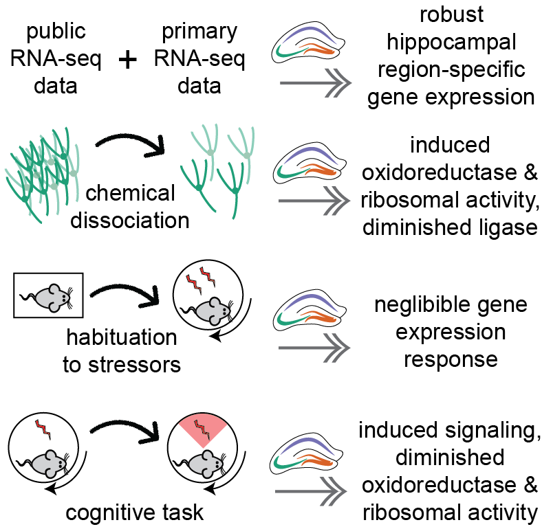

# DissociationTest

The goal of this project is to determine the influence tissue processing techniques on hippocampal gene expression. This data was collected in collaboration with Andre Fenton and Maddy Kao. I compare hippocampal gene expression from CA1, CA3, and DG tissue samples. These samples were collected with a circular punch centered on the pyramidal and granular cells to enrich for that cell type. Biological replicates were tried in two ways before RNA extraction: one was dissociated before cell lysis while the other was homogenized before cell lysis. We wanted to identify the effects of treatment on gene expression. 

This ([Cembrowski et al 2016](https://elifesciences.org/content/5/e14997#fig1s3)) paper is very similar to my experiment, so I want to compare the two. Like mine, they compare hippocampal gene expression from dorsal CA1, CA3, and DG sub regions. These cells were identifed through fac sorting to isolate genetically labeled CA1 and CA3 pyramical neurons and DG granular cells. 

## Repo Contents
- [**data**]((./data/)): contains all the raw and processed data files. They are broken up into sub folders. Some of the data was cleaned in using the process described in my other repo called [BehavEphysRNAseq](https://github.com/raynamharris/BehavEphyRNAseq)
- [**markdownfiles**](./markdownfiles/): this contains all the .R and .Rmd scripts as well as the .md output files. They have prefixes to hint at the order of operation. The workflow is described in more detail below
- [**figures**](./figures/): The output for all files from the Rmarkdown scripts

## The experiments, analyses, and results
All the data analyses for this project were conducted in R. Here is a brief overview of each of the project. Below are links to the .Rmd and .md files.

**Experiment 1: Effect of cellular dissociation.**  First, I compare CA1, CA3, and DG hippocampal samples from single individual that were prepared either by homogenization or dissociation. [Here are the analyses.](./markdownfiles/01_DissociationTest.Rmd) [Here are the results](./markdownfiles/01_DissociationTest.md)

**Experiment 2: Effect of an organismal stressor.**  Next, I look to see how gene expression varies across individuals that exposed to a mild shock (a potential behavioral stressor). [Here are the analyses.](./markdownfiles/02_StressTest.Rmd) [Here are the results](./markdownfiles/02_StressTest.md)

**Experiment 3: Effect of a cognitive task.** Then, I'm wondering what patterns hold up when I look at all these samples compbined. [Here are the analyses.](./markdownfiles/03_CognitionTest.Rmd) [Here are the results](./markdownfiles/03_CognitionTest.md)

**Experiment 4: Reproducing the Cembrowski results.** Then I reanalyze Cembrowski data, which has been used to create a database of sub-region specific hippocampalgene expression. [Here are the analyses.](./markdownfiles/04_Cembrowski.Rmd) [Here are the results](./markdownfiles/04_Cembrowski.md).

**Meta analyses**. Then, I compare across experiments to look for shared and unique patterns of differential gene expression.
[Here are the analyses.](./markdownfiles/05_metaanlyses.Rmd) [Here are the results](./markdownfiles/05_metaanlyses.md).

**Gene Ontology (GO) analyses**. After identifying shared and unique patterns of differential gene expression, I conduct a GO analyses on these lists of genes
[Here are the analyses.](./markdownfiles/06_GO_MWU/06_GO_MWU.Rmd) [Here are the results](./markdownfiles/06_GO_MWU/06_GO_MWU.md).
