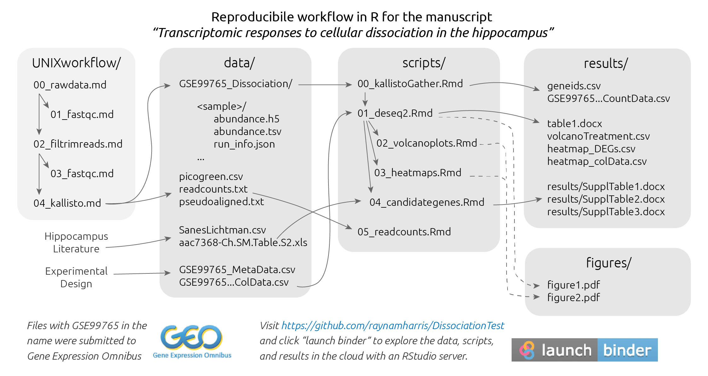

[![badge](https://img.shields.io/badge/launch-binder-579ACA.svg?logo=data:image/png;base64,iVBORw0KGgoAAAANSUhEUgAAAFkAAABZCAMAAABi1XidAAAB8lBMVEX///9XmsrmZYH1olJXmsr1olJXmsrmZYH1olJXmsr1olJXmsrmZYH1olL1olJXmsr1olJXmsrmZYH1olL1olJXmsrmZYH1olJXmsr1olL1olJXmsrmZYH1olL1olJXmsrmZYH1olL1olL0nFf1olJXmsrmZYH1olJXmsq8dZb1olJXmsrmZYH1olJXmspXmspXmsr1olL1olJXmsrmZYH1olJXmsr1olL1olJXmsrmZYH1olL1olLeaIVXmsrmZYH1olL1olL1olJXmsrmZYH1olLna31Xmsr1olJXmsr1olJXmsrmZYH1olLqoVr1olJXmsr1olJXmsrmZYH1olL1olKkfaPobXvviGabgadXmsqThKuofKHmZ4Dobnr1olJXmsr1olJXmspXmsr1olJXmsrfZ4TuhWn1olL1olJXmsqBi7X1olJXmspZmslbmMhbmsdemsVfl8ZgmsNim8Jpk8F0m7R4m7F5nLB6jbh7jbiDirOEibOGnKaMhq+PnaCVg6qWg6qegKaff6WhnpKofKGtnomxeZy3noG6dZi+n3vCcpPDcpPGn3bLb4/Mb47UbIrVa4rYoGjdaIbeaIXhoWHmZYHobXvpcHjqdHXreHLroVrsfG/uhGnuh2bwj2Hxk17yl1vzmljzm1j0nlX1olL3AJXWAAAAbXRSTlMAEBAQHx8gICAuLjAwMDw9PUBAQEpQUFBXV1hgYGBkcHBwcXl8gICAgoiIkJCQlJicnJ2goKCmqK+wsLC4usDAwMjP0NDQ1NbW3Nzg4ODi5+3v8PDw8/T09PX29vb39/f5+fr7+/z8/Pz9/v7+zczCxgAABC5JREFUeAHN1ul3k0UUBvCb1CTVpmpaitAGSLSpSuKCLWpbTKNJFGlcSMAFF63iUmRccNG6gLbuxkXU66JAUef/9LSpmXnyLr3T5AO/rzl5zj137p136BISy44fKJXuGN/d19PUfYeO67Znqtf2KH33Id1psXoFdW30sPZ1sMvs2D060AHqws4FHeJojLZqnw53cmfvg+XR8mC0OEjuxrXEkX5ydeVJLVIlV0e10PXk5k7dYeHu7Cj1j+49uKg7uLU61tGLw1lq27ugQYlclHC4bgv7VQ+TAyj5Zc/UjsPvs1sd5cWryWObtvWT2EPa4rtnWW3JkpjggEpbOsPr7F7EyNewtpBIslA7p43HCsnwooXTEc3UmPmCNn5lrqTJxy6nRmcavGZVt/3Da2pD5NHvsOHJCrdc1G2r3DITpU7yic7w/7Rxnjc0kt5GC4djiv2Sz3Fb2iEZg41/ddsFDoyuYrIkmFehz0HR2thPgQqMyQYb2OtB0WxsZ3BeG3+wpRb1vzl2UYBog8FfGhttFKjtAclnZYrRo9ryG9uG/FZQU4AEg8ZE9LjGMzTmqKXPLnlWVnIlQQTvxJf8ip7VgjZjyVPrjw1te5otM7RmP7xm+sK2Gv9I8Gi++BRbEkR9EBw8zRUcKxwp73xkaLiqQb+kGduJTNHG72zcW9LoJgqQxpP3/Tj//c3yB0tqzaml05/+orHLksVO+95kX7/7qgJvnjlrfr2Ggsyx0eoy9uPzN5SPd86aXggOsEKW2Prz7du3VID3/tzs/sSRs2w7ovVHKtjrX2pd7ZMlTxAYfBAL9jiDwfLkq55Tm7ifhMlTGPyCAs7RFRhn47JnlcB9RM5T97ASuZXIcVNuUDIndpDbdsfrqsOppeXl5Y+XVKdjFCTh+zGaVuj0d9zy05PPK3QzBamxdwtTCrzyg/2Rvf2EstUjordGwa/kx9mSJLr8mLLtCW8HHGJc2R5hS219IiF6PnTusOqcMl57gm0Z8kanKMAQg0qSyuZfn7zItsbGyO9QlnxY0eCuD1XL2ys/MsrQhltE7Ug0uFOzufJFE2PxBo/YAx8XPPdDwWN0MrDRYIZF0mSMKCNHgaIVFoBbNoLJ7tEQDKxGF0kcLQimojCZopv0OkNOyWCCg9XMVAi7ARJzQdM2QUh0gmBozjc3Skg6dSBRqDGYSUOu66Zg+I2fNZs/M3/f/Grl/XnyF1Gw3VKCez0PN5IUfFLqvgUN4C0qNqYs5YhPL+aVZYDE4IpUk57oSFnJm4FyCqqOE0jhY2SMyLFoo56zyo6becOS5UVDdj7Vih0zp+tcMhwRpBeLyqtIjlJKAIZSbI8SGSF3k0pA3mR5tHuwPFoa7N7reoq2bqCsAk1HqCu5uvI1n6JuRXI+S1Mco54YmYTwcn6Aeic+kssXi8XpXC4V3t7/ADuTNKaQJdScAAAAAElFTkSuQmCC)](http://beta.mybinder.org/v2/gh/raynamharris/DissociationTest/master?urlpath=rstudio)
*Click the button to launch a Binder R session. Navigate to the
`scripts` directory and open any `.Rmd` file.*

Hippocampal transcriptomic responses to cellular dissociation
=============================================================

This repository contains the R scripts, data, results that for a study
about *Hippocampal transcriptomic responses to cellular dissociation*.
This research was submitted to the journal *Hippocampus* and was
accepted fro publication on March 15, 2019. A preprint is [available on
BioRxiv](https://www.biorxiv.org/content/early/2019/01/21/153585). The
authors on the manuscript are Rayna M. Harris, Hsin-Yi Kao, Juan Marcos
Alarcon, Hans A. Hofmann, and André A. Fenton

Reproducible Workflow
---------------------

Below is a brief description of this repository’s contents as well as a
graphical description of the data anlysis workflow. To explore the data
in R, click the “launch binder” button above.

-   [**UNIXworkflow**](./UNIXworkflow/): descriptions of the process I
    used to process my files using the Stampede Cluster at the Texas
    Advanced computing facility.
-   [**data**](./data/): contains the input data files for R scripts.
    *Note: Read conts and differential gene expression data are also
    available at Gene Expression Omnibus at
    [GSE99765](https://www.ncbi.nlm.nih.gov/geo/query/acc.cgi?acc=GSE99765).*
-   [**scripts**](./scripts/): this contains all the **.Rmd** scripts,
    **.R** functions, and the **.md** output files, with prefixes to
    convey the order of operation.
-   [**results**](./results): output dataframes from the R scripts.
-   [**figures**](./figures/): output figures from the **.Rmd** scripts
    and my adobe-created images.

Manuscript Abstract
-------------------

Single-neuron gene expression studies may be especially important for
understanding nervous system structure and function because of the
neuron-specific functionality and plasticity that defines functional
neural circuits. Cellular dissociation is a prerequisite technical
manipulation for single-cell and single cell-population studies, but the
extent to which the cellular dissociation process affects neural gene
expression has not been determined. This information is necessary for
interpreting the results of experimental manipulations that affect
neural function such as learning and memory. The goal of this research
was to determine the impact of chemical cell dissociation on brain
transcriptomes. We compared gene expression of microdissected samples
from the dentate gyrus (DG), CA3, and CA1 subfields of the mouse
hippocampus either prepared by a standard tissue homogenization protocol
or subjected to a chemical cellular dissociation procedure. We report
that compared to homogenization, chemical cellular dissociation alters
about 350 genes or 2% of the hippocampal transcriptome. While only a few
genes canonically implicated in long-term potentiation (LTP) and fear
memory change expression levels in response to the dissociation
procedure, these data indicate that sample preparation can affect gene
expression profiles, which might confound interpretation of results
depending on the research question. This study is important for the
investigation of any complex tissues as research effort moves from
subfield level analysis to single cell analysis of gene expression.

Figures and Tables
------------------

**Figure 1. Experimental design and global expression gene expression
patterns. A** Experimental design. Two tissue samples were taken from
three hippocampal subfields (CA1, CA3, and DG) from 300 um brain slices.
Two adjacent samples were processed using a homogenization (HOMO)
protocol or dissociated (DISS) before processing for tissue level gene
expression profiling. **B)** Dissociation does not yield
subfield-specific changes in gene expression between homogenized (HOMO,
open circles, dotted ellipse) and dissociated tissues (DISS, filled
circles, solid ellipse). PC1 accounts for 40% of all gene expression
variation and by inspection, separates the DG samples (orange circles)
from the CA1 (purple circles) and CA3 samples (green circles). PC2
accounts for 22% of the variation in gene expression and varies
significantly with treatment. The ellipses estimate the 95% confidence
interval for a multivariate t-distribution for homogenized (dashed line)
and dissociated (solid line) samples.

**Figure 2. Enzymatic dissociation has a moderate effect on hippocampal
gene expression patterns compared to homogenized tissue. A)** Volcano
plot showing gene expression fold-difference and significance between
treatment groups. We found that 56 genes are up-regulated in the
homogenization control group (open circles) while 288 genes are
up-regulated in the dissociated treatment group (filled dark grey
circles). Genes below the p-value &lt; 0.1 (or –log p-value &lt; 1) are
shown in light grey. **B)** Heatmap showing the top 30 differentially
expressed genes between dissociated and homogenized tissue. Square boxes
at the top are color coded by sample (white: homogenized, grey:
dissociated, purple: CA1, green: CA3, orange: DG. Within the heatmap,
log fold difference levels of expression are indicated by the
blue-green-yellow gradient with lighter colors indicating increased
expression.

<table>
<thead>
<tr class="header">
<th style="text-align: center;">Two-way contrast</th>
<th style="text-align: center;">Up-regulated</th>
<th style="text-align: center;">Down-regulated</th>
<th style="text-align: center;">% DEGs</th>
</tr>
</thead>
<tbody>
<tr class="odd">
<td style="text-align: center;">CA1 vs. CA1</td>
<td style="text-align: center;">222</td>
<td style="text-align: center;">262</td>
<td style="text-align: center;">2.9%</td>
</tr>
<tr class="even">
<td style="text-align: center;">CA3 vs. DG</td>
<td style="text-align: center;">45</td>
<td style="text-align: center;">53</td>
<td style="text-align: center;">0.5%</td>
</tr>
<tr class="odd">
<td style="text-align: center;">CA1 vs. CA3</td>
<td style="text-align: center;">17</td>
<td style="text-align: center;">1</td>
<td style="text-align: center;">0.1%</td>
</tr>
<tr class="even">
<td style="text-align: center;">DISS vs. HOMO</td>
<td style="text-align: center;">288</td>
<td style="text-align: center;">56</td>
<td style="text-align: center;">2.1%</td>
</tr>
</tbody>
</table>

**Table 1. Differentially expressed genes by subfield and treatment.**
The total number and percent of differentially expressed genes (DEGs)
for four two-way contrasts were calculated using DESeq2. Increased
expression cutoffs are defined as log fold-change &gt; 0; p &lt; 0.1
while decreased expression is defined as log fold-change &lt; 0; p &lt;
0.1. % DEGs/Total: The sum of up and down regulated genes divided by the
total number of genes analyzed (16,709) multiplied by 100%. This table
shows that differences between dissociated (DISS) tissue and homogenized
(HOMO) tissues are on the same scale as those between the CA1 and DG
subfields of the hippocampus.

**Preview of Supplemental Table 1. Expression level and fold change of
significant genes (p &lt; 0.1) between dissociated tissue and
homogenized tissue.** This table shows the log fold change (lfc),
p-value (padj), and direction of upregulation for each gene analyzed.
*Full table available at
<a href="https://github.com/raynamharris/DissociationTest/blob/master/results/dissociationDEGs.csv" class="uri">https://github.com/raynamharris/DissociationTest/blob/master/results/dissociationDEGs.csv</a>.*

<table>
<thead>
<tr>
<th style="text-align:left;">
gene
</th>
<th style="text-align:right;">
lfc
</th>
<th style="text-align:right;">
padj
</th>
<th style="text-align:left;">
direction
</th>
</tr>
</thead>
<tbody>
<tr>
<td style="text-align:left;">
Trf
</td>
<td style="text-align:right;">
2.72
</td>
<td style="text-align:right;">
5.0e-07
</td>
<td style="text-align:left;">
DISS
</td>
</tr>
<tr>
<td style="text-align:left;">
Hexb
</td>
<td style="text-align:right;">
2.35
</td>
<td style="text-align:right;">
8.0e-07
</td>
<td style="text-align:left;">
DISS
</td>
</tr>
<tr>
<td style="text-align:left;">
Selplg
</td>
<td style="text-align:right;">
2.97
</td>
<td style="text-align:right;">
9.0e-07
</td>
<td style="text-align:left;">
DISS
</td>
</tr>
<tr>
<td style="text-align:left;">
C1qb
</td>
<td style="text-align:right;">
2.28
</td>
<td style="text-align:right;">
7.1e-06
</td>
<td style="text-align:left;">
DISS
</td>
</tr>
<tr>
<td style="text-align:left;">
Csf1r
</td>
<td style="text-align:right;">
2.13
</td>
<td style="text-align:right;">
9.6e-06
</td>
<td style="text-align:left;">
DISS
</td>
</tr>
<tr>
<td style="text-align:left;">
Ctss
</td>
<td style="text-align:right;">
2.59
</td>
<td style="text-align:right;">
9.6e-06
</td>
<td style="text-align:left;">
DISS
</td>
</tr>
</tbody>
</table>

**Preview of Supplemental Table 2. Molecules implicated in hippocampal
LTP from Sanes and Lichtman 1999.** This table list the molecules review
by Sanes and Lichtman in their 1999 review article and the related
transcripts that were investigated in this study. *Full table available
at
<a href="https://github.com/raynamharris/DissociationTest/blob/master/data/SanesLichtman.csv" class="uri">https://github.com/raynamharris/DissociationTest/blob/master/data/SanesLichtman.csv</a>.*

<table>
<thead>
<tr>
<th style="text-align:left;">
Sanes.and.Lichtman.Molecules
</th>
<th style="text-align:left;">
Related.Transcripts
</th>
</tr>
</thead>
<tbody>
<tr>
<td style="text-align:left;">
GLUTAMATE RECEPTORS
</td>
<td style="text-align:left;">
</td>
</tr>
<tr>
<td style="text-align:left;">
GluR1 GluR2
</td>
<td style="text-align:left;">
Gria1 Gria2
</td>
</tr>
<tr>
<td style="text-align:left;">
mGluR1 mGluR4 mGluR5 mGluR7
</td>
<td style="text-align:left;">
Grm1 Grm4 Grm5 Grm7
</td>
</tr>
<tr>
<td style="text-align:left;">
NMDA NR2A NMDA NR2D NMDA NR1
</td>
<td style="text-align:left;">
Grin1 Grin2a Grin2d
</td>
</tr>
<tr>
<td style="text-align:left;">
OTHER NEUROTRANSMITTERS
</td>
<td style="text-align:left;">
</td>
</tr>
<tr>
<td style="text-align:left;">
norepinephrine and b-adrenergic receptors
</td>
<td style="text-align:left;">
Adrb1 Adrb2 Adrb3
</td>
</tr>
</tbody>
</table>

**Preview of Supplemental Table 3. Marker genes for astrocytes,
oligodendrocytes, microglia, and neurons.** This table lists the genes
from Cahoy et al., 2008 that we investigated to estimate the relative
abundance of cell types in the examined tissue. LFC: Limit fold change.
*This is a preview. The full table available at
<a href="https://github.com/raynamharris/DissociationTest/blob/master/results/markergenes.csv" class="uri">https://github.com/raynamharris/DissociationTest/blob/master/results/markergenes.csv</a>.*

<table>
<thead>
<tr>
<th style="text-align:left;">
marker
</th>
<th style="text-align:left;">
gene
</th>
<th style="text-align:right;">
lfc
</th>
<th style="text-align:right;">
padj
</th>
<th style="text-align:left;">
direction
</th>
</tr>
</thead>
<tbody>
<tr>
<td style="text-align:left;">
microglia
</td>
<td style="text-align:left;">
CD68
</td>
<td style="text-align:right;">
2.35
</td>
<td style="text-align:right;">
9.11e-02
</td>
<td style="text-align:left;">
DISS
</td>
</tr>
<tr>
<td style="text-align:left;">
microglia
</td>
<td style="text-align:left;">
TNF
</td>
<td style="text-align:right;">
2.40
</td>
<td style="text-align:right;">
2.21e-02
</td>
<td style="text-align:left;">
DISS
</td>
</tr>
<tr>
<td style="text-align:left;">
oligodendrocyte
</td>
<td style="text-align:left;">
GJC2
</td>
<td style="text-align:right;">
2.39
</td>
<td style="text-align:right;">
9.60e-02
</td>
<td style="text-align:left;">
DISS
</td>
</tr>
<tr>
<td style="text-align:left;">
oligodendrocyte
</td>
<td style="text-align:left;">
MAG
</td>
<td style="text-align:right;">
3.31
</td>
<td style="text-align:right;">
4.48e-05
</td>
<td style="text-align:left;">
DISS
</td>
</tr>
<tr>
<td style="text-align:left;">
oligodendrocyte
</td>
<td style="text-align:left;">
MAL
</td>
<td style="text-align:right;">
3.20
</td>
<td style="text-align:right;">
2.32e-04
</td>
<td style="text-align:left;">
DISS
</td>
</tr>
<tr>
<td style="text-align:left;">
oligodendrocyte
</td>
<td style="text-align:left;">
MBP
</td>
<td style="text-align:right;">
1.95
</td>
<td style="text-align:right;">
8.03e-03
</td>
<td style="text-align:left;">
DISS
</td>
</tr>
</tbody>
</table>
