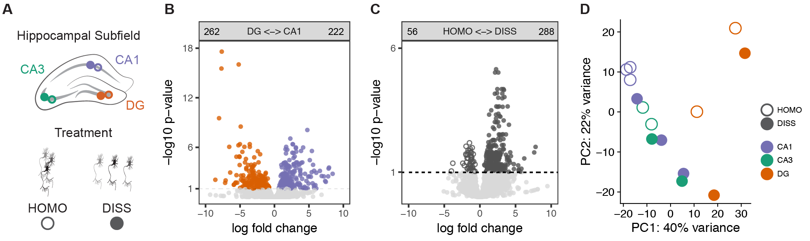
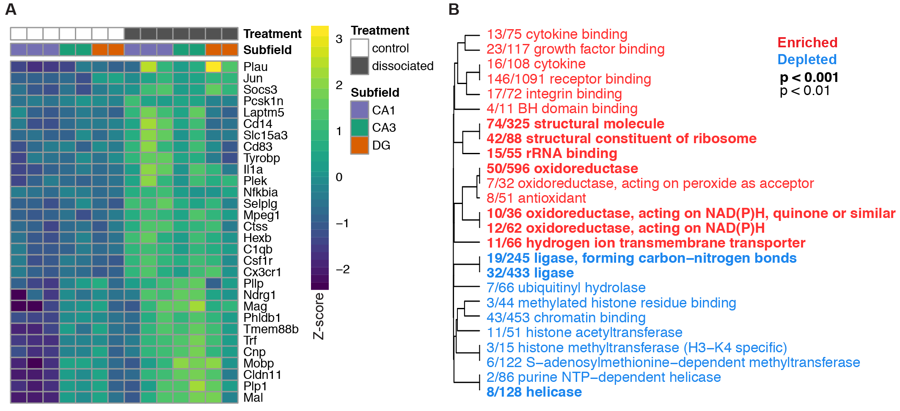

# Analysis of hippocampal transcriptomic responses to technical and biological perturbations
Rayna M. Harris, Hsin-Yi Kao, Juan Marcos Alarcon, Hans A. Hofmann, and André A. Fenton

## Overview
Cost-effective next-generation sequencing has made unbiased gene expression investigations possible. Gene expression studies at the level of single neurons may be especially important for understanding nervous system structure and function because of neuron-specific functionality and plasticity. While cellular dissociation is a prerequisite technical manipulation for such single-cell studies, the extent to which the process of dissociating cells affects neural gene expression has not been determined. Here, we examine the effect of cellular dissociation on gene expression in the mouse hippocampus. We also determine to which extent such changes might confound studies on the behavioral and physiological functions of hippocampus. 

## Video Abstract

I made this [short video](https://www.youtube.com/watch?v=taeAqimxXWo) explaining how to use this GitHub repo when I submitted the first draft to the journal Hippocampus and posted a pre-print on BioRxiv. 

## Repo Contents
- [**data**](./data/): contains most of the input processed data files. Large data fiels are stored in the Gene Expression Omnibus at [GSE99765](https://www.ncbi.nlm.nih.gov/geo/query/acc.cgi?acc=GSE99765) and [GSE100225](https://www.ncbi.nlm.nih.gov/geo/query/acc.cgi?acc=GSE100225). Raw kallisto abundance files are also stored in my other GitHub repo called [MouseHippocampusRNAseqData](https://github.com/raynamharris/MouseHippocampusRNAseqData).
- [**UNIXworkflow**](./UNIXworkflow/): This descirbes the process I used to process my files using the Stampede Cluster at the Texas Advanced computing facility
- [**scripts**](./scripts/): this contains all the .R and .Rmd scripts as well as the .md output files. 
  - They have prefixes to hint at the order of operation.
  - The order was dramatically differnt when this work was first submitted for publication (version 1).
  - The current order is broken down by each figure.
- [**figures**](./figures/): Contains all output for all files from the Rmarkdown scripts and my adobe-created images. 

## Current state of the analysis 

The following descriptions are not ready for publication, rather they are converational descriptions of the current state. 

**Figure 1.** General expression patterns show no major pattern of gene expression alteration. 1A. Experimental design. 1B. Volcano plot showing an exploratory(?) analysis of regional differences, for comparison to published literature. 1C. Volcano plot showing a weak but asymmetric response of gene expression to dissociation. 1D. PCA showing that no major pattern of an effect of dissociation, but also showing that regions are as clearly separated as one would expect given the literature. 

| Two-way contrast | Down-regulated | Up-regulated | % DEGs |
|:-------------:|:-------------:|:-------------:|:-------------:|
| DG vs. CA1 | 262 | 222 | 2.9% |
| DG vs. CA3 | 53 | 45 | 0.5% |
| CA3 vs. CA1 | 1 | 17 | 0.1% | 
| control vs. dissociated | 288 | 56 | 2.1% |

**Table 1.** Number of differentially expressed genes by 2-way contrast. "Down-regulated" means that expression is higher in the term on the far left of column 1. "Up-regulated" means that expression is higher in the term on the right of column 1. This shows that there is more variation due to subfield than treatment. 

**Figure 2.** The gene list and go terms that everyone wants to know. 2A The top 30 most differentially expressed genes. Genes are clustered by correlation but samples are NOT clustered! Only "Jun" jumps out as a gene related to learning and memory. 2B List of molecular function categories that are enriched or depleted in the dissociated tissues relative to controls. Again, nothing jumps out as classic memory pathways, but there are some interesting affects on DNA regulation (methylation, chromatin, histone, RNA binding, helicase) and metabolism (oxidoreductase, cytokin, growth factors, ligase). 

