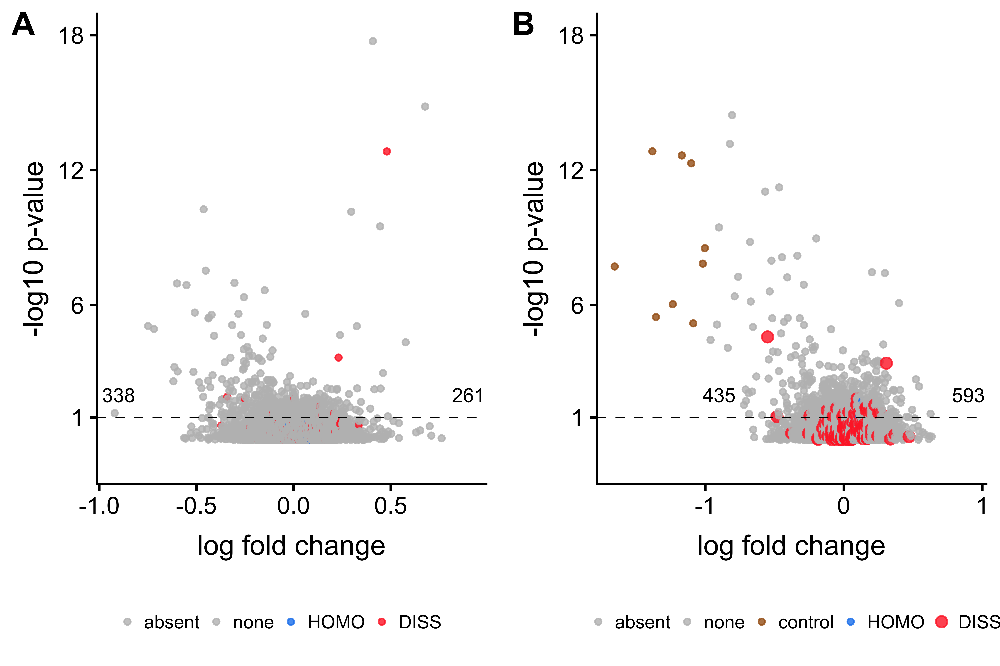

*Click the button to launch a Binder R session. Navigate to the
`scripts` directory and open any `.Rmd` file. Note: the first two are
long and slow. The rest are quick scripts that make figures.*

Hippocampal transcriptomic responses to cellular dissociation
=============================================================

Rayna M. Harris, Hsin-Yi Kao, Juan Marcos Alarcon, Hans A. Hofmann, and
André A. Fenton

Overview
--------

*Background*: Single-neuron gene expression studies may be especially
important for understanding nervous system structure and function
because of the neuron-specific functionality and plasticity that defines
functional neural circuits. Cellular dissociation is a prerequisite
technical manipulation for single-cell and single cell-population
studies, but the extent to which the cellular dissociation process cells
affects neural gene expression has not been determined. This information
is necessary for interpreting the results of experimental manipulations
that affect neural function such as learning and memory. The goal of
this research was to determine the impact of chemical cell dissociation
on transcriptome. *Results*: This report shows that the process of
chemical cellular dissociation compared to homogenization alters about
2% of the tissue-level transcriptome of hippocampal subfields. Genes
related to cellular stress response pathways are activated by
dissociation compared to homogenization. Few genes canonically
implicated in learning and memory are found to change expression levels
in response to the dissociation procedure. *Discussion*: This study
suggests that chemical cellular dissociation has minimal but specific
affect genes or molecular functions canonically related to learning and
memory. However, sample preparation can affect gene expression profiles,
which might confound interpretation of results depending on the research
question. This study is important for the investigation of any complex
tissues as research effort moves from subfield level analysis to single
cell analysis of gene expression. *Methods*: We compared tissue level
expression of microdissected samples from the dentate gyrus (DG), CA3,
and CA1 subfields of the mouse hippocampus either prepared by a standard
tissue homogenization protocol or subjected to a cellular dissociation
procedure. We used the Illumina HiSeq platform for sequencing, Kallisto
for transcript abundance estimation, DESeq2 for differential gene
expression profiling, and GO\_MWU for analysis of gene ontology. Raw
reads, results, and code are available at GEO and on GitHub.

Repo Contents
-------------

-   [**data**](./data/): contains most of the input processed data
    files. Large data fiels are stored in the Gene Expression Omnibus at
    [GSE99765](https://www.ncbi.nlm.nih.gov/geo/query/acc.cgi?acc=GSE99765)
    and
    [GSE100225](https://www.ncbi.nlm.nih.gov/geo/query/acc.cgi?acc=GSE100225).
    Raw kallisto abundance files are also stored in my other GitHub repo
    called
    [MouseHippocampusRNAseqData](https://github.com/raynamharris/MouseHippocampusRNAseqData).
-   [**UNIXworkflow**](./UNIXworkflow/): This descirbes the process I
    used to process my files using the Stampede Cluster at the Texas
    Advanced computing facility
-   [**scripts**](./scripts/): this contains all the .R and .Rmd scripts
    as well as the .md output files.
    -   They have prefixes to hint at the order of operation.
    -   The order was dramatically differnt when this work was first
        submitted for publication (version 1).
    -   The current order is broken down by each figure.
-   [**figures**](./figures/): Contains all output for all files from
    the Rmarkdown scripts and my adobe-created images.

General workflow and approach
-----------------------------

1.  experimental design (treatment \* hippocampal subfield)
2.  RNA-seq (Illumina, GSAF)
3.  bioinformatics (TACC, FASTQC, cutadapt, kallisto)
4.  data viz and stats (DESeq2, GOMWU, R)
5.  version control and sharing (Git, GitHub, NCBI)

Results
-------

The following descriptions are not ready for publication, rather they
are converational descriptions of the current state.

**Figure 1.** General expression patterns show no major pattern of gene
expression alteration. 1A. Experimental design. 1B. Volcano plot showing
an exploratory(?) analysis of regional differences, for comparison to
published literature. 1C. Volcano plot showing a weak but asymmetric
response of gene expression to dissociation. 1D. PCA showing that no
major pattern of an effect of dissociation, but also showing that
regions are as clearly separated as one would expect given the
literature.

<table>
<thead>
<tr class="header">
<th style="text-align: center;">Two-way contrast</th>
<th style="text-align: center;">Up-regulated</th>
<th style="text-align: center;">Down-regulated</th>
<th style="text-align: center;">% DEGs</th>
</tr>
</thead>
<tbody>
<tr class="odd">
<td style="text-align: center;">CA1 vs. CA1</td>
<td style="text-align: center;">222</td>
<td style="text-align: center;">262</td>
<td style="text-align: center;">2.9%</td>
</tr>
<tr class="even">
<td style="text-align: center;">CA3 vs. DG</td>
<td style="text-align: center;">45</td>
<td style="text-align: center;">53</td>
<td style="text-align: center;">0.5%</td>
</tr>
<tr class="odd">
<td style="text-align: center;">CA1 vs. CA3</td>
<td style="text-align: center;">17</td>
<td style="text-align: center;">1</td>
<td style="text-align: center;">0.1%</td>
</tr>
<tr class="even">
<td style="text-align: center;">DISS vs. HOMO</td>
<td style="text-align: center;">288</td>
<td style="text-align: center;">56</td>
<td style="text-align: center;">2.1%</td>
</tr>
</tbody>
</table>

**Table 1.** Number of differentially expressed genes by 2-way contrast.
“Down-regulated” means that expression is higher in the term on the far
left of column 1. “Up-regulated” means that expression is higher in the
term on the right of column 1. This shows that there is more variation
due to subfield than treatment.

**Figure 2.** The

**Figure 3.** The gene list and go terms that everyone wants to know. 2A
The top 30 most differentially expressed genes. Genes are clustered by
correlation but samples are NOT clustered! Only “Jun” jumps out as a
gene related to learning and memory. 2B List of molecular function
categories that are enriched or depleted in the dissociated tissues
relative to controls. Again, nothing jumps out as classic memory
pathways, but there are some interesting affects on DNA regulation
(methylation, chromatin, histone, RNA binding, helicase) and metabolism
(oxidoreductase, cytokin, growth factors, ligase).

**Figure 4.**

**Supplemental Table 1.** Expression level and fold change of of
significant genes (p &lt; 0.1) between dissociated tissue and
homogenized tissue. This table shows the log fold change (lfc), p-value
(padj), and direction of upregulation for each gene analyzed.

For now at:
<https://github.com/raynamharris/DissociationTest/blob/master/results/SuppTable1.csv>

    suptable <- read.csv("~/Github/DissociationTest/results/SuppTable1.csv", header = T)
    tail(suptable, 10)

    ##         gene   lfc   padj upregulated.in
    ## 335     Rpsa  1.10 0.0959           DISS
    ## 336 Slc25a10  2.90 0.0959           DISS
    ## 337    Spry1  2.20 0.0959           DISS
    ## 338   Tango2  1.80 0.0959           DISS
    ## 339   Ubqln1 -1.10 0.0974           HOMO
    ## 340  Gadd45b  1.50 0.0984           DISS
    ## 341    Gsk3b -0.90 0.0984           HOMO
    ## 342     Atrx -1.10 0.0992           HOMO
    ## 343    Itpr3  3.10 0.0992           DISS
    ## 344    Gria2 -0.84 0.0997           HOMO

**Supplemental Table 2.** Gene ontologies of enriched genes. The first
row contains the GO category (either MF or CC). The second is the GO
term. Also shown are directionally, unumber of enriched genes in that
catory out of the total (ratio), and p-value.

<https://github.com/raynamharris/DissociationTest/blob/master/results/GOsignificantcatagories.csv>

    GOtable <- read.csv("~/Github/DissociationTest/results/GOsignificantcatagories.csv", header = T)
    head(GOtable, 5)

    ##   GO                             GOterm enriched   ratio    pval
    ## 1 CC  cytosolic large ribosomal subunit     DISS   33/53 1.0e-15
    ## 2 CC                           ribosome     DISS  60/208 1.0e-15
    ## 3 CC               extracellular region     DISS 101/985 4.1e-15
    ## 4 CC                extracellular space     DISS 122/957 3.4e-14
    ## 5 CC                   nucleoplasm part     HOMO  38/529 6.3e-14

Outdated Video Abstract
-----------------------

I made this [short video](https://www.youtube.com/watch?v=taeAqimxXWo)
explaining how to use this GitHub repo when I submitted the first draft
to the journal Hippocampus and posted a pre-print on BioRxiv.

