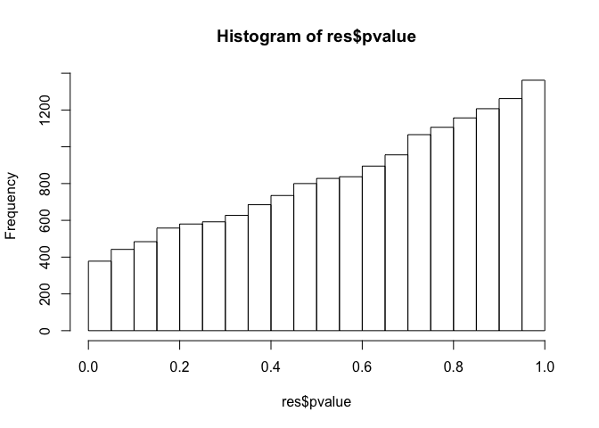
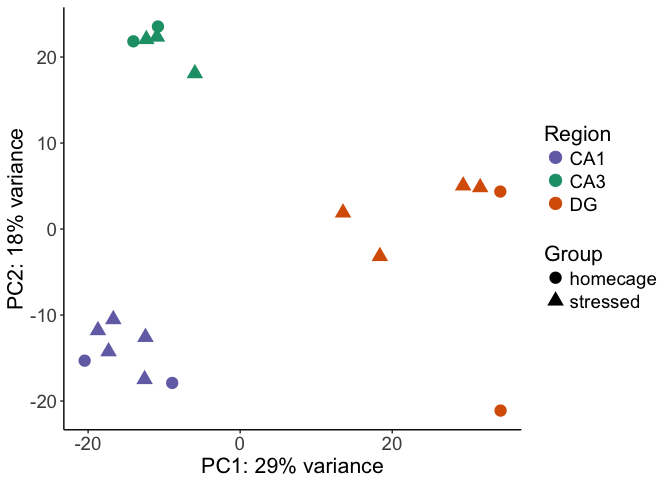
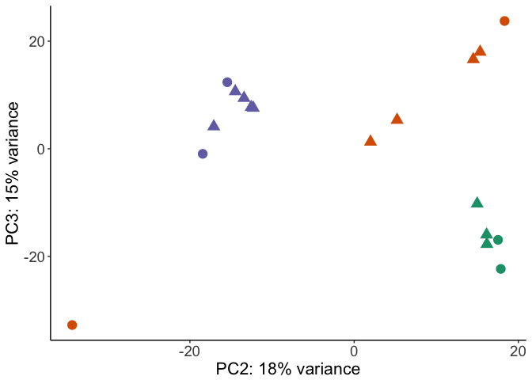
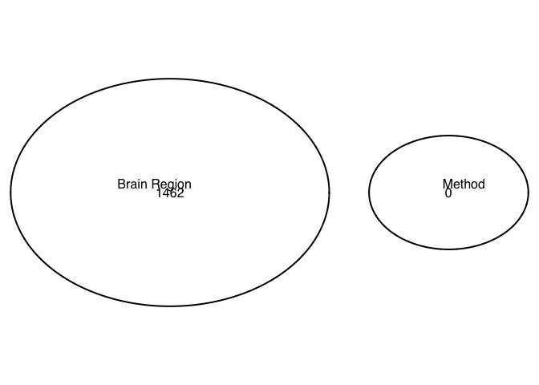
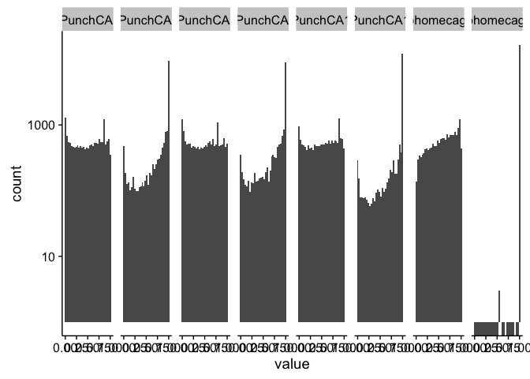
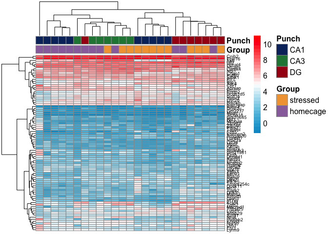
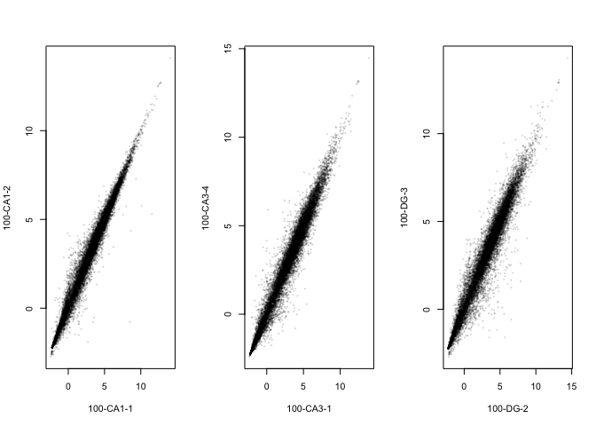
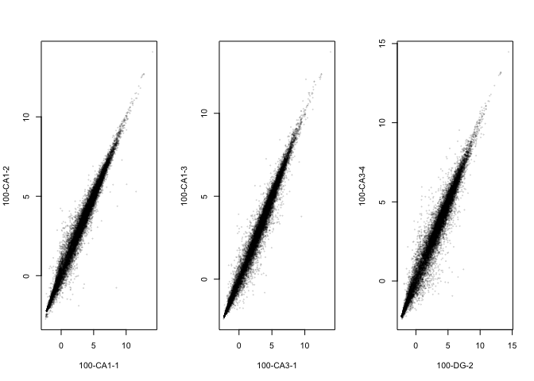
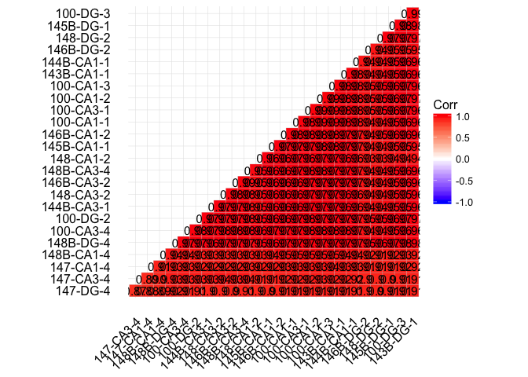

Methods for Dorsal Hippocampal Gene Expression Profiling
--------------------------------------------------------

#### Part 1: Examining the influence of dissasociation on gene expression in the CA1, CA3, and DG

Subset to just look homogenized and dissociated samples
-------------------------------------------------------

    colData <- colData %>%
      filter(method != "dissociated") %>% droplevels()
    colData$Group <- plyr::revalue(colData$Group, c("control"="stressed"))
    savecols <- as.character(colData$RNAseqID) #selects all good samples
    savecols <- as.vector(savecols) # make it a vector
    countData <- countData %>% select(one_of(savecols)) # keep good samples

This PCA gives an overview of the variability between samples using the
a large matrix of log transformed gene expression data. You can see that
the bigges difference is between DG punches and the CA1 and CA3 punches.
CA1 and CA3 samples have similar transcriptomes. The homogenized CA1
samples have the most similar transcriptonal profiles as evidenced by
their tight clustering.

This Venn Diagram shows the number of differentially expressed by
contrast described above each oval. The most number of genes are
differntially expressed between DG and the CAs (nearly 1000) wheras only
about 200 were differntailly regulated as a result of of technical
maniplulation comparing homogenized and dissociated samples.

The first is with padj values. The second with p values

Here, the goal is the analyze the distribution of pvalues to see if they
are randomly distributed or if that is a tendency towards and increase
or decrease of low pvalues. There, I'm showing the pval and adjusted
pvale (padj) for all for two-way comparision.

    head(rldpvals)

    ##               pvalPunchCA1DG padjPunchCA1DG pvalPunchCA3DG padjPunchCA3DG
    ## 0610007P14Rik      0.4030957      0.9757038     0.27152521      0.8547496
    ## 0610009B22Rik      0.4888569      1.0000000     0.07357699      0.5073331
    ## 0610009L18Rik      0.9965304      1.0000000     0.69745038      0.9916077
    ## 0610009O20Rik      0.8835251      1.0000000     0.55755277      0.9916077
    ## 0610010F05Rik      0.4418263      0.9927153     0.86881766      1.0000000
    ## 0610010K14Rik      0.5292212      1.0000000     0.47276217      0.9916077
    ##               pvalPunchCA1CA3 padjPunchCA1CA3 pvalGrouphomecagestressed
    ## 0610007P14Rik       0.7134215       1.0000000                 0.7743941
    ## 0610009B22Rik       0.1990163       0.9230007                 0.9325932
    ## 0610009L18Rik       0.6752917       1.0000000                 0.5127999
    ## 0610009O20Rik       0.6253198       1.0000000                 0.5227737
    ## 0610010F05Rik       0.3368704       1.0000000                 0.3754833
    ## 0610010K14Rik       0.8766163       1.0000000                 0.7083453
    ##               padjGrouphomecagestressed
    ## 0610007P14Rik                 0.9995873
    ## 0610009B22Rik                 0.9995873
    ## 0610009L18Rik                 0.9995873
    ## 0610009O20Rik                 0.9995873
    ## 0610010F05Rik                 0.9995873
    ## 0610010K14Rik                 0.9995873

    rldpvalslong <- rldpvals
    rldpvalslong$gene <- row.names(rldpvalslong) 
    rldpvalslong <- melt(rldpvalslong, id=c("gene"))
    head(rldpvalslong)

    ##            gene       variable     value
    ## 1 0610007P14Rik pvalPunchCA1DG 0.4030957
    ## 2 0610009B22Rik pvalPunchCA1DG 0.4888569
    ## 3 0610009L18Rik pvalPunchCA1DG 0.9965304
    ## 4 0610009O20Rik pvalPunchCA1DG 0.8835251
    ## 5 0610010F05Rik pvalPunchCA1DG 0.4418263
    ## 6 0610010K14Rik pvalPunchCA1DG 0.5292212

    qplot(value, data=rldpvalslong, geom="histogram") + 
      facet_grid( ~ variable) +
      scale_y_log10()

    ## `stat_bin()` using `bins = 30`. Pick better value with `binwidth`.

    ## Warning: Removed 176 rows containing non-finite values (stat_bin).

    ## Warning: Stacking not well defined when ymin != 0

I'm not really happy with these two heat maps. Here's how I created
them. Top heatmap: subset the data to give only the gene with an
adjusted p value &lt; 0.05 for the homogenized vs dissociated
comparisonany two-way comparsion. Bottom heatmap: subset the data to
give only the gene with an adjusted p value &lt; 0.05 for two way brain
region comparision (CA1 vs DG, CA3, vs DG, or CA1 vs DG)

Here, you can see that the differences between samples is not as clear
cut for all comparisions. What other mechanisms would be useful for
subseting the data to identify genes of interest?

This is a data validation check plot. Here, I'm showing how many
millions of reads were present in each sample. On average, each sample
had 5 million reads, but the range was from 0.8 to 10 millino reads.

    FALSE [1] 22485    25

    FALSE  100-CA1-1  100-CA1-2  100-CA1-3  100-CA3-1  100-CA3-4   100-DG-2 
    FALSE   1.136597   3.311998   1.114747   0.966391   1.205348   0.658410 
    FALSE   100-DG-3 143B-CA1-1  143B-DG-1 144B-CA1-1 144B-CA3-1 145B-CA1-1 
    FALSE   3.055740   0.874614   1.019113   1.275137   0.506698   1.034066 
    FALSE  145B-DG-1 146B-CA1-2 146B-CA3-2  146B-DG-2  147-CA1-4  147-CA3-4 
    FALSE   0.720798   0.506014   1.056001   0.055549   0.080721   0.344588 
    FALSE   147-DG-4  148-CA1-2  148-CA3-2   148-DG-2 148B-CA1-4 148B-CA3-4 
    FALSE   0.069648   0.938866   1.148136   1.067185   0.185637   1.724144 
    FALSE  148B-DG-4 
    FALSE   0.398258

    FALSE 
    FALSE    0    1    2    3    4    5    6    7    8    9   10   11   12   13   14 
    FALSE 5109  434  363  298  252  209  168  159  113  140  119  119  105   98   97 
    FALSE   15   16   17   18   19   20   21   22   23   24   25   26   27   28   29 
    FALSE   92   96   78   95   97   82   72   59   67   58   50   60   56   54   58

These next graphs show the correlation between samples of CA1, CA3, and
DG.

This next plot shows the stregnth of the correlation between samples.

Save files for GO analysis. A total of 217 DEGs with unadjusted p-value
&lt; 0.1 were input into the GO anlaysis.
