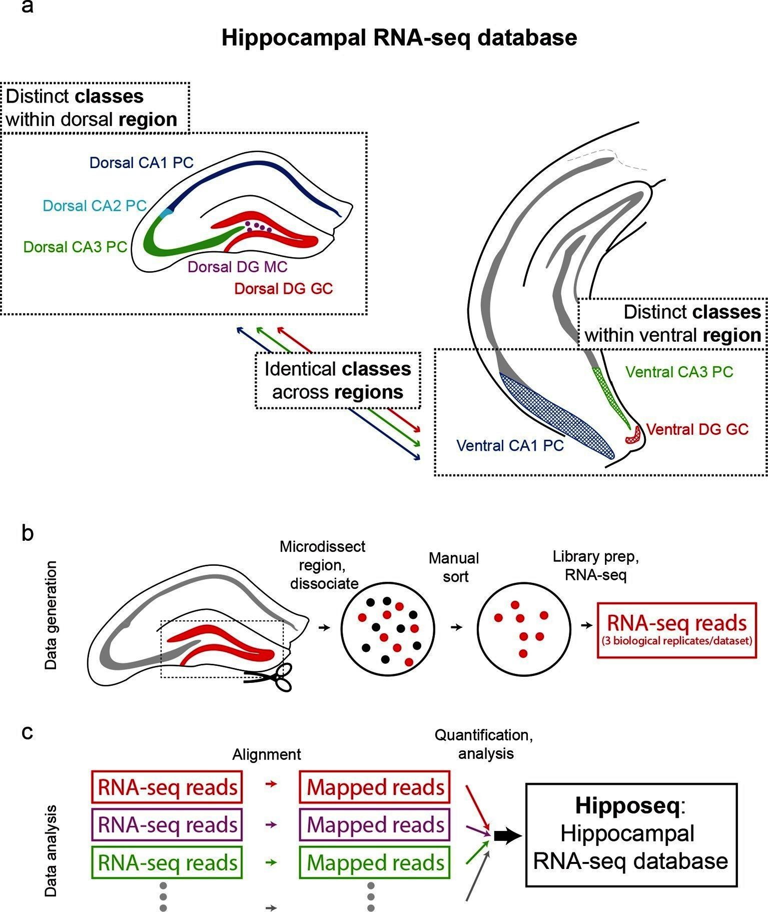
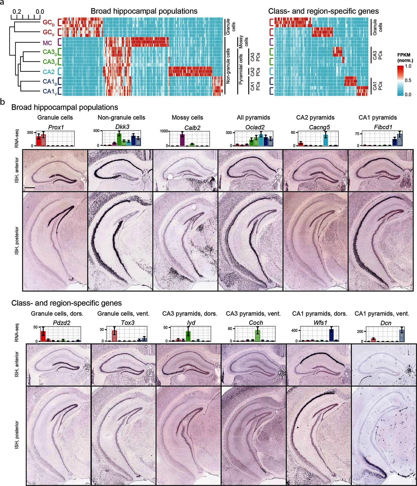
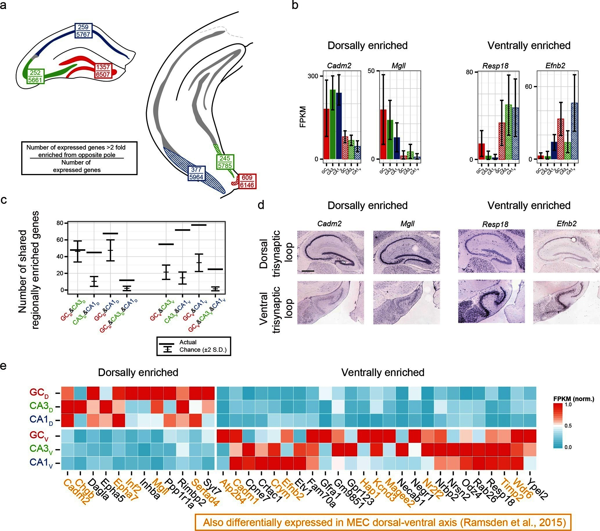

## Methods for Dorsal Hippocampal Gene Expression Profiling

#### Part 3: Examining fac-sorted pyramindal neurons from CA1 and CA3 as well as granular cells from DG from Cembrowski et al 2016.

This ([2016 Cembrowski paper](https://elifesciences.org/content/5/e14997#fig1s30)) is very similar to my experiment, so I want to compare the two. Like mine, they compare hippocampal gene expression from dorsal CA1, CA3, and DG sub regions. These cells were identifed through fac sorting to isolate genetically labeled CA1 and CA3 pyramical neurons and DG granular cells.

Here are three figures from their analysis. 





```{r setup, echo=FALSE, message=FALSE, results='hide',comment=FALSE, warning=FALSE}
#source("http://www.bioconductor.org/biocLite.R")
#biocLite("DESeq2")
library(DESeq2)
library(magrittr)
library(tidyverse)
library(reshape2)
library(VennDiagram)
library(genefilter)
library(pheatmap)
library(colorRamps) # for a matlab like color scheme

# set output file for figures 
knitr::opts_chunk$set(fig.path = '../figures/cembrowski/')
```

```{r ImportData, echo=FALSE, message=FALSE, results='hide',comment=FALSE, warning=FALSE}
## extract gene name and Ensembl id
#geneids <- read.table("../data/Cembrowski/GSE74985_gene_exp.diff", header = TRUE)
#geneids <- geneids %>% select(gene_id, gene)
#write_tsv(geneids, "../data/Cembrowski/geneids.tsv")
geneids <- read.table("../data/Cembrowski/geneids.tsv", header=T)

#read count data 
count <- read.table("../data/Cembrowski/GSE74985_mergedCount.txt")
count$gene_id <- row.names(count)

## join with geneids so we can look at gene level stuff
countbygene <- full_join(geneids, count)
countbygene <- countbygene %>% 
  filter(gene != "-")
countbygene <- countbygene[-c(1)] ## keep gene name and counts for samples)


## lengthen the dataframe, then wide with gene level sums, then make gene the row name, then round the value to nearest integer
countbygene <- melt(countbygene, id=c("gene")) 
countbygene  <- dcast(countbygene, gene ~ variable, value.var= "value", fun.aggregate=sum)
row.names(countbygene) <- countbygene$gene
countbygene[1] <- NULL
countbygene <- round(countbygene)

countData <- countbygene 


# extract the sample information
colData <- as.data.frame(colnames(countData))
names(colData)[1] <- "RNAseqID"
colData$region <- sapply(strsplit(as.character(colData$RNAseqID),'\\_'), "[", 1)
colData$location <- sapply(strsplit(as.character(colData$RNAseqID),'\\_'), "[", 2)
```

```{r SubsetData, echo=FALSE, message=FALSE, results='hide',comment=FALSE, warning=FALSE}
# keep only CA1, CA3, and DG data
colData <- colData %>% 
  filter(grepl("dg|ca1|ca3", region))  %>% 
  droplevels() ## subsets data
savecols <- as.character(colData$RNAseqID) #select the sample name column that corresponds to row names
savecols <- as.vector(savecols) # make it a vector
countData <- countData %>% select(one_of(savecols))

# keep only data with >2 counts
countData[countData < 2] <- 0

# replace nas with 0
countData[is.na(countData)] <- 0
```

The first thing I notice is that they have waay more reads per sample and thus gene counts per sample than I do. They have a mean gene counts per sample around 400 million counts per gene. My data had 5 million counts per gene. 

```{r edgeR, echo=FALSE, message=FALSE, results='hide',comment=FALSE, warning=FALSE }
library(edgeR)

counts <- countData
dim( counts )
colSums( counts ) / 1e06  # in millions of reads
table( rowSums( counts ) )[ 1:30 ] # Number of genes with low counts

rowsum <- as.data.frame(colSums( counts ) / 1e06 )
names(rowsum)[1] <- "millioncounts"
rowsum$sample <- row.names(rowsum)

ggplot(rowsum, aes(x=millioncounts)) + 
  geom_histogram(bins = 20, colour = "black", fill = "darkgrey") +
  theme_classic() +
  scale_x_continuous(name = "Millions of Gene Counts per Sample",
                     breaks = seq(0, 900, 100),
                     limits=c(0, 900)) +
  scale_y_continuous(name = "Number of Samples")
```


This gene has the smalled pvalue of any in the DESeq model. It nicely shows the dyanmic range of a gene's expression from roughly 1,000 to 20,000 counts. 

```{r DifferentialGeneExpressionAnalysis, echo=FALSE, message=FALSE, results='hide',comment=FALSE, warning=FALSE}
dds <- DESeqDataSetFromMatrix(countData = countData,
                              colData = colData,
                              design = ~ region + location + region * location )
## filter genes with 0 counts
dds <- dds[ rowSums(counts(dds)) > 2, ]
dds

# Differential expression analysis
dds <- DESeq(dds)
dds

# general deseq
res <- results(dds, independentFiltering = F)
#res
summary(res)
resOrdered <- res[order(res$padj),]
sum(res$padj < 0.1, na.rm = TRUE)
res05 <- results(dds, alpha=0.05)
summary(res05)
sum(res05$padj < 0.05, na.rm=TRUE)

## make a plot of fold change as function of expression

#plot <- plotMA(res05, main="MA Plot")
plotCounts(dds, gene=which.min(res$padj), intgroup="region")
plotCounts(dds, gene=which.min(res$padj), intgroup="location")

rld <- rlog(dds, blind=FALSE)
vsd <- varianceStabilizingTransformation(dds, blind=FALSE)
vsd.fast <- vst(dds, blind=FALSE)

resdorsalventral <- results(dds, contrast = c("location", "d", "v"), independentFiltering = F)
sum(resdorsalventral$padj < 0.1, na.rm = TRUE) #3049
valsdorsalventral <- cbind(resdorsalventral$pvalue, resdorsalventral$padj)
colnames(valsdorsalventral)=c("pval.dorsalventral", "padj.dorsalventral")

resCA1DG <- results(dds, contrast = c("region", "ca1", "dg"), independentFiltering = F)
sum(resCA1DG$padj < 0.1, na.rm = TRUE) #7569
valsCA1DG <- cbind(resCA1DG$pvalue, resCA1DG$padj) 
colnames(valsCA1DG)=c("pval.CA1DG", "padj.CA1DG")

resCA1CA3 <- results(dds, contrast = c("region", "ca1", "ca3"), independentFiltering = F)
sum(resCA1CA3$padj < 0.1, na.rm = TRUE) #3570
valsCA1CA3 <- cbind(resCA1CA3$pvalue, resCA1CA3$padj) 
colnames(valsCA1CA3)=c("pval.CA1CA3", "padj.CA1CA3")

resCA3DG <- results(dds, contrast = c("region", "ca3", "dg"), independentFiltering = F)
sum(resCA3DG$padj < 0.1, na.rm = TRUE) #7953
valsCA3DG <- cbind(resCA3DG$pvalue, resCA3DG$padj) 
colnames(valsCA3DG)=c("pval.CA3DG", "padj.CA3DG")

rldd <- assay(rld)
rldpvals <- cbind(rldd, valsdorsalventral,valsCA1DG, valsCA1CA3, valsCA3DG)
```


This PCA shows fantastic separation of all 6 sample types included in the anlaysis. DGs are separated from CAs by prcinciple compoent 1. CA1 and CA3 separate by princinple compent 2. Dorsal ventral groups are separated more along the diagonals.

```{r PCA, echo=FALSE, message=FALSE, results='hide',comment=FALSE, warning=FALSE}

plotPCA(rld, intgroup=c("region", "location"), returnData=TRUE)
pcadata <- plotPCA(rld, intgroup=c("region", "location"), returnData=TRUE)
percentVar <- round(100 * attr(pcadata, "percentVar"))

ggplot(pcadata, aes(PC1, PC2, color=region, shape=location, label=name)) +
  geom_point(size=5) +
  xlab(paste0("PC1: ",percentVar[1],"% variance")) +
  ylab(paste0("PC2: ",percentVar[2],"% variance")) +
  theme_classic() +
  stat_ellipse(level = 0.95, (aes(color=region)),size=1)  +
  scale_color_manual(values=c("#08306b", "#238443", "#a50f15"))

source("DESeqPCAfunction.R")
plotPCA(rld, intgroup=c("region", "location"), returnData=TRUE)
pcadata <- pcaplot16(rld, intgroup=c("region", "location"), returnData=TRUE)
percentVar <- round(100 * attr(pcadata, "percentVar"))

ggplot(pcadata, aes(PC1, PC2, color=location, label=name)) +
  geom_point(size=5) +
  xlab(paste0("PC1: ",percentVar[1],"% variance")) +
  ylab(paste0("PC2: ",percentVar[2],"% variance")) +
  theme_classic() +
  stat_ellipse(level = 0.95, (aes(color=location)),size=1)  +
  scale_color_manual(values=c("#525252", "#000000"))

ggplot(pcadata, aes(PC3, PC4, color=location, label=name)) +
  geom_point(size=5) +
  xlab(paste0("PC3: ",percentVar[3],"% variance")) +
  ylab(paste0("PC4: ",percentVar[4],"% variance")) +
  theme_classic() +
  stat_ellipse(level = 0.95, (aes(color=location)),size=1)  +
  scale_color_manual(values=c("#000000", "#f1a340"))

ggplot(pcadata, aes(PC1, PC3, color=location, label=name)) +
  geom_point(size=5) +
  xlab(paste0("PC1: ",percentVar[1],"% variance")) +
  ylab(paste0("PC3: ",percentVar[3],"% variance")) +
  theme_classic() +
  stat_ellipse(level = 0.95, (aes(color=location)),size=1)  +
  scale_color_manual(values=c("#000000", "#f1a340"))

ggplot(pcadata, aes(PC2, PC3, color=location, label=name)) +
  geom_point(size=5) +
  xlab(paste0("PC2: ",percentVar[2],"% variance")) +
  ylab(paste0("PC3: ",percentVar[3],"% variance")) +
  theme_classic() +
  stat_ellipse(level = 0.95, (aes(color=location)),size=1)  +
  scale_color_manual(values=c("#000000", "#f1a340"))


ggplot(pcadata, aes(PC1, PC2, color=region, label=name)) +
  geom_point(size=5) +
  xlab(paste0("PC1: ",percentVar[1],"% variance")) +
  ylab(paste0("PC2: ",percentVar[2],"% variance")) +
  theme_classic() +
  stat_ellipse(level = 0.95, (aes(color=region)),size=1) +
  scale_color_manual(values=c("#08306b", "#238443", "#a50f15"))

ggplot(pcadata, aes(PC3, PC4, color=region, label=name)) +
  geom_point(size=5) +
  xlab(paste0("PC3: ",percentVar[3],"% variance")) +
  ylab(paste0("PC4: ",percentVar[4],"% variance")) +
  theme_classic() +
  stat_ellipse(level = 0.95, (aes(color=region)),size=1) +
  scale_color_manual(values=c("#08306b", "#238443", "#a50f15"))


```


```{r VennDiagram, echo=FALSE, message=FALSE, results='hide',comment=FALSE, warning=FALSE}

rldpvals <- as.data.frame(rldpvals)

dorsalventral <- row.names(rldpvals[rldpvals$padj.dorsalventral<0.1 & !is.na(rldpvals$padj.dorsalventral),])
CA1DG <- row.names(rldpvals[rldpvals$padj.CA1DG<0.1 & !is.na(rldpvals$padj.CA1DG),])
CA1CA3 <- row.names(rldpvals[rldpvals$padj.CA1CA3<0.1 & !is.na(rldpvals$padj.CA1CA3),])
CA3DG <- row.names(rldpvals[rldpvals$padj.CA3DG<0.1 & !is.na(rldpvals$padj.CA3DG),])

## four way grid
candidates <- list("CA1 v. DG" = CA1DG, "CA1 v. CA3" = CA1CA3, "CA3 v. DG" = CA3DG,  "Dorsal v. Lateral" = dorsalventral )
dev.off()
prettyvenn <- venn.diagram(
  x = candidates, filename=NULL, lwd=4,
  col = "transparent",
  fill = (values=c("#00441b", "#00441b","#238b45", "#238b45")),
  alpha = 0.5,
  cex = 1, fontfamily = "sans", #fontface = "bold",
  cat.default.pos = "text",
  #cat.col = c("darkred", "darkgreen", "blue4", "orange"),
  cat.dist = c(0.08, 0.08, 0.08, 0.08), cat.pos = 1,
  cat.cex = 1, cat.fontfamily = "sans")
grid.draw(prettyvenn)

```

These are two heatmaps that I recreated with their data. Thousands of genes are differntially expression at p < 0.001 so I keep make the threshold more and more stringent until I got these plots. 

The top heatmap shows clean separation of each of the 6 groups. Dorsal CA1 are most different from the rest. Ventral CA1 and CA3 are similar to one another and to ventral CA3. DGs cluster well.

The bottom heat map is a much less stringent cutoff and this one cleanly separates first by brain region and then by dorsal ventral location.

```{r Heatmap100DEgenes, echo=FALSE, message=FALSE, results='hide',comment=FALSE, warning=FALSE}

nt <- normTransform(dds) # defaults to log2(x+1) 
df <- as.data.frame(colData(dds)[,c("region", "location")])
rm(ann_colors)
ann_colors = list(location = c(v = (values=c("#000000")), 
                               d = (values=c("#525252"))),
                  region =  c(ca1 = (values=c("#08306b")),  
                              ca3 = (values=c("#238443")), 
                              dg = (values=c("#a50f15"))))
matlabcolors <-  matlab.like2(100)  #color scheme
cembrowskicolors <-  colorRampPalette(c("Deep Sky Blue 3", "white", "red"))( 30 )


DEGes <- as.data.frame(rldpvals) # convert matrix to dataframe
DEGes$rownames <- rownames(DEGes)  # add the rownames to the dataframe
DEGes$padjmin <- with(DEGes, pmin(padj.dorsalventral)) # put the min pvalue in a new column
DEGes <- DEGes %>% filter(padjmin < 0.00000000000000001)
rownames(DEGes) <- DEGes$rownames
drop.cols <- c("padj.dorsalventral", "pval.dorsalventral", "padj.CA1DG" , "padj.CA1CA3" , "padj.CA3DG" , "pval.CA1DG" , "pval.CA1CA3" , "pval.CA3DG" , "rownames", "padjmin")
DEGes <- DEGes %>% select(-one_of(drop.cols))
DEGes <- as.matrix(DEGes)
DEGes <- DEGes - rowMeans(DEGes)

pheatmap(DEGes, show_colnames=F, show_rownames = T,
         annotation_col=df, annotation_colors = ann_colors,
         fontsize = 12, fontsize_row = 7, 
         #cellwidth=10, cellheight=10, width = 10,
         border_color = "grey60" ,
         color = cembrowskicolors,
         main = "top DE genes p <<<<< 0.01"
)

DEGes <- as.data.frame(rldpvals) # convert matrix to dataframe
DEGes$rownames <- rownames(DEGes)  # add the rownames to the dataframe
DEGes$padjmin <- with(DEGes, pmin(padj.dorsalventral)) # put the min pvalue in a new column
DEGes <- DEGes %>% filter(padjmin < 0.01)
rownames(DEGes) <- DEGes$rownames
drop.cols <- c("padj.dorsalventral", "pval.dorsalventral", "padj.CA1DG" , "padj.CA1CA3" , "padj.CA3DG" , "pval.CA1DG" , "pval.CA1CA3" , "pval.CA3DG" , "rownames", "padjmin")
DEGes <- DEGes %>% select(-one_of(drop.cols))
DEGes <- as.matrix(DEGes)
DEGes <- DEGes - rowMeans(DEGes)

pheatmap(DEGes, show_colnames=F, show_rownames = F,
         annotation_col=df, annotation_colors = ann_colors,
         fontsize = 12, fontsize_row = 7, 
         #cellwidth=10, cellheight=10, width = 10,
         border_color = "grey60" ,
         color = matlabcolors,
         main = "top DE genes p < 0.01"
)

```


