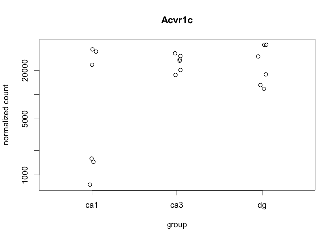
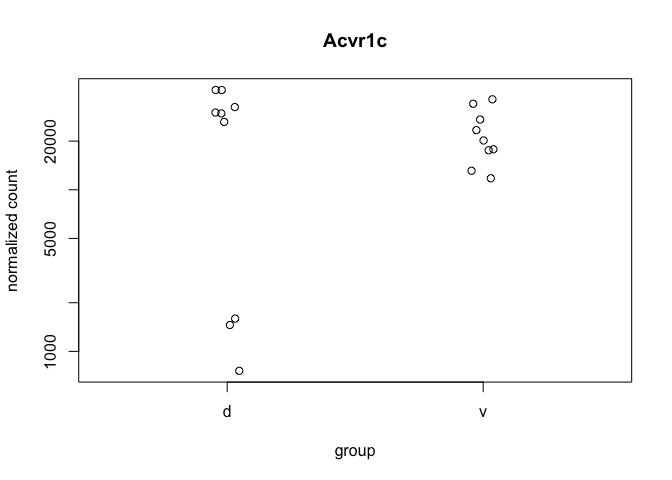
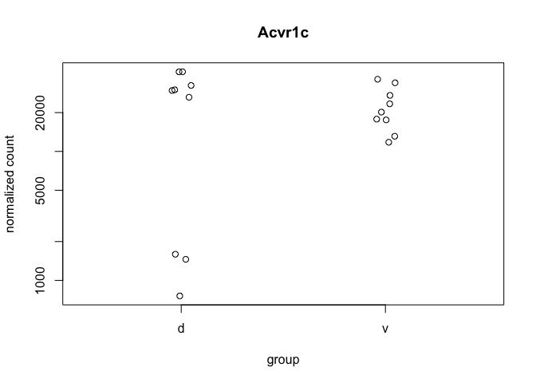
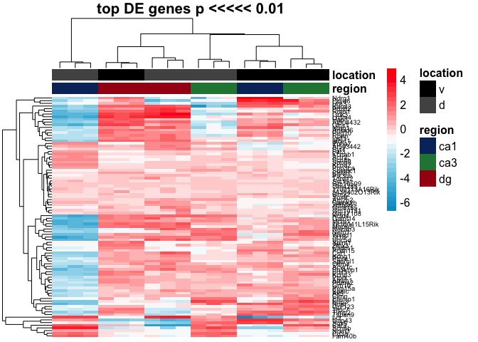
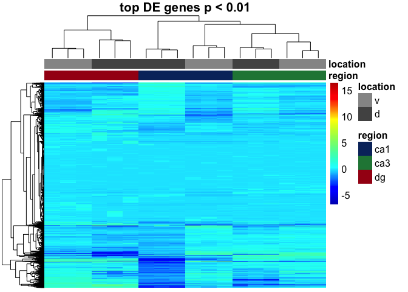
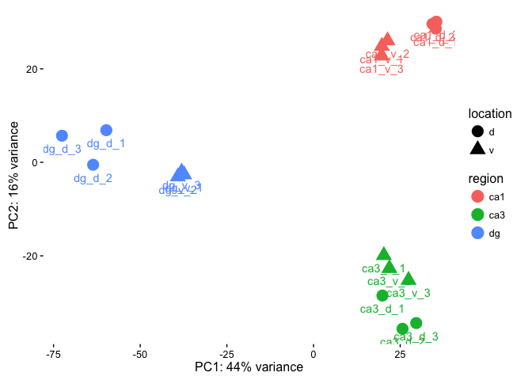
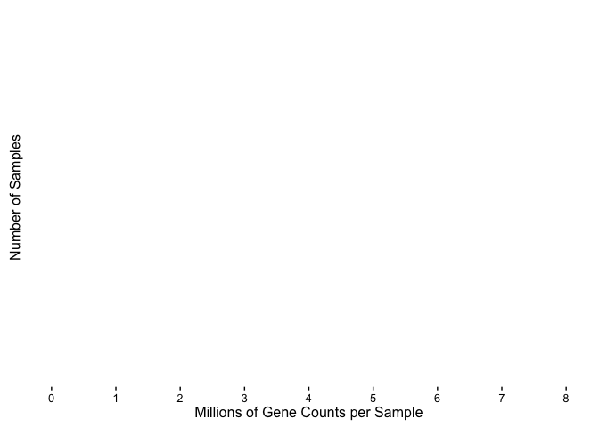

    ## Warning in full_join_impl(x, y, by$x, by$y, suffix$x, suffix$y): joining
    ## character vector and factor, coercing into character vector

#### Differential Gene Expression

    ## class: DESeqDataSet 
    ## dim: 23154 18 
    ## metadata(1): version
    ## assays(1): counts
    ## rownames(23154): 0610005C13Rik 0610007C21Rik ... Zzef1 Zzz3
    ## rowData names(0):
    ## colnames(18): dg_d_1 dg_d_2 ... ca1_v_2 ca1_v_3
    ## colData names(3): RNAseqID region location

    ## class: DESeqDataSet 
    ## dim: 23154 18 
    ## metadata(1): version
    ## assays(3): counts mu cooks
    ## rownames(23154): 0610005C13Rik 0610007C21Rik ... Zzef1 Zzz3
    ## rowData names(37): baseMean baseVar ... deviance maxCooks
    ## colnames(18): dg_d_1 dg_d_2 ... ca1_v_2 ca1_v_3
    ## colData names(4): RNAseqID region location sizeFactor

    ## 
    ## out of 23154 with nonzero total read count
    ## adjusted p-value < 0.1
    ## LFC > 0 (up)     : 2924, 13% 
    ## LFC < 0 (down)   : 1845, 8% 
    ## outliers [1]     : 2872, 12% 
    ## low counts [2]   : 0, 0% 
    ## (mean count < 0)
    ## [1] see 'cooksCutoff' argument of ?results
    ## [2] see 'independentFiltering' argument of ?results

    ## [1] 4769

    ## 
    ## out of 23154 with nonzero total read count
    ## adjusted p-value < 0.05
    ## LFC > 0 (up)     : 2510, 11% 
    ## LFC < 0 (down)   : 1530, 6.6% 
    ## outliers [1]     : 2872, 12% 
    ## low counts [2]   : 796, 3.4% 
    ## (mean count < 2)
    ## [1] see 'cooksCutoff' argument of ?results
    ## [2] see 'independentFiltering' argument of ?results

    ## [1] 4040

    ## [1] 3049

    ## [1] 7569

    ## [1] 3570

    ## [1] 7953

    ## null device 
    ##           1

    ## Warning in rm(ann_colors): object 'ann_colors' not found

    ##               PC1         PC2   group region location    name
    ## dg_d_1  -59.77531   6.8721902  dg : d     dg        d  dg_d_1
    ## dg_d_2  -63.58908  -0.5231247  dg : d     dg        d  dg_d_2
    ## dg_d_3  -72.56614   5.6871586  dg : d     dg        d  dg_d_3
    ## dg_v_1  -37.33232  -2.6303001  dg : v     dg        v  dg_v_1
    ## dg_v_2  -39.13036  -3.0578679  dg : v     dg        v  dg_v_2
    ## dg_v_3  -38.05815  -2.0442823  dg : v     dg        v  dg_v_3
    ## ca3_d_1  19.86808 -28.4907359 ca3 : d    ca3        d ca3_d_1
    ## ca3_d_2  25.66977 -35.5943721 ca3 : d    ca3        d ca3_d_2
    ## ca3_d_3  29.61580 -34.3787069 ca3 : d    ca3        d ca3_d_3
    ## ca3_v_1  20.28343 -19.8953740 ca3 : v    ca3        v ca3_v_1
    ## ca3_v_2  21.88636 -22.6663292 ca3 : v    ca3        v ca3_v_2
    ## ca3_v_3  27.40428 -25.1917459 ca3 : v    ca3        v ca3_v_3
    ## ca1_d_1  35.28578  28.5785230 ca1 : d    ca1        d ca1_d_1
    ## ca1_d_2  34.30461  29.6017201 ca1 : d    ca1        d ca1_d_2
    ## ca1_d_3  35.43417  30.0788933 ca1 : d    ca1        d ca1_d_3
    ## ca1_v_1  19.70195  24.8460738 ca1 : v    ca1        v ca1_v_1
    ## ca1_v_2  21.34259  26.0258445 ca1 : v    ca1        v ca1_v_2
    ## ca1_v_3  19.65454  22.7824357 ca1 : v    ca1        v ca1_v_3

    library(edgeR)

    ## Warning: package 'edgeR' was built under R version 3.3.2

    ## Loading required package: limma

    ## 
    ## Attaching package: 'limma'

    ## The following object is masked from 'package:DESeq2':
    ## 
    ##     plotMA

    ## The following object is masked from 'package:BiocGenerics':
    ## 
    ##     plotMA

    counts <- countData
    dim( counts )

    ## [1] 34262    18

    colSums( counts ) / 1e06  # in millions of reads

    ##   dg_d_1   dg_d_2   dg_d_3   dg_v_1   dg_v_2   dg_v_3  ca3_d_1  ca3_d_2 
    ## 219.8266 189.7792 192.3676 439.7873 413.3088 461.1183 601.7384 703.0054 
    ##  ca3_d_3  ca3_v_1  ca3_v_2  ca3_v_3  ca1_d_1  ca1_d_2  ca1_d_3  ca1_v_1 
    ## 655.3633 705.6929 712.1953 866.0251 716.7226 842.1256 619.2015 211.2678 
    ##  ca1_v_2  ca1_v_3 
    ## 143.2548 233.9112

    table( rowSums( counts ) )[ 1:30 ] # Number of genes with low counts

    ## 
    ##     0    28    56    84   112   140   168   196   224   252   280   308 
    ## 11108   961   640   439   351   294   251   251   219   192   173   172 
    ##   336   364   392   420   448   476   504   532   560   588   616   644 
    ##   145   145   133   127   118   108   112   114   101    99    87    90 
    ##   672   700   728   756   784   812 
    ##    74    84    90    67    73    71

    rowsum <- as.data.frame(colSums( counts ) / 1e06 )
    names(rowsum)[1] <- "millioncounts"
    rowsum$sample <- row.names(rowsum)

    ggplot(rowsum, aes(x=millioncounts)) + 
      geom_histogram(binwidth = 1, colour = "black", fill = "darkgrey") +
      theme_classic() +
      scale_x_continuous(name = "Millions of Gene Counts per Sample",
                         breaks = seq(0, 8, 1),
                         limits=c(0, 8)) +
      scale_y_continuous(name = "Number of Samples")

    ## Warning: Removed 18 rows containing non-finite values (stat_bin).

