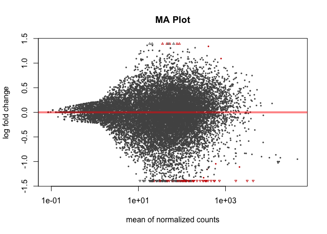
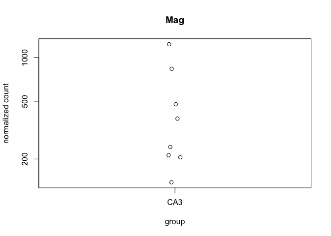
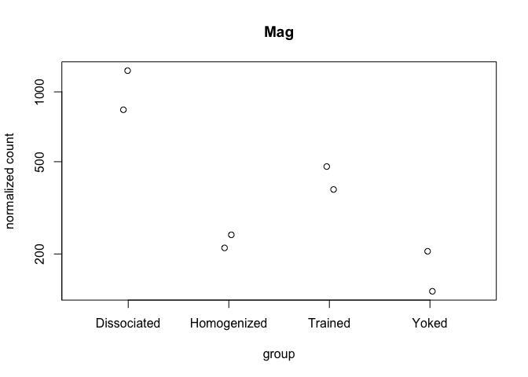
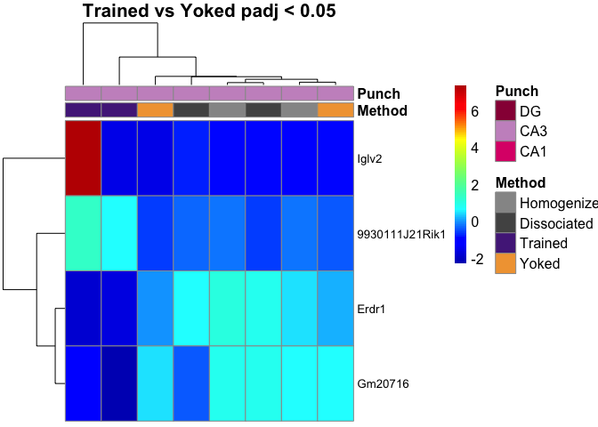
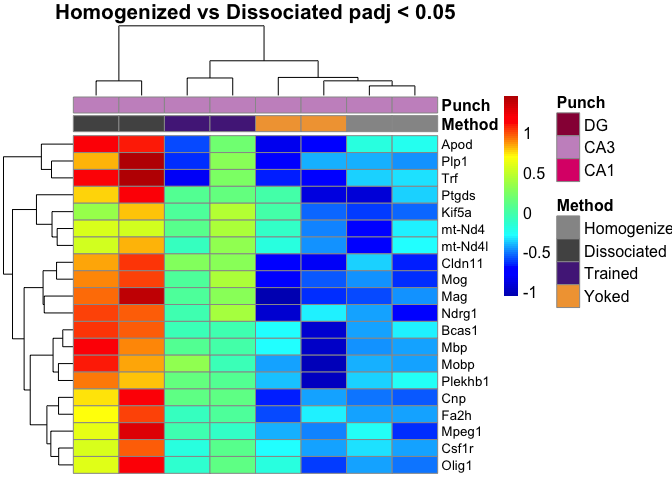
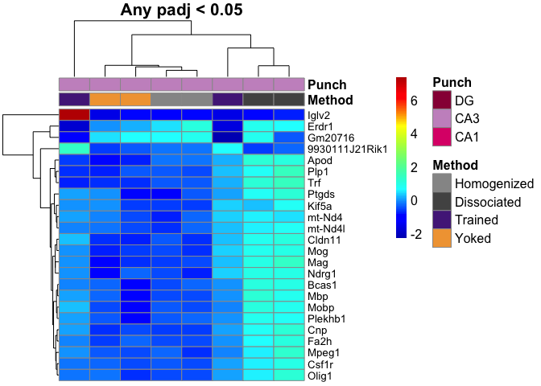
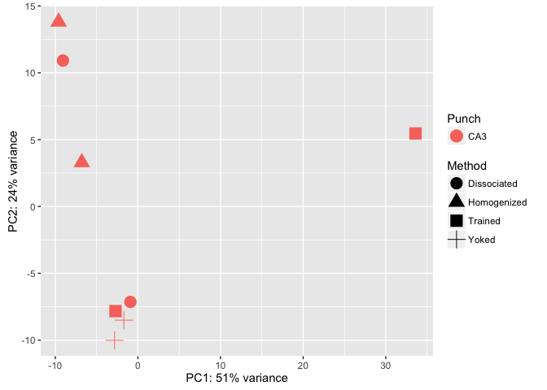

This R Markdown document will walk through the analysis of hippocampal tissue prepared with two different methods. The "homogenized" samples were collected by punch then homogenized in homogenization buffer from the Promega Maxwell kit. The "dissociated samples" were also collected similarily but the cells was dissociated after being punch and before being homogenized.

#### Differential Gene Expression Plots

    ## class: DESeqDataSet 
    ## dim: 16346 8 
    ## metadata(1): version
    ## assays(1): counts
    ## rownames(16346): 0610007P14Rik 0610009B22Rik ... Zzef1 Zzz3
    ## rowData names(0):
    ## colnames(8): 100-CA3-1 100-CA3-4 ... 147C-CA3-3 147D-CA3-1
    ## colData names(11): RNAseqID Method ... Punch.Collector jobnumber

    ## class: DESeqDataSet 
    ## dim: 16346 8 
    ## metadata(1): version
    ## assays(3): counts mu cooks
    ## rownames(16346): 0610007P14Rik 0610009B22Rik ... Zzef1 Zzz3
    ## rowData names(37): baseMean baseVar ... deviance maxCooks
    ## colnames(8): 100-CA3-1 100-CA3-4 ... 147C-CA3-3 147D-CA3-1
    ## colData names(12): RNAseqID Method ... jobnumber sizeFactor

    ## 
    ## out of 16346 with nonzero total read count
    ## adjusted p-value < 0.1
    ## LFC > 0 (up)     : 7, 0.043% 
    ## LFC < 0 (down)   : 60, 0.37% 
    ## outliers [1]     : 0, 0% 
    ## low counts [2]   : 0, 0% 
    ## (mean count < 0)
    ## [1] see 'cooksCutoff' argument of ?results
    ## [2] see 'independentFiltering' argument of ?results

    ## 
    ## out of 16346 with nonzero total read count
    ## adjusted p-value < 0.05
    ## LFC > 0 (up)     : 7, 0.043% 
    ## LFC < 0 (down)   : 55, 0.34% 
    ## outliers [1]     : 0, 0% 
    ## low counts [2]   : 2219, 14% 
    ## (mean count < 2)
    ## [1] see 'cooksCutoff' argument of ?results
    ## [2] see 'independentFiltering' argument of ?results



    ## NULL



resPunchCA1DG \<- results(dds, contrast = c("Punch", "CA1", "DG"), independentFiltering = F) \#sum(resPunchCA1DG\(padj < 0.1, na.rm = TRUE) # 4170 #1127 valsPunchCA1DG <- cbind(resPunchCA1DG\)pvalue, resPunchCA1DG$padj) colnames(valsPunchCA1DG)=c("pval.CA1DG", "padj.CA1DG")

resPunchCA1CA3 \<- results(dds, contrast = c("Punch", "CA1", "CA3"), independentFiltering = F) \#sum(resPunchCA1CA3\(padj < 0.1, na.rm = TRUE) #2240 # 70 valsPunchCA1CA3 <- cbind(resPunchCA1CA3\)pvalue, resPunchCA1CA3$padj) colnames(valsPunchCA1CA3)=c("pval.CA1CA3", "padj.CA1CA3")

resPunchCA3DG \<- results(dds, contrast = c("Punch", "CA3", "DG"), independentFiltering = F) \#sum(resPunchCA3DG\(padj < 0.1, na.rm = TRUE) #4785 #591 valsPunchCA3DG <- cbind(resPunchCA3DG\)pvalue, resPunchCA3DG$padj) colnames(valsPunchCA3DG)=c("pval.CA3DG", "padj.CA3DG")

\`\`\`{r VennDiagram, echo=FALSE, message=FALSE}
================================================

rldpvals \<- as.data.frame(rldpvals)

MethodHomogDiss \<- row.names(rldpvals[rldpvals\(padj.MethodHomogDiss<0.1 & !is.na(rldpvals\)padj.MethodHomogDiss),]) \#MethodYokedTrained \<- row.names(rldpvals[rldpvals\(padj.valsMethodYokedTrained<0.1 & !is.na(rldpvals\)padj.valsMethodYokedTrained),]) PunchCA1DG \<- row.names(rldpvals[rldpvals\(padj.CA1DG<0.1 & !is.na(rldpvals\)padj.CA1DG),]) PunchCA1CA3 \<- row.names(rldpvals[rldpvals\(padj.CA1CA3<0.1 & !is.na(rldpvals\)padj.CA1CA3),]) PunchCA3DG \<- row.names(rldpvals[rldpvals\(padj.CA3DG<0.1 & !is.na(rldpvals\)padj.CA3DG),])

four way grid
-------------

candidates \<- list("CA1 v. DG" = PunchCA1DG, "CA1 v. CA3" = PunchCA1CA3, "CA3 v. DG" = PunchCA3DG, "Homogenized v. Dissociated" = MethodHomogDiss ) dev.off() prettyvenn \<- venn.diagram( x = candidates, filename=NULL, lwd=4, col = "transparent", fill = (values=c("\#00441b", "\#00441b","\#238b45", "\#238b45")), alpha = 0.5, cex = 1, fontfamily = "sans", \#fontface = "bold", cat.default.pos = "text", \#cat.col = c("darkred", "darkgreen", "blue4", "orange"), \#cat.dist = c(0.08, 0.08, 0.08, 0.08), cat.pos = 1, cat.cex = 1, cat.fontfamily = "sans") grid.draw(prettyvenn)

ca1 ca3 homo diss
-----------------

candidates \<- list("CA1 v. CA3" = PunchCA1CA3, "Homogenized v. Dissociated" = MethodHomogDiss ) dev.off() prettyvenn \<- venn.diagram( x = candidates, filename=NULL, lwd=2, col = "transparent", fill = (values=c("\#00441b", "\#00441b")), alpha = 0.5, cex = 1, fontfamily = "sans", \#fontface = "bold", cat.default.pos = "text", \#cat.col = c("darkred", "darkgreen", "blue4", "orange"), \#cat.dist = c(0.08, 0.08, 0.08, 0.08), cat.pos = 1, cat.cex = 1, cat.fontfamily = "sans") grid.draw(prettyvenn)

ca1 dg homo diss
----------------

candidates \<- list("CA1 v. DG" = PunchCA1DG, "Homogenized v. Dissociated" = MethodHomogDiss ) dev.off() prettyvenn \<- venn.diagram( x = candidates, filename=NULL, lwd=4, col = "transparent", fill = (values=c("\#00441b", "\#00441b")), alpha = 0.5, cex = 1, fontfamily = "sans", \#fontface = "bold", cat.default.pos = "text", \#cat.col = c("darkred", "darkgreen", "blue4", "orange"), \#cat.dist = c(0.08, 0.08, 0.08, 0.08), cat.pos = 1, cat.cex = 1, cat.fontfamily = "sans") grid.draw(prettyvenn)

ca3 dg homo diss
----------------

candidates \<- list("CA3 v. DG" = PunchCA3DG, "Homogenized v. Dissociated" = MethodHomogDiss ) dev.off() prettyvenn \<- venn.diagram( x = candidates, filename=NULL, lwd=2, col = "transparent", fill = (values=c("\#00441b", "\#00441b")), alpha = 0.5, cex = 1, fontfamily = "sans", \#fontface = "bold", cat.default.pos = "text", \#cat.col = c("darkred", "darkgreen", "blue4", "orange"), \#cat.dist = c(0.08, 0.08, 0.08, 0.08), cat.pos = 1, cat.cex = 1, cat.fontfamily = "sans") grid.draw(prettyvenn)

\`\`\`
======



    ##                   PC1        PC2             group      Method Punch
    ## 100-CA3-1  -9.5949396  13.811245 Homogenized : CA3 Homogenized   CA3
    ## 100-CA3-4  -6.7962154   3.296780 Homogenized : CA3 Homogenized   CA3
    ## 101-CA3-1  -9.0690275  10.918445 Dissociated : CA3 Dissociated   CA3
    ## 101-CA3-4  -0.9069006  -7.139785 Dissociated : CA3 Dissociated   CA3
    ## 146C-CA3-4 33.5965734   5.463388     Trained : CA3     Trained   CA3
    ## 146D-CA3-3 -1.6943967  -8.507738       Yoked : CA3       Yoked   CA3
    ## 147C-CA3-3 -2.7115965  -7.829288     Trained : CA3     Trained   CA3
    ## 147D-CA3-1 -2.8234970 -10.013047       Yoked : CA3       Yoked   CA3
    ##                  name
    ## 100-CA3-1   100-CA3-1
    ## 100-CA3-4   100-CA3-4
    ## 101-CA3-1   101-CA3-1
    ## 101-CA3-4   101-CA3-4
    ## 146C-CA3-4 146C-CA3-4
    ## 146D-CA3-3 146D-CA3-3
    ## 147C-CA3-3 147C-CA3-3
    ## 147D-CA3-1 147D-CA3-1



``` r
library(edgeR)
```

    ## Warning: package 'edgeR' was built under R version 3.3.2

    ## Loading required package: limma

    ## 
    ## Attaching package: 'limma'

    ## The following object is masked from 'package:DESeq2':
    ## 
    ##     plotMA

    ## The following object is masked from 'package:BiocGenerics':
    ## 
    ##     plotMA

``` r
counts <- countData
dim( counts )
```

    ## [1] 22485     8

``` r
colSums( counts )
```

    ##  100-CA3-1  100-CA3-4  101-CA3-1  101-CA3-4 146C-CA3-4 146D-CA3-3 
    ##    1974845    2352153    2498914    1193153     257822    2994536 
    ## 147C-CA3-3 147D-CA3-1 
    ##    5754581    4624995

``` r
colSums( counts ) / 1e06  # in millions of reads
```

    ##  100-CA3-1  100-CA3-4  101-CA3-1  101-CA3-4 146C-CA3-4 146D-CA3-3 
    ##   1.974845   2.352153   2.498914   1.193153   0.257822   2.994536 
    ## 147C-CA3-3 147D-CA3-1 
    ##   5.754581   4.624995

``` r
table( rowSums( counts ) )[ 1:30 ] # Number of genes with low counts
```

    ## 
    ##    0    1    2    3    4    5    6    7    8    9   10   11   12   13   14 
    ## 5794  345  243  234  177  177  139  140  137  115  126  104  101   96   85 
    ##   15   16   17   18   19   20   21   22   23   24   25   26   27   28   29 
    ##   87   81   63   70   67   77   69   55   53   48   54   45   57   44   47
