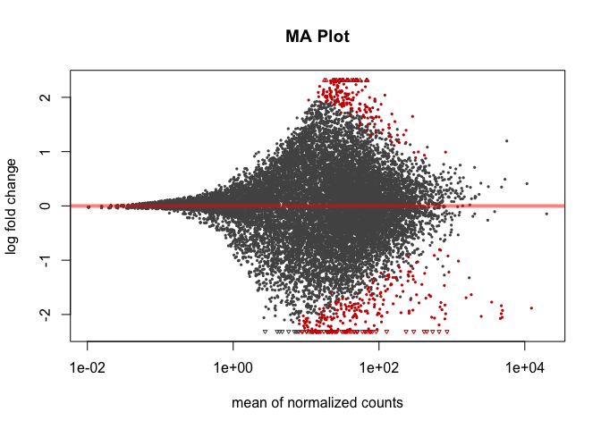
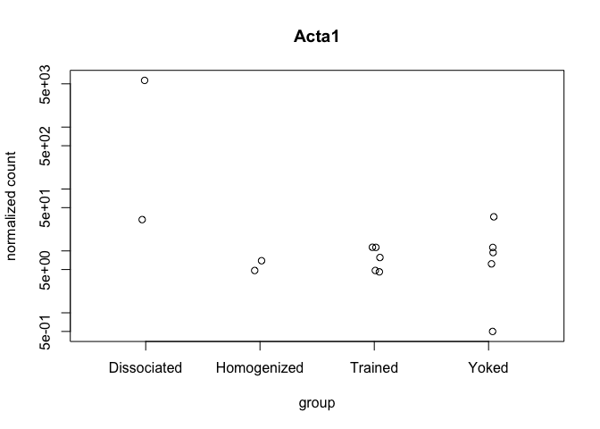
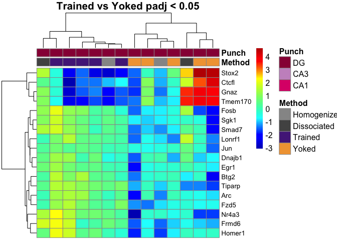
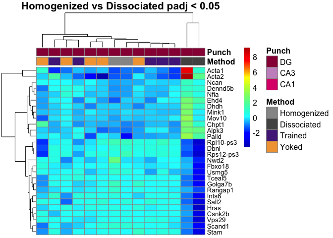
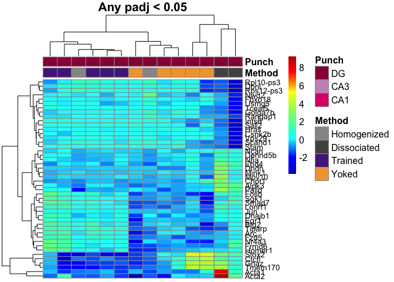
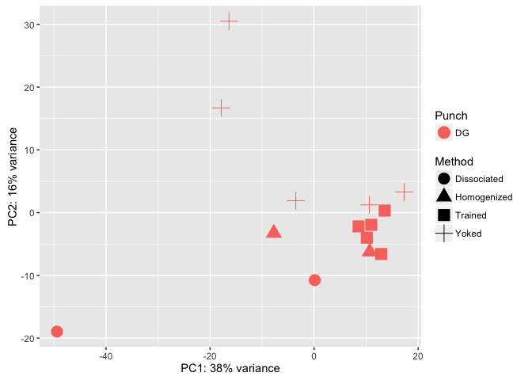

This R Markdown document will walk through the analysis of hippocampal tissue prepared with two different methods. The "homogenized" samples were collected by punch then homogenized in homogenization buffer from the Promega Maxwell kit. The "dissociated samples" were also collected similarily but the cells was dissociated after being punch and before being homogenized.

#### Differential Gene Expression Plots

    ## class: DESeqDataSet 
    ## dim: 16818 14 
    ## metadata(1): version
    ## assays(1): counts
    ## rownames(16818): 0610007P14Rik 0610009B22Rik ... Zzef1 Zzz3
    ## rowData names(0):
    ## colnames(14): 100-DG-2 100-DG-3 ... 148A-DG-3 148B-DG-4
    ## colData names(11): RNAseqID Method ... Punch.Collector jobnumber

    ## class: DESeqDataSet 
    ## dim: 16818 14 
    ## metadata(1): version
    ## assays(3): counts mu cooks
    ## rownames(16818): 0610007P14Rik 0610009B22Rik ... Zzef1 Zzz3
    ## rowData names(37): baseMean baseVar ... deviance maxCooks
    ## colnames(14): 100-DG-2 100-DG-3 ... 148A-DG-3 148B-DG-4
    ## colData names(12): RNAseqID Method ... jobnumber sizeFactor

    ## 
    ## out of 16818 with nonzero total read count
    ## adjusted p-value < 0.1
    ## LFC > 0 (up)     : 234, 1.4% 
    ## LFC < 0 (down)   : 341, 2% 
    ## outliers [1]     : 100, 0.59% 
    ## low counts [2]   : 0, 0% 
    ## (mean count < 0)
    ## [1] see 'cooksCutoff' argument of ?results
    ## [2] see 'independentFiltering' argument of ?results

    ## 
    ## out of 16818 with nonzero total read count
    ## adjusted p-value < 0.05
    ## LFC > 0 (up)     : 183, 1.1% 
    ## LFC < 0 (down)   : 273, 1.6% 
    ## outliers [1]     : 100, 0.59% 
    ## low counts [2]   : 6444, 38% 
    ## (mean count < 8)
    ## [1] see 'cooksCutoff' argument of ?results
    ## [2] see 'independentFiltering' argument of ?results

    ## NULL

resPunchCA1DG \<- results(dds, contrast = c("Punch", "CA1", "DG"), independentFiltering = F) \#sum(resPunchCA1DG\(padj < 0.1, na.rm = TRUE) # 4170 #1127 valsPunchCA1DG <- cbind(resPunchCA1DG\)pvalue, resPunchCA1DG$padj) colnames(valsPunchCA1DG)=c("pval.CA1DG", "padj.CA1DG")

resPunchCA1CA3 \<- results(dds, contrast = c("Punch", "CA1", "CA3"), independentFiltering = F) \#sum(resPunchCA1CA3\(padj < 0.1, na.rm = TRUE) #2240 # 70 valsPunchCA1CA3 <- cbind(resPunchCA1CA3\)pvalue, resPunchCA1CA3$padj) colnames(valsPunchCA1CA3)=c("pval.CA1CA3", "padj.CA1CA3")

resPunchCA3DG \<- results(dds, contrast = c("Punch", "CA3", "DG"), independentFiltering = F) \#sum(resPunchCA3DG\(padj < 0.1, na.rm = TRUE) #4785 #591 valsPunchCA3DG <- cbind(resPunchCA3DG\)pvalue, resPunchCA3DG$padj) colnames(valsPunchCA3DG)=c("pval.CA3DG", "padj.CA3DG")

\`\`\`{r VennDiagram, echo=FALSE, message=FALSE}
================================================

rldpvals \<- as.data.frame(rldpvals)

MethodHomogDiss \<- row.names(rldpvals[rldpvals\(padj.MethodHomogDiss<0.1 & !is.na(rldpvals\)padj.MethodHomogDiss),]) \#MethodYokedTrained \<- row.names(rldpvals[rldpvals\(padj.valsMethodYokedTrained<0.1 & !is.na(rldpvals\)padj.valsMethodYokedTrained),]) PunchCA1DG \<- row.names(rldpvals[rldpvals\(padj.CA1DG<0.1 & !is.na(rldpvals\)padj.CA1DG),]) PunchCA1CA3 \<- row.names(rldpvals[rldpvals\(padj.CA1CA3<0.1 & !is.na(rldpvals\)padj.CA1CA3),]) PunchCA3DG \<- row.names(rldpvals[rldpvals\(padj.CA3DG<0.1 & !is.na(rldpvals\)padj.CA3DG),])

four way grid
-------------

candidates \<- list("CA1 v. DG" = PunchCA1DG, "CA1 v. CA3" = PunchCA1CA3, "CA3 v. DG" = PunchCA3DG, "Homogenized v. Dissociated" = MethodHomogDiss ) dev.off() prettyvenn \<- venn.diagram( x = candidates, filename=NULL, lwd=4, col = "transparent", fill = (values=c("\#00441b", "\#00441b","\#238b45", "\#238b45")), alpha = 0.5, cex = 1, fontfamily = "sans", \#fontface = "bold", cat.default.pos = "text", \#cat.col = c("darkred", "darkgreen", "blue4", "orange"), \#cat.dist = c(0.08, 0.08, 0.08, 0.08), cat.pos = 1, cat.cex = 1, cat.fontfamily = "sans") grid.draw(prettyvenn)

ca1 ca3 homo diss
-----------------

candidates \<- list("CA1 v. CA3" = PunchCA1CA3, "Homogenized v. Dissociated" = MethodHomogDiss ) dev.off() prettyvenn \<- venn.diagram( x = candidates, filename=NULL, lwd=2, col = "transparent", fill = (values=c("\#00441b", "\#00441b")), alpha = 0.5, cex = 1, fontfamily = "sans", \#fontface = "bold", cat.default.pos = "text", \#cat.col = c("darkred", "darkgreen", "blue4", "orange"), \#cat.dist = c(0.08, 0.08, 0.08, 0.08), cat.pos = 1, cat.cex = 1, cat.fontfamily = "sans") grid.draw(prettyvenn)

ca1 dg homo diss
----------------

candidates \<- list("CA1 v. DG" = PunchCA1DG, "Homogenized v. Dissociated" = MethodHomogDiss ) dev.off() prettyvenn \<- venn.diagram( x = candidates, filename=NULL, lwd=4, col = "transparent", fill = (values=c("\#00441b", "\#00441b")), alpha = 0.5, cex = 1, fontfamily = "sans", \#fontface = "bold", cat.default.pos = "text", \#cat.col = c("darkred", "darkgreen", "blue4", "orange"), \#cat.dist = c(0.08, 0.08, 0.08, 0.08), cat.pos = 1, cat.cex = 1, cat.fontfamily = "sans") grid.draw(prettyvenn)

ca3 dg homo diss
----------------

candidates \<- list("CA3 v. DG" = PunchCA3DG, "Homogenized v. Dissociated" = MethodHomogDiss ) dev.off() prettyvenn \<- venn.diagram( x = candidates, filename=NULL, lwd=2, col = "transparent", fill = (values=c("\#00441b", "\#00441b")), alpha = 0.5, cex = 1, fontfamily = "sans", \#fontface = "bold", cat.default.pos = "text", \#cat.col = c("darkred", "darkgreen", "blue4", "orange"), \#cat.dist = c(0.08, 0.08, 0.08, 0.08), cat.pos = 1, cat.cex = 1, cat.fontfamily = "sans") grid.draw(prettyvenn)

\`\`\`
======

    ##                   PC1         PC2            group      Method Punch
    ## 100-DG-2   -7.7452879  -3.2603461 Homogenized : DG Homogenized    DG
    ## 100-DG-3   10.6917399  -6.2330855 Homogenized : DG Homogenized    DG
    ## 101-DG-3  -49.4180850 -18.9616048 Dissociated : DG Dissociated    DG
    ## 101-DG-4    0.1253773 -10.7606587 Dissociated : DG Dissociated    DG
    ## 145A-DG-2  13.5741012   0.3277981     Trained : DG     Trained    DG
    ## 145B-DG-1  10.6313627   1.2355418       Yoked : DG       Yoked    DG
    ## 146A-DG-2  10.9880694  -1.9349261     Trained : DG     Trained    DG
    ## 146B-DG-2 -17.8480816  16.6799210       Yoked : DG       Yoked    DG
    ## 146C-DG-4   8.5519760  -2.1897537     Trained : DG     Trained    DG
    ## 146D-DG-3 -16.3582954  30.4922048       Yoked : DG       Yoked    DG
    ## 147C-DG-3  12.8965955  -6.5954698     Trained : DG     Trained    DG
    ## 147D-DG-1  17.3014613   3.2872675       Yoked : DG       Yoked    DG
    ## 148A-DG-3  10.1350570  -3.9947720     Trained : DG     Trained    DG
    ## 148B-DG-4  -3.5259904   1.9078834       Yoked : DG       Yoked    DG
    ##                name
    ## 100-DG-2   100-DG-2
    ## 100-DG-3   100-DG-3
    ## 101-DG-3   101-DG-3
    ## 101-DG-4   101-DG-4
    ## 145A-DG-2 145A-DG-2
    ## 145B-DG-1 145B-DG-1
    ## 146A-DG-2 146A-DG-2
    ## 146B-DG-2 146B-DG-2
    ## 146C-DG-4 146C-DG-4
    ## 146D-DG-3 146D-DG-3
    ## 147C-DG-3 147C-DG-3
    ## 147D-DG-1 147D-DG-1
    ## 148A-DG-3 148A-DG-3
    ## 148B-DG-4 148B-DG-4

