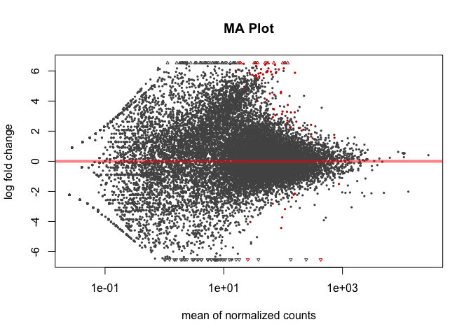
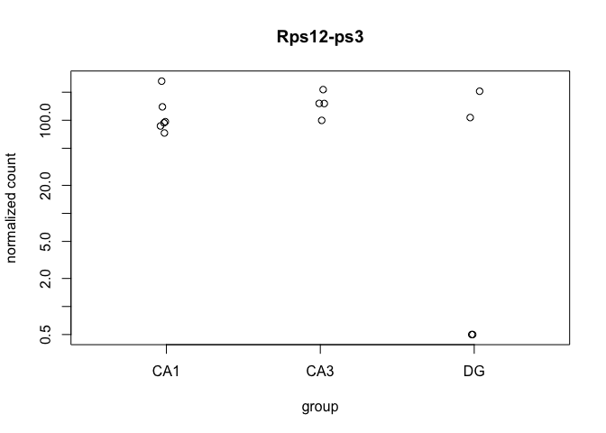

This R Markdown document will walk through the analysis of hippocampal tissue prepared with two different methods. The "homogenized" samples were collected by punch then homogenized in homogenization buffer from the Promega Maxwell kit. The "dissociated samples" were also collected similarily but the cells was dissociated after being punch and before being homogenized.

#### Differential Gene Expression Plots

    ## class: DESeqDataSet 
    ## dim: 16556 14 
    ## metadata(1): version
    ## assays(1): counts
    ## rownames(16556): 0610007P14Rik 0610009B22Rik ... Zzef1 Zzz3
    ## rowData names(0):
    ## colnames(14): 100-CA1-1 100-CA1-2 ... 101-DG-3 101-DG-4
    ## colData names(11): RNAseqID Method ... Punch.Collector jobnumber

    ## class: DESeqDataSet 
    ## dim: 16556 14 
    ## metadata(1): version
    ## assays(3): counts mu cooks
    ## rownames(16556): 0610007P14Rik 0610009B22Rik ... Zzef1 Zzz3
    ## rowData names(37): baseMean baseVar ... deviance maxCooks
    ## colnames(14): 100-CA1-1 100-CA1-2 ... 101-DG-3 101-DG-4
    ## colData names(12): RNAseqID Method ... jobnumber sizeFactor

    ## 
    ## out of 16556 with nonzero total read count
    ## adjusted p-value < 0.1
    ## LFC > 0 (up)     : 72, 0.43% 
    ## LFC < 0 (down)   : 12, 0.072% 
    ## outliers [1]     : 53, 0.32% 
    ## low counts [2]   : 0, 0% 
    ## (mean count < 0)
    ## [1] see 'cooksCutoff' argument of ?results
    ## [2] see 'independentFiltering' argument of ?results

    ## [1] 84

    ## 
    ## out of 16556 with nonzero total read count
    ## adjusted p-value < 0.05
    ## LFC > 0 (up)     : 64, 0.39% 
    ## LFC < 0 (down)   : 12, 0.072% 
    ## outliers [1]     : 53, 0.32% 
    ## low counts [2]   : 7375, 45% 
    ## (mean count < 16)
    ## [1] see 'cooksCutoff' argument of ?results
    ## [2] see 'independentFiltering' argument of ?results

    ## [1] 76



    ## NULL



    ## [1] 217

    ## [1] 847

    ## [1] 5

    ## [1] 619

    ## null device 
    ##           1


    ##                  PC1        PC2             group      Method Punch
    ## 100-CA1-1 -18.387463  10.329061 Homogenized : CA1 Homogenized   CA1
    ## 100-CA1-2 -19.371485  12.210094 Homogenized : CA1 Homogenized   CA1
    ## 100-CA1-3 -17.868242  12.819151 Homogenized : CA1 Homogenized   CA1
    ## 100-CA3-1 -12.879839   2.192040 Homogenized : CA3 Homogenized   CA3
    ## 100-CA3-4  -9.672642  -3.884004 Homogenized : CA3 Homogenized   CA3
    ## 100-DG-2   12.170271  -2.311547  Homogenized : DG Homogenized    DG
    ## 100-DG-3   32.192450  19.193159  Homogenized : DG Homogenized    DG
    ## 101-CA1-1 -16.068006   5.521941 Dissociated : CA1 Dissociated   CA1
    ## 101-CA1-2  -5.958180  -5.420566 Dissociated : CA1 Dissociated   CA1
    ## 101-CA1-3   4.087806 -18.500180 Dissociated : CA1 Dissociated   CA1
    ## 101-CA3-1  -9.855953  -5.830933 Dissociated : CA3 Dissociated   CA3
    ## 101-CA3-4   3.559366 -21.460246 Dissociated : CA3 Dissociated   CA3
    ## 101-DG-3   19.409501 -20.544188  Dissociated : DG Dissociated    DG
    ## 101-DG-4   38.642417  15.686218  Dissociated : DG Dissociated    DG
    ##                name
    ## 100-CA1-1 100-CA1-1
    ## 100-CA1-2 100-CA1-2
    ## 100-CA1-3 100-CA1-3
    ## 100-CA3-1 100-CA3-1
    ## 100-CA3-4 100-CA3-4
    ## 100-DG-2   100-DG-2
    ## 100-DG-3   100-DG-3
    ## 101-CA1-1 101-CA1-1
    ## 101-CA1-2 101-CA1-2
    ## 101-CA1-3 101-CA1-3
    ## 101-CA3-1 101-CA3-1
    ## 101-CA3-4 101-CA3-4
    ## 101-DG-3   101-DG-3
    ## 101-DG-4   101-DG-4


``` r
library(edgeR)
```

    ## Warning: package 'edgeR' was built under R version 3.3.2

    ## Loading required package: limma

    ## 
    ## Attaching package: 'limma'

    ## The following object is masked from 'package:DESeq2':
    ## 
    ##     plotMA

    ## The following object is masked from 'package:BiocGenerics':
    ## 
    ##     plotMA

``` r
counts <- countData
dim( counts )
```

    ## [1] 22485    14

``` r
colSums( counts ) / 1e06  # in millions of reads
```

    ## 100-CA1-1 100-CA1-2 100-CA1-3 100-CA3-1 100-CA3-4  100-DG-2  100-DG-3 
    ##  2.310696  6.646222  2.276635  1.974208  2.351650  1.285004  6.086292 
    ## 101-CA1-1 101-CA1-2 101-CA1-3 101-CA3-1 101-CA3-4  101-DG-3  101-DG-4 
    ##  4.782463  0.133622  0.300000  2.498531  1.192730  0.063507  0.598340

``` r
table( rowSums( counts ) )[ 1:30 ] # Number of genes with low counts
```

    ## 
    ##    0    2    3    4    5    6    7    8    9   10   11   12   13   14   15 
    ## 5566  363  242  174  191  155  127  131  127  114  104  104   82   72   86 
    ##   16   17   18   19   20   21   22   23   24   25   26   27   28   29   30 
    ##   67   76   72   53   68   45   56   63   54   54   56   54   57   55   39

``` r
#geneids <- read.csv('../intermediatefiles/geneids.csv')
#rownames(colData) <- colData$RNAseqID
#listofDegs <- row.names(DEGes)
#listofDegs <- as.data.frame(listofDegs)
#names(listofDegs)[names(listofDegs)=="listofDegs"] <- "gene"
#listofDegs <- left_join(listofDegs, geneids) 
#listofDegs <- listofDegs %>% 
 # distinct(gene, ENSMUSG) 
#rownames(listofDegs) <- listofDegs$gene 
#listofDegs <- listofDegs %>% select(ENSMUSG) 

#write.table(listofDegs, '../intermediatefiles/listofDegs.csv', row.names = TRUE, sep=",", col.names = T)
```

``` r
readcounts <- read.table("../intermediatefiles/readcounts.txt")
str(readcounts)
```

    ## 'data.frame':    67 obs. of  2 variables:
    ##  $ V1: int  151 151 151 151 151 151 151 151 151 151 ...
    ##  $ V2: num  5220597 9496400 6060222 6780934 3658178 ...

``` r
library(dplyr)
library(ggplot2)
mean(readcounts$V2) #6023049
```

    ## [1] 6023049

``` r
sum(readcounts$V2)  #403544258
```

    ## [1] 403544258

``` r
readcounts$millionreads <- readcounts$V2/1000000

qplot(millionreads, data=readcounts, geom="histogram")
```

    ## `stat_bin()` using `bins = 30`. Pick better value with `binwidth`.


``` r
newreadcounts <- readcounts %>% filter(V2 != 529, V2 != 890) 

mean(newreadcounts$V2) #6208351
```

    ## [1] 6208351

``` r
sum(newreadcounts$V2)  #403542839
```

    ## [1] 403542839

``` r
qplot(millionreads, data=newreadcounts, geom="histogram", binwidth = 1)
```


