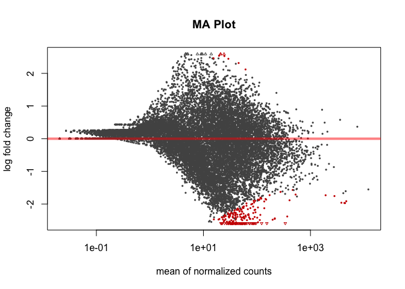
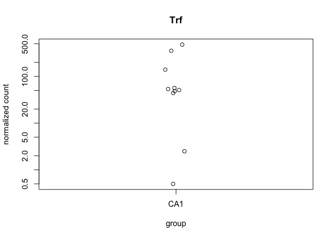
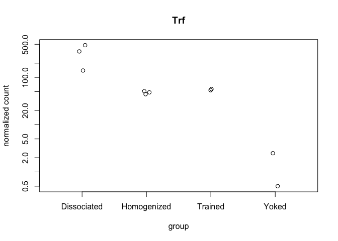
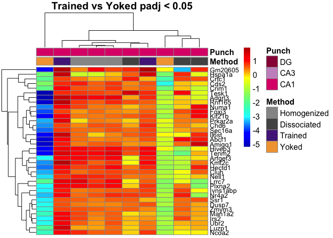
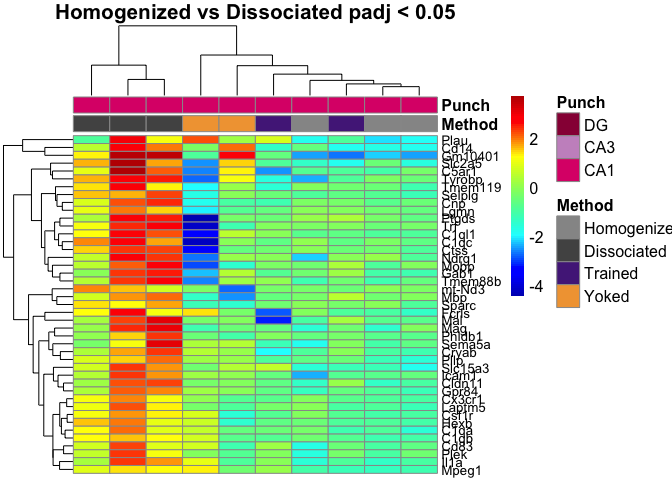
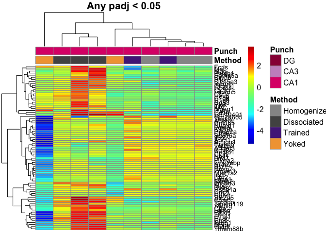
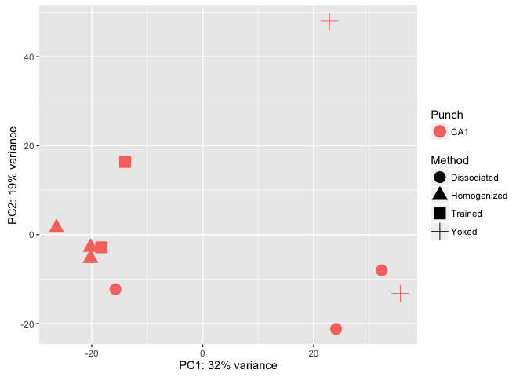

This R Markdown document will walk through the analysis of hippocampal tissue prepared with two different methods. The "homogenized" samples were collected by punch then homogenized in homogenization buffer from the Promega Maxwell kit. The "dissociated samples" were also collected similarily but the cells was dissociated after being punch and before being homogenized.

#### Differential Gene Expression Plots

    ## class: DESeqDataSet 
    ## dim: 16615 10 
    ## metadata(1): version
    ## assays(1): counts
    ## rownames(16615): 0610007P14Rik 0610009B22Rik ... Zzef1 Zzz3
    ## rowData names(0):
    ## colnames(10): 100-CA1-1 100-CA1-2 ... 147C-CA1-3 147D-CA1-1
    ## colData names(11): RNAseqID Method ... Punch.Collector jobnumber

    ## class: DESeqDataSet 
    ## dim: 16615 10 
    ## metadata(1): version
    ## assays(3): counts mu cooks
    ## rownames(16615): 0610007P14Rik 0610009B22Rik ... Zzef1 Zzz3
    ## rowData names(37): baseMean baseVar ... deviance maxCooks
    ## colnames(10): 100-CA1-1 100-CA1-2 ... 147C-CA1-3 147D-CA1-1
    ## colData names(12): RNAseqID Method ... jobnumber sizeFactor

    ## 
    ## out of 16615 with nonzero total read count
    ## adjusted p-value < 0.1
    ## LFC > 0 (up)     : 15, 0.09% 
    ## LFC < 0 (down)   : 171, 1% 
    ## outliers [1]     : 81, 0.49% 
    ## low counts [2]   : 0, 0% 
    ## (mean count < 0)
    ## [1] see 'cooksCutoff' argument of ?results
    ## [2] see 'independentFiltering' argument of ?results

    ## 
    ## out of 16615 with nonzero total read count
    ## adjusted p-value < 0.05
    ## LFC > 0 (up)     : 9, 0.054% 
    ## LFC < 0 (down)   : 204, 1.2% 
    ## outliers [1]     : 81, 0.49% 
    ## low counts [2]   : 9263, 56% 
    ## (mean count < 14)
    ## [1] see 'cooksCutoff' argument of ?results
    ## [2] see 'independentFiltering' argument of ?results



    ## NULL



resPunchCA1DG \<- results(dds, contrast = c("Punch", "CA1", "DG"), independentFiltering = F) \#sum(resPunchCA1DG\(padj < 0.1, na.rm = TRUE) # 4170 #1127 valsPunchCA1DG <- cbind(resPunchCA1DG\)pvalue, resPunchCA1DG$padj) colnames(valsPunchCA1DG)=c("pval.CA1DG", "padj.CA1DG")

resPunchCA1CA3 \<- results(dds, contrast = c("Punch", "CA1", "CA3"), independentFiltering = F) \#sum(resPunchCA1CA3\(padj < 0.1, na.rm = TRUE) #2240 # 70 valsPunchCA1CA3 <- cbind(resPunchCA1CA3\)pvalue, resPunchCA1CA3$padj) colnames(valsPunchCA1CA3)=c("pval.CA1CA3", "padj.CA1CA3")

resPunchCA3DG \<- results(dds, contrast = c("Punch", "CA3", "DG"), independentFiltering = F) \#sum(resPunchCA3DG\(padj < 0.1, na.rm = TRUE) #4785 #591 valsPunchCA3DG <- cbind(resPunchCA3DG\)pvalue, resPunchCA3DG$padj) colnames(valsPunchCA3DG)=c("pval.CA3DG", "padj.CA3DG")

\`\`\`{r VennDiagram, echo=FALSE, message=FALSE}
================================================

rldpvals \<- as.data.frame(rldpvals)

MethodHomogDiss \<- row.names(rldpvals[rldpvals\(padj.MethodHomogDiss<0.1 & !is.na(rldpvals\)padj.MethodHomogDiss),]) \#MethodYokedTrained \<- row.names(rldpvals[rldpvals\(padj.valsMethodYokedTrained<0.1 & !is.na(rldpvals\)padj.valsMethodYokedTrained),]) PunchCA1DG \<- row.names(rldpvals[rldpvals\(padj.CA1DG<0.1 & !is.na(rldpvals\)padj.CA1DG),]) PunchCA1CA3 \<- row.names(rldpvals[rldpvals\(padj.CA1CA3<0.1 & !is.na(rldpvals\)padj.CA1CA3),]) PunchCA3DG \<- row.names(rldpvals[rldpvals\(padj.CA3DG<0.1 & !is.na(rldpvals\)padj.CA3DG),])

four way grid
-------------

candidates \<- list("CA1 v. DG" = PunchCA1DG, "CA1 v. CA3" = PunchCA1CA3, "CA3 v. DG" = PunchCA3DG, "Homogenized v. Dissociated" = MethodHomogDiss ) dev.off() prettyvenn \<- venn.diagram( x = candidates, filename=NULL, lwd=4, col = "transparent", fill = (values=c("\#00441b", "\#00441b","\#238b45", "\#238b45")), alpha = 0.5, cex = 1, fontfamily = "sans", \#fontface = "bold", cat.default.pos = "text", \#cat.col = c("darkred", "darkgreen", "blue4", "orange"), \#cat.dist = c(0.08, 0.08, 0.08, 0.08), cat.pos = 1, cat.cex = 1, cat.fontfamily = "sans") grid.draw(prettyvenn)

ca1 ca3 homo diss
-----------------

candidates \<- list("CA1 v. CA3" = PunchCA1CA3, "Homogenized v. Dissociated" = MethodHomogDiss ) dev.off() prettyvenn \<- venn.diagram( x = candidates, filename=NULL, lwd=2, col = "transparent", fill = (values=c("\#00441b", "\#00441b")), alpha = 0.5, cex = 1, fontfamily = "sans", \#fontface = "bold", cat.default.pos = "text", \#cat.col = c("darkred", "darkgreen", "blue4", "orange"), \#cat.dist = c(0.08, 0.08, 0.08, 0.08), cat.pos = 1, cat.cex = 1, cat.fontfamily = "sans") grid.draw(prettyvenn)

ca1 dg homo diss
----------------

candidates \<- list("CA1 v. DG" = PunchCA1DG, "Homogenized v. Dissociated" = MethodHomogDiss ) dev.off() prettyvenn \<- venn.diagram( x = candidates, filename=NULL, lwd=4, col = "transparent", fill = (values=c("\#00441b", "\#00441b")), alpha = 0.5, cex = 1, fontfamily = "sans", \#fontface = "bold", cat.default.pos = "text", \#cat.col = c("darkred", "darkgreen", "blue4", "orange"), \#cat.dist = c(0.08, 0.08, 0.08, 0.08), cat.pos = 1, cat.cex = 1, cat.fontfamily = "sans") grid.draw(prettyvenn)

ca3 dg homo diss
----------------

candidates \<- list("CA3 v. DG" = PunchCA3DG, "Homogenized v. Dissociated" = MethodHomogDiss ) dev.off() prettyvenn \<- venn.diagram( x = candidates, filename=NULL, lwd=2, col = "transparent", fill = (values=c("\#00441b", "\#00441b")), alpha = 0.5, cex = 1, fontfamily = "sans", \#fontface = "bold", cat.default.pos = "text", \#cat.col = c("darkred", "darkgreen", "blue4", "orange"), \#cat.dist = c(0.08, 0.08, 0.08, 0.08), cat.pos = 1, cat.cex = 1, cat.fontfamily = "sans") grid.draw(prettyvenn)

\`\`\`
======



    ##                  PC1        PC2             group      Method Punch
    ## 100-CA1-1  -26.36636   1.494527 Homogenized : CA1 Homogenized   CA1
    ## 100-CA1-2  -20.22221  -5.350428 Homogenized : CA1 Homogenized   CA1
    ## 100-CA1-3  -20.20199  -2.848570 Homogenized : CA1 Homogenized   CA1
    ## 101-CA1-1  -15.73118 -12.298352 Dissociated : CA1 Dissociated   CA1
    ## 101-CA1-2   24.03778 -21.211051 Dissociated : CA1 Dissociated   CA1
    ## 101-CA1-3   32.27163  -8.038882 Dissociated : CA1 Dissociated   CA1
    ## 146C-CA1-4 -13.99889  16.349953     Trained : CA1     Trained   CA1
    ## 146D-CA1-3  22.86274  47.980021       Yoked : CA1       Yoked   CA1
    ## 147C-CA1-3 -18.27720  -2.860252     Trained : CA1     Trained   CA1
    ## 147D-CA1-1  35.62569 -13.216966       Yoked : CA1       Yoked   CA1
    ##                  name
    ## 100-CA1-1   100-CA1-1
    ## 100-CA1-2   100-CA1-2
    ## 100-CA1-3   100-CA1-3
    ## 101-CA1-1   101-CA1-1
    ## 101-CA1-2   101-CA1-2
    ## 101-CA1-3   101-CA1-3
    ## 146C-CA1-4 146C-CA1-4
    ## 146D-CA1-3 146D-CA1-3
    ## 147C-CA1-3 147C-CA1-3
    ## 147D-CA1-1 147D-CA1-1



``` r
library(edgeR)
```

    ## Warning: package 'edgeR' was built under R version 3.3.2

    ## Loading required package: limma

    ## 
    ## Attaching package: 'limma'

    ## The following object is masked from 'package:DESeq2':
    ## 
    ##     plotMA

    ## The following object is masked from 'package:BiocGenerics':
    ## 
    ##     plotMA

``` r
counts <- countData
dim( counts )
```

    ## [1] 22485    10

``` r
colSums( counts )
```

    ##  100-CA1-1  100-CA1-2  100-CA1-3  101-CA1-1  101-CA1-2  101-CA1-3 
    ##    2311086    6646655    2277596    4782767     135065     300812 
    ## 146C-CA1-4 146D-CA1-3 147C-CA1-3 147D-CA1-1 
    ##    1360004     391369    3072308        213

``` r
colSums( counts ) / 1e06  # in millions of reads
```

    ##  100-CA1-1  100-CA1-2  100-CA1-3  101-CA1-1  101-CA1-2  101-CA1-3 
    ##   2.311086   6.646655   2.277596   4.782767   0.135065   0.300812 
    ## 146C-CA1-4 146D-CA1-3 147C-CA1-3 147D-CA1-1 
    ##   1.360004   0.391369   3.072308   0.000213

``` r
table( rowSums( counts ) )[ 1:30 ] # Number of genes with low counts
```

    ## 
    ##    0    1    2    3    4    5    6    7    8    9   10   11   12   13   14 
    ## 5440  430  372  292  268  208  199  158  163  141  129  127  127  108   79 
    ##   15   16   17   18   19   20   21   22   23   24   25   26   27   28   29 
    ##   83   74   72   77   68   60   78   68   60   53   74   63   55   54   44
