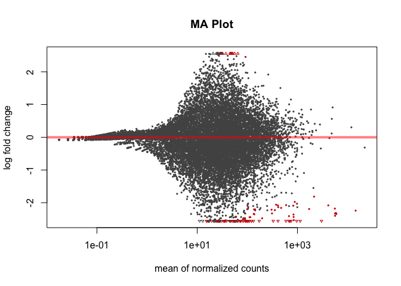
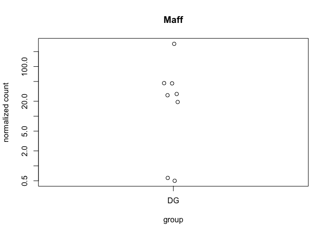
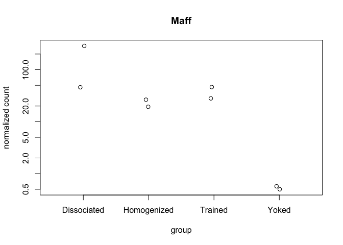
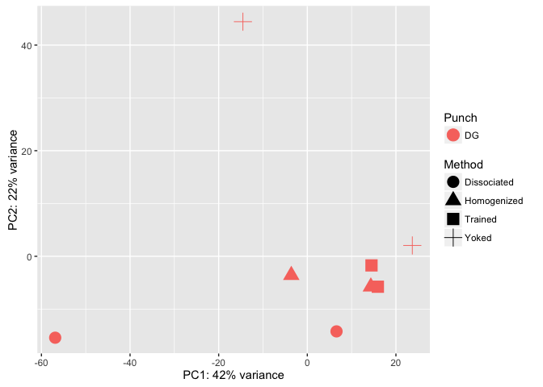

This R Markdown document will walk through the analysis of hippocampal tissue prepared with two different methods. The "homogenized" samples were collected by punch then homogenized in homogenization buffer from the Promega Maxwell kit. The "dissociated samples" were also collected similarily but the cells was dissociated after being punch and before being homogenized.

#### Differential Gene Expression Plots

    ## class: DESeqDataSet 
    ## dim: 16519 8 
    ## metadata(1): version
    ## assays(1): counts
    ## rownames(16519): 0610007P14Rik 0610009B22Rik ... Zzef1 Zzz3
    ## rowData names(0):
    ## colnames(8): 100-DG-2 100-DG-3 ... 147C-DG-3 147D-DG-1
    ## colData names(11): RNAseqID Method ... Punch.Collector jobnumber

    ## class: DESeqDataSet 
    ## dim: 16519 8 
    ## metadata(1): version
    ## assays(3): counts mu cooks
    ## rownames(16519): 0610007P14Rik 0610009B22Rik ... Zzef1 Zzz3
    ## rowData names(37): baseMean baseVar ... deviance maxCooks
    ## colnames(8): 100-DG-2 100-DG-3 ... 147C-DG-3 147D-DG-1
    ## colData names(12): RNAseqID Method ... jobnumber sizeFactor

    ## 
    ## out of 16519 with nonzero total read count
    ## adjusted p-value < 0.1
    ## LFC > 0 (up)     : 14, 0.085% 
    ## LFC < 0 (down)   : 92, 0.56% 
    ## outliers [1]     : 0, 0% 
    ## low counts [2]   : 0, 0% 
    ## (mean count < 0)
    ## [1] see 'cooksCutoff' argument of ?results
    ## [2] see 'independentFiltering' argument of ?results

    ## 
    ## out of 16519 with nonzero total read count
    ## adjusted p-value < 0.05
    ## LFC > 0 (up)     : 13, 0.079% 
    ## LFC < 0 (down)   : 88, 0.53% 
    ## outliers [1]     : 0, 0% 
    ## low counts [2]   : 8007, 48% 
    ## (mean count < 15)
    ## [1] see 'cooksCutoff' argument of ?results
    ## [2] see 'independentFiltering' argument of ?results



    ## NULL



    ## [1] 3

    ## [1] 20

resPunchCA1DG \<- results(dds, contrast = c("Punch", "CA1", "DG"), independentFiltering = F) \#sum(resPunchCA1DG\(padj < 0.1, na.rm = TRUE) # 4170 #1127 valsPunchCA1DG <- cbind(resPunchCA1DG\)pvalue, resPunchCA1DG$padj) colnames(valsPunchCA1DG)=c("pval.CA1DG", "padj.CA1DG")

resPunchCA1CA3 \<- results(dds, contrast = c("Punch", "CA1", "CA3"), independentFiltering = F) \#sum(resPunchCA1CA3\(padj < 0.1, na.rm = TRUE) #2240 # 70 valsPunchCA1CA3 <- cbind(resPunchCA1CA3\)pvalue, resPunchCA1CA3$padj) colnames(valsPunchCA1CA3)=c("pval.CA1CA3", "padj.CA1CA3")

resPunchCA3DG \<- results(dds, contrast = c("Punch", "CA3", "DG"), independentFiltering = F) \#sum(resPunchCA3DG\(padj < 0.1, na.rm = TRUE) #4785 #591 valsPunchCA3DG <- cbind(resPunchCA3DG\)pvalue, resPunchCA3DG$padj) colnames(valsPunchCA3DG)=c("pval.CA3DG", "padj.CA3DG")

\`\`\`{r VennDiagram, echo=FALSE, message=FALSE}
================================================

rldpvals \<- as.data.frame(rldpvals)

MethodHomogDiss \<- row.names(rldpvals[rldpvals\(padj.MethodHomogDiss<0.1 & !is.na(rldpvals\)padj.MethodHomogDiss),]) \#MethodYokedTrained \<- row.names(rldpvals[rldpvals\(padj.valsMethodYokedTrained<0.1 & !is.na(rldpvals\)padj.valsMethodYokedTrained),]) PunchCA1DG \<- row.names(rldpvals[rldpvals\(padj.CA1DG<0.1 & !is.na(rldpvals\)padj.CA1DG),]) PunchCA1CA3 \<- row.names(rldpvals[rldpvals\(padj.CA1CA3<0.1 & !is.na(rldpvals\)padj.CA1CA3),]) PunchCA3DG \<- row.names(rldpvals[rldpvals\(padj.CA3DG<0.1 & !is.na(rldpvals\)padj.CA3DG),])

four way grid
-------------

candidates \<- list("CA1 v. DG" = PunchCA1DG, "CA1 v. CA3" = PunchCA1CA3, "CA3 v. DG" = PunchCA3DG, "Homogenized v. Dissociated" = MethodHomogDiss ) dev.off() prettyvenn \<- venn.diagram( x = candidates, filename=NULL, lwd=4, col = "transparent", fill = (values=c("\#00441b", "\#00441b","\#238b45", "\#238b45")), alpha = 0.5, cex = 1, fontfamily = "sans", \#fontface = "bold", cat.default.pos = "text", \#cat.col = c("darkred", "darkgreen", "blue4", "orange"), \#cat.dist = c(0.08, 0.08, 0.08, 0.08), cat.pos = 1, cat.cex = 1, cat.fontfamily = "sans") grid.draw(prettyvenn)

ca1 ca3 homo diss
-----------------

candidates \<- list("CA1 v. CA3" = PunchCA1CA3, "Homogenized v. Dissociated" = MethodHomogDiss ) dev.off() prettyvenn \<- venn.diagram( x = candidates, filename=NULL, lwd=2, col = "transparent", fill = (values=c("\#00441b", "\#00441b")), alpha = 0.5, cex = 1, fontfamily = "sans", \#fontface = "bold", cat.default.pos = "text", \#cat.col = c("darkred", "darkgreen", "blue4", "orange"), \#cat.dist = c(0.08, 0.08, 0.08, 0.08), cat.pos = 1, cat.cex = 1, cat.fontfamily = "sans") grid.draw(prettyvenn)

ca1 dg homo diss
----------------

candidates \<- list("CA1 v. DG" = PunchCA1DG, "Homogenized v. Dissociated" = MethodHomogDiss ) dev.off() prettyvenn \<- venn.diagram( x = candidates, filename=NULL, lwd=4, col = "transparent", fill = (values=c("\#00441b", "\#00441b")), alpha = 0.5, cex = 1, fontfamily = "sans", \#fontface = "bold", cat.default.pos = "text", \#cat.col = c("darkred", "darkgreen", "blue4", "orange"), \#cat.dist = c(0.08, 0.08, 0.08, 0.08), cat.pos = 1, cat.cex = 1, cat.fontfamily = "sans") grid.draw(prettyvenn)

ca3 dg homo diss
----------------

candidates \<- list("CA3 v. DG" = PunchCA3DG, "Homogenized v. Dissociated" = MethodHomogDiss ) dev.off() prettyvenn \<- venn.diagram( x = candidates, filename=NULL, lwd=2, col = "transparent", fill = (values=c("\#00441b", "\#00441b")), alpha = 0.5, cex = 1, fontfamily = "sans", \#fontface = "bold", cat.default.pos = "text", \#cat.col = c("darkred", "darkgreen", "blue4", "orange"), \#cat.dist = c(0.08, 0.08, 0.08, 0.08), cat.pos = 1, cat.cex = 1, cat.fontfamily = "sans") grid.draw(prettyvenn)

\`\`\`
======

 DEGes \<- as.data.frame(rldpvals) \# convert matrix to dataframe DEGes\(rownames <- rownames(DEGes) # add the rownames to the dataframe DEGes\)padjmin \<- with(DEGes, pmin(padj.MethodHomogDiss, padj.MethodYokedTrained)) \# put the min pvalue in a new column DEGes \<- DEGes %\>% filter(padj.MethodHomogDiss \< 0.05) rownames(DEGes) \<- DEGes$rownames drop.cols \<- c("padj.MethodHomogDiss", "pval.MethodHomogDiss","padj.MethodYokedTrained", "pval.MethodYokedTrained", "rownames", "padjmin") DEGes \<- DEGes %\>% select(-one\_of(drop.cols)) DEGes \<- as.matrix(DEGes) DEGes \<- DEGes - rowMeans(DEGes)

pheatmap(DEGes, show\_colnames=F, show\_rownames = TRUE, annotation\_col=df, annotation\_colors = ann\_colors, fontsize = 12, fontsize\_row = 10, \#cellwidth=10, cellheight=10, width = 10, border\_color = "grey60" , color = matlabcolors, main = "Homogenized vs Dissociated padj \< 0.05" )

DEGes \<- as.data.frame(rldpvals) \# convert matrix to dataframe DEGes\(rownames <- rownames(DEGes) # add the rownames to the dataframe DEGes\)padjmin \<- with(DEGes, pmin(padj.MethodHomogDiss, padj.MethodYokedTrained)) \# put the min pvalue in a new column DEGes \<- DEGes %\>% filter(padjmin \< 0.05) rownames(DEGes) \<- DEGes$rownames drop.cols \<- c("padj.MethodHomogDiss", "pval.MethodHomogDiss","padj.MethodYokedTrained", "pval.MethodYokedTrained", "rownames", "padjmin") DEGes \<- DEGes %\>% select(-one\_of(drop.cols)) DEGes \<- as.matrix(DEGes) DEGes \<- DEGes - rowMeans(DEGes)

pheatmap(DEGes, show\_colnames=F, show\_rownames = TRUE, annotation\_col=df, annotation\_colors = ann\_colors, fontsize = 12, fontsize\_row = 10, \#cellwidth=10, cellheight=10, width = 10, border\_color = "grey60" , color = matlabcolors, main = "Any padj \< 0.05" )

    ##                  PC1        PC2            group      Method Punch
    ## 100-DG-2   -3.613891  -3.584360 Homogenized : DG Homogenized    DG
    ## 100-DG-3   14.340551  -5.770681 Homogenized : DG Homogenized    DG
    ## 101-DG-3  -56.897286 -15.418869 Dissociated : DG Dissociated    DG
    ## 101-DG-4    6.593125 -14.221116 Dissociated : DG Dissociated    DG
    ## 146C-DG-4  14.487462  -1.726934     Trained : DG     Trained    DG
    ## 146D-DG-3 -14.531047  44.430721       Yoked : DG       Yoked    DG
    ## 147C-DG-3  15.923733  -5.763420     Trained : DG     Trained    DG
    ## 147D-DG-1  23.697353   2.054660       Yoked : DG       Yoked    DG
    ##                name
    ## 100-DG-2   100-DG-2
    ## 100-DG-3   100-DG-3
    ## 101-DG-3   101-DG-3
    ## 101-DG-4   101-DG-4
    ## 146C-DG-4 146C-DG-4
    ## 146D-DG-3 146D-DG-3
    ## 147C-DG-3 147C-DG-3
    ## 147D-DG-1 147D-DG-1



``` r
library(edgeR)
```

    ## Warning: package 'edgeR' was built under R version 3.3.2

    ## Loading required package: limma

    ## 
    ## Attaching package: 'limma'

    ## The following object is masked from 'package:DESeq2':
    ## 
    ##     plotMA

    ## The following object is masked from 'package:BiocGenerics':
    ## 
    ##     plotMA

``` r
counts <- countData
dim( counts )
```

    ## [1] 22485     8

``` r
colSums( counts )
```

    ##  100-DG-2  100-DG-3  101-DG-3  101-DG-4 146C-DG-4 146D-DG-3 147C-DG-3 
    ##   1285654   6086605     65887    598775    492145     90417   4350647 
    ## 147D-DG-1 
    ##  11700703

``` r
colSums( counts ) / 1e06  # in millions of reads
```

    ##  100-DG-2  100-DG-3  101-DG-3  101-DG-4 146C-DG-4 146D-DG-3 147C-DG-3 
    ##  1.285654  6.086605  0.065887  0.598775  0.492145  0.090417  4.350647 
    ## 147D-DG-1 
    ## 11.700703

``` r
table( rowSums( counts ) )[ 1:30 ] # Number of genes with low counts
```

    ## 
    ##    0    1    2    3    4    5    6    7    8    9   10   11   12   13   14 
    ## 5632  334  287  249  191  179  137  139  123  109  108  101   78   97   93 
    ##   15   16   17   18   19   20   21   22   23   24   25   26   27   28   29 
    ##   74   83   58   70   63   66   61   62   69   61   55   42   40   45   60
