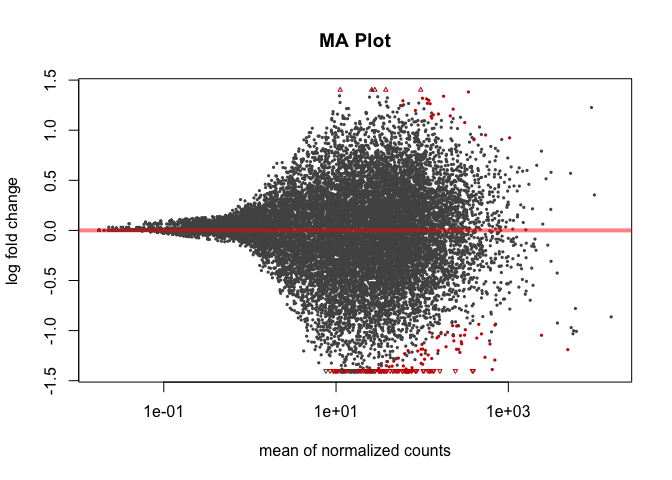
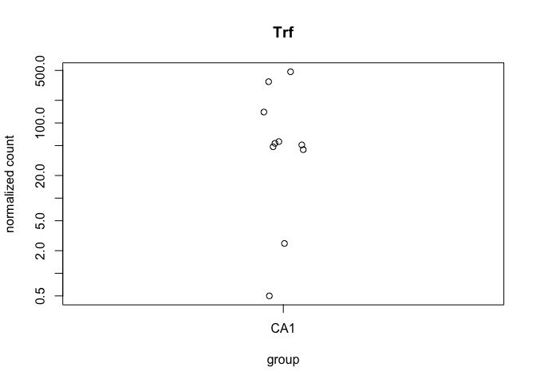
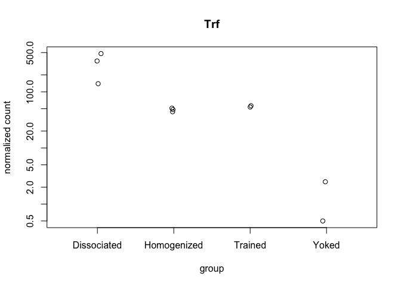
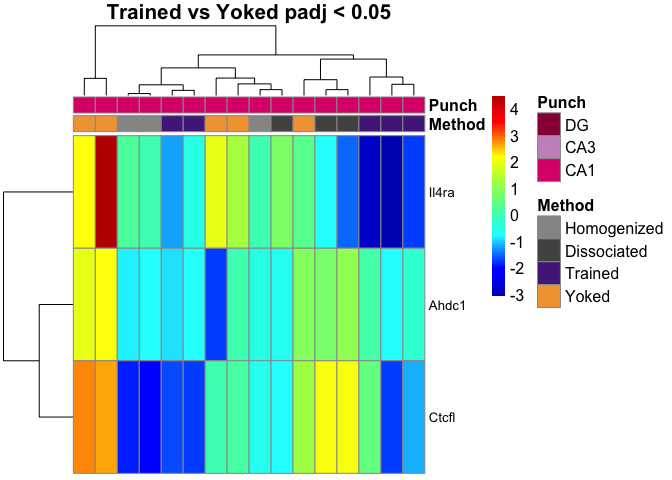
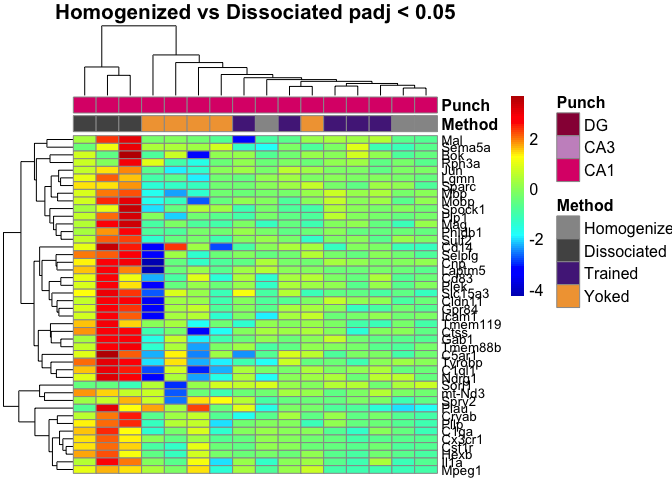
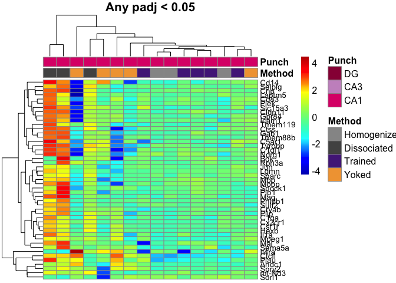
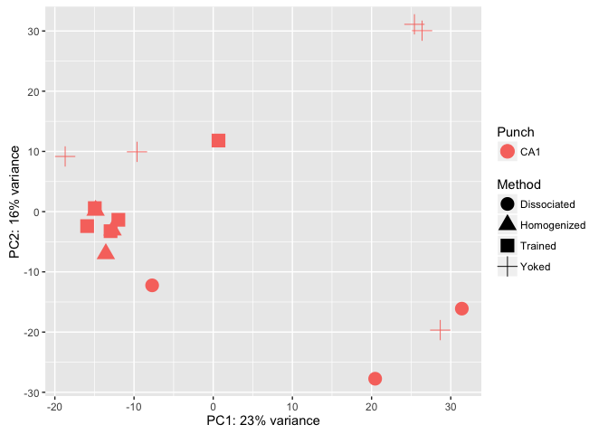

This R Markdown document will walk through the analysis of hippocampal tissue prepared with two different methods. The "homogenized" samples were collected by punch then homogenized in homogenization buffer from the Promega Maxwell kit. The "dissociated samples" were also collected similarily but the cells was dissociated after being punch and before being homogenized.

#### Differential Gene Expression Plots

    ## class: DESeqDataSet 
    ## dim: 17016 16 
    ## metadata(1): version
    ## assays(1): counts
    ## rownames(17016): 0610007P14Rik 0610009B22Rik ... Zzef1 Zzz3
    ## rowData names(0):
    ## colnames(16): 100-CA1-1 100-CA1-2 ... 148A-CA1-3 148B-CA1-4
    ## colData names(11): RNAseqID Method ... Punch.Collector jobnumber

    ## class: DESeqDataSet 
    ## dim: 17016 16 
    ## metadata(1): version
    ## assays(3): counts mu cooks
    ## rownames(17016): 0610007P14Rik 0610009B22Rik ... Zzef1 Zzz3
    ## rowData names(37): baseMean baseVar ... deviance maxCooks
    ## colnames(16): 100-CA1-1 100-CA1-2 ... 148A-CA1-3 148B-CA1-4
    ## colData names(12): RNAseqID Method ... jobnumber sizeFactor

    ## 
    ## out of 17016 with nonzero total read count
    ## adjusted p-value < 0.1
    ## LFC > 0 (up)     : 31, 0.18% 
    ## LFC < 0 (down)   : 160, 0.94% 
    ## outliers [1]     : 483, 2.8% 
    ## low counts [2]   : 0, 0% 
    ## (mean count < 0)
    ## [1] see 'cooksCutoff' argument of ?results
    ## [2] see 'independentFiltering' argument of ?results

    ## 
    ## out of 17016 with nonzero total read count
    ## adjusted p-value < 0.05
    ## LFC > 0 (up)     : 25, 0.15% 
    ## LFC < 0 (down)   : 144, 0.85% 
    ## outliers [1]     : 483, 2.8% 
    ## low counts [2]   : 5851, 34% 
    ## (mean count < 6)
    ## [1] see 'cooksCutoff' argument of ?results
    ## [2] see 'independentFiltering' argument of ?results

    ## NULL

resPunchCA1DG \<- results(dds, contrast = c("Punch", "CA1", "DG"), independentFiltering = F) \#sum(resPunchCA1DG\(padj < 0.1, na.rm = TRUE) # 4170 #1127 valsPunchCA1DG <- cbind(resPunchCA1DG\)pvalue, resPunchCA1DG$padj) colnames(valsPunchCA1DG)=c("pval.CA1DG", "padj.CA1DG")

resPunchCA1CA3 \<- results(dds, contrast = c("Punch", "CA1", "CA3"), independentFiltering = F) \#sum(resPunchCA1CA3\(padj < 0.1, na.rm = TRUE) #2240 # 70 valsPunchCA1CA3 <- cbind(resPunchCA1CA3\)pvalue, resPunchCA1CA3$padj) colnames(valsPunchCA1CA3)=c("pval.CA1CA3", "padj.CA1CA3")

resPunchCA3DG \<- results(dds, contrast = c("Punch", "CA3", "DG"), independentFiltering = F) \#sum(resPunchCA3DG\(padj < 0.1, na.rm = TRUE) #4785 #591 valsPunchCA3DG <- cbind(resPunchCA3DG\)pvalue, resPunchCA3DG$padj) colnames(valsPunchCA3DG)=c("pval.CA3DG", "padj.CA3DG")

\`\`\`{r VennDiagram, echo=FALSE, message=FALSE}
================================================

rldpvals \<- as.data.frame(rldpvals)

MethodHomogDiss \<- row.names(rldpvals[rldpvals\(padj.MethodHomogDiss<0.1 & !is.na(rldpvals\)padj.MethodHomogDiss),]) \#MethodYokedTrained \<- row.names(rldpvals[rldpvals\(padj.valsMethodYokedTrained<0.1 & !is.na(rldpvals\)padj.valsMethodYokedTrained),]) PunchCA1DG \<- row.names(rldpvals[rldpvals\(padj.CA1DG<0.1 & !is.na(rldpvals\)padj.CA1DG),]) PunchCA1CA3 \<- row.names(rldpvals[rldpvals\(padj.CA1CA3<0.1 & !is.na(rldpvals\)padj.CA1CA3),]) PunchCA3DG \<- row.names(rldpvals[rldpvals\(padj.CA3DG<0.1 & !is.na(rldpvals\)padj.CA3DG),])

four way grid
-------------

candidates \<- list("CA1 v. DG" = PunchCA1DG, "CA1 v. CA3" = PunchCA1CA3, "CA3 v. DG" = PunchCA3DG, "Homogenized v. Dissociated" = MethodHomogDiss ) dev.off() prettyvenn \<- venn.diagram( x = candidates, filename=NULL, lwd=4, col = "transparent", fill = (values=c("\#00441b", "\#00441b","\#238b45", "\#238b45")), alpha = 0.5, cex = 1, fontfamily = "sans", \#fontface = "bold", cat.default.pos = "text", \#cat.col = c("darkred", "darkgreen", "blue4", "orange"), \#cat.dist = c(0.08, 0.08, 0.08, 0.08), cat.pos = 1, cat.cex = 1, cat.fontfamily = "sans") grid.draw(prettyvenn)

ca1 ca3 homo diss
-----------------

candidates \<- list("CA1 v. CA3" = PunchCA1CA3, "Homogenized v. Dissociated" = MethodHomogDiss ) dev.off() prettyvenn \<- venn.diagram( x = candidates, filename=NULL, lwd=2, col = "transparent", fill = (values=c("\#00441b", "\#00441b")), alpha = 0.5, cex = 1, fontfamily = "sans", \#fontface = "bold", cat.default.pos = "text", \#cat.col = c("darkred", "darkgreen", "blue4", "orange"), \#cat.dist = c(0.08, 0.08, 0.08, 0.08), cat.pos = 1, cat.cex = 1, cat.fontfamily = "sans") grid.draw(prettyvenn)

ca1 dg homo diss
----------------

candidates \<- list("CA1 v. DG" = PunchCA1DG, "Homogenized v. Dissociated" = MethodHomogDiss ) dev.off() prettyvenn \<- venn.diagram( x = candidates, filename=NULL, lwd=4, col = "transparent", fill = (values=c("\#00441b", "\#00441b")), alpha = 0.5, cex = 1, fontfamily = "sans", \#fontface = "bold", cat.default.pos = "text", \#cat.col = c("darkred", "darkgreen", "blue4", "orange"), \#cat.dist = c(0.08, 0.08, 0.08, 0.08), cat.pos = 1, cat.cex = 1, cat.fontfamily = "sans") grid.draw(prettyvenn)

ca3 dg homo diss
----------------

candidates \<- list("CA3 v. DG" = PunchCA3DG, "Homogenized v. Dissociated" = MethodHomogDiss ) dev.off() prettyvenn \<- venn.diagram( x = candidates, filename=NULL, lwd=2, col = "transparent", fill = (values=c("\#00441b", "\#00441b")), alpha = 0.5, cex = 1, fontfamily = "sans", \#fontface = "bold", cat.default.pos = "text", \#cat.col = c("darkred", "darkgreen", "blue4", "orange"), \#cat.dist = c(0.08, 0.08, 0.08, 0.08), cat.pos = 1, cat.cex = 1, cat.fontfamily = "sans") grid.draw(prettyvenn)

\`\`\`
======

    ##                    PC1         PC2             group      Method Punch
    ## 100-CA1-1  -14.8574127   0.2052474 Homogenized : CA1 Homogenized   CA1
    ## 100-CA1-2  -13.5601020  -7.0035194 Homogenized : CA1 Homogenized   CA1
    ## 100-CA1-3  -12.7134846  -3.0691314 Homogenized : CA1 Homogenized   CA1
    ## 101-CA1-1   -7.7145607 -12.2408535 Dissociated : CA1 Dissociated   CA1
    ## 101-CA1-2   20.4523240 -27.7456391 Dissociated : CA1 Dissociated   CA1
    ## 101-CA1-3   31.3983567 -16.1084710 Dissociated : CA1 Dissociated   CA1
    ## 145A-CA1-2 -15.9217942  -2.4038333     Trained : CA1     Trained   CA1
    ## 145B-CA1-1 -18.6976039   9.1635078       Yoked : CA1       Yoked   CA1
    ## 146A-CA1-2 -11.9798098  -1.3563500     Trained : CA1     Trained   CA1
    ## 146B-CA1-2  -9.6242997   9.9321127       Yoked : CA1       Yoked   CA1
    ## 146C-CA1-4   0.6668059  11.8072097     Trained : CA1     Trained   CA1
    ## 146D-CA1-3  26.3821927  30.0460500       Yoked : CA1       Yoked   CA1
    ## 147C-CA1-3 -12.9643074  -3.2455926     Trained : CA1     Trained   CA1
    ## 147D-CA1-1  28.6754063 -19.6698635       Yoked : CA1       Yoked   CA1
    ## 148A-CA1-3 -14.9545939   0.5853007     Trained : CA1     Trained   CA1
    ## 148B-CA1-4  25.4128831  31.1038255       Yoked : CA1       Yoked   CA1
    ##                  name
    ## 100-CA1-1   100-CA1-1
    ## 100-CA1-2   100-CA1-2
    ## 100-CA1-3   100-CA1-3
    ## 101-CA1-1   101-CA1-1
    ## 101-CA1-2   101-CA1-2
    ## 101-CA1-3   101-CA1-3
    ## 145A-CA1-2 145A-CA1-2
    ## 145B-CA1-1 145B-CA1-1
    ## 146A-CA1-2 146A-CA1-2
    ## 146B-CA1-2 146B-CA1-2
    ## 146C-CA1-4 146C-CA1-4
    ## 146D-CA1-3 146D-CA1-3
    ## 147C-CA1-3 147C-CA1-3
    ## 147D-CA1-1 147D-CA1-1
    ## 148A-CA1-3 148A-CA1-3
    ## 148B-CA1-4 148B-CA1-4

