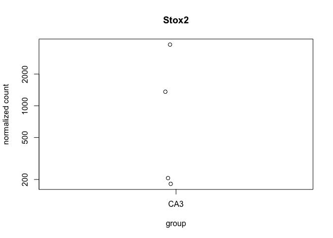
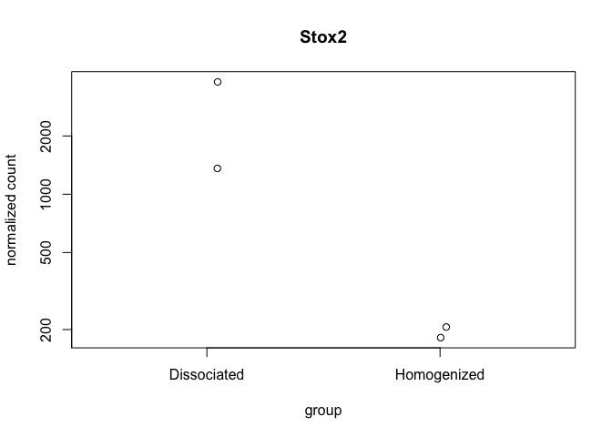
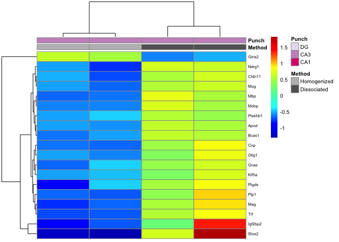
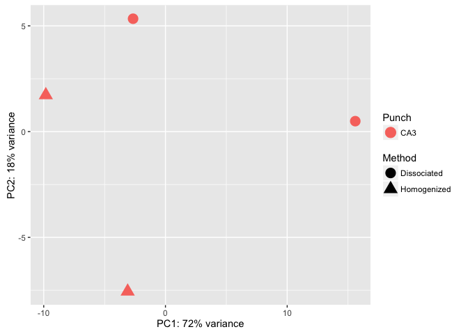

This R Markdown document will walk through the analysis of hippocampal tissue prepared with two different methods. The "homogenized" samples were collected by punch then homogenized in homogenization buffer from the Promega Maxwell kit. The "dissociated samples" were also collected similarily but the cells was dissociated after being punch and before being homogenized.

Save Intermediate Data file types, so they could be loaded from here with StoreReadData write.table(countData, '../intermediatefiles/countData.csv', row.names = TRUE, sep=",", col.names = T) write.table(colData, '../intermediatefiles/colData.csv', row.names = TRUE, sep=",", col.names = T) write.table(geneids, '../intermediatefiles/geneids.csv', row.names = TRUE, sep=",", col.names = T) read.csv('../intermediatefiles/colData.csv') read.csv('../intermediatefiles/countData.csv')

#### Differential Gene Expression Plots

    ## class: DESeqDataSet 
    ## dim: 15591 4 
    ## metadata(1): version
    ## assays(1): counts
    ## rownames(15591): 0610007P14Rik 0610009B22Rik ... Zzef1 Zzz3
    ## rowData names(0):
    ## colnames(4): 100-CA3-1 100-CA3-4 101-CA3-1 101-CA3-4
    ## colData names(11): RNAseqID Method ... Punch.Collector jobnumber

    ## class: DESeqDataSet 
    ## dim: 15591 4 
    ## metadata(1): version
    ## assays(3): counts mu cooks
    ## rownames(15591): 0610007P14Rik 0610009B22Rik ... Zzef1 Zzz3
    ## rowData names(27): baseMean baseVar ... deviance maxCooks
    ## colnames(4): 100-CA3-1 100-CA3-4 101-CA3-1 101-CA3-4
    ## colData names(12): RNAseqID Method ... jobnumber sizeFactor

    ## 
    ## out of 15591 with nonzero total read count
    ## adjusted p-value < 0.1
    ## LFC > 0 (up)     : 1, 0.0064% 
    ## LFC < 0 (down)   : 57, 0.37% 
    ## outliers [1]     : 0, 0% 
    ## low counts [2]   : 0, 0% 
    ## (mean count < 0)
    ## [1] see 'cooksCutoff' argument of ?results
    ## [2] see 'independentFiltering' argument of ?results

    ## 
    ## out of 15591 with nonzero total read count
    ## adjusted p-value < 0.05
    ## LFC > 0 (up)     : 0, 0% 
    ## LFC < 0 (down)   : 70, 0.45% 
    ## outliers [1]     : 0, 0% 
    ## low counts [2]   : 10882, 70% 
    ## (mean count < 84)
    ## [1] see 'cooksCutoff' argument of ?results
    ## [2] see 'independentFiltering' argument of ?results

    ## NULL

 resMethodYokedTrained \<- results(dds, contrast = c("Method", "Yoked", "Trained"), independentFiltering = F) \#sum(resMethodYokedTrained\(padj < 0.1, na.rm = TRUE) #4 valsMethodYokedTrained <- cbind(resMethodYokedTrained\)pvalue, resMethodYokedTrained$padj) colnames(valsMethodYokedTrained)=c("pval.MethodYokedTrained", "padj.MethodYokedTrained")

resPunchCA1DG \<- results(dds, contrast = c("Punch", "CA1", "DG"), independentFiltering = F) \#sum(resPunchCA1DG\(padj < 0.1, na.rm = TRUE) # 4170 #1127 valsPunchCA1DG <- cbind(resPunchCA1DG\)pvalue, resPunchCA1DG$padj) colnames(valsPunchCA1DG)=c("pval.CA1DG", "padj.CA1DG")

resPunchCA1CA3 \<- results(dds, contrast = c("Punch", "CA1", "CA3"), independentFiltering = F) \#sum(resPunchCA1CA3\(padj < 0.1, na.rm = TRUE) #2240 # 70 valsPunchCA1CA3 <- cbind(resPunchCA1CA3\)pvalue, resPunchCA1CA3$padj) colnames(valsPunchCA1CA3)=c("pval.CA1CA3", "padj.CA1CA3")

resPunchCA3DG \<- results(dds, contrast = c("Punch", "CA3", "DG"), independentFiltering = F) \#sum(resPunchCA3DG\(padj < 0.1, na.rm = TRUE) #4785 #591 valsPunchCA3DG <- cbind(resPunchCA3DG\)pvalue, resPunchCA3DG$padj) colnames(valsPunchCA3DG)=c("pval.CA3DG", "padj.CA3DG")

\`\`\`{r VennDiagram, echo=FALSE, message=FALSE}
================================================

rldpvals \<- as.data.frame(rldpvals)

MethodHomogDiss \<- row.names(rldpvals[rldpvals\(padj.MethodHomogDiss<0.1 & !is.na(rldpvals\)padj.MethodHomogDiss),]) \#MethodYokedTrained \<- row.names(rldpvals[rldpvals\(padj.valsMethodYokedTrained<0.1 & !is.na(rldpvals\)padj.valsMethodYokedTrained),]) PunchCA1DG \<- row.names(rldpvals[rldpvals\(padj.CA1DG<0.1 & !is.na(rldpvals\)padj.CA1DG),]) PunchCA1CA3 \<- row.names(rldpvals[rldpvals\(padj.CA1CA3<0.1 & !is.na(rldpvals\)padj.CA1CA3),]) PunchCA3DG \<- row.names(rldpvals[rldpvals\(padj.CA3DG<0.1 & !is.na(rldpvals\)padj.CA3DG),])

four way grid
-------------

candidates \<- list("CA1 v. DG" = PunchCA1DG, "CA1 v. CA3" = PunchCA1CA3, "CA3 v. DG" = PunchCA3DG, "Homogenized v. Dissociated" = MethodHomogDiss ) dev.off() prettyvenn \<- venn.diagram( x = candidates, filename=NULL, lwd=4, col = "transparent", fill = (values=c("\#00441b", "\#00441b","\#238b45", "\#238b45")), alpha = 0.5, cex = 1, fontfamily = "sans", \#fontface = "bold", cat.default.pos = "text", \#cat.col = c("darkred", "darkgreen", "blue4", "orange"), \#cat.dist = c(0.08, 0.08, 0.08, 0.08), cat.pos = 1, cat.cex = 1, cat.fontfamily = "sans") grid.draw(prettyvenn)

ca1 ca3 homo diss
-----------------

candidates \<- list("CA1 v. CA3" = PunchCA1CA3, "Homogenized v. Dissociated" = MethodHomogDiss ) dev.off() prettyvenn \<- venn.diagram( x = candidates, filename=NULL, lwd=2, col = "transparent", fill = (values=c("\#00441b", "\#00441b")), alpha = 0.5, cex = 1, fontfamily = "sans", \#fontface = "bold", cat.default.pos = "text", \#cat.col = c("darkred", "darkgreen", "blue4", "orange"), \#cat.dist = c(0.08, 0.08, 0.08, 0.08), cat.pos = 1, cat.cex = 1, cat.fontfamily = "sans") grid.draw(prettyvenn)

ca1 dg homo diss
----------------

candidates \<- list("CA1 v. DG" = PunchCA1DG, "Homogenized v. Dissociated" = MethodHomogDiss ) dev.off() prettyvenn \<- venn.diagram( x = candidates, filename=NULL, lwd=4, col = "transparent", fill = (values=c("\#00441b", "\#00441b")), alpha = 0.5, cex = 1, fontfamily = "sans", \#fontface = "bold", cat.default.pos = "text", \#cat.col = c("darkred", "darkgreen", "blue4", "orange"), \#cat.dist = c(0.08, 0.08, 0.08, 0.08), cat.pos = 1, cat.cex = 1, cat.fontfamily = "sans") grid.draw(prettyvenn)

ca3 dg homo diss
----------------

candidates \<- list("CA3 v. DG" = PunchCA3DG, "Homogenized v. Dissociated" = MethodHomogDiss ) dev.off() prettyvenn \<- venn.diagram( x = candidates, filename=NULL, lwd=2, col = "transparent", fill = (values=c("\#00441b", "\#00441b")), alpha = 0.5, cex = 1, fontfamily = "sans", \#fontface = "bold", cat.default.pos = "text", \#cat.col = c("darkred", "darkgreen", "blue4", "orange"), \#cat.dist = c(0.08, 0.08, 0.08, 0.08), cat.pos = 1, cat.cex = 1, cat.fontfamily = "sans") grid.draw(prettyvenn)

\`\`\`
======

    ##                 PC1        PC2             group      Method Punch
    ## 100-CA3-1 -9.828458  1.7257648 Homogenized : CA3 Homogenized   CA3
    ## 100-CA3-4 -3.104855 -7.5567430 Homogenized : CA3 Homogenized   CA3
    ## 101-CA3-1 -2.660925  5.3371558 Dissociated : CA3 Dissociated   CA3
    ## 101-CA3-4 15.594238  0.4938225 Dissociated : CA3 Dissociated   CA3
    ##                name
    ## 100-CA3-1 100-CA3-1
    ## 100-CA3-4 100-CA3-4
    ## 101-CA3-1 101-CA3-1
    ## 101-CA3-4 101-CA3-4

