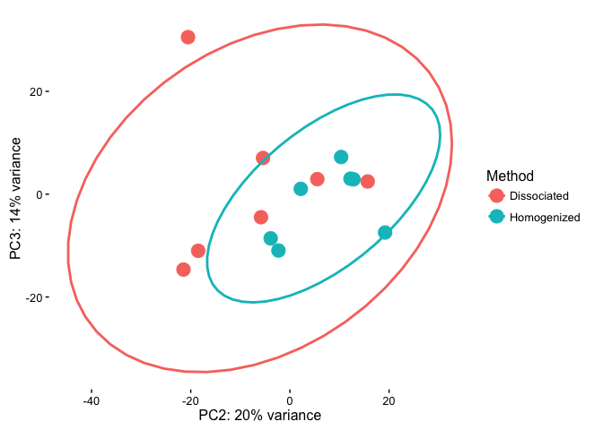
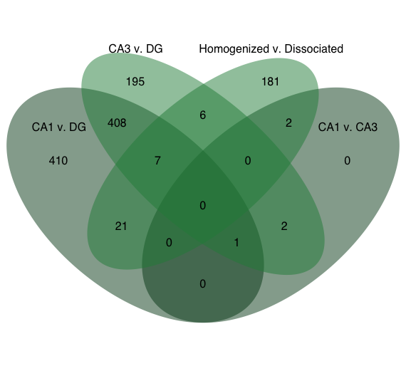
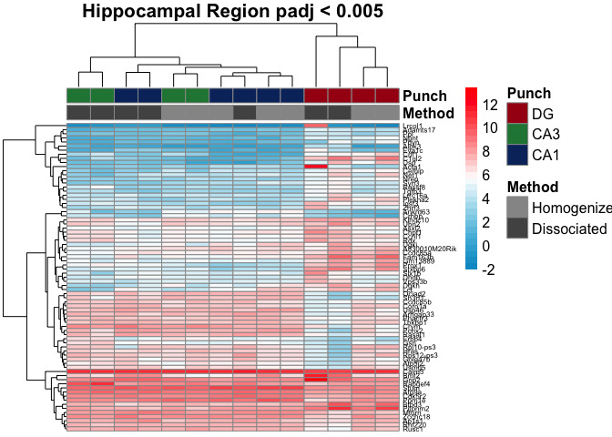
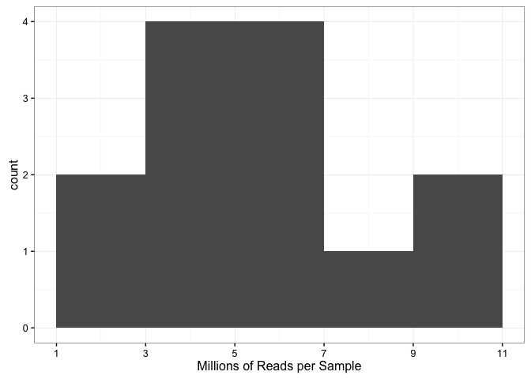
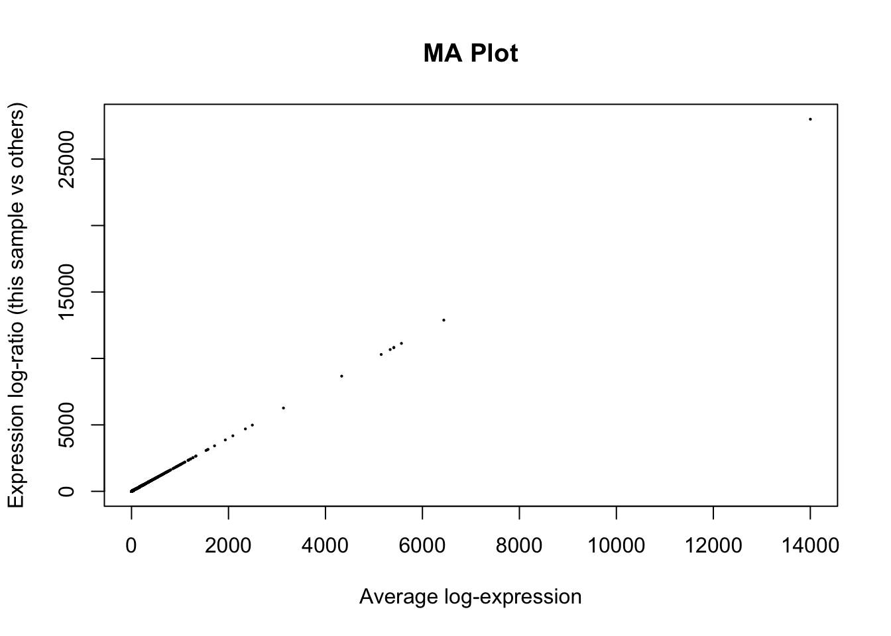
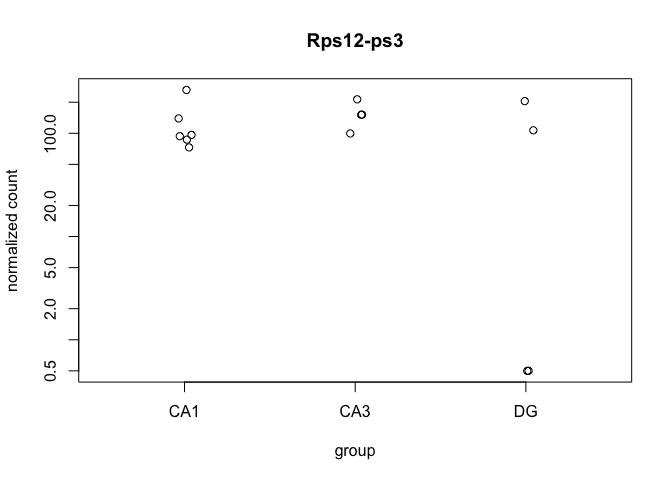
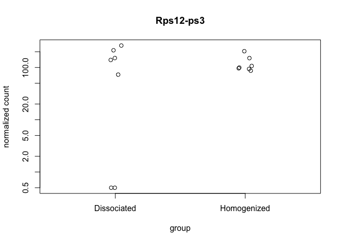

Methods for Dorsal Hippocampal Gene Expression Profiling
--------------------------------------------------------

#### Part 1: Examining the influence of dissasociation on gene expression in the CA1, CA3, and DG

This PCA gives an overview of the variability between samples using the a large matrix of log transformed gene expression data. You can see that the bigges difference is between DG punches and the CA1 and CA3 punches. CA1 and CA3 samples have similar transcriptomes. The homogenized CA1 samples have the most similar transcriptonal profiles as evidenced by their tight clustering.

This Venn Diagram shows the number of differentially expressed by contrast described above each oval. The most number of genes are differntially expressed between DG and the CAs (nearly 1000) wheras only about 200 were differntailly regulated as a result of of technical maniplulation comparing homogenized and dissociated samples.

I'm not really happy with these two heat maps. Here's how I created them. Top heatmap: subset the data to give only the gene with an adjusted p value \< 0.05 for the homogenized vs dissociated comparisonany two-way comparsion. Bottom heatmap: subset the data to give only the gene with an adjusted p value \< 0.05 for two way brain region comparision (CA1 vs DG, CA3, vs DG, or CA1 vs DG)

Here, you can see that the differences between samples is not as clear cut for all comparisions. What other mechanisms would be useful for subseting the data to identify genes of interest?

This is a data validation check plot. Here, I'm showing how many millions of reads were present in each sample. On average, each sample had 5 million reads, but the range was from 0.8 to 10 millino reads.

This graph examines the magnitude of gene expression differences (shown as log fold change on the y axis) as a function of read abundance (shown as mean normalized counts on the x axis.

This is the gene with the most significant p value when you compare DG dissociated to the rest of the samples. 
