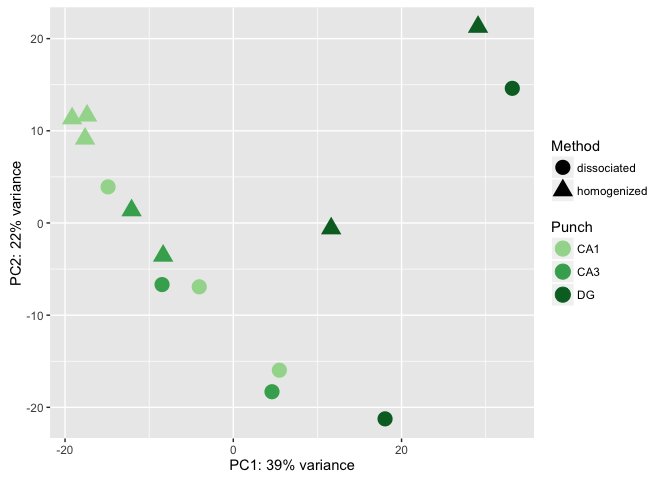

A brief analysis of hippocampal tissue prepared with two different methods. The "homogenized" samples were collected by punch then homogenized in homogenization buffer from the Promega Maxwell kit. The "dissociated" samples were also collected similarily but the cells was dissociated after being punch and before being homogenized.

#### Breif synopysis of the samples Information 

    ##    RNAseqID      Method Punch Slice  Mouse       Year Genotype collector
    ## 1 100-CA1-1 homogenized   CA1     1 15-100 Spring2016       WT        MK
    ## 2 100-CA3-1 homogenized   CA3     1 15-100 Spring2016       WT        MK
    ## 3 100-CA1-2 homogenized   CA1     2 15-100 Spring2016       WT        MK
    ## 4  100-DG-2 homogenized    DG     2 15-100 Spring2016       WT        MK
    ## 5 100-CA1-3 homogenized   CA1     3 15-100 Spring2016       WT        MK
    ## 6  100-DG-3 homogenized    DG     3 15-100 Spring2016       WT        MK

#### Summary stats of raw counts for all 14 samples

    summary(countbygene)

    ##    100-CA1-1         100-CA1-2         100-CA1-3         100-CA3-1       
    ##  Min.   :    0.0   Min.   :    0.0   Min.   :    0.0   Min.   :    0.00  
    ##  1st Qu.:    0.0   1st Qu.:    0.0   1st Qu.:    0.0   1st Qu.:    0.00  
    ##  Median :    9.0   Median :   28.0   Median :    9.0   Median :   10.00  
    ##  Mean   :  102.8   Mean   :  295.6   Mean   :  101.3   Mean   :   87.83  
    ##  3rd Qu.:   73.0   3rd Qu.:  226.0   3rd Qu.:   74.0   3rd Qu.:   71.00  
    ##  Max.   :31720.0   Max.   :95996.0   Max.   :24445.0   Max.   :24878.00  
    ##    100-CA3-4          100-DG-2           100-DG-3       
    ##  Min.   :    0.0   Min.   :    0.00   Min.   :     0.0  
    ##  1st Qu.:    0.0   1st Qu.:    0.00   1st Qu.:     0.0  
    ##  Median :   12.0   Median :    7.00   Median :    32.0  
    ##  Mean   :  104.6   Mean   :   57.18   Mean   :   270.7  
    ##  3rd Qu.:   83.0   3rd Qu.:   48.00   3rd Qu.:   231.0  
    ##  Max.   :42838.0   Max.   :22711.00   Max.   :100671.0  
    ##    101-CA1-1          101-CA1-2          101-CA1-3         101-CA3-1      
    ##  Min.   :     0.0   Min.   :   0.000   Min.   :   0.00   Min.   :    0.0  
    ##  1st Qu.:     0.0   1st Qu.:   0.000   1st Qu.:   0.00   1st Qu.:    0.0  
    ##  Median :    21.0   Median :   0.000   Median :   0.00   Median :   12.0  
    ##  Mean   :   212.7   Mean   :   6.007   Mean   :  13.38   Mean   :  111.1  
    ##  3rd Qu.:   145.0   3rd Qu.:   5.000   3rd Qu.:  10.00   3rd Qu.:   85.0  
    ##  Max.   :183815.0   Max.   :3478.000   Max.   :6174.00   Max.   :86004.0  
    ##    101-CA3-4           101-DG-3          101-DG-4      
    ##  Min.   :    0.00   Min.   :   0.00   Min.   :   0.00  
    ##  1st Qu.:    0.00   1st Qu.:   0.00   1st Qu.:   0.00  
    ##  Median :    5.00   Median :   0.00   Median :   0.00  
    ##  Mean   :   53.06   Mean   :   2.93   Mean   :  26.63  
    ##  3rd Qu.:   37.00   3rd Qu.:   2.00   3rd Qu.:  20.00  
    ##  Max.   :37665.00   Max.   :4563.00   Max.   :9988.00

#### MA plot of fold change as function of expression

#### The gene most differentially expressed by brain region

#### Venn Diagram showing all pair wise comparisons

#### Heatmap of 100 differentially expressed genes

#### PCA of all data

