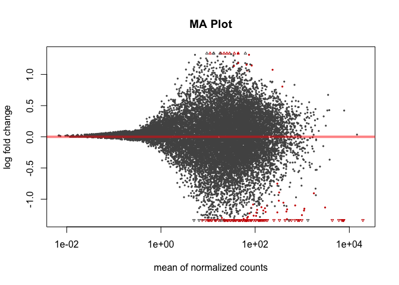
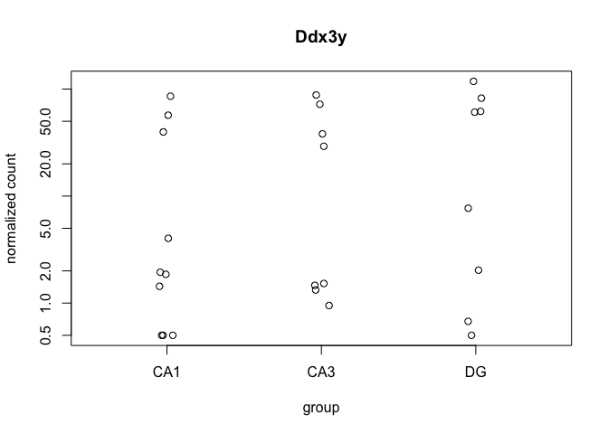
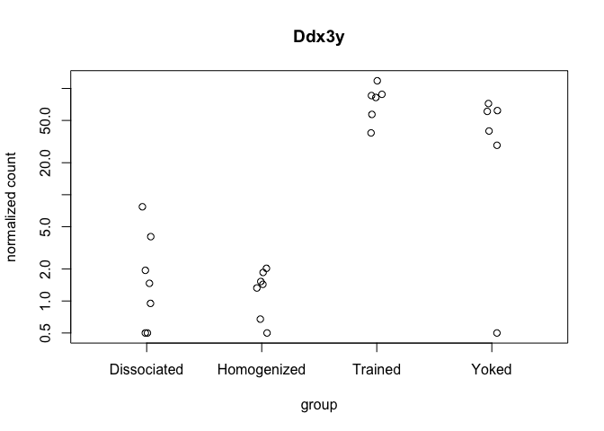
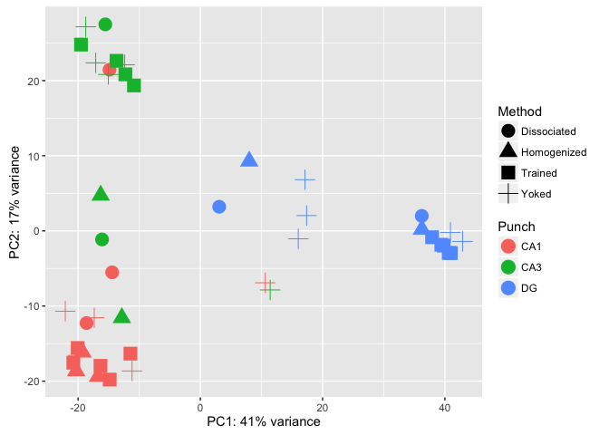

This R Markdown document will walk through the analysis of hippocampal tissue prepared with two different methods. The "homogenized" samples were collected by punch then homogenized in homogenization buffer from the Promega Maxwell kit. The "dissociated samples" were also collected similarily but the cells was dissociated after being punch and before being homogenized.

#### Differential Gene Expression Plots

    ## class: DESeqDataSet 
    ## dim: 17978 43 
    ## metadata(1): version
    ## assays(1): counts
    ## rownames(17978): 0610007P14Rik 0610009B22Rik ... Zzef1 Zzz3
    ## rowData names(0):
    ## colnames(43): 100-CA1-1 100-CA1-2 ... 148B-CA3-4 148B-DG-4
    ## colData names(11): RNAseqID Method ... Punch.Collector jobnumber

    ## class: DESeqDataSet 
    ## dim: 17978 43 
    ## metadata(1): version
    ## assays(5): counts mu cooks replaceCounts replaceCooks
    ## rownames(17978): 0610007P14Rik 0610009B22Rik ... Zzef1 Zzz3
    ## rowData names(38): baseMean baseVar ... maxCooks replace
    ## colnames(43): 100-CA1-1 100-CA1-2 ... 148B-CA3-4 148B-DG-4
    ## colData names(13): RNAseqID Method ... sizeFactor replaceable

    ## 
    ## out of 17956 with nonzero total read count
    ## adjusted p-value < 0.1
    ## LFC > 0 (up)     : 343, 1.9% 
    ## LFC < 0 (down)   : 137, 0.76% 
    ## outliers [1]     : 0, 0% 
    ## low counts [2]   : 0, 0% 
    ## (mean count < 0)
    ## [1] see 'cooksCutoff' argument of ?results
    ## [2] see 'independentFiltering' argument of ?results

    ## 
    ## out of 17956 with nonzero total read count
    ## adjusted p-value < 0.05
    ## LFC > 0 (up)     : 325, 1.8% 
    ## LFC < 0 (down)   : 114, 0.63% 
    ## outliers [1]     : 0, 0% 
    ## low counts [2]   : 9769, 54% 
    ## (mean count < 17)
    ## [1] see 'cooksCutoff' argument of ?results
    ## [2] see 'independentFiltering' argument of ?results



    ## NULL



resPunchCA1DG \<- results(dds, contrast = c("Punch", "CA1", "DG"), independentFiltering = F) \#sum(resPunchCA1DG\(padj < 0.1, na.rm = TRUE) # 4170 #1127 valsPunchCA1DG <- cbind(resPunchCA1DG\)pvalue, resPunchCA1DG$padj) colnames(valsPunchCA1DG)=c("pval.CA1DG", "padj.CA1DG")

resPunchCA1CA3 \<- results(dds, contrast = c("Punch", "CA1", "CA3"), independentFiltering = F) \#sum(resPunchCA1CA3\(padj < 0.1, na.rm = TRUE) #2240 # 70 valsPunchCA1CA3 <- cbind(resPunchCA1CA3\)pvalue, resPunchCA1CA3$padj) colnames(valsPunchCA1CA3)=c("pval.CA1CA3", "padj.CA1CA3")

resPunchCA3DG \<- results(dds, contrast = c("Punch", "CA3", "DG"), independentFiltering = F) \#sum(resPunchCA3DG\(padj < 0.1, na.rm = TRUE) #4785 #591 valsPunchCA3DG <- cbind(resPunchCA3DG\)pvalue, resPunchCA3DG$padj) colnames(valsPunchCA3DG)=c("pval.CA3DG", "padj.CA3DG")

\`\`\`{r VennDiagram, echo=FALSE, message=FALSE}
================================================

rldpvals \<- as.data.frame(rldpvals)

MethodHomogDiss \<- row.names(rldpvals[rldpvals\(padj.MethodHomogDiss<0.1 & !is.na(rldpvals\)padj.MethodHomogDiss),]) \#MethodYokedTrained \<- row.names(rldpvals[rldpvals\(padj.valsMethodYokedTrained<0.1 & !is.na(rldpvals\)padj.valsMethodYokedTrained),]) PunchCA1DG \<- row.names(rldpvals[rldpvals\(padj.CA1DG<0.1 & !is.na(rldpvals\)padj.CA1DG),]) PunchCA1CA3 \<- row.names(rldpvals[rldpvals\(padj.CA1CA3<0.1 & !is.na(rldpvals\)padj.CA1CA3),]) PunchCA3DG \<- row.names(rldpvals[rldpvals\(padj.CA3DG<0.1 & !is.na(rldpvals\)padj.CA3DG),])

four way grid
-------------

candidates \<- list("CA1 v. DG" = PunchCA1DG, "CA1 v. CA3" = PunchCA1CA3, "CA3 v. DG" = PunchCA3DG, "Homogenized v. Dissociated" = MethodHomogDiss ) dev.off() prettyvenn \<- venn.diagram( x = candidates, filename=NULL, lwd=4, col = "transparent", fill = (values=c("\#00441b", "\#00441b","\#238b45", "\#238b45")), alpha = 0.5, cex = 1, fontfamily = "sans", \#fontface = "bold", cat.default.pos = "text", \#cat.col = c("darkred", "darkgreen", "blue4", "orange"), \#cat.dist = c(0.08, 0.08, 0.08, 0.08), cat.pos = 1, cat.cex = 1, cat.fontfamily = "sans") grid.draw(prettyvenn)

ca1 ca3 homo diss
-----------------

candidates \<- list("CA1 v. CA3" = PunchCA1CA3, "Homogenized v. Dissociated" = MethodHomogDiss ) dev.off() prettyvenn \<- venn.diagram( x = candidates, filename=NULL, lwd=2, col = "transparent", fill = (values=c("\#00441b", "\#00441b")), alpha = 0.5, cex = 1, fontfamily = "sans", \#fontface = "bold", cat.default.pos = "text", \#cat.col = c("darkred", "darkgreen", "blue4", "orange"), \#cat.dist = c(0.08, 0.08, 0.08, 0.08), cat.pos = 1, cat.cex = 1, cat.fontfamily = "sans") grid.draw(prettyvenn)

ca1 dg homo diss
----------------

candidates \<- list("CA1 v. DG" = PunchCA1DG, "Homogenized v. Dissociated" = MethodHomogDiss ) dev.off() prettyvenn \<- venn.diagram( x = candidates, filename=NULL, lwd=4, col = "transparent", fill = (values=c("\#00441b", "\#00441b")), alpha = 0.5, cex = 1, fontfamily = "sans", \#fontface = "bold", cat.default.pos = "text", \#cat.col = c("darkred", "darkgreen", "blue4", "orange"), \#cat.dist = c(0.08, 0.08, 0.08, 0.08), cat.pos = 1, cat.cex = 1, cat.fontfamily = "sans") grid.draw(prettyvenn)

ca3 dg homo diss
----------------

candidates \<- list("CA3 v. DG" = PunchCA3DG, "Homogenized v. Dissociated" = MethodHomogDiss ) dev.off() prettyvenn \<- venn.diagram( x = candidates, filename=NULL, lwd=2, col = "transparent", fill = (values=c("\#00441b", "\#00441b")), alpha = 0.5, cex = 1, fontfamily = "sans", \#fontface = "bold", cat.default.pos = "text", \#cat.col = c("darkred", "darkgreen", "blue4", "orange"), \#cat.dist = c(0.08, 0.08, 0.08, 0.08), cat.pos = 1, cat.cex = 1, cat.fontfamily = "sans") grid.draw(prettyvenn)

\`\`\`
======


    ##                   PC1         PC2             group      Method Punch
    ## 100-CA1-1  -20.310308 -18.6319594 Homogenized : CA1 Homogenized   CA1
    ## 100-CA1-2  -19.263807 -16.1449265 Homogenized : CA1 Homogenized   CA1
    ## 100-CA1-3  -16.740170 -19.3773093 Homogenized : CA1 Homogenized   CA1
    ## 100-CA3-1  -12.837139 -11.5605046 Homogenized : CA3 Homogenized   CA3
    ## 100-CA3-4  -16.298048   4.7352419 Homogenized : CA3 Homogenized   CA3
    ## 100-DG-2     7.999164   9.2727630  Homogenized : DG Homogenized    DG
    ## 100-DG-3    36.236644   0.2123620  Homogenized : DG Homogenized    DG
    ## 101-CA1-1  -18.608714 -12.2637170 Dissociated : CA1 Dissociated   CA1
    ## 101-CA1-2  -14.420763  -5.5172056 Dissociated : CA1 Dissociated   CA1
    ## 101-CA1-3  -14.853343  21.4468870 Dissociated : CA1 Dissociated   CA1
    ## 101-CA3-1  -16.075459  -1.1403563 Dissociated : CA3 Dissociated   CA3
    ## 101-CA3-4  -15.540189  27.4817439 Dissociated : CA3 Dissociated   CA3
    ## 101-DG-3     3.083991   3.2138474  Dissociated : DG Dissociated    DG
    ## 101-DG-4    36.217505   1.9971189  Dissociated : DG Dissociated    DG
    ## 145A-CA1-2 -20.776988 -17.5430628     Trained : CA1     Trained   CA1
    ## 145A-CA3-2 -10.848907  19.3535559     Trained : CA3     Trained   CA3
    ## 145A-DG-2   40.627517  -2.9365669      Trained : DG     Trained    DG
    ## 145B-CA1-1 -20.021293 -16.5765006       Yoked : CA1       Yoked   CA1
    ## 145B-CA3-1  11.424760  -7.8604156       Yoked : CA3       Yoked   CA3
    ## 145B-DG-1   40.907085  -0.1996583        Yoked : DG       Yoked    DG
    ## 146A-CA1-2 -20.060796 -15.5823763     Trained : CA1     Trained   CA1
    ## 146A-DG-2   37.901927  -0.8420957      Trained : DG     Trained    DG
    ## 146B-CA1-2 -11.166215 -18.6416342       Yoked : CA1       Yoked   CA1
    ## 146B-CA3-2 -17.110619  22.3636223       Yoked : CA3       Yoked   CA3
    ## 146B-DG-2   17.384768   2.0409257        Yoked : DG       Yoked    DG
    ## 146C-CA1-4 -14.818929 -19.7898133     Trained : CA1     Trained   CA1
    ## 146C-CA3-4 -13.706780  22.6322351     Trained : CA3     Trained   CA3
    ## 146C-DG-4   39.801207  -1.9541432      Trained : DG     Trained    DG
    ## 146D-CA1-3 -17.351953 -11.5644868       Yoked : CA1       Yoked   CA1
    ## 146D-CA3-3 -12.371719  22.1082931       Yoked : CA3       Yoked   CA3
    ## 146D-DG-3   17.113226   6.8115244        Yoked : DG       Yoked    DG
    ## 147C-CA1-3 -16.327513 -17.9552891     Trained : CA1     Trained   CA1
    ## 147C-CA3-3 -12.259635  20.8276730     Trained : CA3     Trained   CA3
    ## 147C-DG-3   40.969535  -2.9492290      Trained : DG     Trained    DG
    ## 147D-CA1-1  10.619076  -6.9078835       Yoked : CA1       Yoked   CA1
    ## 147D-CA3-1 -18.741402  27.1616373       Yoked : CA3       Yoked   CA3
    ## 147D-DG-1   42.892505  -1.4013727        Yoked : DG       Yoked    DG
    ## 148A-CA1-3 -11.433554 -16.3391605     Trained : CA1     Trained   CA1
    ## 148A-CA3-3 -19.516028  24.7934854     Trained : CA3     Trained   CA3
    ## 148A-DG-3   39.413296  -1.8436140      Trained : DG     Trained    DG
    ## 148B-CA1-4 -22.089434 -10.6924212       Yoked : CA1       Yoked   CA1
    ## 148B-CA3-4 -15.058830  20.8171292       Yoked : CA3       Yoked   CA3
    ## 148B-DG-4   16.016332  -1.0543431        Yoked : DG       Yoked    DG
    ##                  name
    ## 100-CA1-1   100-CA1-1
    ## 100-CA1-2   100-CA1-2
    ## 100-CA1-3   100-CA1-3
    ## 100-CA3-1   100-CA3-1
    ## 100-CA3-4   100-CA3-4
    ## 100-DG-2     100-DG-2
    ## 100-DG-3     100-DG-3
    ## 101-CA1-1   101-CA1-1
    ## 101-CA1-2   101-CA1-2
    ## 101-CA1-3   101-CA1-3
    ## 101-CA3-1   101-CA3-1
    ## 101-CA3-4   101-CA3-4
    ## 101-DG-3     101-DG-3
    ## 101-DG-4     101-DG-4
    ## 145A-CA1-2 145A-CA1-2
    ## 145A-CA3-2 145A-CA3-2
    ## 145A-DG-2   145A-DG-2
    ## 145B-CA1-1 145B-CA1-1
    ## 145B-CA3-1 145B-CA3-1
    ## 145B-DG-1   145B-DG-1
    ## 146A-CA1-2 146A-CA1-2
    ## 146A-DG-2   146A-DG-2
    ## 146B-CA1-2 146B-CA1-2
    ## 146B-CA3-2 146B-CA3-2
    ## 146B-DG-2   146B-DG-2
    ## 146C-CA1-4 146C-CA1-4
    ## 146C-CA3-4 146C-CA3-4
    ## 146C-DG-4   146C-DG-4
    ## 146D-CA1-3 146D-CA1-3
    ## 146D-CA3-3 146D-CA3-3
    ## 146D-DG-3   146D-DG-3
    ## 147C-CA1-3 147C-CA1-3
    ## 147C-CA3-3 147C-CA3-3
    ## 147C-DG-3   147C-DG-3
    ## 147D-CA1-1 147D-CA1-1
    ## 147D-CA3-1 147D-CA3-1
    ## 147D-DG-1   147D-DG-1
    ## 148A-CA1-3 148A-CA1-3
    ## 148A-CA3-3 148A-CA3-3
    ## 148A-DG-3   148A-DG-3
    ## 148B-CA1-4 148B-CA1-4
    ## 148B-CA3-4 148B-CA3-4
    ## 148B-DG-4   148B-DG-4



``` r
library(edgeR)
```

    ## Warning: package 'edgeR' was built under R version 3.3.2

    ## Loading required package: limma

    ## 
    ## Attaching package: 'limma'

    ## The following object is masked from 'package:DESeq2':
    ## 
    ##     plotMA

    ## The following object is masked from 'package:BiocGenerics':
    ## 
    ##     plotMA

``` r
counts <- countData
dim( counts )
```

    ## [1] 22485    43

``` r
colSums( counts )
```

    ##  100-CA1-1  100-CA1-2  100-CA1-3  100-CA3-1  100-CA3-4   100-DG-2 
    ##    2311086    6646655    2277596    1974845    2352153    1285654 
    ##   100-DG-3  101-CA1-1  101-CA1-2  101-CA1-3  101-CA3-1  101-CA3-4 
    ##    6086605    4782767     135065     300812    2498914    1193153 
    ##   101-DG-3   101-DG-4 145A-CA1-2 145A-CA3-2  145A-DG-2 145B-CA1-1 
    ##      65887     598775    4680960     345619    1435833    2020114 
    ## 145B-CA3-1  145B-DG-1 146A-CA1-2  146A-DG-2 146B-CA1-2 146B-CA3-2 
    ##        274    1509310    1715282    1201333    1063417    2144771 
    ##  146B-DG-2 146C-CA1-4 146C-CA3-4  146C-DG-4 146D-CA1-3 146D-CA3-3 
    ##     116106    1360004     257822     492145     391369    2994536 
    ##  146D-DG-3 147C-CA1-3 147C-CA3-3  147C-DG-3 147D-CA1-1 147D-CA3-1 
    ##      90417    3072308    5754581    4350647        213    4624995 
    ##  147D-DG-1 148A-CA1-3 148A-CA3-3  148A-DG-3 148B-CA1-4 148B-CA3-4 
    ##   11700703    5260906    2676397    4019062     337174    3486840 
    ##  148B-DG-4 
    ##     798668

``` r
colSums( counts ) / 1e06  # in millions of reads
```

    ##  100-CA1-1  100-CA1-2  100-CA1-3  100-CA3-1  100-CA3-4   100-DG-2 
    ##   2.311086   6.646655   2.277596   1.974845   2.352153   1.285654 
    ##   100-DG-3  101-CA1-1  101-CA1-2  101-CA1-3  101-CA3-1  101-CA3-4 
    ##   6.086605   4.782767   0.135065   0.300812   2.498914   1.193153 
    ##   101-DG-3   101-DG-4 145A-CA1-2 145A-CA3-2  145A-DG-2 145B-CA1-1 
    ##   0.065887   0.598775   4.680960   0.345619   1.435833   2.020114 
    ## 145B-CA3-1  145B-DG-1 146A-CA1-2  146A-DG-2 146B-CA1-2 146B-CA3-2 
    ##   0.000274   1.509310   1.715282   1.201333   1.063417   2.144771 
    ##  146B-DG-2 146C-CA1-4 146C-CA3-4  146C-DG-4 146D-CA1-3 146D-CA3-3 
    ##   0.116106   1.360004   0.257822   0.492145   0.391369   2.994536 
    ##  146D-DG-3 147C-CA1-3 147C-CA3-3  147C-DG-3 147D-CA1-1 147D-CA3-1 
    ##   0.090417   3.072308   5.754581   4.350647   0.000213   4.624995 
    ##  147D-DG-1 148A-CA1-3 148A-CA3-3  148A-DG-3 148B-CA1-4 148B-CA3-4 
    ##  11.700703   5.260906   2.676397   4.019062   0.337174   3.486840 
    ##  148B-DG-4 
    ##   0.798668

``` r
table( rowSums( counts ) )[ 1:30 ] # Number of genes with low counts
```

    ## 
    ##    0    1    2    3    4    5    6    7    8    9   10   11   12   13   14 
    ## 4202  305  253  244  183  146  128  131  105   90   89   81   74   54   69 
    ##   15   16   17   18   19   20   21   22   23   24   25   26   27   28   29 
    ##   68   51   53   52   61   56   70   47   42   54   45   32   47   48   47
