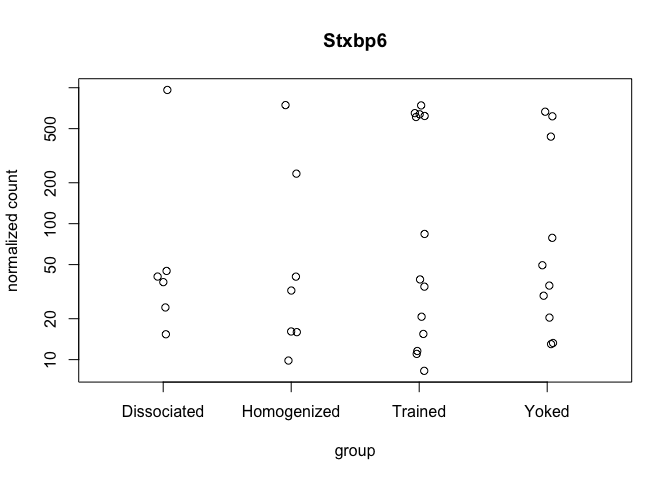
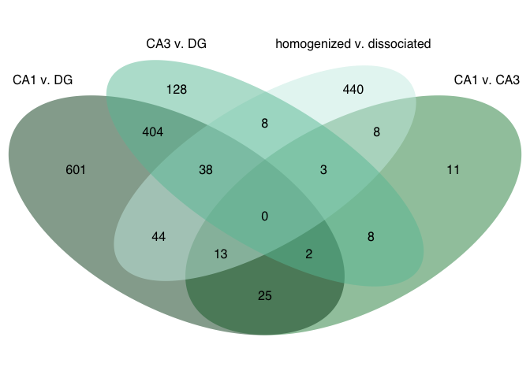
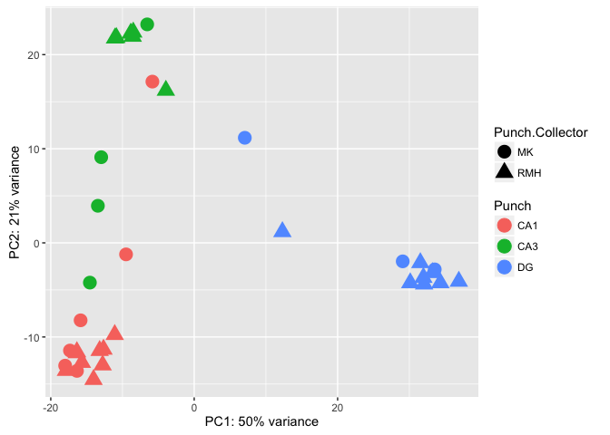
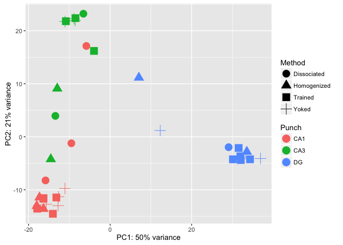

This R Markdown document will walk through the analysis of hippocampal tissue prepared with two different methods. The "homogenized" samples were collected by punch then homogenized in homogenization buffer from the Promega Maxwell kit. The "dissociated samples" were also collected similarily but the cells was dissociated after being punch and before being homogenized.

#### Differential Gene Expression Plots

    ## NULL

    ## Warning in is.na(rldpvals$padj.valsMethodYokedTrained): is.na() applied to
    ## non-(list or vector) of type 'NULL'

    ##                   PC1        PC2     group Punch.Collector Punch
    ## 100-CA1-1  -17.993347 -13.045265  MK : CA1              MK   CA1
    ## 100-CA1-2  -17.324222 -11.440788  MK : CA1              MK   CA1
    ## 100-CA1-3  -16.348220 -13.602801  MK : CA1              MK   CA1
    ## 100-CA3-1  -14.546249  -4.223415  MK : CA3              MK   CA3
    ## 100-CA3-4  -12.966904   9.101025  MK : CA3              MK   CA3
    ## 100-DG-2     7.058032  11.165242   MK : DG              MK    DG
    ## 100-DG-3    33.542201  -2.818931   MK : DG              MK    DG
    ## 101-CA1-1  -15.840016  -8.229683  MK : CA1              MK   CA1
    ## 101-CA1-2   -9.503243  -1.222787  MK : CA1              MK   CA1
    ## 101-CA1-3   -5.829286  17.132416  MK : CA1              MK   CA1
    ## 101-CA3-1  -13.431707   3.939066  MK : CA3              MK   CA3
    ## 101-CA3-4   -6.554781  23.213242  MK : CA3              MK   CA3
    ## 101-DG-4    29.077891  -1.964917   MK : DG              MK    DG
    ## 145A-CA1-2 -17.886282 -13.565931 RMH : CA1             RMH   CA1
    ## 145A-CA3-2  -3.951009  16.199620 RMH : CA3             RMH   CA3
    ## 145A-DG-2   32.060497  -4.386569  RMH : DG             RMH    DG
    ## 145B-CA1-1 -15.660731 -12.714928 RMH : CA1             RMH   CA1
    ## 145B-DG-1   33.234994  -3.172934  RMH : DG             RMH    DG
    ## 146A-CA1-2 -16.358483 -11.570388 RMH : CA1             RMH   CA1
    ## 146A-DG-2   31.960606  -3.683923  RMH : DG             RMH    DG
    ## 146B-CA1-2 -12.768810 -12.985362 RMH : CA1             RMH   CA1
    ## 146B-CA3-2 -11.048309  21.750002 RMH : CA3             RMH   CA3
    ## 146C-CA1-4 -14.037692 -14.527186 RMH : CA1             RMH   CA1
    ## 146C-DG-4   30.127551  -4.249862  RMH : DG             RMH    DG
    ## 146D-CA1-3 -11.081138  -9.751907 RMH : CA1             RMH   CA1
    ## 146D-CA3-3  -8.575580  21.934056 RMH : CA3             RMH   CA3
    ## 147C-CA1-3 -16.378048 -11.691026 RMH : CA1             RMH   CA1
    ## 147C-CA3-3  -8.497698  22.381056 RMH : CA3             RMH   CA3
    ## 147C-DG-3   34.326308  -4.247331  RMH : DG             RMH    DG
    ## 147D-CA3-1  -8.850328  22.266949 RMH : CA3             RMH   CA3
    ## 147D-DG-1   36.902079  -4.092825  RMH : DG             RMH    DG
    ## 148A-CA1-3 -13.187995 -11.449862 RMH : CA1             RMH   CA1
    ## 148A-CA3-3 -10.856032  21.803971 RMH : CA3             RMH   CA3
    ## 148A-DG-3   31.535236  -2.115077  RMH : DG             RMH    DG
    ## 148B-CA1-4 -12.648268 -11.310769 RMH : CA1             RMH   CA1
    ## 148B-DG-4   12.298983   1.177825  RMH : DG             RMH    DG
    ##                  name
    ## 100-CA1-1   100-CA1-1
    ## 100-CA1-2   100-CA1-2
    ## 100-CA1-3   100-CA1-3
    ## 100-CA3-1   100-CA3-1
    ## 100-CA3-4   100-CA3-4
    ## 100-DG-2     100-DG-2
    ## 100-DG-3     100-DG-3
    ## 101-CA1-1   101-CA1-1
    ## 101-CA1-2   101-CA1-2
    ## 101-CA1-3   101-CA1-3
    ## 101-CA3-1   101-CA3-1
    ## 101-CA3-4   101-CA3-4
    ## 101-DG-4     101-DG-4
    ## 145A-CA1-2 145A-CA1-2
    ## 145A-CA3-2 145A-CA3-2
    ## 145A-DG-2   145A-DG-2
    ## 145B-CA1-1 145B-CA1-1
    ## 145B-DG-1   145B-DG-1
    ## 146A-CA1-2 146A-CA1-2
    ## 146A-DG-2   146A-DG-2
    ## 146B-CA1-2 146B-CA1-2
    ## 146B-CA3-2 146B-CA3-2
    ## 146C-CA1-4 146C-CA1-4
    ## 146C-DG-4   146C-DG-4
    ## 146D-CA1-3 146D-CA1-3
    ## 146D-CA3-3 146D-CA3-3
    ## 147C-CA1-3 147C-CA1-3
    ## 147C-CA3-3 147C-CA3-3
    ## 147C-DG-3   147C-DG-3
    ## 147D-CA3-1 147D-CA3-1
    ## 147D-DG-1   147D-DG-1
    ## 148A-CA1-3 148A-CA1-3
    ## 148A-CA3-3 148A-CA3-3
    ## 148A-DG-3   148A-DG-3
    ## 148B-CA1-4 148B-CA1-4
    ## 148B-DG-4   148B-DG-4

    ##                   PC1        PC2             group      Method Punch
    ## 100-CA1-1  -17.993347 -13.045265 Homogenized : CA1 Homogenized   CA1
    ## 100-CA1-2  -17.324222 -11.440788 Homogenized : CA1 Homogenized   CA1
    ## 100-CA1-3  -16.348220 -13.602801 Homogenized : CA1 Homogenized   CA1
    ## 100-CA3-1  -14.546249  -4.223415 Homogenized : CA3 Homogenized   CA3
    ## 100-CA3-4  -12.966904   9.101025 Homogenized : CA3 Homogenized   CA3
    ## 100-DG-2     7.058032  11.165242  Homogenized : DG Homogenized    DG
    ## 100-DG-3    33.542201  -2.818931  Homogenized : DG Homogenized    DG
    ## 101-CA1-1  -15.840016  -8.229683 Dissociated : CA1 Dissociated   CA1
    ## 101-CA1-2   -9.503243  -1.222787 Dissociated : CA1 Dissociated   CA1
    ## 101-CA1-3   -5.829286  17.132416 Dissociated : CA1 Dissociated   CA1
    ## 101-CA3-1  -13.431707   3.939066 Dissociated : CA3 Dissociated   CA3
    ## 101-CA3-4   -6.554781  23.213242 Dissociated : CA3 Dissociated   CA3
    ## 101-DG-4    29.077891  -1.964917  Dissociated : DG Dissociated    DG
    ## 145A-CA1-2 -17.886282 -13.565931     Trained : CA1     Trained   CA1
    ## 145A-CA3-2  -3.951009  16.199620     Trained : CA3     Trained   CA3
    ## 145A-DG-2   32.060497  -4.386569      Trained : DG     Trained    DG
    ## 145B-CA1-1 -15.660731 -12.714928       Yoked : CA1       Yoked   CA1
    ## 145B-DG-1   33.234994  -3.172934        Yoked : DG       Yoked    DG
    ## 146A-CA1-2 -16.358483 -11.570388     Trained : CA1     Trained   CA1
    ## 146A-DG-2   31.960606  -3.683923      Trained : DG     Trained    DG
    ## 146B-CA1-2 -12.768810 -12.985362       Yoked : CA1       Yoked   CA1
    ## 146B-CA3-2 -11.048309  21.750002       Yoked : CA3       Yoked   CA3
    ## 146C-CA1-4 -14.037692 -14.527186     Trained : CA1     Trained   CA1
    ## 146C-DG-4   30.127551  -4.249862      Trained : DG     Trained    DG
    ## 146D-CA1-3 -11.081138  -9.751907       Yoked : CA1       Yoked   CA1
    ## 146D-CA3-3  -8.575580  21.934056       Yoked : CA3       Yoked   CA3
    ## 147C-CA1-3 -16.378048 -11.691026     Trained : CA1     Trained   CA1
    ## 147C-CA3-3  -8.497698  22.381056     Trained : CA3     Trained   CA3
    ## 147C-DG-3   34.326308  -4.247331      Trained : DG     Trained    DG
    ## 147D-CA3-1  -8.850328  22.266949       Yoked : CA3       Yoked   CA3
    ## 147D-DG-1   36.902079  -4.092825        Yoked : DG       Yoked    DG
    ## 148A-CA1-3 -13.187995 -11.449862     Trained : CA1     Trained   CA1
    ## 148A-CA3-3 -10.856032  21.803971     Trained : CA3     Trained   CA3
    ## 148A-DG-3   31.535236  -2.115077      Trained : DG     Trained    DG
    ## 148B-CA1-4 -12.648268 -11.310769       Yoked : CA1       Yoked   CA1
    ## 148B-DG-4   12.298983   1.177825        Yoked : DG       Yoked    DG
    ##                  name
    ## 100-CA1-1   100-CA1-1
    ## 100-CA1-2   100-CA1-2
    ## 100-CA1-3   100-CA1-3
    ## 100-CA3-1   100-CA3-1
    ## 100-CA3-4   100-CA3-4
    ## 100-DG-2     100-DG-2
    ## 100-DG-3     100-DG-3
    ## 101-CA1-1   101-CA1-1
    ## 101-CA1-2   101-CA1-2
    ## 101-CA1-3   101-CA1-3
    ## 101-CA3-1   101-CA3-1
    ## 101-CA3-4   101-CA3-4
    ## 101-DG-4     101-DG-4
    ## 145A-CA1-2 145A-CA1-2
    ## 145A-CA3-2 145A-CA3-2
    ## 145A-DG-2   145A-DG-2
    ## 145B-CA1-1 145B-CA1-1
    ## 145B-DG-1   145B-DG-1
    ## 146A-CA1-2 146A-CA1-2
    ## 146A-DG-2   146A-DG-2
    ## 146B-CA1-2 146B-CA1-2
    ## 146B-CA3-2 146B-CA3-2
    ## 146C-CA1-4 146C-CA1-4
    ## 146C-DG-4   146C-DG-4
    ## 146D-CA1-3 146D-CA1-3
    ## 146D-CA3-3 146D-CA3-3
    ## 147C-CA1-3 147C-CA1-3
    ## 147C-CA3-3 147C-CA3-3
    ## 147C-DG-3   147C-DG-3
    ## 147D-CA3-1 147D-CA3-1
    ## 147D-DG-1   147D-DG-1
    ## 148A-CA1-3 148A-CA1-3
    ## 148A-CA3-3 148A-CA3-3
    ## 148A-DG-3   148A-DG-3
    ## 148B-CA1-4 148B-CA1-4
    ## 148B-DG-4   148B-DG-4

