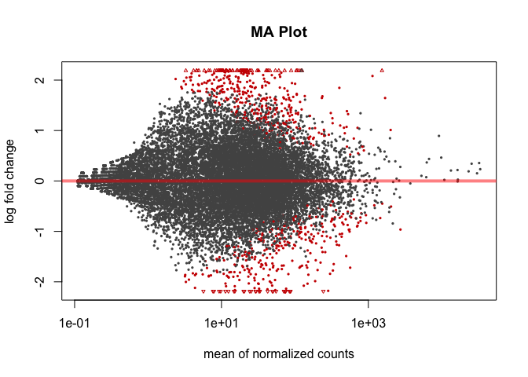
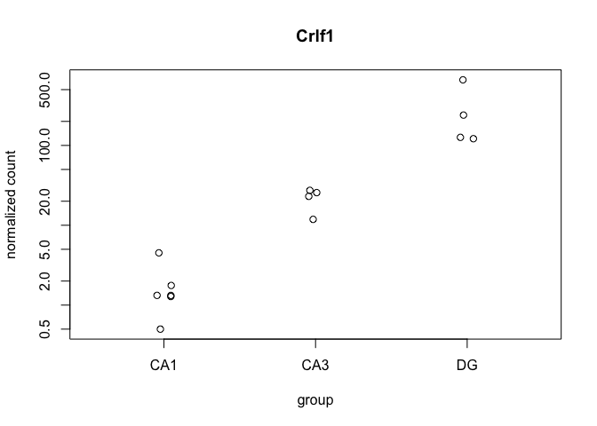
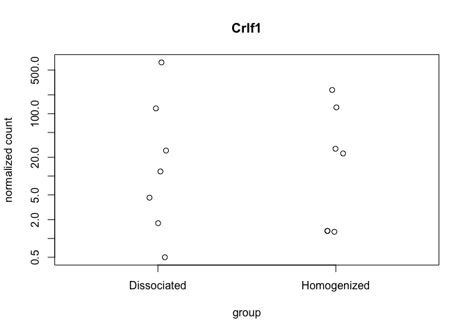
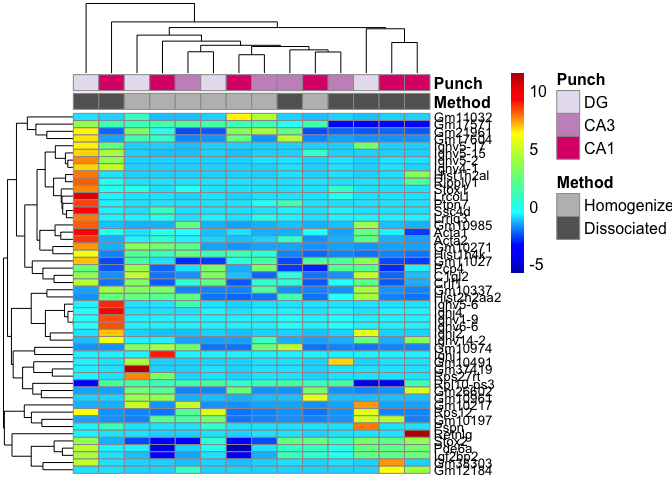
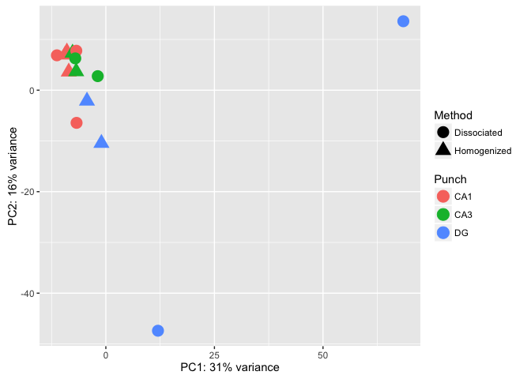

This R Markdown document will walk through the analysis of hippocampal tissue prepared with two different methods. The "homogenized" samples were collected by punch then homogenized in homogenization buffer from the Promega Maxwell kit. The "dissociated samples" were also collected similarily but the cells was dissociated after being punch and before being homogenized.

Save Intermediate Data file types, so they could be loaded from here with StoreReadData write.table(countData, '../intermediatefiles/countData.csv', row.names = TRUE, sep=",", col.names = T) write.table(colData, '../intermediatefiles/colData.csv', row.names = TRUE, sep=",", col.names = T) write.table(geneids, '../intermediatefiles/geneids.csv', row.names = TRUE, sep=",", col.names = T) read.csv('../intermediatefiles/colData.csv') read.csv('../intermediatefiles/countData.csv')

write.table(countData, '../intermediatefiles/countData.csv', row.names = TRUE, sep=",", col.names = T) write.table(colData, '../intermediatefiles/colData.csv', row.names = TRUE, sep=",", col.names = T) write.table(geneids, '../intermediatefiles/geneids.csv', row.names = TRUE, sep=",", col.names = T) colData \<- read.csv('../intermediatefiles/colData.csv') countData \<- read.csv('../intermediatefiles/countData.csv')

#### Differential Gene Expression Plots

    ## 
    ## out of 16523 with nonzero total read count
    ## adjusted p-value < 0.1
    ## LFC > 0 (up)     : 400, 2.4% 
    ## LFC < 0 (down)   : 324, 2% 
    ## outliers [1]     : 426, 2.6% 
    ## low counts [2]   : 0, 0% 
    ## (mean count < 0)
    ## [1] see 'cooksCutoff' argument of ?results
    ## [2] see 'independentFiltering' argument of ?results

    ## 
    ## out of 16523 with nonzero total read count
    ## adjusted p-value < 0.05
    ## LFC > 0 (up)     : 290, 1.8% 
    ## LFC < 0 (down)   : 260, 1.6% 
    ## outliers [1]     : 426, 2.6% 
    ## low counts [2]   : 5202, 31% 
    ## (mean count < 5)
    ## [1] see 'cooksCutoff' argument of ?results
    ## [2] see 'independentFiltering' argument of ?results

    ## NULL

    ## 
    ## FALSE  TRUE 
    ##   426 16097

    ## null device 
    ##           1

    ## null device 
    ##           1

    ## null device 
    ##           1

    ## null device 
    ##           1

    ##                  PC1        PC2             group      Method Punch
    ## 100-CA1-1  -8.543004   3.617009 Homogenized : CA1 Homogenized   CA1
    ## 100-CA1-2  -9.381323   6.965400 Homogenized : CA1 Homogenized   CA1
    ## 100-CA1-3  -8.976440   7.551405 Homogenized : CA1 Homogenized   CA1
    ## 100-CA3-1  -6.828439   3.671783 Homogenized : CA3 Homogenized   CA3
    ## 100-CA3-4  -7.666672   7.335174 Homogenized : CA3 Homogenized   CA3
    ## 100-DG-2   -4.349456  -2.118321  Homogenized : DG Homogenized    DG
    ## 100-DG-3   -1.024243 -10.443956  Homogenized : DG Homogenized    DG
    ## 101-CA1-1  -6.804781   7.773082 Dissociated : CA1 Dissociated   CA1
    ## 101-CA1-2 -11.269471   6.869803 Dissociated : CA1 Dissociated   CA1
    ## 101-CA1-3  -6.743889  -6.438843 Dissociated : CA1 Dissociated   CA1
    ## 101-CA3-1  -7.042732   6.269317 Dissociated : CA3 Dissociated   CA3
    ## 101-CA3-4  -1.868508   2.764041 Dissociated : CA3 Dissociated   CA3
    ## 101-DG-3   68.498294  13.583738  Dissociated : DG Dissociated    DG
    ## 101-DG-4   12.000663 -47.399633  Dissociated : DG Dissociated    DG
    ##                name
    ## 100-CA1-1 100-CA1-1
    ## 100-CA1-2 100-CA1-2
    ## 100-CA1-3 100-CA1-3
    ## 100-CA3-1 100-CA3-1
    ## 100-CA3-4 100-CA3-4
    ## 100-DG-2   100-DG-2
    ## 100-DG-3   100-DG-3
    ## 101-CA1-1 101-CA1-1
    ## 101-CA1-2 101-CA1-2
    ## 101-CA1-3 101-CA1-3
    ## 101-CA3-1 101-CA3-1
    ## 101-CA3-4 101-CA3-4
    ## 101-DG-3   101-DG-3
    ## 101-DG-4   101-DG-4

