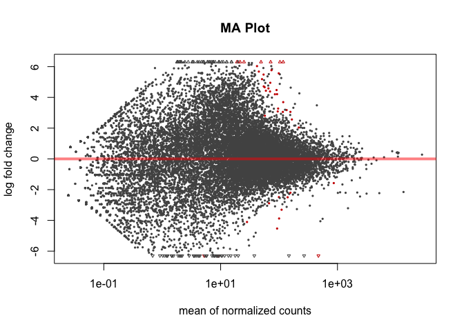
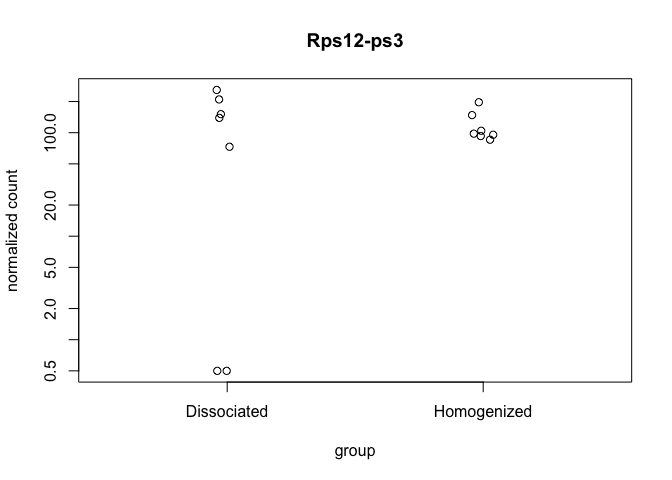
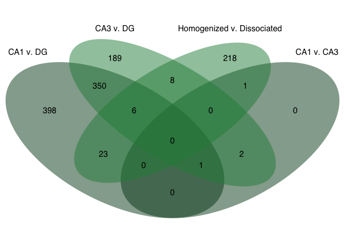
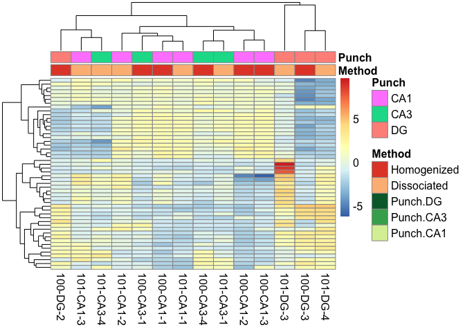
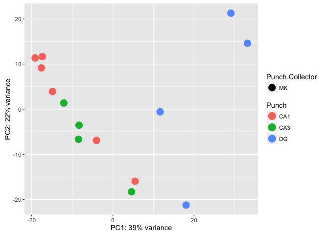

This R Markdown document will walk through the analysis of hippocampal tissue prepared with two different methods. The "homogenized" samples were collected by punch then homogenized in homogenization buffer from the Promega Maxwell kit. The "dissociated samples" were also collected similarily but the cells was dissociated after being punch and before being homogenized.

Save Intermediate Data file types, so they could be loaded from here with StoreReadData write.table(countData, '../intermediatefiles/countData.csv', row.names = TRUE, sep=",", col.names = T) write.table(colData, '../intermediatefiles/colData.csv', row.names = TRUE, sep=",", col.names = T) write.table(geneids, '../intermediatefiles/geneids.csv', row.names = TRUE, sep=",", col.names = T) read.csv('../intermediatefiles/colData.csv') read.csv('../intermediatefiles/countData.csv')

write.table(countData, '../intermediatefiles/countData.csv', row.names = TRUE, sep=",", col.names = T) write.table(colData, '../intermediatefiles/colData.csv', row.names = TRUE, sep=",", col.names = T) write.table(geneids, '../intermediatefiles/geneids.csv', row.names = TRUE, sep=",", col.names = T) colData \<- read.csv('../intermediatefiles/colData.csv') countData \<- read.csv('../intermediatefiles/countData.csv')

#### Differential Gene Expression Plots

    ## NULL

    ## 
    ## FALSE  TRUE 
    ##   121 16892

    ##                  PC1         PC2    group Punch.Collector Punch      name
    ## 100-CA1-1 -17.622093   9.1439946 MK : CA1              MK   CA1 100-CA1-1
    ## 100-CA1-2 -19.159655  11.3425943 MK : CA1              MK   CA1 100-CA1-2
    ## 100-CA1-3 -17.382752  11.6431165 MK : CA1              MK   CA1 100-CA1-3
    ## 100-CA3-1 -12.090892   1.3650739 MK : CA3              MK   CA3 100-CA3-1
    ## 100-CA3-4  -8.341418  -3.5590556 MK : CA3              MK   CA3 100-CA3-4
    ## 100-DG-2   11.632917  -0.5957455  MK : DG              MK    DG  100-DG-2
    ## 100-DG-3   29.091124  21.2715840  MK : DG              MK    DG  100-DG-3
    ## 101-CA1-1 -14.885865   3.9166594 MK : CA1              MK   CA1 101-CA1-1
    ## 101-CA1-2  -4.048188  -6.9240528 MK : CA1              MK   CA1 101-CA1-2
    ## 101-CA1-3   5.474944 -15.9714610 MK : CA1              MK   CA1 101-CA1-3
    ## 101-CA3-1  -8.468865  -6.6823684 MK : CA3              MK   CA3 101-CA3-1
    ## 101-CA3-4   4.597856 -18.3067083 MK : CA3              MK   CA3 101-CA3-4
    ## 101-DG-3   18.039195 -21.2504238  MK : DG              MK    DG  101-DG-3
    ## 101-DG-4   33.163694  14.6067925  MK : DG              MK    DG  101-DG-4

