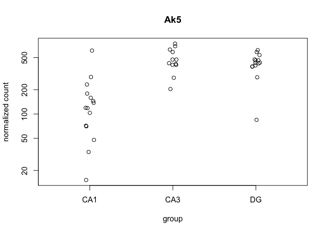
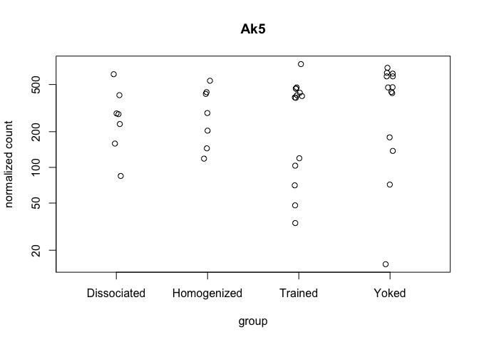

Methods for Dorsal Hippocampal Gene Expression Profiling
--------------------------------------------------------

#### Part 2: Comparing the technial manipulation described in Part 1 with samples collected after a behavioral manipulation

This PCA ...

This Venn Diagram ....

Heatmaps

This is a data validation check plot. Here, I'm showing how many millions of reads were present in each sample. On average, each sample had xxmillion reads, but the range was from x to x millino reads.

This graph examines the magnitude of gene expression differences (shown as log fold change on the y axis) as a function of read abundance (shown as mean normalized counts on the x axis.

This is the gene with the most significant p value 

