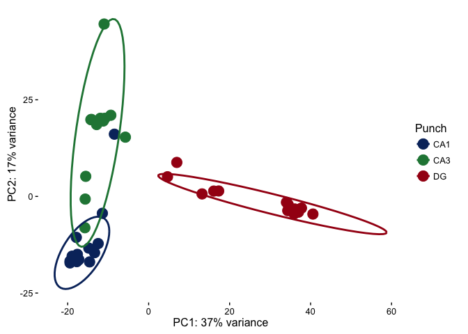
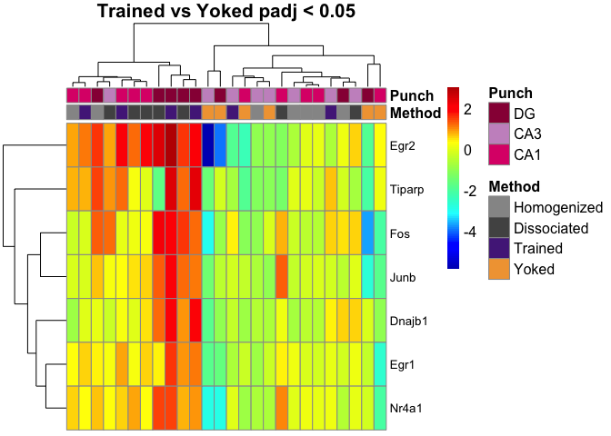
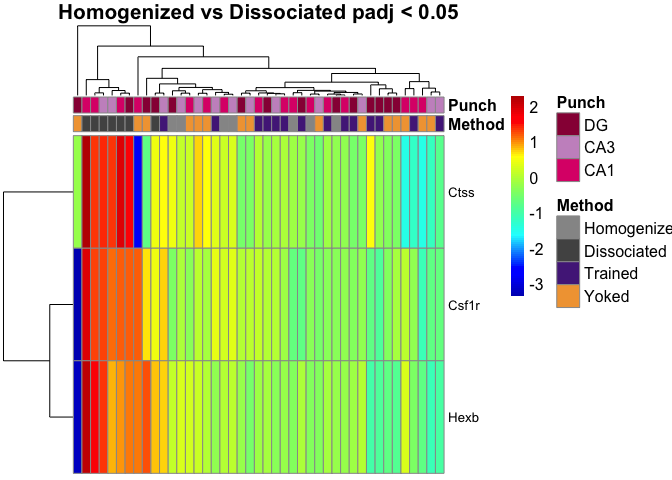
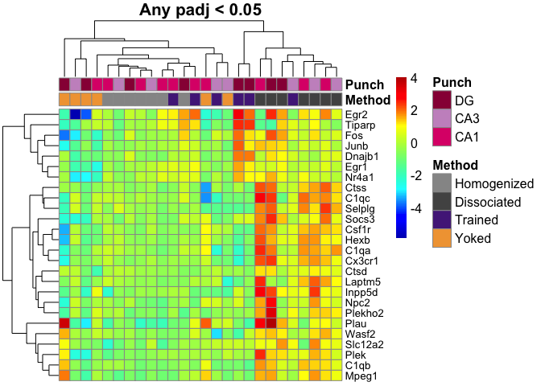
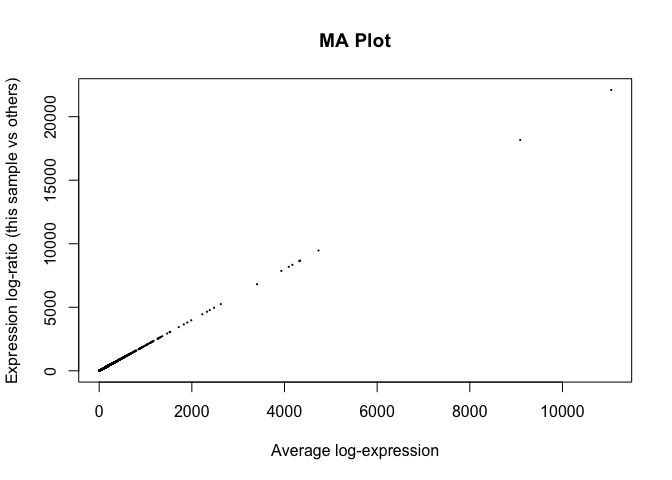

Methods for Dorsal Hippocampal Gene Expression Profiling
--------------------------------------------------------

#### Part 2: Comparing the technial manipulation described in Part 1 with samples collected after a behavioral manipulation

For this section of the results, I added 2 or 3 samples from CA1, CA3, and DG collected from male mice that had the exprience of being in the active place avoidance arena, including spatially-trained and yoked animals. The DG samples cluster fairly well, but the CA1 and CA3 samples are pretty overlapping. The CA1 homogenized and dissociated technical replicates have the least amount of variance of all groups.

Very, very few genes are differentially expressed by 

This is a data validation check plot. Here, I'm showing how many millions of reads were present in each sample. On average, each sample had xxmillion reads, but the range was from x to x millino reads.

This graph examines the magnitude of gene expression differences (shown as log fold change on the y axis) as a function of read abundance (shown as mean normalized counts on the x axis.

This is the gene with the most significant p value 

