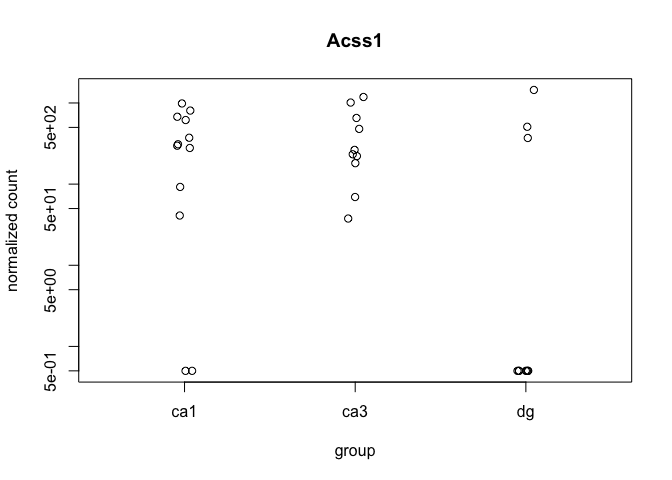
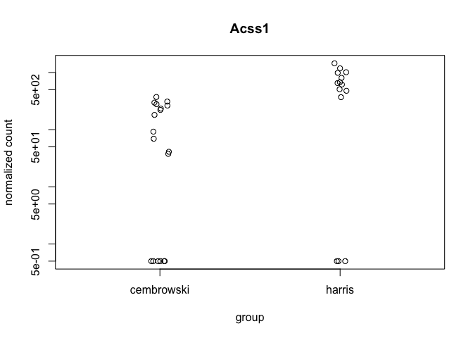
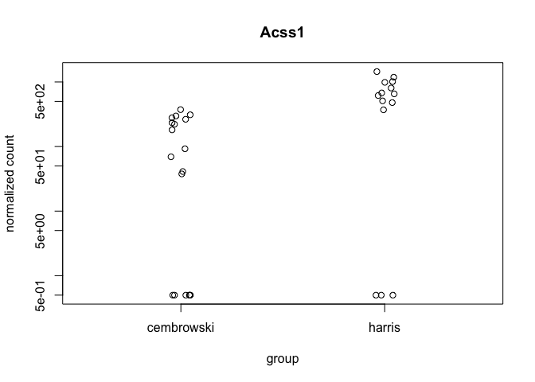
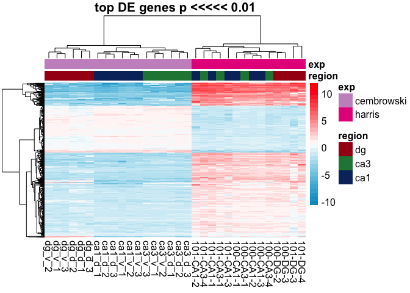
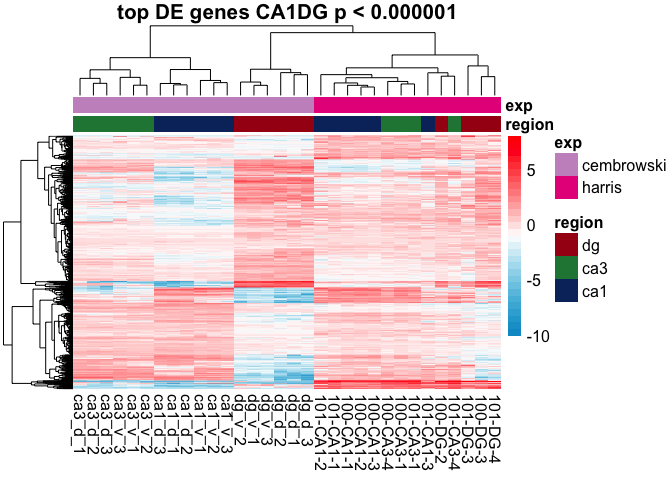
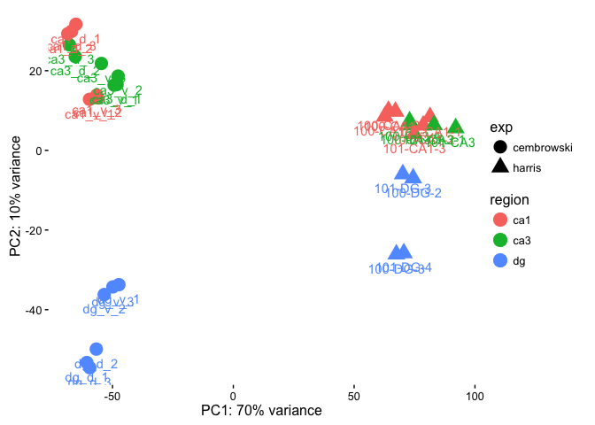
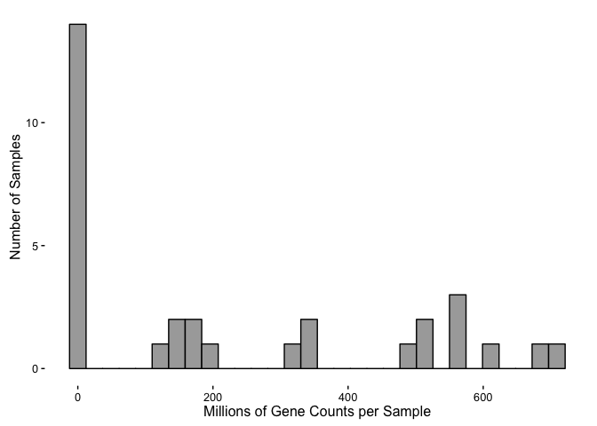

    ## Warning in full_join_impl(x, y, by$x, by$y, suffix$x, suffix$y): joining
    ## character vector and factor, coercing into character vector

    ##               dg_d_1 dg_d_2 dg_d_3 dg_v_1 dg_v_2 dg_v_3 ca3_d_1 ca3_d_2
    ## 0610005C13Rik      0     56     56     84    168    168     196      28
    ## 0610007C21Rik   9156  16268  12124  19992  15036  19628   13608   16688
    ## 0610007L01Rik  11816   6468   6608  18144  16352  11536   22008   23408
    ## 0610007N19Rik      0      0      0      0    112      0       0       0
    ## 0610007P08Rik  18592  14952   5152  16940  17304  22624   10248   12656
    ## 0610007P14Rik  18312  13804  12852  23044  27244  25648   31108   27132
    ##               ca3_d_3 ca3_v_1 ca3_v_2 ca3_v_3 ca1_d_1 ca1_d_2 ca1_d_3
    ## 0610005C13Rik       0     112      84     168     112     112       0
    ## 0610007C21Rik   13188   21784   24472   28756   19684   19880   15904
    ## 0610007L01Rik   15988   24640   25144   25032   27244   32088   30968
    ## 0610007N19Rik       0       0      28       0       0       0       0
    ## 0610007P08Rik   15708   11704   15876   15204   22512   18648   14560
    ## 0610007P14Rik   36092   31248   28980   33488   31528   43120   46396
    ##               ca1_v_1 ca1_v_2 ca1_v_3      rownames
    ## 0610005C13Rik       0     112       0 0610005C13Rik
    ## 0610007C21Rik    4928    2996    5264 0610007C21Rik
    ## 0610007L01Rik    8400    5628    8064 0610007L01Rik
    ## 0610007N19Rik       0       0       0 0610007N19Rik
    ## 0610007P08Rik    6104    1652    3640 0610007P08Rik
    ## 0610007P14Rik    8456    8092   15344 0610007P14Rik

#### Differential Gene Expression

    ## class: DESeqDataSet 
    ## dim: 16397 32 
    ## metadata(1): version
    ## assays(1): counts
    ## rownames(16397): 0610007P14Rik 0610009B22Rik ... Zzef1 Zzz3
    ## rowData names(0):
    ## colnames(32): dg_d_1 dg_d_2 ... 101-DG-3 101-DG-4
    ## colData names(4): RNAseqID region location exp

    ## class: DESeqDataSet 
    ## dim: 16397 32 
    ## metadata(1): version
    ## assays(3): counts mu cooks
    ## rownames(16397): 0610007P14Rik 0610009B22Rik ... Zzef1 Zzz3
    ## rowData names(37): baseMean baseVar ... deviance maxCooks
    ## colnames(32): dg_d_1 dg_d_2 ... 101-DG-3 101-DG-4
    ## colData names(5): RNAseqID region location exp sizeFactor

    ## 
    ## out of 16397 with nonzero total read count
    ## adjusted p-value < 0.1
    ## LFC > 0 (up)     : 277, 1.7% 
    ## LFC < 0 (down)   : 405, 2.5% 
    ## outliers [1]     : 1026, 6.3% 
    ## low counts [2]   : 0, 0% 
    ## (mean count < 0)
    ## [1] see 'cooksCutoff' argument of ?results
    ## [2] see 'independentFiltering' argument of ?results

    ## [1] 682

    ## 
    ## out of 16397 with nonzero total read count
    ## adjusted p-value < 0.05
    ## LFC > 0 (up)     : 202, 1.2% 
    ## LFC < 0 (down)   : 265, 1.6% 
    ## outliers [1]     : 1026, 6.3% 
    ## low counts [2]   : 1043, 6.4% 
    ## (mean count < 4)
    ## [1] see 'cooksCutoff' argument of ?results
    ## [2] see 'independentFiltering' argument of ?results

    ## [1] 467

    ## [1] 7487

    ## [1] 4492

    ## [1] 1732

    ## [1] 4656

    ## null device 
    ##           1

    ##                 PC1        PC2            group region        exp
    ## dg_d_1    -60.62948 -53.271699  dg : cembrowski     dg cembrowski
    ## dg_d_2    -56.69417 -49.891426  dg : cembrowski     dg cembrowski
    ## dg_d_3    -59.39578 -54.567691  dg : cembrowski     dg cembrowski
    ## dg_v_1    -47.35151 -33.724910  dg : cembrowski     dg cembrowski
    ## dg_v_2    -53.42543 -36.201122  dg : cembrowski     dg cembrowski
    ## dg_v_3    -49.84204 -34.283298  dg : cembrowski     dg cembrowski
    ## ca3_d_1   -48.11217  16.539057 ca3 : cembrowski    ca3 cembrowski
    ## ca3_d_2   -65.41073  23.555829 ca3 : cembrowski    ca3 cembrowski
    ## ca3_d_3   -67.85086  26.488983 ca3 : cembrowski    ca3 cembrowski
    ## ca3_v_1   -49.33266  16.383439 ca3 : cembrowski    ca3 cembrowski
    ## ca3_v_2   -47.71230  18.652510 ca3 : cembrowski    ca3 cembrowski
    ## ca3_v_3   -54.60493  21.816738 ca3 : cembrowski    ca3 cembrowski
    ## ca1_d_1   -65.13766  31.665199 ca1 : cembrowski    ca1 cembrowski
    ## ca1_d_2   -68.50432  29.273067 ca1 : cembrowski    ca1 cembrowski
    ## ca1_d_3   -66.93532  29.892423 ca1 : cembrowski    ca1 cembrowski
    ## ca1_v_1   -59.51790  12.816763 ca1 : cembrowski    ca1 cembrowski
    ## ca1_v_2   -56.15874  13.176459 ca1 : cembrowski    ca1 cembrowski
    ## ca1_v_3   -56.51244  13.860754 ca1 : cembrowski    ca1 cembrowski
    ## 100-CA1-1  67.08953   9.748168     ca1 : harris    ca1     harris
    ## 100-CA1-2  64.19508   9.972216     ca1 : harris    ca1     harris
    ## 100-CA1-3  62.67781   8.521132     ca1 : harris    ca1     harris
    ## 100-CA3-1  73.68077   6.314293     ca3 : harris    ca3     harris
    ## 100-CA3-4  72.93685   7.305724     ca3 : harris    ca3     harris
    ## 100-DG-2   74.42804  -6.979642      dg : harris     dg     harris
    ## 100-DG-3   67.46979 -26.088445      dg : harris     dg     harris
    ## 101-CA1-1  81.38110   8.400727     ca1 : harris    ca1     harris
    ## 101-CA1-2  78.59718   6.268473     ca1 : harris    ca1     harris
    ## 101-CA1-3  74.92452   4.149616     ca1 : harris    ca1     harris
    ## 101-CA3-1  83.02973   6.352919     ca3 : harris    ca3     harris
    ## 101-CA3-4  92.00858   5.603327     ca3 : harris    ca3     harris
    ## 101-DG-3   70.14098  -5.963352      dg : harris     dg     harris
    ## 101-DG-4   70.56849 -25.786233      dg : harris     dg     harris
    ##                name
    ## dg_d_1       dg_d_1
    ## dg_d_2       dg_d_2
    ## dg_d_3       dg_d_3
    ## dg_v_1       dg_v_1
    ## dg_v_2       dg_v_2
    ## dg_v_3       dg_v_3
    ## ca3_d_1     ca3_d_1
    ## ca3_d_2     ca3_d_2
    ## ca3_d_3     ca3_d_3
    ## ca3_v_1     ca3_v_1
    ## ca3_v_2     ca3_v_2
    ## ca3_v_3     ca3_v_3
    ## ca1_d_1     ca1_d_1
    ## ca1_d_2     ca1_d_2
    ## ca1_d_3     ca1_d_3
    ## ca1_v_1     ca1_v_1
    ## ca1_v_2     ca1_v_2
    ## ca1_v_3     ca1_v_3
    ## 100-CA1-1 100-CA1-1
    ## 100-CA1-2 100-CA1-2
    ## 100-CA1-3 100-CA1-3
    ## 100-CA3-1 100-CA3-1
    ## 100-CA3-4 100-CA3-4
    ## 100-DG-2   100-DG-2
    ## 100-DG-3   100-DG-3
    ## 101-CA1-1 101-CA1-1
    ## 101-CA1-2 101-CA1-2
    ## 101-CA1-3 101-CA1-3
    ## 101-CA3-1 101-CA3-1
    ## 101-CA3-4 101-CA3-4
    ## 101-DG-3   101-DG-3
    ## 101-DG-4   101-DG-4

    counts <- allcountData
    dim( counts )

    ## [1] 20234    32

    colSums( counts ) / 1e06  # in millions of reads

    ##     dg_d_1     dg_d_2     dg_d_3     dg_v_1     dg_v_2     dg_v_3 
    ## 172.402104 149.170784 152.703880 343.688716 309.712536 349.619032 
    ##    ca3_d_1    ca3_d_2    ca3_d_3    ca3_v_1    ca3_v_2    ca3_v_3 
    ## 479.089240 560.757568 519.835512 562.506112 573.535060 680.126104 
    ##    ca1_d_1    ca1_d_2    ca1_d_3    ca1_v_1    ca1_v_2    ca1_v_3 
    ## 603.017492 709.074520 522.308248 174.061888 118.269536 191.532124 
    ##  100-CA1-1  100-CA1-2  100-CA1-3  100-CA3-1  100-CA3-4   100-DG-2 
    ##   2.169200   6.249005   2.136109   1.853269   2.225726   1.217646 
    ##   100-DG-3  101-CA1-1  101-CA1-2  101-CA1-3  101-CA3-1  101-CA3-4 
    ##   5.745792   4.526123   0.126580   0.284570   2.373002   1.133814 
    ##   101-DG-3   101-DG-4 
    ##   0.060772   0.564613

    table( rowSums( counts ) )[ 1:30 ] # Number of genes with low counts

    ## 
    ##    0    2    3    4    5    6    7    8    9   10   11   12   13   14   15 
    ## 3707  130   73   53   47   33   37   34   20   24   22   22    9   16   15 
    ##   16   17   18   19   20   21   22   23   24   25   26   27   28   29   30 
    ##   13    8   10   10   14   10    3   11    6   10    7    7  171    9   20

    rowsum <- as.data.frame(colSums( counts ) / 1e06 )
    names(rowsum)[1] <- "millioncounts"
    rowsum$sample <- row.names(rowsum)

    ggplot(rowsum, aes(x=millioncounts)) + 
      geom_histogram(bins = 20, colour = "black", fill = "darkgrey") +
      theme_classic() +
      scale_x_continuous(name = "Millions of Gene Counts per Sample",
                         breaks = seq(0, 30, 5),
                         limits=c(0, 30)) +
      scale_y_continuous(name = "Number of Samples")

    ## Warning: Removed 18 rows containing non-finite values (stat_bin).

