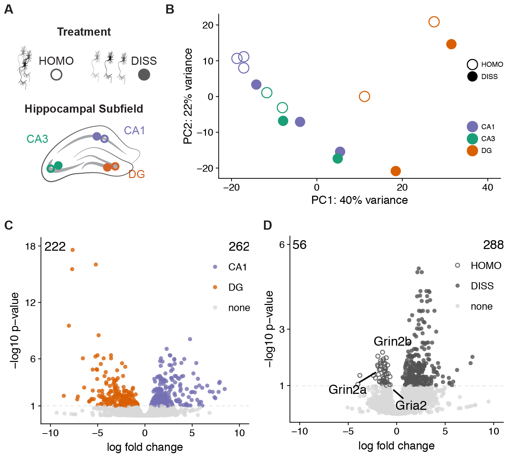

First Slide
========================================================

- experimental dataset
- methods
- figures 
- tables
- links

NCBI GEO
=========

https://www.ncbi.nlm.nih.gov/geo/query/acc.cgi?acc=GSE99765


Kallisto + MultiQC
=========


1. https://github.com/raynamharris/IntegrativeProjectWT2015/blob/master/UNIXworkflow/04_kallisto.md


Cellular dissociation has minors effect on hippocampal gene expression
========================================================

{width=65%}

github.com/raynamharris/DissociationTest: scripts/01_DissociationTest.Rmd & 02_volcanoplots.Rmd

Top 20ish differentially expressed genes
========================================================

{width=80%}

- https://github.com/raynamharris/DissociationTest/blob/master/scripts/04_heatmaps.Rmd
- https://github.com/raynamharris/DissociationTest/tree/master/scripts/05_GO_MWU/05_GO_MWU.Rmd

Searchable supplementary files - DEGs
========================================================

```{r}
suptable <- read.csv("../results/SuppTable1.csv")
tail(suptable, 10)
```

Searchable supplementary files - GOs
========================================================

```{r}
GOtable <- read.csv("../results/GOsignificantcatagories.csv")
head(GOtable, 5)
```

Repeated workflows from different time and space
=========

1. https://github.com/raynamharris/IntegrativeProjectWT2015/
1. https://github.com/raynamharris/DissociationTest/
1. https://github.com/raynamharris/FMR1CA1rnaseq/

