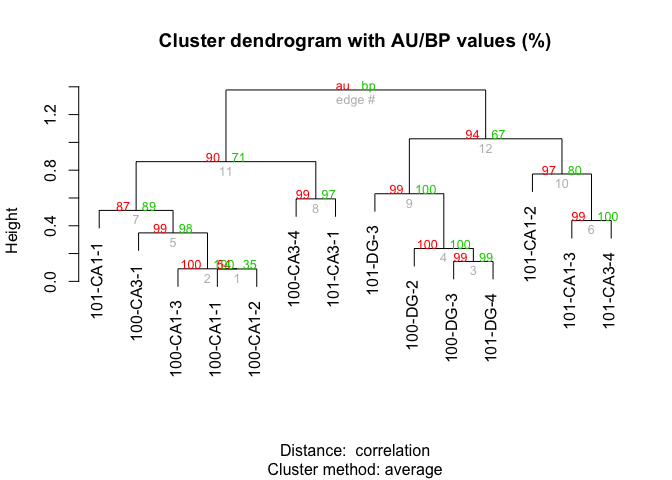

Cellular Stress
---------------

In this analysis, I examine the effect that cell dissasociation has on
CA1, CA3, and DG gene expression relative to control tissue samples.

Here is a brief overview of the samples being compared.

    str(colData)

    ## 'data.frame':    14 obs. of  14 variables:
    ##  $ RNAseqID : Factor w/ 14 levels "100-CA1-1","100-CA1-2",..: 1 2 3 4 5 6 7 8 9 10 ...
    ##  $ Mouse    : Factor w/ 1 level "15-100": 1 1 1 1 1 1 1 1 1 1 ...
    ##  $ year     : int  2015 2015 2015 2015 2015 2015 2015 2015 2015 2015 ...
    ##  $ Genotype : Factor w/ 1 level "WT": 1 1 1 1 1 1 1 1 1 1 ...
    ##  $ jobnumber: Factor w/ 1 level "JA16444": 1 1 1 1 1 1 1 1 1 1 ...
    ##  $ Region   : Factor w/ 3 levels "CA1","CA3","DG": 1 1 1 2 2 3 3 1 1 1 ...
    ##  $ Group    : Factor w/ 1 level "homecage": 1 1 1 1 1 1 1 1 1 1 ...
    ##  $ Conflict : Factor w/ 0 levels: NA NA NA NA NA NA NA NA NA NA ...
    ##  $ APA      : Factor w/ 0 levels: NA NA NA NA NA NA NA NA NA NA ...
    ##  $ Treatment: Factor w/ 2 levels "control","dissociated": 1 1 1 1 1 1 1 2 2 2 ...
    ##  $ dodgy    : Factor w/ 1 level "allgood": 1 1 1 1 1 1 1 1 1 1 ...
    ##  $ daytime  : Factor w/ 1 level "norecord": 1 1 1 1 1 1 1 1 1 1 ...
    ##  $ Slice    : int  1 2 3 1 4 2 3 1 2 3 ...
    ##  $ Date     : Factor w/ 1 level "9/28/15": 1 1 1 1 1 1 1 1 1 1 ...

    summary(colData)

    ##       RNAseqID    Mouse         year      Genotype   jobnumber  Region 
    ##  100-CA1-1:1   15-100:14   Min.   :2015   WT:14    JA16444:14   CA1:6  
    ##  100-CA1-2:1               1st Qu.:2015                         CA3:4  
    ##  100-CA1-3:1               Median :2015                         DG :4  
    ##  100-CA3-1:1               Mean   :2015                                
    ##  100-CA3-4:1               3rd Qu.:2015                                
    ##  100-DG-2 :1               Max.   :2015                                
    ##  (Other)  :8                                                           
    ##       Group    Conflict    APA           Treatment     dodgy   
    ##  homecage:14   NA's:14   NA's:14   control    :7   allgood:14  
    ##                                    dissociated:7               
    ##                                                                
    ##                                                                
    ##                                                                
    ##                                                                
    ##                                                                
    ##      daytime       Slice            Date   
    ##  norecord:14   Min.   :1.000   9/28/15:14  
    ##                1st Qu.:1.250               
    ##                Median :2.500               
    ##                Mean   :2.429               
    ##                3rd Qu.:3.000               
    ##                Max.   :4.000               
    ## 

This PCA gives an overview of the variability between samples using the
a large matrix of log transformed gene expression data. You can see that
the bigges difference is between DG punches and the CA1 and CA3 punches.
CA1 and CA3 samples have similar transcriptomes. The control CA1 samples
have the most similar transcriptonal profiles as evidenced by their
tight clustering.

    source("DESeqPCAfunction.R")
    source("figureoptions.R")

    # create the dataframe using my function pcadataframe
    pcadata <- pcadataframe(rld, intgroup=c("Region", "Treatment"), returnData=TRUE)
    percentVar <- round(100 * attr(pcadata, "percentVar"))

    ## for markdown
    plotPC1PC2(aescolor = pcadata$Region, colorname = "Region", colorvalues = colorvalRegion, aesshape = pcadata$Treatment, shapename = "Treatment")

    # for adobe
    myplot <- plotPC1PC2(aescolor = pcadata$Region, colorname = "Region", aesshape = pcadata$Treatment, shapename = "Treatment", colorvalues = colorvalRegion)
    pdf(file="../figures/01_dissociationtest/PCA-1.pdf", width=4.5, height=3)
    plot(myplot)
    dev.off()

    ## quartz_off_screen 
    ##                 2

    ## statistics
    aov1 <- aov(PC1 ~ Region, data=pcadata)
    summary(aov1) 

    ##             Df Sum Sq Mean Sq F value   Pr(>F)    
    ## Region       2 2431.8  1215.9   14.89 0.000741 ***
    ## Residuals   11  898.2    81.7                     
    ## ---
    ## Signif. codes:  0 '***' 0.001 '**' 0.01 '*' 0.05 '.' 0.1 ' ' 1

    TukeyHSD(aov1, which = "Region") 

    ##   Tukey multiple comparisons of means
    ##     95% family-wise confidence level
    ## 
    ## Fit: aov(formula = PC1 ~ Region, data = pcadata)
    ## 
    ## $Region
    ##              diff       lwr      upr     p adj
    ## CA3-CA1  6.006054 -9.747606 21.75971 0.5744797
    ## DG-CA1  31.052821 15.299161 46.80648 0.0006523
    ## DG-CA3  25.046767  7.789497 42.30404 0.0062084

    aov2 <- aov(PC2 ~ Region, data=pcadata)
    summary(aov2) 

    ##             Df Sum Sq Mean Sq F value Pr(>F)
    ## Region       2    318     159   1.019  0.393
    ## Residuals   11   1716     156

    TukeyHSD(aov2, which = "Region") 

    ##   Tukey multiple comparisons of means
    ##     95% family-wise confidence level
    ## 
    ## Fit: aov(formula = PC2 ~ Region, data = pcadata)
    ## 
    ## $Region
    ##              diff       lwr      upr     p adj
    ## CA3-CA1 -8.274284 -30.04803 13.49946 0.5764407
    ## DG-CA1   4.024891 -17.74885 25.79863 0.8731463
    ## DG-CA3  12.299176 -11.55276 36.15111 0.3777094

    aov3 <- aov(PC1 ~ Treatment, data=pcadata)
    summary(aov3) 

    ##             Df Sum Sq Mean Sq F value Pr(>F)
    ## Treatment    1    382   382.0   1.555  0.236
    ## Residuals   12   2948   245.7

    TukeyHSD(aov3, which = "Treatment")

    ##   Tukey multiple comparisons of means
    ##     95% family-wise confidence level
    ## 
    ## Fit: aov(formula = PC1 ~ Treatment, data = pcadata)
    ## 
    ## $Treatment
    ##                         diff       lwr      upr     p adj
    ## dissociated-control 10.44772 -7.806276 28.70172 0.2361705

    aov4 <- aov(PC2 ~ Treatment, data=pcadata)
    summary(aov4) 

    ##             Df Sum Sq Mean Sq F value Pr(>F)  
    ## Treatment    1  676.8   676.8   5.985 0.0308 *
    ## Residuals   12 1357.0   113.1                 
    ## ---
    ## Signif. codes:  0 '***' 0.001 '**' 0.01 '*' 0.05 '.' 0.1 ' ' 1

    TukeyHSD(aov4, which = "Treatment") 

    ##   Tukey multiple comparisons of means
    ##     95% family-wise confidence level
    ## 
    ## Fit: aov(formula = PC2 ~ Treatment, data = pcadata)
    ## 
    ## $Treatment
    ##                          diff       lwr       upr     p adj
    ## dissociated-control -13.90576 -26.29056 -1.520969 0.0307958

    lm1 <- lm(PC1~Region*Treatment, data=pcadata)
    summary(lm1)

    ## 
    ## Call:
    ## lm(formula = PC1 ~ Region * Treatment, data = pcadata)
    ## 
    ## Residuals:
    ##      Min       1Q   Median       3Q      Max 
    ## -10.1636  -5.2711   0.6748   5.2711   9.3395 
    ## 
    ## Coefficients:
    ##                                Estimate Std. Error t value Pr(>|t|)   
    ## (Intercept)                     -17.487      4.494  -3.892  0.00460 **
    ## RegionCA3                         8.432      7.105   1.187  0.26937   
    ## RegionDG                         34.490      7.105   4.854  0.00127 **
    ## Treatmentdissociated             13.798      6.355   2.171  0.06170 . 
    ## RegionCA3:Treatmentdissociated   -4.852     10.048  -0.483  0.64213   
    ## RegionDG:Treatmentdissociated    -6.874     10.048  -0.684  0.51324   
    ## ---
    ## Signif. codes:  0 '***' 0.001 '**' 0.01 '*' 0.05 '.' 0.1 ' ' 1
    ## 
    ## Residual standard error: 7.783 on 8 degrees of freedom
    ## Multiple R-squared:  0.8545, Adjusted R-squared:  0.7635 
    ## F-statistic: 9.394 on 5 and 8 DF,  p-value: 0.003363

    anova(lm1) 

    ## Analysis of Variance Table
    ## 
    ## Response: PC1
    ##                  Df  Sum Sq Mean Sq F value    Pr(>F)    
    ## Region            2 2431.85 1215.92 20.0717 0.0007625 ***
    ## Treatment         1  382.04  382.04  6.3065 0.0362986 *  
    ## Region:Treatment  2   31.51   15.75  0.2600 0.7772870    
    ## Residuals         8  484.63   60.58                      
    ## ---
    ## Signif. codes:  0 '***' 0.001 '**' 0.01 '*' 0.05 '.' 0.1 ' ' 1

    lm2 <- lm(PC2~Region*Treatment, data=pcadata)
    summary(lm2)

    ## 
    ## Call:
    ## lm(formula = PC2 ~ Region * Treatment, data = pcadata)
    ## 
    ## Residuals:
    ##     Min      1Q  Median      3Q     Max 
    ## -14.658  -5.104   0.220   5.104  14.658 
    ## 
    ## Coefficients:
    ##                                Estimate Std. Error t value Pr(>|t|)  
    ## (Intercept)                     10.3125     6.4088   1.609   0.1463  
    ## RegionCA3                      -11.2435    10.1332  -1.110   0.2994  
    ## RegionDG                        -0.5152    10.1332  -0.051   0.9607  
    ## Treatmentdissociated           -18.1968     9.0634  -2.008   0.0796 .
    ## RegionCA3:Treatmentdissociated   5.9385    14.3304   0.414   0.6895  
    ## RegionDG:Treatmentdissociated    9.0801    14.3304   0.634   0.5440  
    ## ---
    ## Signif. codes:  0 '***' 0.001 '**' 0.01 '*' 0.05 '.' 0.1 ' ' 1
    ## 
    ## Residual standard error: 11.1 on 8 degrees of freedom
    ## Multiple R-squared:  0.5153, Adjusted R-squared:  0.2124 
    ## F-statistic: 1.701 on 5 and 8 DF,  p-value: 0.24

    anova(lm2) 

    ## Analysis of Variance Table
    ## 
    ## Response: PC2
    ##                  Df Sum Sq Mean Sq F value  Pr(>F)  
    ## Region            2 318.02  159.01  1.2905 0.32678  
    ## Treatment         1 676.80  676.80  5.4927 0.04715 *
    ## Region:Treatment  2  53.27   26.63  0.2162 0.81016  
    ## Residuals         8 985.74  123.22                  
    ## ---
    ## Signif. codes:  0 '***' 0.001 '**' 0.01 '*' 0.05 '.' 0.1 ' ' 1

Now, we can calulate the number of significant genes by contrast by
contrast. The first number displayed is not corrected for mutiple
hypothesis testing but the second one is.

    ## DEG by contrasts
    source("resvalsfunction.R")
    contrast1 <- resvals(contrastvector = c('Region', 'CA1', 'DG'), mypval = 0.1)

    ## [1] 1723
    ## [1] 281

    contrast2 <- resvals(contrastvector = c('Region', 'CA3', 'DG'), mypval = 0.1)

    ## [1] 903
    ## [1] 46

    contrast3 <- resvals(contrastvector = c('Region', 'CA1', 'CA3'), mypval = 0.1)

    ## [1] 551
    ## [1] 5

    contrast4 <- resvals(contrastvector = c('Treatment', 'dissociated', 'control'), mypval = 0.1)

    ## [1] 1662
    ## [1] 129

Now, we can view a histogram of the distribution

    ## [1] 1

    ## [1] 1

    ## [1] 1

    ## [1] 1

This Venn Diagram sthe overlap of differentailly expression genes by
Region and Treatment. This shows all genes with *adjusted* pvalue
&lt;0.1.

heatmaps
========

This is a data validation check plot. Here, I'm showing how many
millions of reads were present in each sample. On average, each sample
had 5 million reads, but the range was from 0.8 to 10 millino reads.

    FALSE [1] 22485    14

    FALSE 100-CA1-1 100-CA1-2 100-CA1-3 100-CA3-1 100-CA3-4  100-DG-2  100-DG-3 
    FALSE  1.136597  3.311998  1.114747  0.966391  1.205348  0.658410  3.055740 
    FALSE 101-CA1-1 101-CA1-2 101-CA1-3 101-CA3-1 101-CA3-4  101-DG-3  101-DG-4 
    FALSE  2.668415  0.072040  0.154427  1.361076  0.639942  0.036498  0.300618

    FALSE 
    FALSE    0    1    2    3    4    5    6    7    8    9   10   11   12   13   14 
    FALSE 5353  455  405  314  258  226  229  158  160  147  149  131  110  121  116 
    FALSE   15   16   17   18   19   20   21   22   23   24   25   26   27   28   29 
    FALSE   96   91   81   84   80   82   82   73   67   68   68   62   56   60   68

Save files for GO analysis. A total of 217 DEGs with unadjusted p-value
&lt; 0.1 were input into the GO anlaysis.

    FALSE 
    FALSE FALSE  TRUE 
    FALSE  6918   200

    FALSE 
    FALSE FALSE  TRUE 
    FALSE 15218  1046

    FALSE log2 fold change (MLE): Treatment dissociated vs control 
    FALSE Wald test p-value: Treatment dissociated vs control 
    FALSE DataFrame with 6 rows and 6 columns
    FALSE                baseMean log2FoldChange     lfcSE       stat    pvalue
    FALSE               <numeric>      <numeric> <numeric>  <numeric> <numeric>
    FALSE 0610007P14Rik 15.805028     -0.5408900 0.8772671 -0.6165625 0.5375233
    FALSE 0610009B22Rik  6.854308      0.1461694 1.0755847  0.1358976 0.8919022
    FALSE 0610009L18Rik  7.047180     -0.3817767 1.2364033 -0.3087801 0.7574888
    FALSE 0610009O20Rik 42.475899      0.2636886 0.4481426  0.5884033 0.5562616
    FALSE 0610010F05Rik  4.934166     -0.4205911 0.8731170 -0.4817122 0.6300104
    FALSE 0610010K14Rik  1.034686      0.4361484 1.8194582  0.2397134 0.8105525
    FALSE                    padj
    FALSE               <numeric>
    FALSE 0610007P14Rik 0.9146795
    FALSE 0610009B22Rik        NA
    FALSE 0610009L18Rik        NA
    FALSE 0610009O20Rik 0.9228152
    FALSE 0610010F05Rik        NA
    FALSE 0610010K14Rik        NA

    FALSE sign
    FALSE   -1    1 
    FALSE 6631 9641

    FALSE Bootstrap (r = 0.5)... Done.
    FALSE Bootstrap (r = 0.6)... Done.
    FALSE Bootstrap (r = 0.7)... Done.
    FALSE Bootstrap (r = 0.8)... Done.
    FALSE Bootstrap (r = 0.9)... Done.
    FALSE Bootstrap (r = 1.0)... Done.
    FALSE Bootstrap (r = 1.1)... Done.
    FALSE Bootstrap (r = 1.2)... Done.
    FALSE Bootstrap (r = 1.3)... Done.
    FALSE Bootstrap (r = 1.4)... Done.

