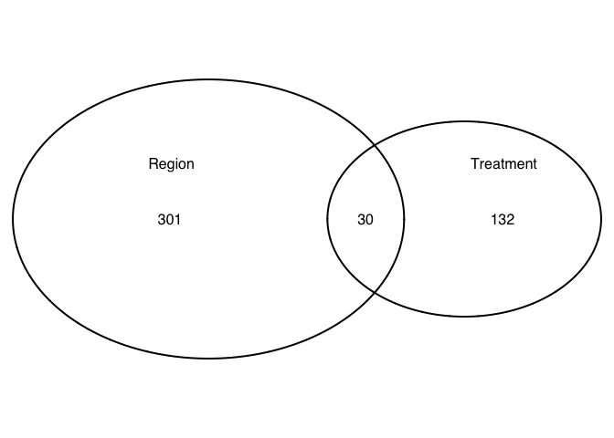
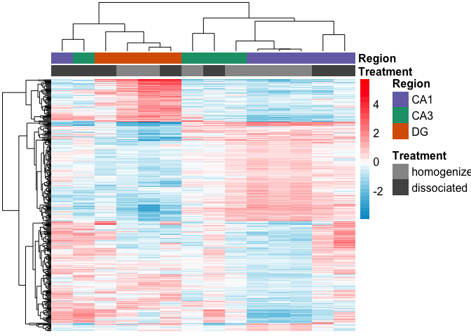
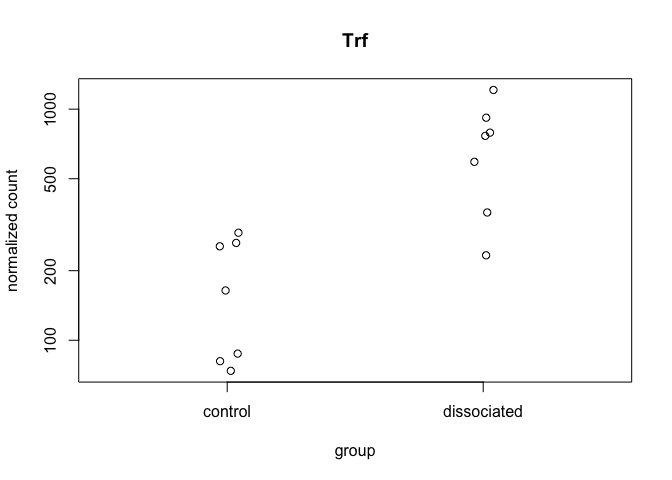
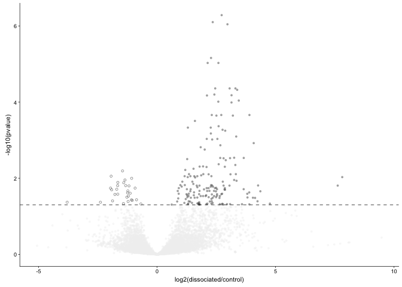
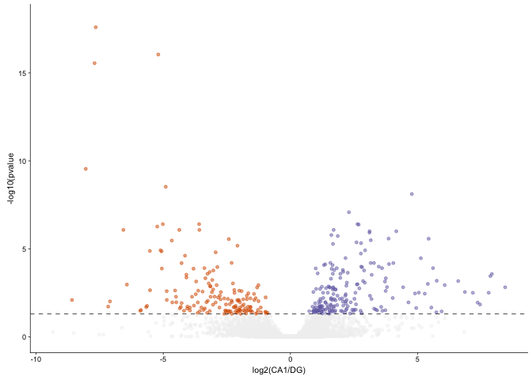
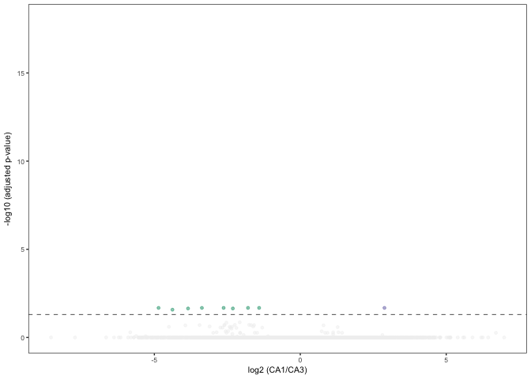
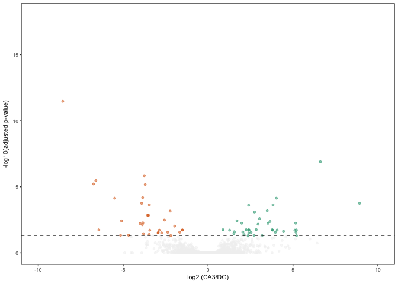
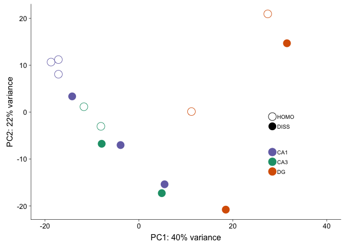
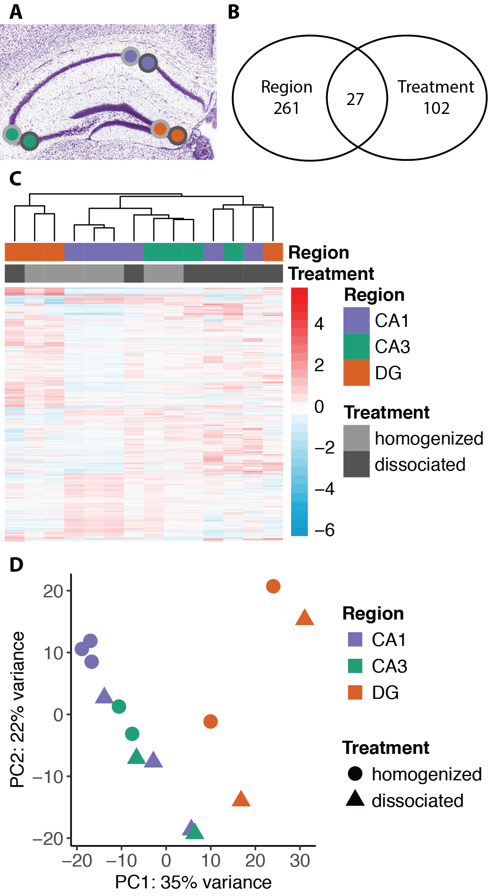

### Identifying the effects of cellular dissociation on hippocampal transcriptomes

The sample and count information for this part is found in
`../data/GSE99765_DissociationColData.csv` and
`../data/GSE99765_DissociationCountData.csv`. You can also download
these two files (with a different name but same content) from [GEO
GSE99765](https://www.ncbi.nlm.nih.gov/geo/query/acc.cgi?acc=GSE99765).

    colData <- read.csv('../data/GSE99765_DissociationColData.csv')
    rownames(colData) <- colData$RNAseqID
    countData <-  read.csv('../data/GSE99765_DissociationCountData.csv', check.names = F, row.names = 1)

Sample sizes

    colData %>% select(Treatment,Region)  %>%  summary()

    ##        Treatment Region 
    ##  control    :7   CA1:6  
    ##  dissociated:7   CA3:4  
    ##                  DG :4

    dim(countData)

    ## [1] 22485    14

    colSums( countData ) / 1e06  # in millions of gene counts

    ## 100-CA1-1 100-CA1-2 100-CA1-3 100-CA3-1 100-CA3-4  100-DG-2  100-DG-3 
    ##  2.311086  6.646655  2.277596  1.974845  2.352153  1.285654  6.086605 
    ## 101-CA1-1 101-CA1-2 101-CA1-3 101-CA3-1 101-CA3-4  101-DG-3  101-DG-4 
    ##  4.782767  0.135065  0.300812  2.498914  1.193153  0.065887  0.598775

I used DESeq2 (Love et al., 2014) for gene expression normalization and
quantification using the following experimental design:
`Treatment + Region + Treatment * Region`. Genes with less than 2 counts
across all samples were filtered, leaving us with `dim(rld)` number of
genes for analysis of differntial expression.

    dds <- DESeqDataSetFromMatrix(countData = countData,
                                  colData = colData,
                                  design = ~ Treatment + Region + Treatment * Region )
    dds <- dds[ rowSums(counts(dds)) > 2, ] ## filter genes 
    dds <- DESeq(dds) # Differential expression analysis

    ## estimating size factors

    ## estimating dispersions

    ## gene-wise dispersion estimates

    ## mean-dispersion relationship

    ## final dispersion estimates

    ## fitting model and testing

    rld <- rlog(dds, blind=FALSE) ## log transformed data
    dim(rld) #print total genes analyzed

    ## [1] 16709    14

We identified 162 genes that were differentially expressed between the
control and dissociated samples, 331 genes that were differentially
expressed genes (DEGs) between any of the three hippocampus subfields,
and 30 genes were shared between both sets of differentially expressed
genes at FDR p-value &lt; 0.05 (Fig 1B).

    ## DEG by contrasts
    source("resvalsfunction.R")
    contrast1 <- resvals(contrastvector = c('Region', 'CA1', 'DG'), mypval = 0.05)

    ## [1] 322

    contrast2 <- resvals(contrastvector = c('Region', 'CA3', 'DG'), mypval = 0.05)

    ## [1] 63

    contrast3 <- resvals(contrastvector = c('Region', 'CA1', 'CA3'), mypval = 0.05)

    ## [1] 9

    contrast4 <- resvals(contrastvector = c('Treatment', 'dissociated', 'control'), mypval = 0.05)

    ## [1] 162

    #create a new DF with the gene counts
    rldpvals <- assay(rld)
    rldpvals <- cbind(rldpvals, contrast1, contrast2, contrast3, contrast4)
    rldpvals <- as.data.frame(rldpvals)
    rldpvals <- rldpvals[ , grepl( "padj|pval" , names( rldpvals ) ) ]

    # venn with padj values
    venn1 <- row.names(rldpvals[rldpvals[2] <0.05 & !is.na(rldpvals[2]),])
    venn2 <- row.names(rldpvals[rldpvals[4] <0.05 & !is.na(rldpvals[4]),])
    venn3 <- row.names(rldpvals[rldpvals[6] <0.05 & !is.na(rldpvals[6]),])
    venn4 <- row.names(rldpvals[rldpvals[8] <0.05 & !is.na(rldpvals[8]),])
    venn12 <- union(venn1,venn2)
    venn123 <- union(venn12,venn3)

    ## check order for correctness
    candidates <- list("Region" = venn123, "Treatment" = venn4)

    prettyvenn <- venn.diagram(
      scaled=T,
      x = candidates, filename=NULL, 
      col = "black",
      fill = c( "white", "white"),
      alpha = 0.5,
      cex = 1, fontfamily = "sans", #fontface = "bold",
      cat.default.pos = "text",
      cat.dist = c(0.08, 0.08), cat.pos = 1,
      cat.cex = 1, cat.fontfamily = "sans")
    #dev.off()
    grid.draw(prettyvenn)

    # save files for metanalysis
    write(venn123, "../results/01_dissociation_venn123.txt")
    write(venn4, "../results/01_dissociation_venn4.txt")
    write(venn1, "../results/01_dissociation_venn1.txt")

A hierarchical clustering analysis of all differentially expressed genes
does not give rise to distinct clusters that are separated by subfield
or method; however, when examining the control, homogenized samples
alone (identified with light grey boxes), the three subfields form
distinct clusters, while the dissociated samples do not cluster by
subfield (Fig. 1C).

    ## Any padj <0.05
    DEGes <- assay(rld)
    DEGes <- cbind(DEGes, contrast1, contrast2, contrast3, contrast4)
    DEGes <- as.data.frame(DEGes) # convert matrix to dataframe
    DEGes$rownames <- rownames(DEGes)  # add the rownames to the dataframe

    DEGes$padjmin <- with(DEGes, pmin(padjTreatmentdissociatedcontrol, padjRegionCA1DG ,padjRegionCA3DG, padjRegionCA1CA3 )) # put the min pvalue in a new column
    DEGes <- DEGes %>% filter(padjmin < 0.05)

    rownames(DEGes) <- DEGes$rownames
    drop.cols <-colnames(DEGes[,grep("padj|pval|rownames", colnames(DEGes))])
    DEGes <- DEGes %>% select(-one_of(drop.cols))
    DEGes <- as.matrix(DEGes)
    DEGes <- DEGes - rowMeans(DEGes)

    # setting color options
    source("figureoptions.R")
    ann_colors <- ann_colorsdissociation
    colorpalette <- viridis(30)
    df <- as.data.frame(colData(dds)[,c("Treatment", "Region")])
    paletteLength <- 30
    myBreaks <- c(seq(min(DEGes), 0, length.out=ceiling(paletteLength/2) + 1), 
                  seq(max(DEGes)/paletteLength, max(DEGes), length.out=floor(paletteLength/2)))

    pheatmap(DEGes, show_colnames=F, show_rownames = F,
             annotation_col=df, annotation_colors = ann_colors,
             treeheight_row = 0, treeheight_col = 25,
             fontsize = 8, 
             width=4.5, height=2.25,
             border_color = "grey60" ,
             color = viridis(30),
             cellwidth = 8, 
             clustering_method="average",
             breaks=myBreaks,
             clustering_distance_cols="correlation" 
             )

    # for adobe
    pheatmap(DEGes, show_colnames=F, show_rownames = F,
             annotation_col=df, annotation_colors = ann_colors,
             treeheight_row = 0, treeheight_col = 25,
             annotation_row = NA, 
             annotation_legend = FALSE,
             annotation_names_row = FALSE, annotation_names_col = FALSE,
             fontsize = 6, 
             width=1.5, height=2.25,
             border_color = "grey60" ,
             color = viridis(30),
             clustering_method="average",
             breaks=myBreaks,
             clustering_distance_cols="correlation" ,
             filename = "../figures/01_dissociationtest/HeatmapPadj-1.pdf"
             )

    res <- results(dds, contrast =c('Treatment', 'dissociated', 'control'), independentFiltering = T, alpha = 0.05)
    summary(res)

    ## 
    ## out of 16709 with nonzero total read count
    ## adjusted p-value < 0.05
    ## LFC > 0 (up)     : 173, 1% 
    ## LFC < 0 (down)   : 29, 0.17% 
    ## outliers [1]     : 18, 0.11% 
    ## low counts [2]   : 4855, 29% 
    ## (mean count < 5)
    ## [1] see 'cooksCutoff' argument of ?results
    ## [2] see 'independentFiltering' argument of ?results

    resOrdered <- res[order(res$padj),]
    head(resOrdered, 10)

    ## log2 fold change (MLE): Treatment dissociated vs control 
    ## Wald test p-value: Treatment dissociated vs control 
    ## DataFrame with 10 rows and 6 columns
    ##         baseMean log2FoldChange     lfcSE      stat       pvalue
    ##        <numeric>      <numeric> <numeric> <numeric>    <numeric>
    ## Trf    434.21998       2.724762 0.4133952  6.591178 4.363497e-11
    ## Hexb   218.64390       2.348231 0.3655736  6.423415 1.332509e-10
    ## Selplg  69.25758       2.969443 0.4682601  6.341439 2.276293e-10
    ## C1qb    98.21782       2.276249 0.3810896  5.973001 2.329283e-09
    ## Csf1r  233.86842       2.133675 0.3643295  5.856444 4.728833e-09
    ## Ctss   141.76508       2.587430 0.4406802  5.871445 4.320121e-09
    ## Cnp    294.57356       2.452739 0.4439974  5.524220 3.309524e-08
    ## Il1a   126.62271       3.060191 0.5507346  5.556562 2.751396e-08
    ## Mag    236.40895       3.305349 0.5966580  5.539772 3.028665e-08
    ## Cd14    52.43968       3.379468 0.6155233  5.490398 4.010293e-08
    ##                padj
    ##           <numeric>
    ## Trf    5.164635e-07
    ## Hexb   7.885787e-07
    ## Selplg 8.980733e-07
    ## C1qb   6.892348e-06
    ## Csf1r  9.328411e-06
    ## Ctss   9.328411e-06
    ## Cnp    4.352391e-05
    ## Il1a   4.352391e-05
    ## Mag    4.352391e-05
    ## Cd14   4.746583e-05

    topGene <- rownames(res)[which.min(res$padj)]
    plotCounts(dds, gene = topGene, intgroup=c("Treatment"))

    data <- data.frame(gene = row.names(res),
                       pvalue = -log10(res$padj), 
                       lfc = res$log2FoldChange)
    data <- na.omit(data)
    data <- data %>%
      mutate(color = ifelse(data$lfc > 0 & data$pvalue > 1.3, 
                            yes = "dissociated", 
                            no = ifelse(data$lfc < 0 & data$pvalue > 1.3, 
                                        yes = "control", 
                                        no = "none")))
    top_labelled <- top_n(data, n = 5, wt = lfc)

    volcano <- ggplot(data, aes(x = lfc, y = pvalue)) + 
      geom_point(aes(color = factor(color)), size = 1, alpha = 0.5, na.rm = T) + # add gene points
      scale_color_manual(values = volcano1)  + 
      scale_x_continuous(name="log2(dissociated/control)") +
      scale_y_continuous(name="-log10(pvalue)",
                         limits=c(0, 18)) +
      theme_cowplot(font_size = 8, line_size = 0.25) +
      geom_hline(yintercept = 1.3,  size = 0.25, linetype = 2 )+ 
      theme(panel.grid.minor=element_blank(),
            legend.position = "none", # remove legend 
            panel.grid.major=element_blank())
    volcano

    pdf(file="../figures/01_dissociationtest/volcano1.pdf", width=1.25, height=2)
    plot(volcano)
    dev.off()

    ## quartz_off_screen 
    ##                 2

    res <- results(dds, contrast =c("Region", "CA1", "DG"), independentFiltering = T, alpha = 0.05)
    resOrdered <- res[order(res$padj),]
    head(resOrdered, 10)

    ## log2 fold change (MLE): Region CA1 vs DG 
    ## Wald test p-value: Region CA1 vs DG 
    ## DataFrame with 10 rows and 6 columns
    ##          baseMean log2FoldChange     lfcSE      stat       pvalue
    ##         <numeric>      <numeric> <numeric> <numeric>    <numeric>
    ## C1ql2   130.70538      -7.653838 0.7860552 -9.737024 2.096033e-22
    ## Stxbp6  143.43881      -5.193969 0.5589022 -9.293163 1.497702e-20
    ## Crlf1    40.19316      -7.699695 0.8435166 -9.128090 6.971829e-20
    ## Plk5     53.24886      -8.045965 1.0802654 -7.448137 9.466720e-14
    ## Prox1    93.13040      -4.901599 0.6901466 -7.102257 1.227354e-12
    ## Ccdc88c  92.64575       4.773056 0.6873962  6.943676 3.820273e-12
    ## Nos1ap  156.50060       2.300369 0.3498181  6.575900 4.835978e-11
    ## Ccnd1    99.39163       2.637440 0.4192302  6.291149 3.151256e-10
    ## Fam163b 203.60466      -3.589888 0.5711846 -6.284988 3.278796e-10
    ## Sema5a  155.08557      -5.015113 0.7936817 -6.318797 2.636077e-10
    ##                 padj
    ##            <numeric>
    ## C1ql2   2.548147e-18
    ## Stxbp6  9.103783e-17
    ## Crlf1   2.825218e-16
    ## Plk5    2.877173e-10
    ## Prox1   2.984189e-09
    ## Ccdc88c 7.740509e-09
    ## Nos1ap  8.398712e-08
    ## Ccnd1   3.986033e-07
    ## Fam163b 3.986033e-07
    ## Sema5a  3.986033e-07

    data <- data.frame(gene = row.names(res), pvalue = -log10(res$padj), lfc = res$log2FoldChange)
    data <- na.omit(data)
    data <- data %>%
      mutate(color = ifelse(data$lfc > 0 & data$pvalue > 1.3, 
                            yes = "CA1", 
                            no = ifelse(data$lfc < 0 & data$pvalue > 1.3, 
                                        yes = "DG", 
                                        no = "none")))
    top_labelled <- top_n(data, n = 5, wt = lfc)

    # Color corresponds to fold change directionality
    volcano2 <- ggplot(data, aes(x = lfc, y = pvalue)) + 
      geom_point(aes(color = factor(color)), size = 1, alpha = 0.5, na.rm = T) + # add gene points
      scale_color_manual(values = c("CA1" = "#7570b3",
                                    "DG" = "#d95f02", 
                                    "none" = "#f0f0f0")) + 
      theme_cowplot(font_size = 8, line_size = 0.25) +
      geom_hline(yintercept = 1.3, size = 0.25, linetype = 2) + 
      scale_y_continuous(name="-log10(pvalue",
                         limits=c(0, 18)) +
      scale_x_continuous(name="log2(CA1/DG)") +
      theme(panel.grid.minor=element_blank(),
            legend.position = "none", 
            panel.grid.major=element_blank())
    volcano2

    pdf(file="../figures/01_dissociationtest/volcano2.pdf", width=1.5, height=2)
    plot(volcano2)
    dev.off()

    ## quartz_off_screen 
    ##                 2

    res <- results(dds, contrast =c("Region", "CA1", "CA3"), independentFiltering = T, alpha = 0.05)
    resOrdered <- res[order(res$padj),]
    head(resOrdered, 10)

    ## log2 fold change (MLE): Region CA1 vs CA3 
    ## Wald test p-value: Region CA1 vs CA3 
    ## DataFrame with 10 rows and 6 columns
    ##           baseMean log2FoldChange     lfcSE      stat       pvalue
    ##          <numeric>      <numeric> <numeric> <numeric>    <numeric>
    ## Gad1     281.80697      -1.410620 0.3087856 -4.568282 4.917382e-06
    ## Lct       80.20339       2.884136 0.6204258  4.648640 3.341303e-06
    ## Mobp     816.51918      -2.627074 0.5839294 -4.498958 6.828740e-06
    ## Plekhb1  260.50715      -1.791454 0.4001326 -4.477151 7.564582e-06
    ## Smoc2     30.28090      -4.856213 1.0840429 -4.479724 7.473965e-06
    ## Tenm3    137.10477      -3.371426 0.7501897 -4.494098 6.986535e-06
    ## Crlf1     40.19316      -3.845687 0.8736303 -4.401962 1.072763e-05
    ## Mbp     2041.80193      -2.310398 0.5252025 -4.399062 1.087200e-05
    ## Amigo2    23.82136      -4.381118 1.0099077 -4.338137 1.436954e-05
    ## Bcas1    163.89714      -2.075036 0.5270223 -3.937283 8.240929e-05
    ##               padj
    ##          <numeric>
    ## Gad1    0.02104341
    ## Lct     0.02104341
    ## Mobp    0.02104341
    ## Plekhb1 0.02104341
    ## Smoc2   0.02104341
    ## Tenm3   0.02104341
    ## Crlf1   0.02268307
    ## Mbp     0.02268307
    ## Amigo2  0.02664911
    ## Bcas1   0.13754935

    data <- data.frame(gene = row.names(res), pvalue = -log10(res$padj), lfc = res$log2FoldChange)
    data <- na.omit(data)
    head(data)

    ##            gene pvalue          lfc
    ## 1 0610007P14Rik      0 -0.555764051
    ## 2 0610009B22Rik      0 -0.004179956
    ## 3 0610009L18Rik      0 -0.760543990
    ## 4 0610009O20Rik      0 -0.533419317
    ## 5 0610010F05Rik      0  0.124978039
    ## 6 0610010K14Rik      0 -0.056511180

    data <- data %>%
      mutate(color = ifelse(data$lfc > 0 & data$pvalue > 1.3, 
                            yes = "CA1", 
                            no = ifelse(data$lfc < 0 & data$pvalue > 1.3, 
                                        yes = "CA3", 
                                        no = "none")))
    top_labelled <- top_n(data, n = 5, wt = lfc)
    volcano <- ggplot(data, aes(x = lfc, y = pvalue)) + 
      geom_point(aes(color = factor(color)), size = 1, alpha = 0.5, na.rm = T) + # add gene points
      theme_bw(base_size = 8) + # clean up theme
      theme(legend.position = "none") + # remove legend 
      scale_color_manual(values = c("CA1" = "#7570b3",
                                    "CA3" = "#1b9e77", 
                                    "none" = "#f0f0f0")) + theme(panel.grid.minor=element_blank(),
               panel.grid.major=element_blank()) + 
      scale_x_continuous(name="log2 (CA1/CA3)") +
      scale_y_continuous(name="-log10 (adjusted p-value)",
                         limits = c(0,18))  +
      geom_hline(yintercept = 1.3,  size = 0.25, linetype = 2 ) 
    volcano

    pdf(file="../figures/01_dissociationtest/volcano3.pdf", width=1.5, height=1.75)
    plot(volcano)
    dev.off()

    ## quartz_off_screen 
    ##                 2

    res <- results(dds, contrast =c("Region", "CA3", "DG"), independentFiltering = T, alpha = 0.05)
    resOrdered <- res[order(res$padj),]
    head(resOrdered, 10)

    ## log2 fold change (MLE): Region CA3 vs DG 
    ## Wald test p-value: Region CA3 vs DG 
    ## DataFrame with 10 rows and 6 columns
    ##          baseMean log2FoldChange     lfcSE      stat       pvalue
    ##         <numeric>      <numeric> <numeric> <numeric>    <numeric>
    ## C1ql2   130.70538      -8.556298 1.0488491 -8.157797 3.411899e-16
    ## Col11a1  57.12622       6.612699 0.9911457  6.671773 2.527316e-11
    ## Stxbp6  143.43881      -3.753045 0.6012542 -6.242026 4.319379e-10
    ## Grm2     56.50904      -6.610298 1.0913020 -6.057258 1.384612e-09
    ## Plk5     53.24886      -6.743455 1.1378217 -5.926637 3.092022e-09
    ## Fam163b 203.60466      -3.701336 0.6296758 -5.878161 4.148490e-09
    ## Crlf1    40.19316      -3.854008 0.7054970 -5.462827 4.686106e-08
    ## Ccdc88c  92.64575       4.024901 0.7453491  5.400022 6.663280e-08
    ## Npnt     23.60067      -5.500271 1.0164731 -5.411133 6.262733e-08
    ## Crhbp    25.06650       8.919975 1.7152614  5.200359 1.989040e-07
    ##                 padj
    ##            <numeric>
    ## C1ql2   3.375391e-12
    ## Col11a1 1.250137e-07
    ## Stxbp6  1.424387e-06
    ## Grm2    3.424491e-06
    ## Plk5    6.117875e-06
    ## Fam163b 6.840168e-06
    ## Crlf1   6.622806e-05
    ## Ccdc88c 7.324426e-05
    ## Npnt    7.324426e-05
    ## Crhbp   1.788871e-04

    data <- data.frame(gene = row.names(res), pvalue = -log10(res$padj), lfc = res$log2FoldChange)
    data <- na.omit(data)
    head(data)

    ##            gene      pvalue         lfc
    ## 1 0610007P14Rik 5.98986e-05  0.02392547
    ## 2 0610009B22Rik 5.98986e-05 -0.35516195
    ## 4 0610009O20Rik 5.98986e-05  0.10943293
    ## 5 0610010F05Rik 5.98986e-05 -0.09481060
    ## 6 0610010K14Rik 5.98986e-05 -0.40446410
    ## 7 0610012G03Rik 5.98986e-05  0.11239148

    data <- data %>%
      mutate(color = ifelse(data$lfc > 0 & data$pvalue > 1.3, 
                            yes = "CA3", 
                            no = ifelse(data$lfc < 0 & data$pvalue > 1.3, 
                                        yes = "DG", 
                                        no = "none")))
    top_labelled <- top_n(data, n = 5, wt = lfc)
    volcano4 <- ggplot(data, aes(x = lfc, y = pvalue)) + 
      geom_point(aes(color = factor(color)), size = 1, alpha = 0.5, na.rm = T) + # add gene points
      theme_bw(base_size = 8) + # clean up theme
      theme(legend.position = "none") + # remove legend 
      scale_color_manual(values = c("CA3" = "#1b9e77",
                                    "DG" = "#d95f02", 
                                    "none" = "#f0f0f0")) + theme(panel.grid.minor=element_blank(),
               panel.grid.major=element_blank()) + 
      scale_x_continuous(name="log2 (CA3/DG)",
                         limits=c(-10, 10)) +
      scale_y_continuous(name="-log10(adjusted p-value)",
                         limits= c(0,18))  +
      geom_hline(yintercept = 1.3,  size = 0.25, linetype = 2 ) 
    volcano4

    pdf(file="../figures/01_dissociationtest/volcano4.pdf", width=1.5, height=1.75)
    plot(volcano4)
    dev.off()

    ## quartz_off_screen 
    ##                 2

This PCA gives an overview of the variability between samples using the
a large matrix of log transformed gene expression data. You can see that
the biggest difference is between DG punches and the CA1 and CA3
punches. CA1 and CA3 samples have similar transcriptomes. The control
CA1 samples have the most similar transcriptonal profiles as evidenced
by their tight clustering.

    source("DESeqPCAfunction.R")
    source("figureoptions.R")

    # create the dataframe using my function pcadataframe
    pcadata <- pcadataframe(rld, intgroup=c("Region", "Treatment"), returnData=TRUE)
    percentVar <- round(100 * attr(pcadata, "percentVar"))

    ## for markdown
    plotPC2PC1(aescolor = pcadata$Region, colorname = "Region", colorvalues = colorvalRegion, aesshape = pcadata$Treatment, shapename = "Treatment")

    # for adobe
    myplot <- plotPC1PC2(aescolor = pcadata$Region, colorname = "Region", aesshape = pcadata$Treatment, shapename = "Treatment", colorvalues = colorvalRegion)
    pdf(file="../figures/01_dissociationtest/PCA-1.pdf", width=4.5, height=3)
    plot(myplot)
    dev.off()

    ## quartz_off_screen 
    ##                 2

    ## statistics
    aov1 <- aov(PC1 ~ Region, data=pcadata)
    summary(aov1) 

    ##             Df Sum Sq Mean Sq F value   Pr(>F)    
    ## Region       2 2812.7  1406.4   17.69 0.000365 ***
    ## Residuals   11  874.3    79.5                     
    ## ---
    ## Signif. codes:  0 '***' 0.001 '**' 0.01 '*' 0.05 '.' 0.1 ' ' 1

    TukeyHSD(aov1, which = "Region") 

    ##   Tukey multiple comparisons of means
    ##     95% family-wise confidence level
    ## 
    ## Fit: aov(formula = PC1 ~ Region, data = pcadata)
    ## 
    ## $Region
    ##              diff       lwr      upr     p adj
    ## CA3-CA1  5.223942 -10.31899 20.76687 0.6467956
    ## DG-CA1  33.098083  17.55515 48.64101 0.0003454
    ## DG-CA3  27.874142  10.84772 44.90057 0.0027013

    aov2 <- aov(PC2 ~ Region, data=pcadata)
    summary(aov2) 

    ##             Df Sum Sq Mean Sq F value Pr(>F)
    ## Region       2  243.8   121.9   0.744  0.498
    ## Residuals   11 1801.4   163.8

    TukeyHSD(aov2, which = "Region") 

    ##   Tukey multiple comparisons of means
    ##     95% family-wise confidence level
    ## 
    ## Fit: aov(formula = PC2 ~ Region, data = pcadata)
    ## 
    ## $Region
    ##              diff       lwr      upr     p adj
    ## CA3-CA1 -8.297717 -30.60810 14.01267 0.5893113
    ## DG-CA1   1.924204 -20.38618 24.23459 0.9706097
    ## DG-CA3  10.221920 -14.21788 34.66172 0.5166917

    aov3 <- aov(PC1 ~ Treatment, data=pcadata)
    summary(aov3) 

    ##             Df Sum Sq Mean Sq F value Pr(>F)
    ## Treatment    1    335   335.2     1.2  0.295
    ## Residuals   12   3352   279.3

    TukeyHSD(aov3, which = "Treatment")

    ##   Tukey multiple comparisons of means
    ##     95% family-wise confidence level
    ## 
    ## Fit: aov(formula = PC1 ~ Treatment, data = pcadata)
    ## 
    ## $Treatment
    ##                         diff       lwr      upr     p adj
    ## dissociated-control 9.785654 -9.678654 29.24996 0.2948417

    aov4 <- aov(PC2 ~ Treatment, data=pcadata)
    summary(aov4) 

    ##             Df Sum Sq Mean Sq F value Pr(>F)  
    ## Treatment    1  691.1   691.1   6.125 0.0292 *
    ## Residuals   12 1354.1   112.8                 
    ## ---
    ## Signif. codes:  0 '***' 0.001 '**' 0.01 '*' 0.05 '.' 0.1 ' ' 1

    TukeyHSD(aov4, which = "Treatment") 

    ##   Tukey multiple comparisons of means
    ##     95% family-wise confidence level
    ## 
    ## Fit: aov(formula = PC2 ~ Treatment, data = pcadata)
    ## 
    ## $Treatment
    ##                          diff       lwr       upr     p adj
    ## dissociated-control -14.05242 -26.42372 -1.681116 0.0292306

Next, save files for dowstream GO analysis.

    # from https://github.com/rachelwright8/Ahya-White-Syndromes/blob/master/deseq2_Ahya.R

    resCD=results(dds, contrast=c('Treatment', 'dissociated', 'control'), independentFiltering = F)
    table(resCD$padj<0.05)

    ## 
    ## FALSE  TRUE 
    ## 16529   162

    logs <- data.frame(cbind("gene"=row.names(resCD),"logP"=round(-log(resCD$pvalue+1e-10,10),1)))
    logs$logP=as.numeric(as.character(logs$logP))
    sign <- rep(1,nrow(logs))
    sign[resCD$log2FoldChange<0]=-1  ##change to correct model
    table(sign)

    ## sign
    ##   -1    1 
    ## 6989 9720

    logs$logP <- logs$logP*sign

    write.csv(logs, file = "./06_GO_MWU/01_dissociation_GOpvals.csv", row.names = F)

To view a histogram of the p-value distibution for each constrast,
change the Rmd file to `include=TRUE` for this chunck.

Here is the corresponding Adobe Illustrator file that combines many of
the above plots.

