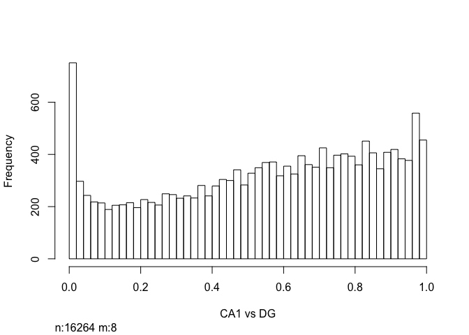
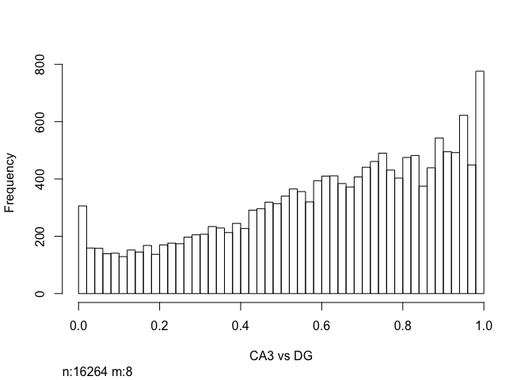
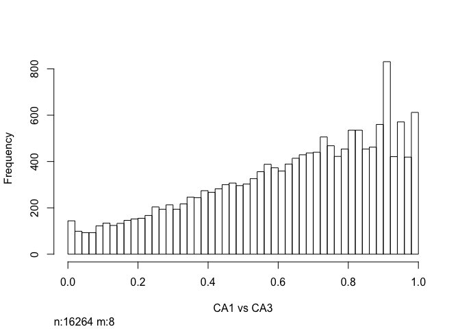
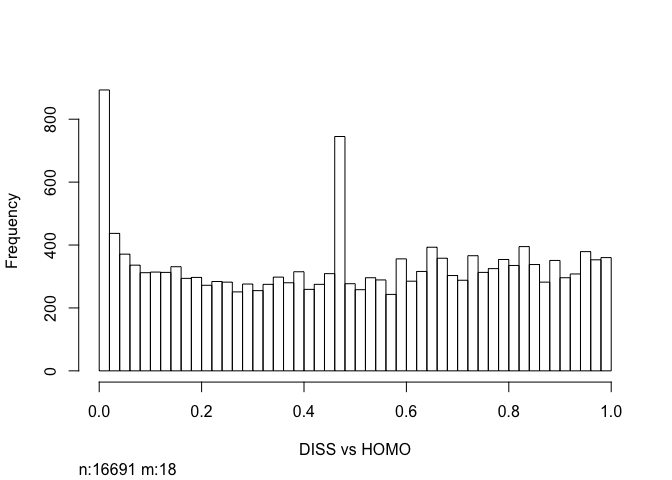

Cellular Stress
---------------

In this analysis, I examine the effect that cell dissasociation has on
CA1, CA3, and DG gene expression relative to homogenized tissue samples.

Here is a brief overview of the samples being compared.

    str(colData)

    ## 'data.frame':    14 obs. of  14 variables:
    ##  $ RNAseqID : Factor w/ 14 levels "100-CA1-1","100-CA1-2",..: 1 2 3 4 5 6 7 8 9 10 ...
    ##  $ Mouse    : Factor w/ 1 level "15-100": 1 1 1 1 1 1 1 1 1 1 ...
    ##  $ year     : int  2015 2015 2015 2015 2015 2015 2015 2015 2015 2015 ...
    ##  $ Genotype : Factor w/ 1 level "WT": 1 1 1 1 1 1 1 1 1 1 ...
    ##  $ jobnumber: Factor w/ 1 level "JA16444": 1 1 1 1 1 1 1 1 1 1 ...
    ##  $ Region   : Factor w/ 3 levels "CA1","CA3","DG": 1 1 1 2 2 3 3 1 1 1 ...
    ##  $ Group    : Factor w/ 1 level "homecage": 1 1 1 1 1 1 1 1 1 1 ...
    ##  $ Conflict : Factor w/ 0 levels: NA NA NA NA NA NA NA NA NA NA ...
    ##  $ APA      : Factor w/ 0 levels: NA NA NA NA NA NA NA NA NA NA ...
    ##  $ Treatment: Factor w/ 2 levels "homogenized",..: 1 1 1 1 1 1 1 2 2 2 ...
    ##  $ dodgy    : Factor w/ 1 level "allgood": 1 1 1 1 1 1 1 1 1 1 ...
    ##  $ daytime  : Factor w/ 1 level "norecord": 1 1 1 1 1 1 1 1 1 1 ...
    ##  $ Slice    : int  1 2 3 1 4 2 3 1 2 3 ...
    ##  $ Date     : Factor w/ 1 level "9/28/15": 1 1 1 1 1 1 1 1 1 1 ...

    summary(colData)

    ##       RNAseqID    Mouse         year      Genotype   jobnumber  Region 
    ##  100-CA1-1:1   15-100:14   Min.   :2015   WT:14    JA16444:14   CA1:6  
    ##  100-CA1-2:1               1st Qu.:2015                         CA3:4  
    ##  100-CA1-3:1               Median :2015                         DG :4  
    ##  100-CA3-1:1               Mean   :2015                                
    ##  100-CA3-4:1               3rd Qu.:2015                                
    ##  100-DG-2 :1               Max.   :2015                                
    ##  (Other)  :8                                                           
    ##       Group    Conflict    APA           Treatment     dodgy   
    ##  homecage:14   NA's:14   NA's:14   homogenized:7   allgood:14  
    ##                                    dissociated:7               
    ##                                                                
    ##                                                                
    ##                                                                
    ##                                                                
    ##                                                                
    ##      daytime       Slice            Date   
    ##  norecord:14   Min.   :1.000   9/28/15:14  
    ##                1st Qu.:1.250               
    ##                Median :2.500               
    ##                Mean   :2.429               
    ##                3rd Qu.:3.000               
    ##                Max.   :4.000               
    ## 

This PCA gives an overview of the variability between samples using the
a large matrix of log transformed gene expression data. You can see that
the bigges difference is between DG punches and the CA1 and CA3 punches.
CA1 and CA3 samples have similar transcriptomes. The homogenized CA1
samples have the most similar transcriptonal profiles as evidenced by
their tight clustering.

Now, we can calulate the number of significant genes by contrast by
contrast. The first number displayed is not corrected for mutiple
hypothesis testing but the second one is.

    ## DEG by contrasts
    source("resvalsfunction.R")
    contrast1 <- resvals(contrastvector = c('Region', 'CA1', 'DG'), mypval = 0.1)

    ## [1] 1723
    ## [1] 281

    contrast2 <- resvals(contrastvector = c('Region', 'CA3', 'DG'), mypval = 0.1)

    ## [1] 903
    ## [1] 46

    contrast3 <- resvals(contrastvector = c('Region', 'CA1', 'CA3'), mypval = 0.1)

    ## [1] 551
    ## [1] 5

    contrast4 <- resvals(contrastvector = c('Treatment', 'dissociated', 'homogenized'), mypval = 0.1)

    ## [1] 1662
    ## [1] 129

Now, we can view a histogram of the distribution

    ## [1] 1

    ## [1] 1

    ## [1] 1

    ## [1] 1

This Venn Diagram sthe overlap of differentailly expression genes by
Region and Treatment. This shows all genes with *adjusted* pvalue
&lt;0.1.

heatmaps
========

This is a data validation check plot. Here, I'm showing how many
millions of reads were present in each sample. On average, each sample
had 5 million reads, but the range was from 0.8 to 10 millino reads.

    FALSE [1] 22485    14

    FALSE 100-CA1-1 100-CA1-2 100-CA1-3 100-CA3-1 100-CA3-4  100-DG-2  100-DG-3 
    FALSE  1.136597  3.311998  1.114747  0.966391  1.205348  0.658410  3.055740 
    FALSE 101-CA1-1 101-CA1-2 101-CA1-3 101-CA3-1 101-CA3-4  101-DG-3  101-DG-4 
    FALSE  2.668415  0.072040  0.154427  1.361076  0.639942  0.036498  0.300618

    FALSE 
    FALSE    0    1    2    3    4    5    6    7    8    9   10   11   12   13   14 
    FALSE 5353  455  405  314  258  226  229  158  160  147  149  131  110  121  116 
    FALSE   15   16   17   18   19   20   21   22   23   24   25   26   27   28   29 
    FALSE   96   91   81   84   80   82   82   73   67   68   68   62   56   60   68

Save files for GO analysis. A total of 217 DEGs with unadjusted p-value
&lt; 0.1 were input into the GO anlaysis.

    FALSE 
    FALSE FALSE  TRUE 
    FALSE  6918   200

    FALSE 
    FALSE FALSE  TRUE 
    FALSE 15218  1046

    FALSE log2 fold change (MLE): Treatment dissociated vs homogenized 
    FALSE Wald test p-value: Treatment dissociated vs homogenized 
    FALSE DataFrame with 6 rows and 6 columns
    FALSE                baseMean log2FoldChange     lfcSE       stat    pvalue
    FALSE               <numeric>      <numeric> <numeric>  <numeric> <numeric>
    FALSE 0610007P14Rik 15.805028     -0.5408900 0.8772671 -0.6165625 0.5375233
    FALSE 0610009B22Rik  6.854308      0.1461694 1.0755847  0.1358976 0.8919022
    FALSE 0610009L18Rik  7.047180     -0.3817767 1.2364033 -0.3087801 0.7574888
    FALSE 0610009O20Rik 42.475899      0.2636886 0.4481426  0.5884033 0.5562616
    FALSE 0610010F05Rik  4.934166     -0.4205911 0.8731170 -0.4817122 0.6300104
    FALSE 0610010K14Rik  1.034686      0.4361484 1.8194582  0.2397134 0.8105525
    FALSE                    padj
    FALSE               <numeric>
    FALSE 0610007P14Rik 0.9146795
    FALSE 0610009B22Rik        NA
    FALSE 0610009L18Rik        NA
    FALSE 0610009O20Rik 0.9228152
    FALSE 0610010F05Rik        NA
    FALSE 0610010K14Rik        NA

    FALSE sign
    FALSE   -1    1 
    FALSE 6631 9641
