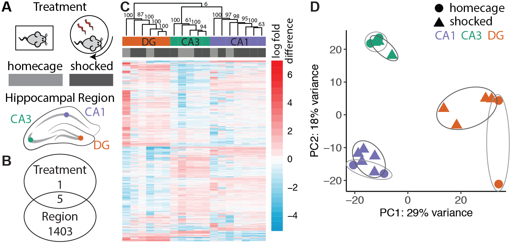

## Identifying the effects of habituation to a stressor on hippocampal transcriptomes

We examined the expression patterns of 16,229 genes. We identified 0 genes that were significantly expressed between homecage and shocked samples; 1669 genes that were were differentially expressed between any of the three brain regions at PDF p-value < 0.05 (Fig. 3B). 

```{r setup, message=FALSE, warning=FALSE}
#source("http://www.bioconductor.org/biocLite.R")
library(DESeq2)
library(VennDiagram)
library(genefilter)
library(pheatmap)
library(cowplot)
library(RColorBrewer)
library(dplyr)
library(plyr)
library(ggplot2)
library(edgeR)
library(pvclust)
library(knitr) 

# set output file for figures 
knitr::opts_chunk$set(fig.path = '../figures/02_stresstest/')

# user defined funcitons and options
source("resvalsfunction.R") 
source("DESeqPCAfunction.R")
source("figureoptions.R")
```

The sample and count information for this part is found in `../data/GSE100225_IntegrativeWT2015ColData.csv` and `../data/GSE100225_IntegrativeWT2015CountData.csv`. You can also download these two files (with a different name but same content) from [GEO GSE100225 ](https://www.ncbi.nlm.nih.gov/geo/query/acc.cgi?acc=GSE100225). 

```{r ImportData, message=FALSE, warning=FALSE}
colData <- read.csv('../data/GSE100225_IntegrativeWT2015ColData.csv')
rownames(colData) <- colData$RNAseqID
countData <-  read.csv('../data/GSE100225_IntegrativeWT2015CountData.csv', check.names = F)
```

```{r subset}
colData <- colData %>%
  filter(Treatment %in% c("homecage", "shocked")) %>% droplevels()

savecols <- as.character(colData$RNAseqID) #selects all good samples
savecols <- as.vector(savecols) # make it a vector
countData <- countData %>% select(one_of(savecols)) # keep good samples

## rename and relevel things
colData$Treatment <- factor(colData$Treatment, levels = c("homecage", "shocked"))
```

Here is a brief overview of the samples being compared.

```{r viewcoldata, echo=FALSE,message=FALSE, warning=FALSE}
colData %>% select(Treatment,Region)  %>%  summary()
```

18 Samples, 22485 genes.

```{r viewscountData}
dim(countData)
```

```{r edgeR}
counts <- countData
dim( counts )
colSums( counts ) / 1e06  # in millions of gene counts
table( rowSums( counts ) )[ 1:30 ] # Number of genes with low counts
```


```{r DifferentialGeneExpressionAnalysis}
dds <- DESeqDataSetFromMatrix(countData = countData,
                              colData = colData,
                              design = ~ Treatment + Region + Treatment * Region )
dds <- dds[ rowSums(counts(dds)) > 2, ] ## filter genes with 0 counts
dds <- DESeq(dds) # Differential expression analysis
rld <- rlog(dds, blind=FALSE) # log transformed
dim(rld) #print total genes analyzed
```


```{r signficiantgenes, message=FALSE, warning=FALSE}
## DEG by contrasts
source("resvalsfunction.R")
contrast1 <- resvals(contrastvector = c('Region', 'CA1', 'DG'), mypval = 0.05)
contrast2 <- resvals(contrastvector = c('Region', 'CA3', 'DG'), mypval = 0.05)
contrast3 <- resvals(contrastvector = c('Region', 'CA1', 'CA3'), mypval = 0.05)
contrast4 <- resvals(contrastvector = c('Treatment', 'shocked', 'homecage'), mypval = 0.05)
```


We examined the expression patterns of 16,229 genes. We identified 0 genes that were significantly expressed between homecage and shocked samples; 1669 genes that were were differentially expressed between any of the three brain regions at PDF p-value < 0.05 (Fig. 3B). 

```{r VennDiagramPadj, message=FALSE, warning=FALSE}
#create a new DF with the gene counts
rldpvals <- assay(rld)
rldpvals <- cbind(rldpvals, contrast1, contrast2, contrast3, contrast4)
rldpvals <- as.data.frame(rldpvals)
rldpvals <- rldpvals[ , grepl( "padj|pval" , names( rldpvals ) ) ]


# venn with padj values
venn1 <- row.names(rldpvals[rldpvals[2] <0.05 & !is.na(rldpvals[2]),])
venn2 <- row.names(rldpvals[rldpvals[4] <0.05 & !is.na(rldpvals[4]),])
venn3 <- row.names(rldpvals[rldpvals[6] <0.05 & !is.na(rldpvals[6]),])
venn4 <- row.names(rldpvals[rldpvals[8] <0.05 & !is.na(rldpvals[8]),])
venn12 <- union(venn1,venn2)
venn123 <- union(venn12,venn3)

# save files for big venn diagram
write(venn123, "../results/02_stress_venn123.txt")
write(venn4, "../results/02_stress_venn4.txt")


## check order for correctness
candidates <- list("Region" = venn123, "Method" = venn4)

prettyvenn <- venn.diagram(
  scaled=T,
  x = candidates, filename=NULL, 
  col = "black",
  fill = c( "white", "white"),
  alpha = 0.5,
  cex = 1, fontfamily = "sans", #fontface = "bold",
  cat.default.pos = "text",
  cat.dist = c(0.07, 0.07), cat.pos = 1,
  cat.cex = 1, cat.fontfamily = "sans")
#dev.off()
grid.draw(prettyvenn)
```

Supplementary histogram of  p-value distributions 

```{r histogram}
source("resvalsfunction.R")
myhistogram(contrastvector = c('Region', 'CA1', 'DG'), mypval = 0.05)
myhistogram(contrastvector = c('Region', 'CA3', 'DG'), mypval = 0.05)
myhistogram(contrastvector = c('Region', 'CA1', 'CA3'), mypval = 0.05)
myhistogram(contrastvector = c('Treatment', 'shocked', 'homecage'), mypval = 0.05)

```

Hierarchical clustering of the differentially expressed genes gives rise to three distinct clusters corresponding to the three subfields, with CA1 (purple) and CA3 (green) being more similar to one another than to DG (orange) (Fig. 3C). 


```{r HeatmapPadj, message=FALSE, warning=FALSE}
## Any padj <0.05
DEGes <- assay(rld)
DEGes <- cbind(DEGes, contrast1, contrast2, contrast3, contrast4)
DEGes <- as.data.frame(DEGes) # convert matrix to dataframe
DEGes$rownames <- rownames(DEGes)  # add the rownames to the dataframe

DEGes$padjmin <- with(DEGes, pmin(padjTreatmentshockedhomecage, padjRegionCA1DG ,padjRegionCA3DG, padjRegionCA1CA3 )) # put the min pvalue in a new column
DEGes <- DEGes %>% filter(padjmin < 0.05)

rownames(DEGes) <- DEGes$rownames
drop.cols <-colnames(DEGes[,grep("padj|pval|rownames", colnames(DEGes))])
DEGes <- DEGes %>% select(-one_of(drop.cols))
DEGes <- as.matrix(DEGes)
DEGes <- DEGes - rowMeans(DEGes)

# setting color options
source("figureoptions.R")
ann_colors <- ann_colorsstress
colorpalette <- cembrowskicolors
df <- as.data.frame(colData(dds)[,c("Treatment", "Region")])
df$Treatment <- factor(df$Treatment, levels = c("homecage", "shocked"))

paletteLength <- 30
myBreaks <- c(seq(min(DEGes), 0, length.out=ceiling(paletteLength/2) + 1), 
              seq(max(DEGes)/paletteLength, max(DEGes), length.out=floor(paletteLength/2)))

pheatmap(DEGes, show_colnames=T, show_rownames = F,
         annotation_col=df, annotation_colors = ann_colors,
         treeheight_row = 0, treeheight_col = 25,
         fontsize = 8, 
         #width=4.5, height=3,
         border_color = "grey60" ,
         color = colorpalette,
         #cellwidth = 12, 
         #main = "Any Padj < 0.05",
         clustering_method="average",
         breaks=myBreaks,
         clustering_distance_cols="correlation" 
         )

# for adobe
pheatmap(DEGes, show_colnames=F, show_rownames = F,
         annotation_col=df, annotation_colors = ann_colors,
         treeheight_row = 0, treeheight_col = 25,
         fontsize = 8, 
         width=4.5, height=3,
         border_color = "grey60" ,
         color = colorpalette,
         cellwidth = 7, 
         filename = "../figures/02_stresstest/HeatmapPadj-1.pdf",
         clustering_method="average",
         breaks=myBreaks,
         clustering_distance_cols="correlation" 
         )
```


```{r pvclust, include=FALSE}
# clustering just the degs
result <- pvclust(DEGes, method.dist="cor", method.hclust="average", nboot=1000)
plot(result)
```


Next, we conducted a principal component analysis of all genes measured. PC1 accounts for 31% of the variation and visually separates the DG samples from the CA1 and CA3 samples ANOVA (PC1 ~ Region, F2,15= 42.89; p < 0.001) (Fig. 3D). A post hoc Tukey test showed that DG samples are significantly different from both CA1 and CA3 samples (CA1-DG, p < 0.001; CA3-DG, p < 0.001; CA1-CA3, p = 0.83). PC2 accounts for 18% of the variation and varies significantly between CA1 and CA3 and CA1 and DG (PC2 ~ Region, ANOVA, F2, 15= 11.41; p < 0.001; Tukey test, CA1-DG, p = 0.03; CA3-DG, p = 0.18; CA1-CA3, p < 0.001). PC2 accounts for 15% of the variation and also explains some brain region specific differences (PC3 ~ Region, ANOVA, F2, 15= 6.315; p < 0.01; Tukey test, CA1-DG, p = 0.95; CA3-DG, p = 0.03; CA1-CA3, p = 0.01). PC7 is the lowest PC to explain any variance associated with treatment (PC6 ~ Region, ANOVA, F1, 16= 4.774; p = 0.04


```{r PCA, message=FALSE, warning=FALSE}
source("DESeqPCAfunction.R")
source("figureoptions.R")

# create the dataframe using my function pcadataframe
pcadata <- pcadataframe(rld, intgroup=c("Treatment", "Region"), returnData=TRUE)
percentVar <- round(100 * attr(pcadata, "percentVar"))

pcadata$Treatment <- factor(pcadata$Treatment, levels = c("homecage", "shocked"))

## plot a bunch of pca plots using my ggplot functions DESeqPCAfunction.R, with the color defined infigureoptions.R
plotPC2PC1(aescolor = pcadata$Region, colorname = "Region", aesshape = pcadata$Treatment, shapename = "Treatment", colorvalues = colorvalRegion)

plotPC2PC3(aescolor = pcadata$Region, colorname = "Region", aesshape = pcadata$Treatment, shapename = "Treatment", colorvalues = colorvalRegion)

# for adobe
myplot <- plotPC1PC2(aescolor = pcadata$Region, colorname = "Region", aesshape = pcadata$Treatment, shapename = "Treatment", colorvalues = colorvalRegion)
pdf(file="../figures/../figures/02_stresstest/PCA-1.pdf", width=4.5, height=3)
plot(myplot)
dev.off()


## statistics
aov1R <- aov(PC1 ~ Region, data=pcadata)
summary(aov1R) 
TukeyHSD(aov1R, which = "Region") 

aov2R <- aov(PC2 ~ Region, data=pcadata)
summary(aov2R) 
TukeyHSD(aov2R, which = "Region") 

aov3R <- aov(PC3 ~ Region, data=pcadata)
summary(aov3R) 
TukeyHSD(aov3R, which = "Region") 

aov4R <- aov(PC3 ~ Region, data=pcadata)
summary(aov4R) 
TukeyHSD(aov4R, which = "Region") 

aov5R <- aov(PC5 ~ Region, data=pcadata)
summary(aov5R) 
TukeyHSD(aov5R, which = "Region") 

aov6R <- aov(PC6 ~ Region, data=pcadata)
summary(aov6R) 
TukeyHSD(aov6R, which = "Region") 


aov1T <- aov(PC1 ~ Treatment, data=pcadata)
summary(aov1T) 

aov2T <- aov(PC2 ~ Treatment, data=pcadata)
summary(aov2T) 

aov3T <- aov(PC3 ~ Treatment, data=pcadata)
summary(aov3T) 
 
aov4T <- aov(PC4 ~ Treatment, data=pcadata)
summary(aov4T) 

aov5T <- aov(PC5 ~ Treatment, data=pcadata)
summary(aov5T) 
 
aov6T <- aov(PC6 ~ Treatment, data=pcadata)
summary(aov6T) 


lm1 <- lm(PC1~Region*Treatment, data=pcadata)
summary(lm1)
anova(lm1) 

lm2 <- lm(PC2~Region*Treatment, data=pcadata)
summary(lm2)
anova(lm2)
```

Next, save files for dowstream GO analysis.

```{r GOsetup, message=FALSE, warning=FALSE}
# from https://github.com/rachelwright8/Ahya-White-Syndromes/blob/master/deseq2_Ahya.R

res <- results(dds, contrast=c('Treatment', 'shocked', 'homecage'), independentFiltering = F)
table(res$padj<0.05)
logs <- data.frame(cbind("gene"=row.names(res),"logP"=round(-log(res$pvalue+1e-10,10),1)))
logs$logP <- as.numeric(as.character(logs$logP))
sign <- rep(1,nrow(logs))
sign[res$log2FoldChange<0]=-1  ##change to correct model
table(sign)
logs$logP <- logs$logP*sign

write.csv(logs, file = "./06_GO_MWU/02_stress_GOpvals.csv", row.names = F)

```

Supplementary behavior file about timesheries of shocks.
```{r numshocks, include=FALSE}
## now, to show how many shocks each animal received.
unavoidableshock <- read.csv("../data/unavoidableshock.csv", header = T)

unavoidableshock %>% 
  ggplot(aes(x=TrainSessionCombo.x, y=NumShock.y)) + 
  geom_point(position = position_jitter(width = 0.2)) + 
  #geom_point()+ 
  theme_bw() + 
  scale_x_discrete(labels=c("T1" = "1", "T2" = "2",
                            "T3" = "3", "T4_C1" = "4",
                            "T5_C2" = "5", "T6_C3" = "6")) + 
  labs(list(x = "Day", y = "Number of Shocks")) +
  theme(axis.title.x = element_text(size=12),
        axis.title.y = element_text(size=12),
        axis.text.x = element_text(size = 11),
        axis.text.y = element_text(size = 11))
```

Here is the corresponding Adobe Illustrator file that combines many of the above plots. 

