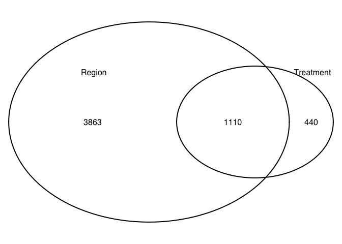
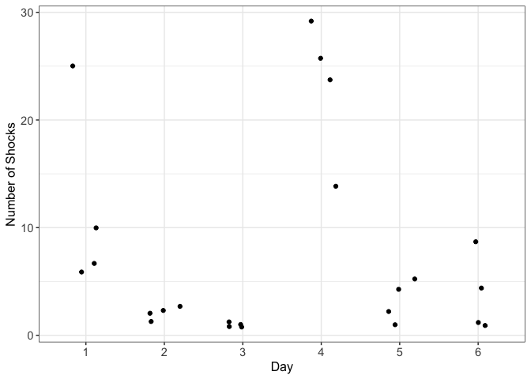

Behavioral Stress
-----------------

In this analysis, I examine the effect that behavioral stress has on
CA1, CA3, and DG gene expression relative to homogenized tissue samples.

Subset to just look homogenized and dissociated samples
-------------------------------------------------------

    colData <- colData %>%
      filter(Mouse != "15-100") %>% droplevels()
    savecols <- as.character(colData$RNAseqID) #selects all good samples
    savecols <- as.vector(savecols) # make it a vector
    countData <- countData %>% select(one_of(savecols)) # keep good samples

    ## rename and relevel things
    colData <- rename(colData, c("Group"="Treatment"))
    colData$Treatment <- plyr::revalue(colData$Treatment, c("control"="shocked"))
    colData$Treatment <- factor(colData$Treatment, levels = c("homecage", "shocked"))

This PCA gives an overview of the variability between samples using the
a large matrix of log transformed gene expression data. You can see that
the bigges difference is between DG punches and the CA1 and CA3 punches.
CA1 and CA3 samples have similar transcriptomes. The homogenized CA1
samples have the most similar transcriptonal profiles as evidenced by
their tight clustering.

    ## DEG by contrasts
    source("resvalsfunction.R")
    contrast1 <- resvals(contrastvector = c('Region', 'CA1', 'DG'), mypval = 0.1)

    ## [1] 2674
    ## [1] 674

    contrast2 <- resvals(contrastvector = c('Region', 'CA3', 'DG'), mypval = 0.1)

    ## [1] 2849
    ## [1] 871

    contrast3 <- resvals(contrastvector = c('Region', 'CA1', 'CA3'), mypval = 0.1)

    ## [1] 2510
    ## [1] 384

    contrast4 <- resvals(contrastvector = c('Treatment', 'shocked', 'homecage'), mypval = 0.1)

    ## [1] 1550
    ## [1] 6

Now, we can view a histogram of the distribution

    ## [1] 1

    ## [1] 1

    ## [1] 1

    ## [1] 1

This Venn Diagram sthe overlap of differentailly expression genes by
Region and method. This shows all genes with *uncorrected* pvalue
&lt;0.1.

This Venn Diagram sthe overlap of differentailly expression genes by
Region and method. This shows all genes with *adjusted* pvalue &lt;0.1.

    FALSE [1] 22485    18

    FALSE 143B-CA1-1  143B-DG-1 144B-CA1-1 144B-CA3-1 145B-CA1-1  145B-DG-1 
    FALSE   0.874614   1.019113   1.275137   0.506698   1.034066   0.720798 
    FALSE 146B-CA1-2 146B-CA3-2  146B-DG-2  147-CA1-4  147-CA3-4   147-DG-4 
    FALSE   0.506014   1.056001   0.055549   0.080721   0.344588   0.069648 
    FALSE  148-CA1-2  148-CA3-2   148-DG-2 148B-CA1-4 148B-CA3-4  148B-DG-4 
    FALSE   0.938866   1.148136   1.067185   0.185637   1.724144   0.398258

    FALSE 
    FALSE    0    1    2    3    4    5    6    7    8    9   10   11   12   13   14 
    FALSE 5881  459  423  280  261  209  190  159  178  156  136  141  139  107  104 
    FALSE   15   16   17   18   19   20   21   22   23   24   25   26   27   28   29 
    FALSE   95   91   94   81   79   84   69   83   81   68   80   77   58   49   46

    FALSE 
    FALSE FALSE  TRUE 
    FALSE  9295    18

    FALSE 
    FALSE FALSE  TRUE 
    FALSE 14851   862

    FALSE log2 fold change (MLE): Treatment shocked vs homecage 
    FALSE Wald test p-value: Treatment shocked vs homecage 
    FALSE DataFrame with 6 rows and 6 columns
    FALSE                baseMean log2FoldChange     lfcSE       stat    pvalue
    FALSE               <numeric>      <numeric> <numeric>  <numeric> <numeric>
    FALSE 0610007P14Rik 12.542367      0.1356020  0.897367  0.1511110 0.8798882
    FALSE 0610009B22Rik  6.112886      0.4614292  1.226013  0.3763657 0.7066451
    FALSE 0610009L18Rik  1.423716     -1.2901378  2.187262 -0.5898416 0.5552969
    FALSE 0610009O20Rik 24.090980      1.3885828  0.962880  1.4421141 0.1492702
    FALSE 0610010F05Rik  5.411247     -1.0611824  1.108837 -0.9570231 0.3385556
    FALSE 0610010K14Rik  1.218209      1.4258700  1.908507  0.7471129 0.4549954
    FALSE                    padj
    FALSE               <numeric>
    FALSE 0610007P14Rik 0.9979476
    FALSE 0610009B22Rik 0.9905416
    FALSE 0610009L18Rik        NA
    FALSE 0610009O20Rik 0.7973706
    FALSE 0610010F05Rik 0.9317371
    FALSE 0610010K14Rik        NA

    FALSE sign
    FALSE   -1    1 
    FALSE 7250 8472

summary stats
=============

