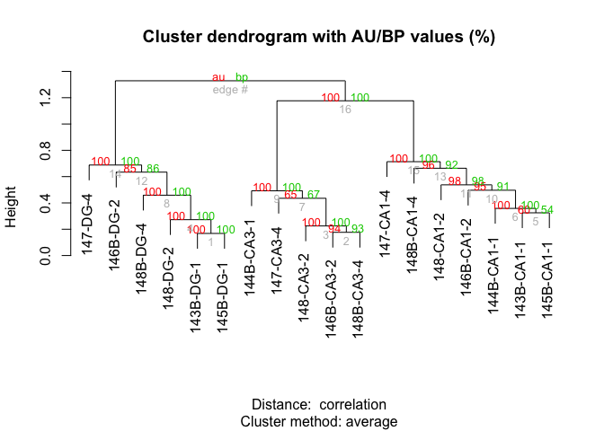

Behavioral Stress
-----------------

In this analysis, I examine the effect that behavioral stress has on
CA1, CA3, and DG gene expression relative to homogenized tissue samples.

    #source("http://www.bioconductor.org/biocLite.R")
    #biocLite("DESeq2")
    library(DESeq2)
    library(magrittr)
    library(tidyverse)
    library(reshape2)
    library(VennDiagram)
    library(genefilter)
    library(pheatmap)
    library(cowplot)
    library(RColorBrewer)
    library(ggcorrplot)
    library(dplyr)
    library(plyr)
    library(ggplot2)
    library(colorRamps)

    # set output file for figures 
    knitr::opts_chunk$set(fig.path = '../figures/02_stresstest/')

    # this starts with data genearated from code described in KallistoGather.Rmd
    colData <- read.csv('../data/DissociationColData.csv')
    rownames(colData) <- colData$RNAseqID
    countData <-  read.csv('../data/DissociationCountData.csv', check.names = F, row.names = 1)

Subset to just look homogenized and dissociated samples
-------------------------------------------------------

    colData <- colData %>%
      filter(Mouse != "15-100") %>% droplevels()
    savecols <- as.character(colData$RNAseqID) #selects all good samples
    savecols <- as.vector(savecols) # make it a vector
    countData <- countData %>% select(one_of(savecols)) # keep good samples

    ## rename and relevel things
    colData <- rename(colData, c("Group"="Treatment"))
    colData$Treatment <- plyr::revalue(colData$Treatment, c("control"="shocked"))
    colData$Treatment <- factor(colData$Treatment, levels = c("homecage", "shocked"))

    ##     Treatment  Region 
    ##  homecage: 6   CA1:7  
    ##  shocked :12   CA3:5  
    ##                DG :6

    dds <- DESeqDataSetFromMatrix(countData = countData,
                                  colData = colData,
                                  design = ~ Treatment + Region + Treatment * Region )
    dds <- dds[ rowSums(counts(dds)) > 2, ] ## filter genes with 0 counts
    dds <- DESeq(dds) # Differential expression analysis
    dds

    ## class: DESeqDataSet 
    ## dim: 16229 18 
    ## metadata(1): version
    ## assays(3): counts mu cooks
    ## rownames(16229): 0610007P14Rik 0610009B22Rik ... Zzef1 Zzz3
    ## rowData names(37): baseMean baseVar ... deviance maxCooks
    ## colnames(18): 143B-CA1-1 143B-DG-1 ... 148B-CA3-4 148B-DG-4
    ## colData names(15): RNAseqID Mouse ... Date sizeFactor

    ## for variance stablized gene expression and log transformed data
    rld <- rlog(dds, blind=FALSE)
    vsd <- getVarianceStabilizedData(dds)

This PCA gives an overview of the variability between samples using the
a large matrix of log transformed gene expression data. You can see that
the bigges difference is between DG punches and the CA1 and CA3 punches.
CA1 and CA3 samples have similar transcriptomes. The homogenized CA1
samples have the most similar transcriptonal profiles as evidenced by
their tight clustering.

    source("DESeqPCAfunction.R")
    source("figureoptions.R")

    # create the dataframe using my function pcadataframe
    pcadata <- pcadataframe(rld, intgroup=c("Treatment", "Region"), returnData=TRUE)
    percentVar <- round(100 * attr(pcadata, "percentVar"))

    pcadata$Treatment <- factor(pcadata$Treatment, levels = c("homecage", "shocked"))

    ## plot a bunch of pca plots using my ggplot functions DESeqPCAfunction.R, with the color defined infigureoptions.R
    plotPC1PC2(aescolor = pcadata$Region, colorname = "Region", aesshape = pcadata$Treatment, shapename = "Treatment", colorvalues = colorvalRegion)

    plotPC2PC3(aescolor = pcadata$Region, colorname = "Region", aesshape = pcadata$Treatment, shapename = "Treatment", colorvalues = colorvalRegion)

    # for adobe
    myplot <- plotPC2PC1(aescolor = pcadata$Region, colorname = "Region", aesshape = pcadata$Treatment, shapename = "Treatment", colorvalues = colorvalRegion)
    pdf(file="../figures/../figures/02_stresstest/PCA-1.pdf", width=4.5, height=3)
    plot(myplot)
    dev.off()

    ## quartz_off_screen 
    ##                 2

    ## statistics
    aov1 <- aov(PC1 ~ Region, data=pcadata)
    summary(aov1) 

    ##             Df Sum Sq Mean Sq F value   Pr(>F)    
    ## Region       2   7334    3667   42.89 6.24e-07 ***
    ## Residuals   15   1282      85                     
    ## ---
    ## Signif. codes:  0 '***' 0.001 '**' 0.01 '*' 0.05 '.' 0.1 ' ' 1

    TukeyHSD(aov1, which = "Region") 

    ##   Tukey multiple comparisons of means
    ##     95% family-wise confidence level
    ## 
    ## Fit: aov(formula = PC1 ~ Region, data = pcadata)
    ## 
    ## $Region
    ##              diff       lwr      upr     p adj
    ## CA3-CA1  3.127434 -10.93525 17.19012 0.8339245
    ## DG-CA1  44.037806  30.67620 57.39941 0.0000011
    ## DG-CA3  40.910372  26.36759 55.45315 0.0000073

    aov2 <- aov(PC2 ~ Region, data=pcadata)
    summary(aov2) 

    ##             Df Sum Sq Mean Sq F value   Pr(>F)    
    ## Region       2   2976  1487.9   11.41 0.000971 ***
    ## Residuals   15   1955   130.4                     
    ## ---
    ## Signif. codes:  0 '***' 0.001 '**' 0.01 '*' 0.05 '.' 0.1 ' ' 1

    TukeyHSD(aov2, which = "Region") 

    ##   Tukey multiple comparisons of means
    ##     95% family-wise confidence level
    ## 
    ## Fit: aov(formula = PC2 ~ Region, data = pcadata)
    ## 
    ## $Region
    ##              diff        lwr       upr     p adj
    ## CA3-CA1  31.34187  13.976505 48.707233 0.0008014
    ## DG-CA1   18.32018   1.820548 34.819817 0.0288392
    ## DG-CA3  -13.02169 -30.979895  4.936522 0.1776538

    aov5 <- aov(PC3 ~ Region, data=pcadata)
    summary(aov5) 

    ##             Df Sum Sq Mean Sq F value Pr(>F)  
    ## Region       2   1928   963.8   6.315 0.0102 *
    ## Residuals   15   2289   152.6                 
    ## ---
    ## Signif. codes:  0 '***' 0.001 '**' 0.01 '*' 0.05 '.' 0.1 ' ' 1

    TukeyHSD(aov5, which = "Region") 

    ##   Tukey multiple comparisons of means
    ##     95% family-wise confidence level
    ## 
    ## Fit: aov(formula = PC3 ~ Region, data = pcadata)
    ## 
    ## $Region
    ##               diff       lwr       upr     p adj
    ## CA3-CA1 -23.912642 -42.70222 -5.123068 0.0125516
    ## DG-CA1   -1.905862 -19.75870 15.946981 0.9586161
    ## DG-CA3   22.006780   2.57574 41.437821 0.0257680

    aov3 <- aov(PC1 ~ Treatment, data=pcadata)
    summary(aov3) 

    ##             Df Sum Sq Mean Sq F value Pr(>F)
    ## Treatment    1    142   142.1   0.268  0.612
    ## Residuals   16   8474   529.6

    TukeyHSD(aov3, which = "Treatment")

    ##   Tukey multiple comparisons of means
    ##     95% family-wise confidence level
    ## 
    ## Fit: aov(formula = PC1 ~ Treatment, data = pcadata)
    ## 
    ## $Treatment
    ##                       diff       lwr      upr     p adj
    ## shocked-homecage -5.959766 -30.35285 18.43332 0.6115881

    aov4 <- aov(PC2 ~ Treatment, data=pcadata)
    summary(aov4) 

    ##             Df Sum Sq Mean Sq F value Pr(>F)
    ## Treatment    1     53   52.73   0.173  0.683
    ## Residuals   16   4879  304.91

    TukeyHSD(aov4, which = "Treatment") 

    ##   Tukey multiple comparisons of means
    ##     95% family-wise confidence level
    ## 
    ## Fit: aov(formula = PC2 ~ Treatment, data = pcadata)
    ## 
    ## $Treatment
    ##                      diff       lwr      upr     p adj
    ## shocked-homecage 3.630848 -14.87759 22.13929 0.6830314

    aov6 <- aov(PC3 ~ Treatment, data=pcadata)
    summary(aov6) 

    ##             Df Sum Sq Mean Sq F value Pr(>F)
    ## Treatment    1    339   339.4     1.4  0.254
    ## Residuals   16   3877   242.3

    TukeyHSD(aov6, which = "Treatment") 

    ##   Tukey multiple comparisons of means
    ##     95% family-wise confidence level
    ## 
    ## Fit: aov(formula = PC3 ~ Treatment, data = pcadata)
    ## 
    ## $Treatment
    ##                      diff       lwr      upr     p adj
    ## shocked-homecage 9.211197 -7.289415 25.71181 0.2539351

    aov7 <- aov(PC4 ~ Treatment, data=pcadata)
    summary(aov7) 

    ##             Df Sum Sq Mean Sq F value Pr(>F)
    ## Treatment    1  172.9   172.9   1.435  0.248
    ## Residuals   16 1927.7   120.5

    TukeyHSD(aov7, which = "Treatment") 

    ##   Tukey multiple comparisons of means
    ##     95% family-wise confidence level
    ## 
    ## Fit: aov(formula = PC4 ~ Treatment, data = pcadata)
    ## 
    ## $Treatment
    ##                      diff       lwr      upr     p adj
    ## shocked-homecage 6.575095 -5.059432 18.20962 0.2483494

    lm1 <- lm(PC1~Region*Treatment, data=pcadata)
    summary(lm1)

    ## 
    ## Call:
    ## lm(formula = PC1 ~ Region * Treatment, data = pcadata)
    ## 
    ## Residuals:
    ##      Min       1Q   Median       3Q      Max 
    ## -14.6047  -2.6399  -0.3964   3.2833  14.6047 
    ## 
    ## Coefficients:
    ##                            Estimate Std. Error t value Pr(>|t|)    
    ## (Intercept)                -15.1706     5.4511  -2.783   0.0166 *  
    ## RegionCA3                    0.2547     7.7090   0.033   0.9742    
    ## RegionDG                    57.1767     7.7090   7.417 8.09e-06 ***
    ## Treatmentshocked            -0.5283     6.4498  -0.082   0.9361    
    ## RegionCA3:Treatmentshocked   4.6873     9.5459   0.491   0.6323    
    ## RegionDG:Treatmentshocked  -19.7460     9.2829  -2.127   0.0548 .  
    ## ---
    ## Signif. codes:  0 '***' 0.001 '**' 0.01 '*' 0.05 '.' 0.1 ' ' 1
    ## 
    ## Residual standard error: 7.709 on 12 degrees of freedom
    ## Multiple R-squared:  0.9172, Adjusted R-squared:  0.8827 
    ## F-statistic:  26.6 on 5 and 12 DF,  p-value: 4.223e-06

    anova(lm1) 

    ## Analysis of Variance Table
    ## 
    ## Response: PC1
    ##                  Df Sum Sq Mean Sq F value    Pr(>F)    
    ## Region            2 7333.5  3666.8 61.7000 4.846e-07 ***
    ## Treatment         1  131.2   131.2  2.2072   0.16316    
    ## Region:Treatment  2  438.1   219.0  3.6855   0.05652 .  
    ## Residuals        12  713.1    59.4                      
    ## ---
    ## Signif. codes:  0 '***' 0.001 '**' 0.01 '*' 0.05 '.' 0.1 ' ' 1

    lm2 <- lm(PC2~Region*Treatment, data=pcadata)
    summary(lm2)

    ## 
    ## Call:
    ## lm(formula = PC2 ~ Region * Treatment, data = pcadata)
    ## 
    ## Residuals:
    ##      Min       1Q   Median       3Q      Max 
    ## -26.3267  -1.3168   0.2702   1.4777  26.3267 
    ## 
    ## Coefficients:
    ##                            Estimate Std. Error t value Pr(>|t|)   
    ## (Intercept)                 -16.942      8.011  -2.115  0.05606 . 
    ## RegionCA3                    34.630     11.330   3.057  0.00996 **
    ## RegionDG                      8.933     11.330   0.788  0.44573   
    ## Treatmentshocked              2.980      9.479   0.314  0.75860   
    ## RegionCA3:Treatmentshocked   -4.913     14.030  -0.350  0.73227   
    ## RegionDG:Treatmentshocked    14.293     13.643   1.048  0.31543   
    ## ---
    ## Signif. codes:  0 '***' 0.001 '**' 0.01 '*' 0.05 '.' 0.1 ' ' 1
    ## 
    ## Residual standard error: 11.33 on 12 degrees of freedom
    ## Multiple R-squared:  0.6876, Adjusted R-squared:  0.5575 
    ## F-statistic: 5.283 on 5 and 12 DF,  p-value: 0.008546

    anova(lm2)

    ## Analysis of Variance Table
    ## 
    ## Response: PC2
    ##                  Df  Sum Sq Mean Sq F value   Pr(>F)   
    ## Region            2 2975.79 1487.90 11.5909 0.001575 **
    ## Treatment         1  157.38  157.38  1.2260 0.289883   
    ## Region:Treatment  2  257.64  128.82  1.0035 0.395373   
    ## Residuals        12 1540.42  128.37                    
    ## ---
    ## Signif. codes:  0 '***' 0.001 '**' 0.01 '*' 0.05 '.' 0.1 ' ' 1

    ## DEG by contrasts
    source("resvalsfunction.R")
    contrast1 <- resvals(contrastvector = c('Region', 'CA1', 'DG'), mypval = 0.1)

    ## [1] 3602
    ## [1] 1329

    contrast2 <- resvals(contrastvector = c('Region', 'CA3', 'DG'), mypval = 0.1)

    ## [1] 3556
    ## [1] 1442

    contrast3 <- resvals(contrastvector = c('Region', 'CA1', 'CA3'), mypval = 0.1)

    ## [1] 3151
    ## [1] 581

    contrast4 <- resvals(contrastvector = c('Treatment', 'shocked', 'homecage'), mypval = 0.1)

    ## [1] 2187
    ## [1] 13

Now, we can view a histogram of the distribution

    source("resvalsfunction.R")
    myhistogram(contrastvector = c('Region', 'CA1', 'DG'), mypval = 0.1)

    ## [1] 1

    myhistogram(contrastvector = c('Region', 'CA3', 'DG'), mypval = 0.1)

    ## [1] 1

    myhistogram(contrastvector = c('Region', 'CA1', 'CA3'), mypval = 0.1)

    ## [1] 1

    myhistogram(contrastvector = c('Treatment', 'shocked', 'homecage'), mypval = 0.1)

    ## [1] 1

This Venn Diagram sthe overlap of differentailly expression genes by
Region and method. This shows all genes with *adjusted* pvalue &lt;0.1.

    #create a new DF with the gene counts
    rldpvals <- assay(rld)
    rldpvals <- cbind(rldpvals, contrast1, contrast2, contrast3, contrast4)
    rldpvals <- as.data.frame(rldpvals)
    rldpvals <- rldpvals[ , grepl( "padj|pval" , names( rldpvals ) ) ]

    # venn with padj values
    venn1 <- row.names(rldpvals[rldpvals[2] <0.1 & !is.na(rldpvals[2]),])
    venn2 <- row.names(rldpvals[rldpvals[4] <0.1 & !is.na(rldpvals[4]),])
    venn3 <- row.names(rldpvals[rldpvals[6] <0.1 & !is.na(rldpvals[6]),])
    venn4 <- row.names(rldpvals[rldpvals[8] <0.1 & !is.na(rldpvals[8]),])
    venn12 <- union(venn1,venn2)
    venn123 <- union(venn12,venn3)

    # save files for big venn diagram
    write(venn123, "../results/02_stress_venn123.txt")
    write(venn4, "../results/02_stress_venn4.txt")

    ## check order for correctness
    candidates <- list("Region" = venn123, "Method" = venn4)

    prettyvenn <- venn.diagram(
      scaled=T,
      x = candidates, filename=NULL, 
      col = "black",
      fill = c( "white", "white"),
      alpha = 0.5,
      cex = 1, fontfamily = "sans", #fontface = "bold",
      cat.default.pos = "text",
      cat.dist = c(0.07, 0.07), cat.pos = 1,
      cat.cex = 1, cat.fontfamily = "sans")
    #dev.off()
    grid.draw(prettyvenn)

    ## Any padj <0.1
    DEGes <- assay(rld)
    DEGes <- cbind(DEGes, contrast1, contrast2, contrast3, contrast4)
    DEGes <- as.data.frame(DEGes) # convert matrix to dataframe
    DEGes$rownames <- rownames(DEGes)  # add the rownames to the dataframe

    DEGes$padjmin <- with(DEGes, pmin(padjTreatmentshockedhomecage, padjRegionCA1DG ,padjRegionCA3DG, padjRegionCA1CA3 )) # put the min pvalue in a new column
    DEGes <- DEGes %>% filter(padjmin < 0.1)

    rownames(DEGes) <- DEGes$rownames
    drop.cols <-colnames(DEGes[,grep("padj|pval|rownames", colnames(DEGes))])
    DEGes <- DEGes %>% select(-one_of(drop.cols))
    DEGes <- as.matrix(DEGes)
    DEGes <- DEGes - rowMeans(DEGes)

    # setting color options
    source("figureoptions.R")
    ann_colors <- ann_colorsstress
    colorpalette <- cembrowskicolors
    df <- as.data.frame(colData(dds)[,c("Treatment", "Region")])
    df$Treatment <- factor(df$Treatment, levels = c("homecage", "shocked"))

    paletteLength <- 30
    myBreaks <- c(seq(min(DEGes), 0, length.out=ceiling(paletteLength/2) + 1), 
                  seq(max(DEGes)/paletteLength, max(DEGes), length.out=floor(paletteLength/2)))

    pheatmap(DEGes, show_colnames=T, show_rownames = F,
             annotation_col=df, annotation_colors = ann_colors,
             treeheight_row = 0, treeheight_col = 25,
             fontsize = 8, 
             #width=4.5, height=3,
             border_color = "grey60" ,
             color = colorpalette,
             #cellwidth = 12, 
             #main = "Any Padj < 0.1",
             clustering_method="average",
             breaks=myBreaks,
             clustering_distance_cols="correlation" 
             )

    # for adobe
    pheatmap(DEGes, show_colnames=F, show_rownames = F,
             annotation_col=df, annotation_colors = ann_colors,
             treeheight_row = 0, treeheight_col = 25,
             fontsize = 8, 
             width=4.5, height=3,
             border_color = "grey60" ,
             color = colorpalette,
             cellwidth = 7, 
             filename = "../figures/02_stresstest/HeatmapPadj-1.pdf",
             clustering_method="average",
             breaks=myBreaks,
             clustering_distance_cols="correlation" 
             )

    library(edgeR)
    counts <- countData
    dim( counts )

    ## [1] 22485    18

    colSums( counts ) / 1e06  # in millions of gene counts

    ## 143B-CA1-1  143B-DG-1 144B-CA1-1 144B-CA3-1 145B-CA1-1  145B-DG-1 
    ##   1.719498   2.085031   2.555909   1.027388   2.020114   1.509310 
    ## 146B-CA1-2 146B-CA3-2  146B-DG-2  147-CA1-4  147-CA3-4   147-DG-4 
    ##   1.063417   2.144771   0.116106   0.159069   0.689232   0.139276 
    ##  148-CA1-2  148-CA3-2   148-DG-2 148B-CA1-4 148B-CA3-4  148B-DG-4 
    ##   1.901256   2.343035   2.231849   0.337174   3.486840   0.798668

    table( rowSums( counts ) )[ 1:30 ] # Number of genes with low counts

    ## 
    ##    0    1    2    3    4    5    6    7    8    9   10   11   12   13   14 
    ## 5664  331  261  236  209  167  130  147  132  123  115  125   85   69   92 
    ##   15   16   17   18   19   20   21   22   23   24   25   26   27   28   29 
    ##   95   79   65   67   65   64   71   77   60   54   57   52   48   40   46

    # from https://github.com/rachelwright8/Ahya-White-Syndromes/blob/master/deseq2_Ahya.R

    res <- results(dds, contrast=c('Treatment', 'shocked', 'homecage'))
    table(res$padj<0.1)

    ## 
    ## FALSE  TRUE 
    ## 10836    36

    table(res$pvalue<0.05)

    ## 
    ## FALSE  TRUE 
    ## 14907  1313

    head(res)

    ## log2 fold change (MLE): Treatment shocked vs homecage 
    ## Wald test p-value: Treatment shocked vs homecage 
    ## DataFrame with 6 rows and 6 columns
    ##                baseMean log2FoldChange     lfcSE       stat     pvalue
    ##               <numeric>      <numeric> <numeric>  <numeric>  <numeric>
    ## 0610007P14Rik 25.404705      0.1667337 0.8205675  0.2031932 0.83898404
    ## 0610009B22Rik 14.797684      0.1263942 1.1373629  0.1111291 0.91151394
    ## 0610009L18Rik  1.389306     -1.2578953 2.6894975 -0.4677064 0.63999454
    ## 0610009O20Rik 23.481387      1.3802472 0.9860902  1.3997170 0.16159808
    ## 0610010F05Rik 44.199071     -1.0474863 0.8785164 -1.1923355 0.23312972
    ## 0610010K14Rik 10.326020      3.2022196 1.3598647  2.3548075 0.01853231
    ##                    padj
    ##               <numeric>
    ## 0610007P14Rik 0.9701979
    ## 0610009B22Rik 0.9840751
    ## 0610009L18Rik        NA
    ## 0610009O20Rik 0.6490190
    ## 0610010F05Rik 0.7217512
    ## 0610010K14Rik 0.3184006

    logs <- data.frame(cbind("gene"=row.names(res),"logP"=round(-log(res$pvalue+1e-10,10),1)))
    logs$logP <- as.numeric(as.character(logs$logP))
    sign <- rep(1,nrow(logs))
    sign[res$log2FoldChange<0]=-1  ##change to correct model
    table(sign)

    ## sign
    ##   -1    1 
    ## 7045 9184

    logs$logP <- logs$logP*sign

    write.csv(logs, file = "./06_GO_MWU/02_stress_GOpvals.csv", row.names = F)

summary stats
=============

    ## now, to show how many shocks each animal received.
    unavoidableshock <- read.csv("../data/unavoidableshock.csv", header = T)

    unavoidableshock %>% 
      ggplot(aes(x=TrainSessionCombo.x, y=NumShock.y)) + 
      geom_point(position = position_jitter(width = 0.2)) + 
      #geom_point()+ 
      theme_bw() + 
      scale_x_discrete(labels=c("T1" = "1", "T2" = "2",
                                "T3" = "3", "T4_C1" = "4",
                                "T5_C2" = "5", "T6_C3" = "6")) + 
      labs(list(x = "Day", y = "Number of Shocks")) +
      theme(axis.title.x = element_text(size=12),
            axis.title.y = element_text(size=12),
            axis.text.x = element_text(size = 11),
            axis.text.y = element_text(size = 11))

    library(pvclust)
    # clustering just the degs
    result <- pvclust(DEGes, method.dist="cor", method.hclust="average", nboot=1000)

    ## Bootstrap (r = 0.5)... Done.
    ## Bootstrap (r = 0.6)... Done.
    ## Bootstrap (r = 0.7)... Done.
    ## Bootstrap (r = 0.8)... Done.
    ## Bootstrap (r = 0.9)... Done.
    ## Bootstrap (r = 1.0)... Done.
    ## Bootstrap (r = 1.1)... Done.
    ## Bootstrap (r = 1.2)... Done.
    ## Bootstrap (r = 1.3)... Done.
    ## Bootstrap (r = 1.4)... Done.

    plot(result)

