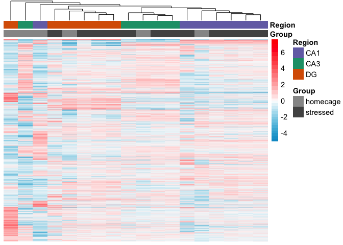
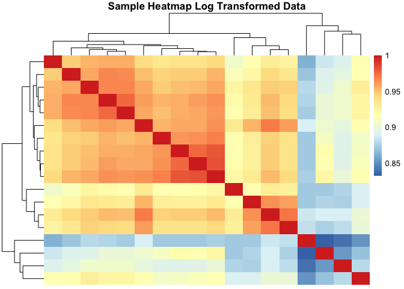
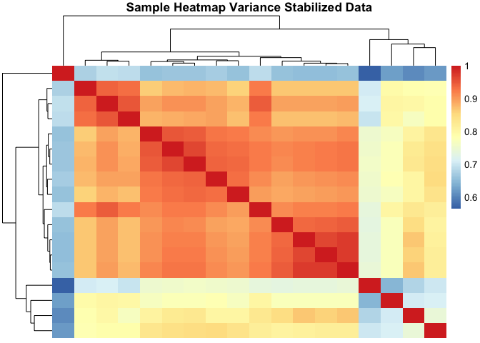

Behavioral Stress
-----------------

In this analysis, I examine the effect that behavioral stress has on
CA1, CA3, and DG gene expression relative to homogenized tissue samples.

Subset to just look homogenized and dissociated samples
-------------------------------------------------------

    colData <- colData %>%
      filter(Method != "dissociated") %>% droplevels()
    colData$Group <- plyr::revalue(colData$Group, c("control"="stressed"))
    colData$Group <- factor(colData$Group, levels = c("homecage", "stressed"))
    savecols <- as.character(colData$RNAseqID) #selects all good samples
    savecols <- as.vector(savecols) # make it a vector
    countData <- countData %>% select(one_of(savecols)) # keep good samples

This PCA gives an overview of the variability between samples using the
a large matrix of log transformed gene expression data. You can see that
the bigges difference is between DG punches and the CA1 and CA3 punches.
CA1 and CA3 samples have similar transcriptomes. The homogenized CA1
samples have the most similar transcriptonal profiles as evidenced by
their tight clustering.

    ## DEG by contrasts
    source("resvalsfunction.R")
    contrast1 <- resvals(contrastvector = c('Region', 'CA1', 'DG'), mypval = 0.1)

    ## [1] 3109
    ## [1] 1146

    contrast2 <- resvals(contrastvector = c('Region', 'CA3', 'DG'), mypval = 0.1)

    ## [1] 2808
    ## [1] 783

    contrast3 <- resvals(contrastvector = c('Region', 'CA1', 'CA3'), mypval = 0.1)

    ## [1] 2262
    ## [1] 295

    contrast4 <- resvals(contrastvector = c('Group', 'homecage', 'stressed'), mypval = 0.1)

    ## [1] 899
    ## [1] 0

Now, we can view a histogram of the distribution

    ## [1] 1

    ## [1] 1

    ## [1] 1

    ## [1] 1

This Venn Diagram sthe overlap of differentailly expression genes by
Region and method. This shows all genes with *uncorrected* pvalue
&lt;0.1.

This Venn Diagram sthe overlap of differentailly expression genes by
Region and method. This shows all genes with *adjusted* pvalue &lt;0.1.

This shows how strongly correlated the samples are. Even across brain
regions, correlation is super fucking hight.

This is a data validation check plot. Here, I'm showing how many
millions of reads were present in each sample. On average, each sample
had 5 million reads, but the range was from 0.8 to 10 millino reads.

    FALSE [1] 22485    25

    FALSE  100-CA1-1  100-CA1-2  100-CA1-3  100-CA3-1  100-CA3-4   100-DG-2 
    FALSE   1.136597   3.311998   1.114747   0.966391   1.205348   0.658410 
    FALSE   100-DG-3 143B-CA1-1  143B-DG-1 144B-CA1-1 144B-CA3-1 145B-CA1-1 
    FALSE   3.055740   0.874614   1.019113   1.275137   0.506698   1.034066 
    FALSE  145B-DG-1 146B-CA1-2 146B-CA3-2  146B-DG-2  147-CA1-4  147-CA3-4 
    FALSE   0.720798   0.506014   1.056001   0.055549   0.080721   0.344588 
    FALSE   147-DG-4  148-CA1-2  148-CA3-2   148-DG-2 148B-CA1-4 148B-CA3-4 
    FALSE   0.069648   0.938866   1.148136   1.067185   0.185637   1.724144 
    FALSE  148B-DG-4 
    FALSE   0.398258

    FALSE 
    FALSE    0    1    2    3    4    5    6    7    8    9   10   11   12   13   14 
    FALSE 5109  434  363  298  252  209  168  159  113  140  119  119  105   98   97 
    FALSE   15   16   17   18   19   20   21   22   23   24   25   26   27   28   29 
    FALSE   92   96   78   95   97   82   72   59   67   58   50   60   56   54   58
