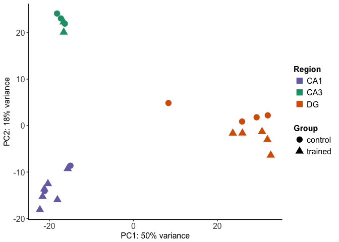
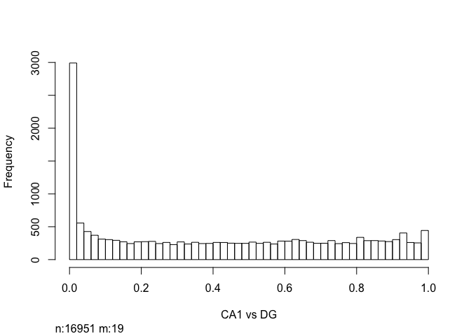
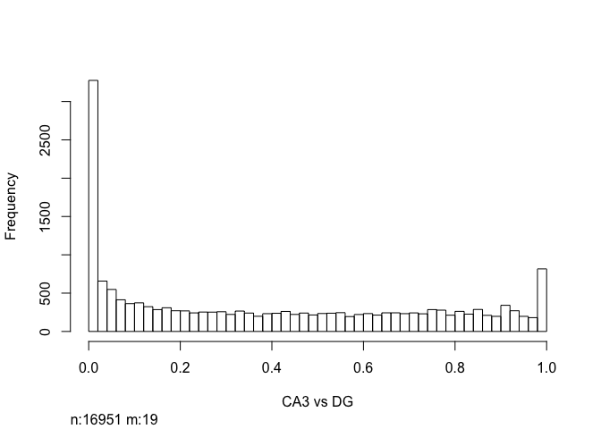
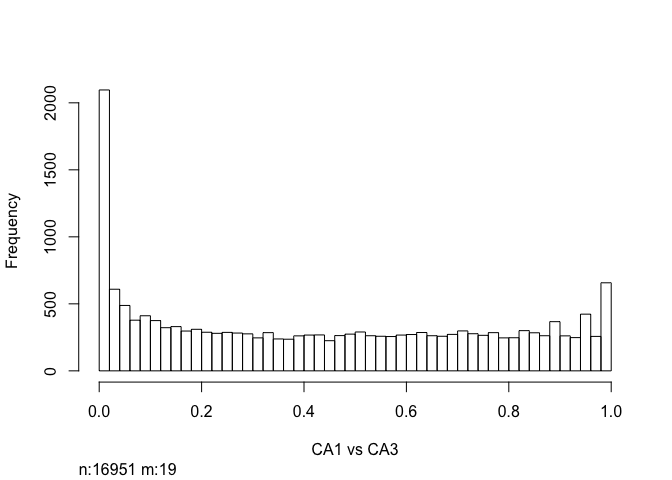
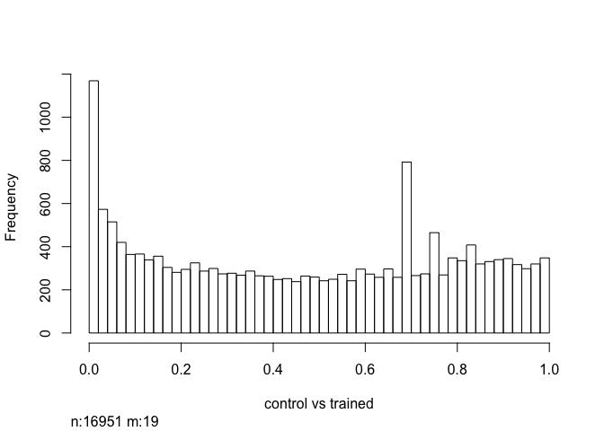
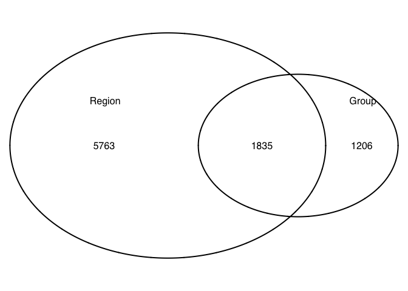
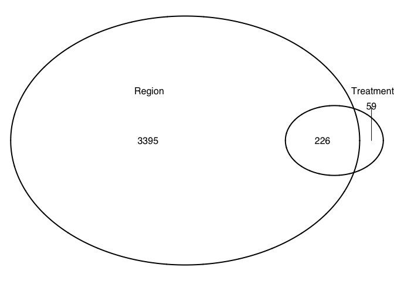
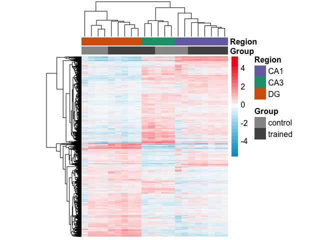
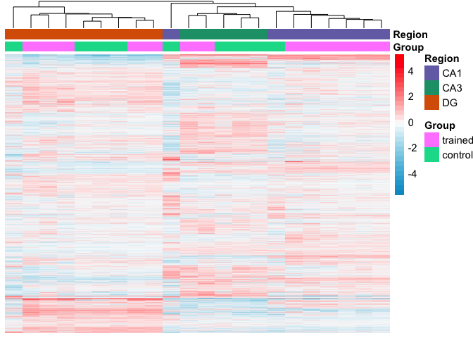

All together now
----------------

Combining the two previous analyses

PCA

    ## DEG by contrasts
    source("resvalsfunction.R")
    contrast1 <- resvals(contrastvector = c('Region', 'CA1', 'DG'), mypval = 0.1)

    ## [1] 4657
    ## [1] 2898

    contrast2 <- resvals(contrastvector = c('Region', 'CA3', 'DG'), mypval = 0.1)

    ## [1] 5257
    ## [1] 3224

    contrast3 <- resvals(contrastvector = c('Region', 'CA1', 'CA3'), mypval = 0.1)

    ## [1] 3982
    ## [1] 1618

    contrast4 <- resvals(contrastvector = c('Group', 'control', 'trained'), mypval = 0.1)

    ## [1] 3041
    ## [1] 285

Now, we can view a histogram of the distribution

    ## [1] 1

    ## [1] 1

    ## [1] 1

    ## [1] 1

This Venn Diagram sthe overlap of differentailly expression genes by
Region and method. This shows all genes with *uncorrected* pvalue
&lt;0.1.

This Venn Diagram sthe overlap of differentailly expression genes by
Region and method. This shows all genes with *adjusted* pvalue &lt;0.1.

I'm not really happy with these two heat maps. Here's how I created
them. Top heatmap: subset the data to give only the gene with an
adjusted p value &lt; 0.05 for the homogenized vs dissociated
comparisonany two-way comparsion. Bottom heatmap: subset the data to
give only the gene with an adjusted p value &lt; 0.05 for two way brain
region comparision (CA1 vs DG, CA3, vs DG, or CA1 vs DG)

Here, you can see that the differences between samples is not as clear
cut for all comparisions. What other mechanisms would be useful for
subseting the data to identify genes of interest?

