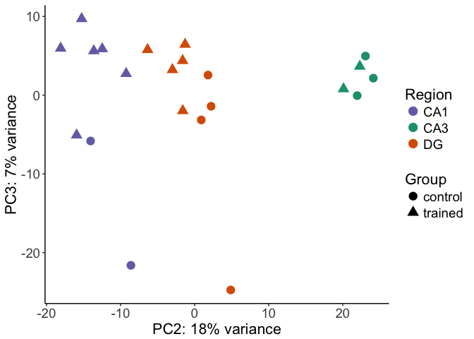

All together now
----------------

Combining the two previous analyses

PCA

    ## DEG by contrasts
    source("resvalsfunction.R")
    contrast1 <- resvals(contrastvector = c('Region', 'CA1', 'DG'), mypval = 0.1)

    ## [1] 3919
    ## [1] 1546

    contrast2 <- resvals(contrastvector = c('Region', 'CA3', 'DG'), mypval = 0.1)

    ## [1] 4690
    ## [1] 2664

    contrast3 <- resvals(contrastvector = c('Region', 'CA1', 'CA3'), mypval = 0.1)

    ## [1] 3745
    ## [1] 1194

    contrast4 <- resvals(contrastvector = c('Treatment', 'avoidable', 'unavoidable'), mypval = 0.1)

    ## [1] 3041
    ## [1] 285

Now, we can view a histogram of the distribution

    ## [1] 1

    ## [1] 1

    ## [1] 1

    ## [1] 1

This Venn Diagram sthe overlap of differentailly expression genes by
Region and method. This shows all genes with *uncorrected* pvalue
&lt;0.1.

This Venn Diagram sthe overlap of differentailly expression genes by
Region and method. This shows all genes with *adjusted* pvalue &lt;0.1.

Heatmaps

    FALSE 
    FALSE FALSE  TRUE 
    FALSE  8889   504

    FALSE 
    FALSE FALSE  TRUE 
    FALSE 14951  2000

    FALSE log2 fold change (MLE): Treatment avoidable vs unavoidable 
    FALSE Wald test p-value: Treatment avoidable vs unavoidable 
    FALSE DataFrame with 6 rows and 6 columns
    FALSE                baseMean log2FoldChange     lfcSE       stat    pvalue
    FALSE               <numeric>      <numeric> <numeric>  <numeric> <numeric>
    FALSE 0610007P14Rik 28.312171     -0.4917430 0.5416911 -0.9077924 0.3639879
    FALSE 0610009B22Rik  7.764007      1.1336111 1.1791370  0.9613905 0.3363559
    FALSE 0610009L18Rik  3.652118      2.3345187 1.9670998  1.1867820 0.2353136
    FALSE 0610009O20Rik 58.892418      0.6145425 0.3810066  1.6129444 0.1067566
    FALSE 0610010F05Rik 10.601326      0.1150379 0.7181401  0.1601886 0.8727325
    FALSE 0610010K14Rik  1.780900     -1.3461274 1.1956145 -1.1258875 0.2602132
    FALSE                    padj
    FALSE               <numeric>
    FALSE 0610007P14Rik 0.6743469
    FALSE 0610009B22Rik        NA
    FALSE 0610009L18Rik        NA
    FALSE 0610009O20Rik 0.3933625
    FALSE 0610010F05Rik 0.9513260
    FALSE 0610010K14Rik        NA

    FALSE sign
    FALSE   -1    1 
    FALSE 7986 8984
