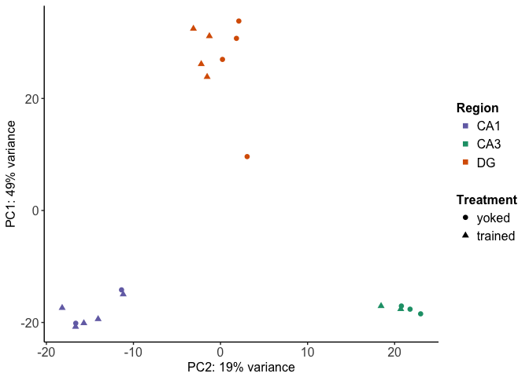

    #source("http://www.bioconductor.org/biocLite.R")
    #biocLite("DESeq2")
    library(DESeq2)
    #library(magrittr)
    #library(tidyverse)
    #library(reshape2)
    library(VennDiagram)
    library(genefilter)
    library(pheatmap)
    library(cowplot)
    library(RColorBrewer)
    library(dplyr)
    library(plyr)
    library(ggplot2)
    library(colorRamps)
    library(edgeR)
    library(knitr) 
    # set output file for figures 
    knitr::opts_chunk$set(fig.path = '../figures/03_cognitiontest/')

Effect of cognitive training on hippocampal transcriptomes
----------------------------------------------------------

Next, we examined the effects of cognitiving training on hippocampal
gene expression. Mice trained in the active place avoidance task alter
their behavior to avoid footshocks. The sequence of unavoidable shock
delivered to the yoked mice mimicked the time series of shocks received
by the trained mice that were being conditioned to avoid localized, mild
shocks. While the trained and yoked animals received the same number of
shocks, only the trained animals exhibitied an avoidance response
(Supplementary figure. Use 'include=TRUE' to view).

### Biological samples

The animals used in experiments 2 and 3 were 3-4–month-old male C57BL/6J
mice (Jackson Laboratory). Following killed trained mice (N=4) were
yoked control mice (N=4). Mice were killed and transverse brain slices
were prepared. The DG, CA3, CA1 regions were microdissected using a 0.25
mm punch (Electron Microscopy Systems) and a dissecting scope (Zeiss).
RNA was isolated using the Maxwell 16 LEV RNA Isolation Kit (Promega).
RNA libraries were prepared by the Genomic Sequencing and Analysis
Facility at the University of Texas at Austin using the Illumina HiSeq
platform.

### Gene counts

Raw reads were downloaded from the Amazon cloud server to the Stampede
Cluster at the Texas Advanced Computing Facility for processing and
analysis. RNA quality was checked using the bioinformatic program FASTQC
(citation). Low quality reads and adapter sequences were removed using
the program Cutadapt (Martin, 2011). Kallisto was use for fast read
mapping and counting (Bray et al., 2016). Transcript from a single gene
were combined into a count total for each gene. In the end, we meausred
the expression of 22,485 genes in 20 samples.

    # this starts with data genearated from code described in KallistoGather.Rmd
    colData <- read.csv('../data/BehaviorSlimColData.csv')
    rownames(colData) <- colData$RNAseqID
    countData <-  read.csv('../data/BehaviorSlimCountData.csv', check.names = F, row.names = 1)

    ## subset
    colData <- colData %>%
      filter(Mouse != "15-142C") %>% droplevels()
    savecols <- as.character(colData$RNAseqID) #selects all good samples
    savecols <- as.vector(savecols) # make it a vector
    countData <- countData %>% select(one_of(savecols)) # keep good samples

    #rename revalue things
    colData$Group <- plyr::revalue(colData$Group, c("consistent"="trained"))
    colData$Group <- plyr::revalue(colData$Group, c("control"="yoked"))

    colData <- rename(colData, c("Group"="Treatment"))
    colData$Treatment <- factor(colData$Treatment, levels = c("yoked", "trained"))

    dim(countData)

    ## [1] 22485    20

    colData %>% select(Treatment,Region)  %>%  summary()

    ##    Treatment  Region 
    ##  yoked  : 9   CA1:7  
    ##  trained:11   CA3:5  
    ##               DG :8

### Differential gene expresssion analysis

We used DESeq2 for gene expression normalization and quantification
(Love et al., 2014). We compared the effects of treatment, region, and
the interaction with the formal
`design = ~ Treatment + Region + Treatment * Region`. After removing
genes with less than 2 counts across all samples, we were left with
16,847 genes.

    dds <- DESeqDataSetFromMatrix(countData = countData,
                                  colData = colData,
                                  design = ~ Treatment + Region + Treatment * Region )
    dds <- dds[ rowSums(counts(dds)) > 2, ] ## filter genes with 0 counts
    dds <- DESeq(dds) # Differential expression analysis

    FALSE estimating size factors

    FALSE estimating dispersions

    FALSE gene-wise dispersion estimates

    FALSE mean-dispersion relationship

    FALSE final dispersion estimates

    FALSE fitting model and testing

    dds

    FALSE class: DESeqDataSet 
    FALSE dim: 16847 20 
    FALSE metadata(1): version
    FALSE assays(3): counts mu cooks
    FALSE rownames(16847): 0610007P14Rik 0610009B22Rik ... Zzef1 Zzz3
    FALSE rowData names(37): baseMean baseVar ... deviance maxCooks
    FALSE colnames(20): 143C_CA1 143C_DG ... 147D-CA3-1 147D-DG-1
    FALSE colData names(15): RNAseqID Mouse ... Date sizeFactor

    ## log transformed data
    rld <- rlog(dds, blind=FALSE)

This experiment produced a larger effect on gene expression, 285 genes
were differentially expressed between the two groups, and a large
portion of those genes were also being differentially expressed between
the hippocampal subfields. Hierarchical clustering of the differentially
expressed genes separates samples by both subfield and treatment (Fig.
3C).

Now, we can view a histogram of the distribution

    ## [1] 1

    ## [1] 1

    ## [1] 1

    ## [1] 1

This Venn Diagram sthe overlap of differentailly expression genes by
Region and method. This shows all genes with *adjusted* pvalue &lt;0.1.

Heatmaps

    ## Any padj <0.1
    DEGes <- assay(rld)
    DEGes <- cbind(DEGes, contrast1, contrast2, contrast3, contrast4)
    DEGes <- as.data.frame(DEGes) # convert matrix to dataframe
    DEGes$rownames <- rownames(DEGes)  # add the rownames to the dataframe

    DEGes$padjmin <- with(DEGes, pmin(padjTreatmenttrainedyoked, padjRegionCA1DG ,padjRegionCA3DG, padjRegionCA1CA3 )) # put the min pvalue in a new column
    DEGes <- DEGes %>% filter(padjmin < 0.1)

    rownames(DEGes) <- DEGes$rownames
    drop.cols <-colnames(DEGes[,grep("padj|pval|rownames", colnames(DEGes))])
    DEGes <- DEGes %>% select(-one_of(drop.cols))
    DEGes <- as.matrix(DEGes)
    DEGes <- DEGes - rowMeans(DEGes)

    # setting color options
    source("figureoptions.R")
    ann_colors <- ann_colorsbehavior
    colorpalette <- cembrowskicolors
    df <- as.data.frame(colData(dds)[,c("Treatment", "Region")])
    paletteLength <- 30
    myBreaks <- c(seq(min(DEGes), 0, length.out=ceiling(paletteLength/2) + 1), 
                  seq(max(DEGes)/paletteLength, max(DEGes), length.out=floor(paletteLength/2)))

    pheatmap(DEGes, show_colnames=F, show_rownames = F,
             annotation_col=df, annotation_colors = ann_colors,
             fontsize = 12, fontsize_row = 7, 
             cellwidth = 10, 
             border_color = "grey60" ,
             color = colorpalette,
             clustering_distance_cols="correlation" ,
             breaks=myBreaks,
             clustering_method="average"
             )

    # for adobe
    pheatmap(DEGes, show_colnames=F, show_rownames = F,
             annotation_col=df, annotation_colors = ann_colors,
             treeheight_row = 0, treeheight_col = 25,
             fontsize = 8, 
             width=4.5, height=3,
             border_color = "grey60" ,
             color = colorpalette,
             cellwidth = 7, 
             filename = "../figures/03_cognitiontest/HeatmapPadj-1.pdf",
             clustering_distance_cols="correlation" ,
             breaks=myBreaks,
             clustering_method="average"
             )

Then, we used pvclust to obtain bootstrap values for the heatmap sample
dendrogram.

    FALSE Bootstrap (r = 0.5)... Done.
    FALSE Bootstrap (r = 0.6)... Done.
    FALSE Bootstrap (r = 0.7)... Done.
    FALSE Bootstrap (r = 0.8)... Done.
    FALSE Bootstrap (r = 0.9)... Done.
    FALSE Bootstrap (r = 1.0)... Done.
    FALSE Bootstrap (r = 1.1)... Done.
    FALSE Bootstrap (r = 1.2)... Done.
    FALSE Bootstrap (r = 1.3)... Done.
    FALSE Bootstrap (r = 1.4)... Done.

### Analysis of variance

A principal component analysis of all gene expression data revealed that
PC1 explains 50% of the variance in gene expression and distinguishes
between the DG and CA regions. PC2 accounts for 18% of the variance and
distinguishes the three subfields.

    source("DESeqPCAfunction.R")
    source("figureoptions.R")

    # create the dataframe using my function pcadataframe
    pcadata <- pcadataframe(rld, intgroup=c("Treatment", "Region"), returnData=TRUE)
    percentVar <- round(100 * attr(pcadata, "percentVar"))

    pcadata$Treatment <- factor(pcadata$Treatment, levels = c("yoked", "trained"))

    ## PC2 vs PC1
    plotPC2PC1(aescolor = pcadata$Region, colorname = "Region", aesshape = pcadata$Treatment, shapename = "Treatment", colorvalues = colorvalRegion)

    # PC1 vs PC2 for adobe
    myplot <- plotPC2PC1(aescolor = pcadata$Region, colorname = "Region", aesshape = pcadata$Treatment, shapename = "Treatment", colorvalues = colorvalRegion)
    pdf(file="../figures/03_cognitiontest/PCA-1.pdf", width=4.5, height=3)
    plot(myplot)
    dev.off()

    FALSE quartz_off_screen 
    FALSE                 2

To confirm statistical significance of this visual pattern, we conducted
a two-way ANOVA for PC1 ~ Region: F2,19= 199.3; p = 1.78e-13). A post
hoc Tukey test showed that DG samples are significantly different from
both CA1 and CA3 samples (CA1-DG, p = 1.0e-07; CA3-DG, p = 1.0e-07;
CA1-CA3, p = 0.7002).

    aov1 <- aov(PC1 ~ Region, data=pcadata)
    summary(aov1) 

    FALSE             Df Sum Sq Mean Sq F value   Pr(>F)    
    FALSE Region       2   9607    4804   176.1 4.34e-12 ***
    FALSE Residuals   17    464      27                     
    FALSE ---
    FALSE Signif. codes:  0 '***' 0.001 '**' 0.01 '*' 0.05 '.' 0.1 ' ' 1

    TukeyHSD(aov1, which = "Region")

    FALSE   Tukey multiple comparisons of means
    FALSE     95% family-wise confidence level
    FALSE 
    FALSE Fit: aov(formula = PC1 ~ Region, data = pcadata)
    FALSE 
    FALSE $Region
    FALSE              diff       lwr       upr     p adj
    FALSE CA3-CA1  0.575778 -7.270363  8.421919 0.9806741
    FALSE DG-CA1  44.976167 38.041093 51.911242 0.0000000
    FALSE DG-CA3  44.400389 36.761307 52.039472 0.0000000

The strongest contributor to PC2 is brain regions (PC2 ~ Region ANOVA:
F2,19= 220.4; p = 7.15e-14; Tukey test, p&lt;&lt;&lt;0.001 for all three
comparisons), with some influence of treatment on PC2 (PC2 ~ Treatment
ANOVA: F1,20=3.389; p = 0.0805).

    aov2 <- aov(PC2 ~ Region, data=pcadata)
    summary(aov2) 

    FALSE             Df Sum Sq Mean Sq F value   Pr(>F)    
    FALSE Region       2   3729  1864.7   347.1 1.65e-14 ***
    FALSE Residuals   17     91     5.4                     
    FALSE ---
    FALSE Signif. codes:  0 '***' 0.001 '**' 0.01 '*' 0.05 '.' 0.1 ' ' 1

    TukeyHSD(aov2, which = "Region") 

    FALSE   Tukey multiple comparisons of means
    FALSE     95% family-wise confidence level
    FALSE 
    FALSE Fit: aov(formula = PC2 ~ Region, data = pcadata)
    FALSE 
    FALSE $Region
    FALSE              diff       lwr       upr p adj
    FALSE CA3-CA1  35.75785  32.27608  39.23961     0
    FALSE DG-CA1   14.70776  11.63029  17.78523     0
    FALSE DG-CA3  -21.05009 -24.43997 -17.66021     0

PC3 and PC4 account for 7% and 4.5 of the variation in gene expression
respectively.PC3 are PC4 are influenced by variation due to treatment
(PC3 ~ Treatment ANOVA: F1,18=5.622; p = 0.0291, PC4 ~ Treatment ANOVA:
F1,18=12.01; p = 0.00276).

    source("DESeqPCAfunction.R")
    source("figureoptions.R")
    ## PC2 vs PC3
    A <- plotPC2PC3(aescolor = pcadata$Region, colorname = "Region", aesshape = pcadata$Treatment, shapename = "Treatment", colorvalues = colorvalRegion)

    B <- plotPC2PC4(aescolor = pcadata$Region, colorname = "Region", aesshape = pcadata$Treatment, shapename = "Treatment", colorvalues = colorvalRegion)

    plot_grid(A, B, rel_widths = c(1,1))

    aov3 <- aov(PC3 ~ Treatment, data=pcadata)
    summary(aov3) 

    FALSE             Df Sum Sq Mean Sq F value Pr(>F)  
    FALSE Treatment    1  363.2   363.2   5.622 0.0291 *
    FALSE Residuals   18 1162.8    64.6                 
    FALSE ---
    FALSE Signif. codes:  0 '***' 0.001 '**' 0.01 '*' 0.05 '.' 0.1 ' ' 1

    aov4 <- aov(PC4 ~ Treatment, data=pcadata)
    summary(aov4) 

    FALSE             Df Sum Sq Mean Sq F value  Pr(>F)   
    FALSE Treatment    1  448.3   448.3   12.01 0.00276 **
    FALSE Residuals   18  672.1    37.3                   
    FALSE ---
    FALSE Signif. codes:  0 '***' 0.001 '**' 0.01 '*' 0.05 '.' 0.1 ' ' 1
