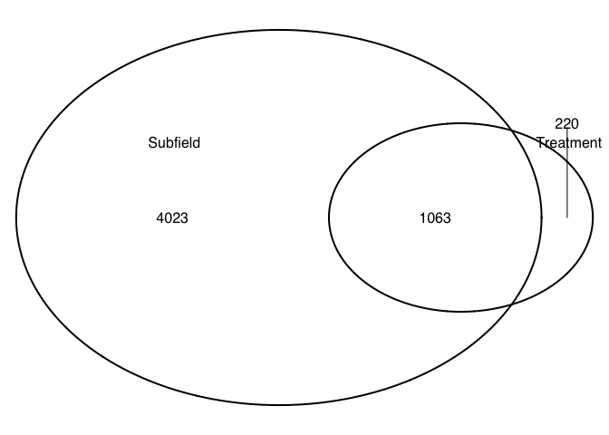
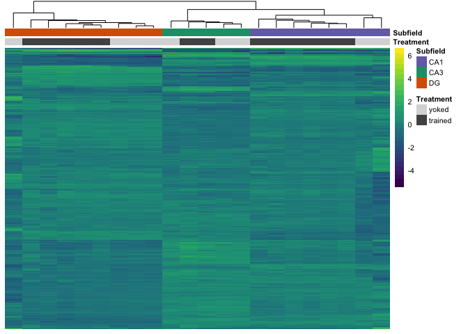
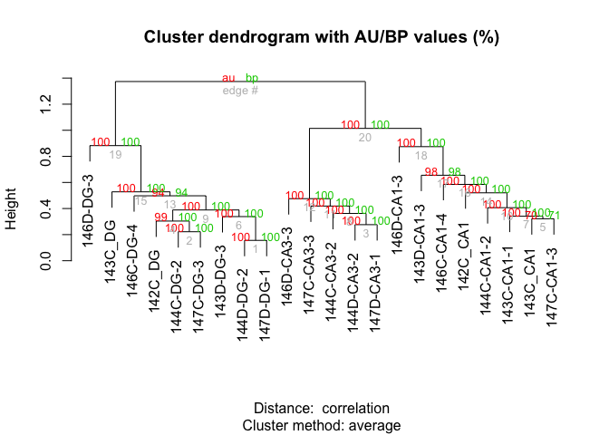
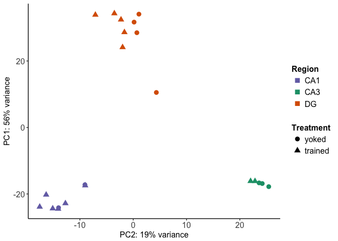
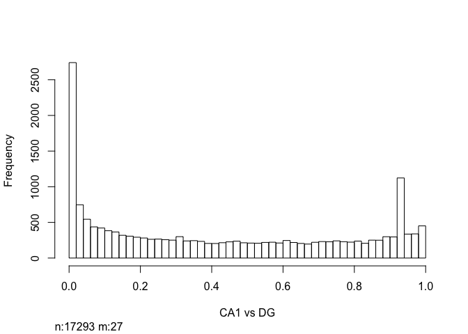
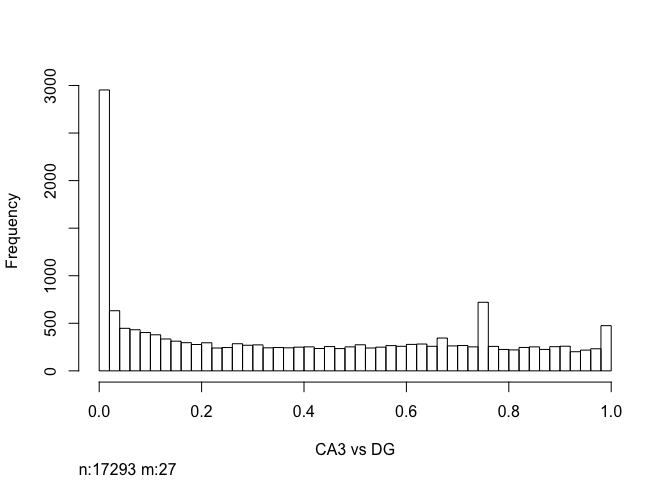
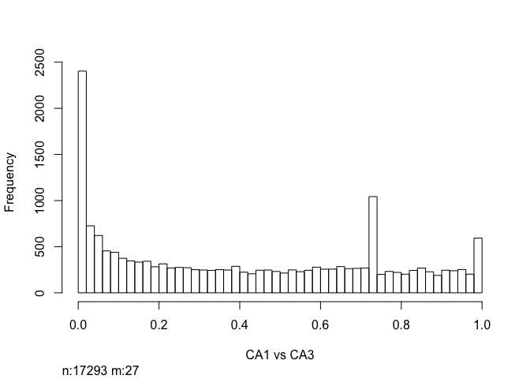
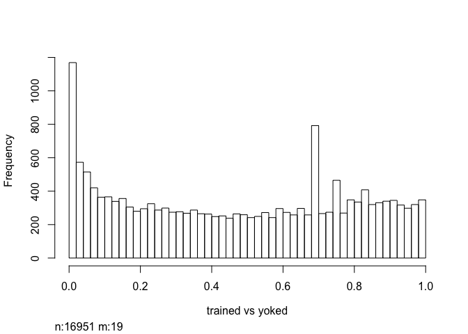
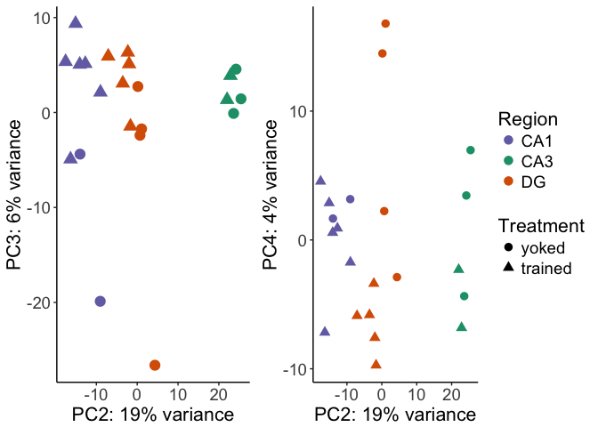
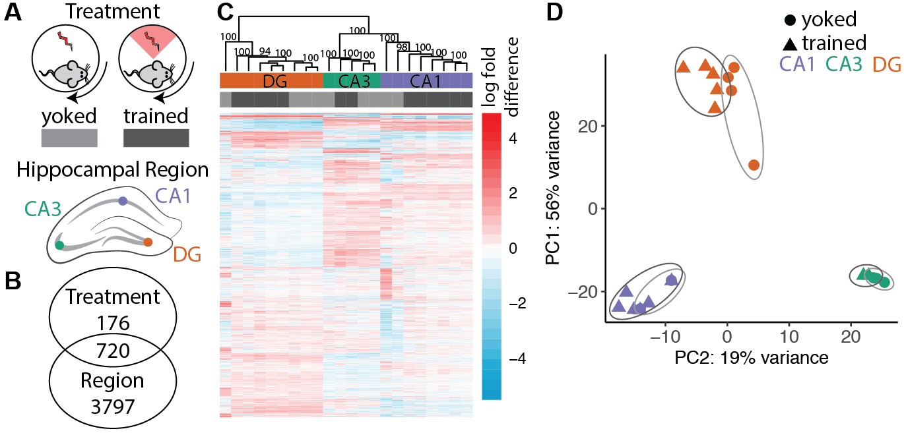

Examining of cognitive training on hippocampal
----------------------------------------------

The goals of the subsequent analysis are 1) to determine the effects of
cognitiving training on hippocampal gene expression and 2) related any
detectable changes to variation cause by other technical and biological
treatements.

The sample and count information for this part is found in
`../data/GSE100225_IntegrativeWT2015ColData.csv` and
`../data/GSE100225_IntegrativeWT2015CountData.csv`. You can also
download these two files (with a different name but same content) from
[GEO
GSE100225](https://www.ncbi.nlm.nih.gov/geo/query/acc.cgi?acc=GSE100225).

### Experimental Design

We use 3-4–month-old male C57BL/6J mice fro the Jackson Laboratory and
housed at the Marine Biological Laboratory. Mice (N=4) trained in the
active place avoidance task are conditioned to avoid mild shocks that
can be localized by visual cues in the enviornment. Yoked control mice
(N=4) are delivered sequence of unavoidable shock that mimickes the time
series of shocks received by the trained mice. While the trained and
yoked animals received the same number of shocks, only the trained
animals exhibitied an avoidance response.

Thirty minutes after the last cognitive training session, mice were
killed and transverse brain slices were prepared. The DG, CA3, CA1
subregions were microdissected using a 0.25 mm punch (Electron
Microscopy Systems) and a dissecting scope (Zeiss). RNA was isolated
using the Maxwell 16 LEV RNA Isolation Kit (Promega). RNA libraries were
prepared by the Genomic Sequencing and Analysis Facility at the
University of Texas at Austin using the Illumina HiSeq platform.

The orginal design was 4 animals per treament and 3 hippocampal sub
regions per animals, which would give 24 samples. After excluding
compromized samples, the final sample sizes are:

    ##    Treatment  Region 
    ##  yoked  : 9   CA1:8  
    ##  trained:13   CA3:5  
    ##               DG :9

### Differential gene expresssion analysis

Raw reads were downloaded from the Amazon cloud server to the Stampede
Cluster at the Texas Advanced Computing Facility for processing and
analysis. RNA quality was checked using the bioinformatic program FASTQC
(citation). Low quality reads and adapter sequences were removed using
the program Cutadapt (Martin, 2011). Kallisto was use for fast read
mapping and counting (Bray et al., 2016). Transcript from a single gene
were combined into a count total for each gene. In the end, we meausred
the expression of 22,485 genes in 22 samples.

    ## [1] 22485    22

We used DESeq2 (Love et al., 2014) for gene expression normalization and
quantification using the following experimental design:
`Treatment + Region + Treatment * Region`. Genes with less than 2 counts
across all samples were filtered, leaving us with `dim(rld)` genes for
analysis of differntial expression.

    dim(rld)

    FALSE [1] 17320    22

We identified 423 genes were differentially expressed between the yoked
control and cognitively trained animals, 3485 genes that were
differentially expressed across subfields, and 324 showed an interaction
at FDR p &lt; 0.05 (Fig. 4B). We see a large effect of brain region on
gene expression, with 20% of detectable genes begin differentially
expressed between one or more brain-region comparisons (3485
differentially expressed genes /17320 measured genes). This is an order
of magnitude greater than the 2% of the transcriptome that changed in
response to learning (423 DEGs /17320 genes measured).

Hierarchical clustering of the differentially expressed genes separates
samples by both subfield and treatment (Fig. 4C).

Then, we visuazlied the data as a heatmap showing the relative log fold
change of gene expression across samples. Genes were filtered for a
minimimum adjust p value &lt; 0.05 in any two-way contrast. The row mean
for each gene was subtracted for the raw value to allow for analysis of
fold change rather than raw magnitudes. The samples cluster primarily by
brain region with some small treatment-driven.

    result <- pvclust(DEGes, method.dist="cor", method.hclust="average", nboot=1000)

    ## Bootstrap (r = 0.5)... Done.
    ## Bootstrap (r = 0.6)... Done.
    ## Bootstrap (r = 0.7)... Done.
    ## Bootstrap (r = 0.8)... Done.
    ## Bootstrap (r = 0.9)... Done.
    ## Bootstrap (r = 1.0)... Done.
    ## Bootstrap (r = 1.1)... Done.
    ## Bootstrap (r = 1.2)... Done.
    ## Bootstrap (r = 1.3)... Done.
    ## Bootstrap (r = 1.4)... Done.

    plot(result)

A principal component analysis of all gene expression data revealed that
brain region explains 75% of the variance in the data (Fig. 4D). PC1
accounts for 56% of the variance and distinguishes DG from not-DG
samples (ANOVA for PC1 ~ Region: F2,19= 226.1; p &lt; 0.001). A post hoc
Tukey test showed that DG samples are significantly different from both
CA1 and CA3 samples (CA1-DG, p &lt; 0.001; CA3-DG, p &lt; 0.001;
CA1-CA3, p = 0.23). PC2 accounts for 19% of the variance and
distinguishes the three subfields (PC2 ~ Region ANOVA: F2,19= 255.3; p
&lt; 0.001; Tukey test, p &lt; 0.001for all three comparisons). PC3 are
PC4 are influenced by variation due to cognitive training (PC3 ~
Treatment ANOVA: F1,20=7.451; p = 0.012, PC4 ~ Treatment ANOVA:
F1,20=10.11; p = 0.0047). An analysis of Gene Ontology identified 91 GO
terms at 10% FDR significant. Among the top 10 are glutamate signaling
and membrane transport systems and a downregulation of oxidoreductase
and ribosomal activity (Fig. 2C).

    ## statistics
    aov1R <- aov(PC1 ~ Region, data=pcadata)
    summary(aov1R) 

    ##             Df Sum Sq Mean Sq F value   Pr(>F)    
    ## Region       2  12615    6307   226.1 5.65e-14 ***
    ## Residuals   19    530      28                     
    ## ---
    ## Signif. codes:  0 '***' 0.001 '**' 0.01 '*' 0.05 '.' 0.1 ' ' 1

    TukeyHSD(aov1R, which = "Region") 

    ##   Tukey multiple comparisons of means
    ##     95% family-wise confidence level
    ## 
    ## Fit: aov(formula = PC1 ~ Region, data = pcadata)
    ## 
    ## $Region
    ##              diff       lwr      upr    p adj
    ## CA3-CA1  5.100214 -2.548692 12.74912 0.233216
    ## DG-CA1  50.510511 43.990986 57.03003 0.000000
    ## DG-CA3  45.410296 37.926612 52.89398 0.000000

    aov2R <- aov(PC2 ~ Region, data=pcadata)
    summary(aov2R) 

    ##             Df Sum Sq Mean Sq F value   Pr(>F)    
    ## Region       2   4255  2127.4   255.3 1.86e-14 ***
    ## Residuals   19    158     8.3                     
    ## ---
    ## Signif. codes:  0 '***' 0.001 '**' 0.01 '*' 0.05 '.' 0.1 ' ' 1

    TukeyHSD(aov2R, which = "Region") 

    ##   Tukey multiple comparisons of means
    ##     95% family-wise confidence level
    ## 
    ## Fit: aov(formula = PC2 ~ Region, data = pcadata)
    ## 
    ## $Region
    ##              diff        lwr       upr p adj
    ## CA3-CA1  37.09928  32.918856  41.27970 0e+00
    ## DG-CA1   12.33263   8.769462  15.89581 1e-07
    ## DG-CA3  -24.76665 -28.856769 -20.67652 0e+00

    aov3R <- aov(PC3 ~ Region, data=pcadata)
    summary(aov3R) 

    ##             Df Sum Sq Mean Sq F value Pr(>F)
    ## Region       2   34.4   17.21   0.225  0.801
    ## Residuals   19 1454.8   76.57

    TukeyHSD(aov3R, which = "Region") 

    ##   Tukey multiple comparisons of means
    ##     95% family-wise confidence level
    ## 
    ## Fit: aov(formula = PC3 ~ Region, data = pcadata)
    ## 
    ## $Region
    ##               diff       lwr       upr     p adj
    ## CA3-CA1  2.4937376 -10.17909 15.166567 0.8722208
    ## DG-CA1  -0.7357084 -11.53736 10.065942 0.9836439
    ## DG-CA3  -3.2294460 -15.62853  9.169639 0.7880961

    aov4R <- aov(PC3 ~ Region, data=pcadata)
    summary(aov4R) 

    ##             Df Sum Sq Mean Sq F value Pr(>F)
    ## Region       2   34.4   17.21   0.225  0.801
    ## Residuals   19 1454.8   76.57

    TukeyHSD(aov4R, which = "Region") 

    ##   Tukey multiple comparisons of means
    ##     95% family-wise confidence level
    ## 
    ## Fit: aov(formula = PC3 ~ Region, data = pcadata)
    ## 
    ## $Region
    ##               diff       lwr       upr     p adj
    ## CA3-CA1  2.4937376 -10.17909 15.166567 0.8722208
    ## DG-CA1  -0.7357084 -11.53736 10.065942 0.9836439
    ## DG-CA3  -3.2294460 -15.62853  9.169639 0.7880961

    aov5R <- aov(PC5 ~ Region, data=pcadata)
    summary(aov5R) 

    ##             Df Sum Sq Mean Sq F value Pr(>F)
    ## Region       2    8.0   4.014   0.154  0.858
    ## Residuals   19  495.5  26.082

    TukeyHSD(aov5R, which = "Region") 

    ##   Tukey multiple comparisons of means
    ##     95% family-wise confidence level
    ## 
    ## Fit: aov(formula = PC5 ~ Region, data = pcadata)
    ## 
    ## $Region
    ##               diff       lwr      upr     p adj
    ## CA3-CA1 -0.2658585 -7.662234 7.130517 0.9954145
    ## DG-CA1  -1.3140576 -7.618338 4.990222 0.8579143
    ## DG-CA3  -1.0481991 -8.284807 6.188409 0.9283575

    aov6R <- aov(PC6 ~ Region, data=pcadata)
    summary(aov6R) 

    ##             Df Sum Sq Mean Sq F value Pr(>F)
    ## Region       2    1.1   0.549   0.027  0.973
    ## Residuals   19  379.9  19.993

    TukeyHSD(aov6R, which = "Region") 

    ##   Tukey multiple comparisons of means
    ##     95% family-wise confidence level
    ## 
    ## Fit: aov(formula = PC6 ~ Region, data = pcadata)
    ## 
    ## $Region
    ##                diff       lwr      upr     p adj
    ## CA3-CA1 -0.51051373 -6.986232 5.965204 0.9781557
    ## DG-CA1   0.03953805 -5.480022 5.559098 0.9998174
    ## DG-CA3   0.55005178 -5.785786 6.885889 0.9735779

    aov1T <- aov(PC1 ~ Treatment, data=pcadata)
    summary(aov1T) 

    ##             Df Sum Sq Mean Sq F value Pr(>F)
    ## Treatment    1     28    27.8   0.042  0.839
    ## Residuals   20  13117   655.9

    aov2T <- aov(PC2 ~ Treatment, data=pcadata)
    summary(aov2T) 

    ##             Df Sum Sq Mean Sq F value Pr(>F)  
    ## Treatment    1    599   599.2   3.142 0.0915 .
    ## Residuals   20   3814   190.7                 
    ## ---
    ## Signif. codes:  0 '***' 0.001 '**' 0.01 '*' 0.05 '.' 0.1 ' ' 1

    aov3T <- aov(PC3 ~ Treatment, data=pcadata)
    summary(aov3T) 

    ##             Df Sum Sq Mean Sq F value Pr(>F)  
    ## Treatment    1  404.2   404.2   7.451 0.0129 *
    ## Residuals   20 1085.0    54.2                 
    ## ---
    ## Signif. codes:  0 '***' 0.001 '**' 0.01 '*' 0.05 '.' 0.1 ' ' 1

    aov4T <- aov(PC4 ~ Treatment, data=pcadata)
    summary(aov4T) 

    ##             Df Sum Sq Mean Sq F value  Pr(>F)   
    ## Treatment    1  324.1   324.1   10.11 0.00472 **
    ## Residuals   20  641.5    32.1                   
    ## ---
    ## Signif. codes:  0 '***' 0.001 '**' 0.01 '*' 0.05 '.' 0.1 ' ' 1

    aov5T <- aov(PC5 ~ Treatment, data=pcadata)
    summary(aov5T) 

    ##             Df Sum Sq Mean Sq F value Pr(>F)
    ## Treatment    1    2.7   2.743    0.11  0.744
    ## Residuals   20  500.8  25.042

    aov6T <- aov(PC6 ~ Treatment, data=pcadata)
    summary(aov6T) 

    ##             Df Sum Sq Mean Sq F value Pr(>F)
    ## Treatment    1   25.7   25.66   1.444  0.243
    ## Residuals   20  355.3   17.77

The gene expression data were exported to csv files for importing into
the GOMMU analysis package for subsequent analysis.

    # from https://github.com/rachelwright8/Ahya-White-Syndromes/blob/master/deseq2_Ahya.R
    res <- results(dds, contrast=c('Treatment', 'trained', 'yoked'), independentFiltering = FALSE)
    table(res$padj<0.05)

    ## 
    ## FALSE  TRUE 
    ## 16870   423

    logs <- data.frame(cbind("gene"=row.names(res),"logP"=round(-log(res$pvalue+1e-10,10),1)))
    logs$logP <- as.numeric(as.character(logs$logP))
    sign <- rep(1,nrow(logs))
    sign[res$log2FoldChange<0]=-1  ##change to correct model
    table(sign)

    ## sign
    ##   -1    1 
    ## 7759 9561

    logs$logP <- logs$logP*sign

    write.csv(logs, file = "./06_GO_MWU/03_behavior_GOpvals.csv", row.names = F)

Supplementary figures showing the distibution of pvalues.

    myhistogram(contrastvector = c('Region', 'CA1', 'DG'), mypval = 0.05)

    ## [1] 1

    myhistogram(contrastvector = c('Region', 'CA3', 'DG'), mypval = 0.05)

    ## [1] 1

    myhistogram(contrastvector = c('Region', 'CA1', 'CA3'), mypval = 0.05)

    ## [1] 1

    myhistogram(contrastvector = c('Treatment', 'trained', 'yoked'), mypval = 0.05)

    ## [1] 1

Supplementary figures of showing PC3 and PC4 contrasted against PC2.)

    ## PC2 vs PC3
    A <- plotPC2PC3(aescolor = pcadata$Region, colorname = "Region", aesshape = pcadata$Treatment, shapename = "Treatment", colorvalues = colorvalRegion)

    B <- plotPC2PC4(aescolor = pcadata$Region, colorname = "Region", aesshape = pcadata$Treatment, shapename = "Treatment", colorvalues = colorvalRegion)

    plot_grid(A, B, rel_widths = c(2.25,3))

Here is the corresponding Adobe Illustrator file that combines many of
the above plots.

