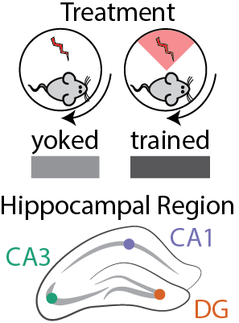

Examining of cognitive training on hippocampal
----------------------------------------------

The goals of the subsequent analysis are 1) to determine the effects of
cognitiving training on hippocampal gene expression and 2) related any
detectable changes to variation cause by other technical and biological
treatements.

### Experimental Design

We use 3-4–month-old male C57BL/6J mice fro the Jackson Laboratory and
housed at the Marine Biological Laboratory. Mice (N=4) trained in the
active place avoidance task are conditioned to avoid mild shocks that
can be localized by visual cues in the enviornment. Yoked control mice
(N=4) are delivered sequence of unavoidable shock that mimickes the time
series of shocks received by the trained mice. While the trained and
yoked animals received the same number of shocks, only the trained
animals exhibitied an avoidance response. (Supplementary figures showing
the number of shocks and the avoidance behaviors can be viewed by using
'include=TRUE' in the corresponding Rmd file).

Thirty minutes after the last cognitive training session, mice were
killed and transverse brain slices were prepared. The DG, CA3, CA1
subregions were microdissected using a 0.25 mm punch (Electron
Microscopy Systems) and a dissecting scope (Zeiss). RNA was isolated
using the Maxwell 16 LEV RNA Isolation Kit (Promega). RNA libraries were
prepared by the Genomic Sequencing and Analysis Facility at the
University of Texas at Austin using the Illumina HiSeq platform.

The orginal design was 4 animals per treament and 3 hippocampal sub
regions per animals, which would give 24 samples. After excluding
compromized samples, the final sample sizes are:

    ##    Treatment  Region 
    ##  yoked  : 9   CA1:8  
    ##  trained:13   CA3:5  
    ##               DG :9

### Differential gene expresssion analysis

Raw reads were downloaded from the Amazon cloud server to the Stampede
Cluster at the Texas Advanced Computing Facility for processing and
analysis. RNA quality was checked using the bioinformatic program FASTQC
(citation). Low quality reads and adapter sequences were removed using
the program Cutadapt (Martin, 2011). Kallisto was use for fast read
mapping and counting (Bray et al., 2016). Transcript from a single gene
were combined into a count total for each gene. In the end, we meausred
the expression of 22,485 genes in 22 samples.

    ## [1] 22485    22

We used DESeq2 (Love et al., 2014) for gene expression normalization and
quantification using the following experimental design:
`Treatment + Region + Treatment * Region`. Genes with less than 2 counts
across all samples were filtered, leaving us with 16,970 genes for
analysis of differntial expression.

    dim(rld)

    FALSE [1] 16970    22

We see a large effect of brain region on gene expression, with 21%
(3622/16970) of detactabel genes begin differntially expressed between
one or more brain-region comparisions. This is an order of magnitude
greater than the 2% (285/16970) difference seen across treatments.

Then, we visuazlied the data as a heatmap showing the relative log fold
change of gene expression across samples. Genes were filtered for a
minimimum adjust p value &lt; 0.1 in any two-way contrast. The row mean
for each gene was subtracted for the raw value to allow for analysis of
fold change rather than raw magnitudes. The samples cluster primarily by
brain region with some small treatment-driven.

### Analysis of variance

A principal component analysis of all gene expression data revealed that
PC1 explains 50% of the variance in gene expression and distinguishes
between the DG and CA regions. PC2 accounts for 18% of the variance and
distinguishes the three subfields.

To confirm statistical significance of this visual pattern, we conducted
a two-way ANOVA for PC1 ~ Region: F2,19= 199.3; p = 1.78e-13).

    aov1 <- aov(PC1 ~ Region, data=pcadata)
    summary(aov1) 

    FALSE             Df Sum Sq Mean Sq F value   Pr(>F)    
    FALSE Region       2  10887    5443   199.3 1.78e-13 ***
    FALSE Residuals   19    519      27                     
    FALSE ---
    FALSE Signif. codes:  0 '***' 0.001 '**' 0.01 '*' 0.05 '.' 0.1 ' ' 1

A post hoc Tukey test showed PC1 does not distinguish CA1 and CA3
samples. However PC does distingish DG from non-DG samples (CA1-DG, p =
1.0e-07; CA3-DG, p = 1.0e-07; CA1-CA3, p = 0.7002).

    TukeyHSD(aov1, which = "Region")

    FALSE   Tukey multiple comparisons of means
    FALSE     95% family-wise confidence level
    FALSE 
    FALSE Fit: aov(formula = PC1 ~ Region, data = pcadata)
    FALSE 
    FALSE $Region
    FALSE              diff       lwr       upr     p adj
    FALSE CA3-CA1  2.419769 -5.149283  9.988821 0.7002216
    FALSE DG-CA1  46.138194 39.686734 52.589654 0.0000000
    FALSE DG-CA3  43.718425 36.312871 51.123979 0.0000000

The strongest contributor to PC2 is brain regions (PC2 ~ Region ANOVA:
F2,19= 220.4; p = 7.15e-14), but it is also influenced by treatment (PC2
~ Treatment ANOVA: F1,20=3.389; p = 0.0805).

    aov2 <- aov(PC2 ~ Region, data=pcadata)
    summary(aov2) 

    FALSE             Df Sum Sq Mean Sq F value   Pr(>F)    
    FALSE Region       2   3934  1966.9   220.4 7.15e-14 ***
    FALSE Residuals   19    170     8.9                     
    FALSE ---
    FALSE Signif. codes:  0 '***' 0.001 '**' 0.01 '*' 0.05 '.' 0.1 ' ' 1

PC2 is an excellent variable for summarizing brain region differences
because all three are signficantly different from one another (Tukey
test, p&lt;&lt;&lt;0.001 for all three comparisons). Thus, we can use
PC2 on the X axis to aid vizualization of the influence of treatment on
PC3 and PC4.

    TukeyHSD(aov2, which = "Region") 

    FALSE   Tukey multiple comparisons of means
    FALSE     95% family-wise confidence level
    FALSE 
    FALSE Fit: aov(formula = PC2 ~ Region, data = pcadata)
    FALSE 
    FALSE $Region
    FALSE              diff        lwr       upr p adj
    FALSE CA3-CA1  35.74129  31.414508  40.06807 0e+00
    FALSE DG-CA1   12.96556   9.277639  16.65348 1e-07
    FALSE DG-CA3  -22.77573 -27.009049 -18.54241 0e+00

PC3 account for 7% of the variation in gene expression and is
signficantly influenced by treatment (PC3 ~ Treatment ANOVA:
F1,18=5.622, p = 0.0291)

    aov3 <- aov(PC3 ~ Treatment, data=pcadata)
    summary(aov3) 

    FALSE             Df Sum Sq Mean Sq F value Pr(>F)  
    FALSE Treatment    1  417.6   417.6   7.629  0.012 *
    FALSE Residuals   20 1094.8    54.7                 
    FALSE ---
    FALSE Signif. codes:  0 '***' 0.001 '**' 0.01 '*' 0.05 '.' 0.1 ' ' 1

PC$ accounts for 4.5 of of the variation in gene expression and is also
signficantly influenced by treatment (PC4 ~ Treatment ANOVA:
F1,18=12.01. p = 0.00276).

    aov4 <- aov(PC4 ~ Treatment, data=pcadata)
    summary(aov4) 

    FALSE             Df Sum Sq Mean Sq F value Pr(>F)   
    FALSE Treatment    1  401.3   401.3   10.43 0.0042 **
    FALSE Residuals   20  769.5    38.5                  
    FALSE ---
    FALSE Signif. codes:  0 '***' 0.001 '**' 0.01 '*' 0.05 '.' 0.1 ' ' 1

The gene expression data were exported to csv files for importing into
the GOMMU analysis package for subsequent analysis.

### Supplementary Files

A supplementary figure was creating using pvclust to obtain bootstrap
values for the heatmap sample dendrogram. To reproduce this analysis,
add the following code to a R block.

    library(pvclust)
    result <- pvclust(DEGes, method.dist="cor", method.hclust="average", nboot=1000)
    plot(result)

Supplementary figures showing the distibution of pvalues can be viewed
by using 'include=TRUE' in the corresponding Rmd file.

Supplementary figures of showing PC3 and PC4 contrasted against PC2 can
be view by changing `include = TRUE`)
