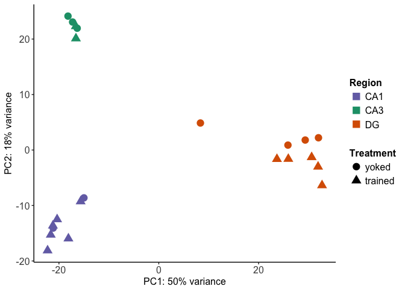
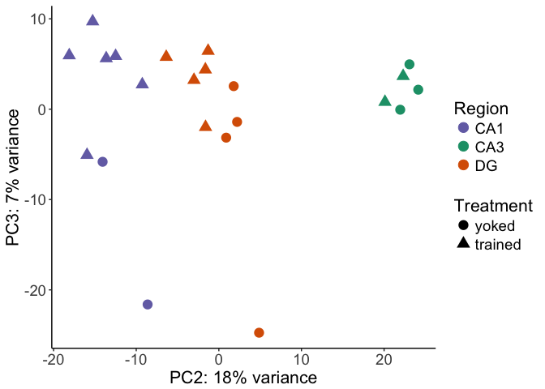
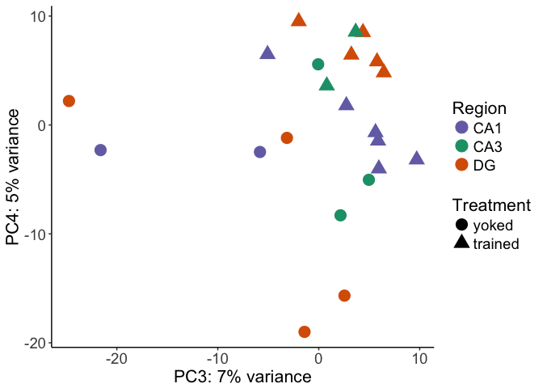
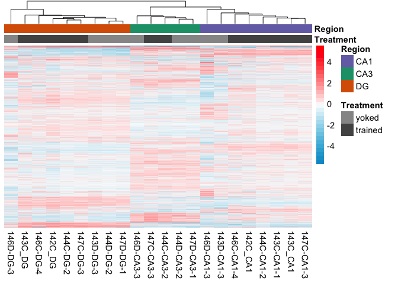
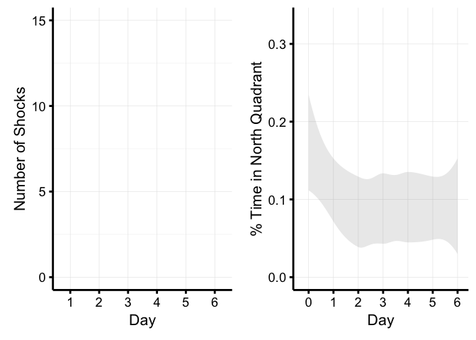
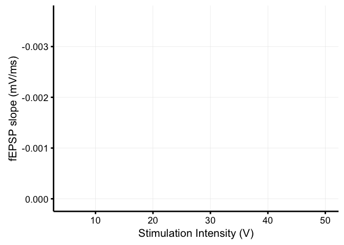
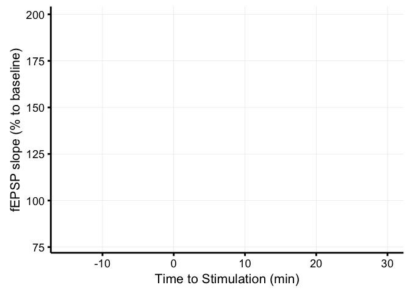

All together now
----------------

Combining the two previous analyses

    #source("http://www.bioconductor.org/biocLite.R")
    #biocLite("DESeq2")
    library(DESeq2)
    #library(magrittr)
    #library(tidyverse)
    #library(reshape2)
    library(VennDiagram)
    library(genefilter)
    library(pheatmap)
    library(cowplot)
    library(RColorBrewer)
    library(dplyr)
    library(plyr)
    library(ggplot2)
    library(colorRamps)
    #library(edgeR)
    # set output file for figures 
    knitr::opts_chunk$set(fig.path = '../figures/03_cognitiontest/')

    # this starts with data genearated from code described in KallistoGather.Rmd
    colData <- read.csv('../data/BehaviorSlimColData.csv')
    rownames(colData) <- colData$RNAseqID
    countData <-  read.csv('../data/BehaviorSlimCountData.csv', check.names = F, row.names = 1)

    #rename revalue things
    colData$Group <- plyr::revalue(colData$Group, c("consistent"="avoidable"))
    colData$Group <- plyr::revalue(colData$Group, c("control"="unavoidable"))

    colData <- rename(colData, c("Group"="Treatment"))
    colData$Treatment <- factor(colData$Treatment, levels = c("unavoidable", "avoidable"))

    dds <- DESeqDataSetFromMatrix(countData = countData,
                                  colData = colData,
                                  design = ~ Treatment + Region + Treatment * Region )
    dds <- dds[ rowSums(counts(dds)) > 2, ] ## filter genes with 0 counts
    dds <- DESeq(dds) # Differential expression analysis

    FALSE estimating size factors

    FALSE estimating dispersions

    FALSE gene-wise dispersion estimates

    FALSE mean-dispersion relationship

    FALSE final dispersion estimates

    FALSE fitting model and testing

    dds

    FALSE class: DESeqDataSet 
    FALSE dim: 16970 22 
    FALSE metadata(1): version
    FALSE assays(3): counts mu cooks
    FALSE rownames(16970): 0610007P14Rik 0610009B22Rik ... Zzef1 Zzz3
    FALSE rowData names(37): baseMean baseVar ... deviance maxCooks
    FALSE colnames(22): 142C_CA1 142C_DG ... 147D-CA3-1 147D-DG-1
    FALSE colData names(15): RNAseqID Mouse ... Date sizeFactor

    ## log transformed data
    rld <- rlog(dds, blind=FALSE)

PCA

    source("DESeqPCAfunction.R")
    source("figureoptions.R")

    # create the dataframe using my function pcadataframe
    pcadata <- pcadataframe(rld, intgroup=c("Treatment", "Region"), returnData=TRUE)
    percentVar <- round(100 * attr(pcadata, "percentVar"))

    pcadata$Treatment <- factor(pcadata$Treatment, levels = c("unavoidable", "avoidable"))

    ## PC1 vs PC2
    plotPC1PC2(aescolor = pcadata$Region, colorname = "Region", aesshape = pcadata$Treatment, shapename = "Treatment", colorvalues = colorvalRegion)

    # PC1 vs PC2 for adobe
    myplot <- plotPC1PC2(aescolor = pcadata$Region, colorname = "Region", aesshape = pcadata$Treatment, shapename = "Treatment", colorvalues = colorvalRegion)
    pdf(file="../figures/03_cognitiontest/PCA-1.pdf", width=4.5, height=3)
    plot(myplot)
    dev.off()

    FALSE quartz_off_screen 
    FALSE                 2

    ## PC2 vs PC3
    plotPC2PC3(aescolor = pcadata$Region, colorname = "Region", aesshape = pcadata$Treatment, shapename = "Treatment", colorvalues = colorvalRegion)

    plotPC3PC4(aescolor = pcadata$Region, colorname = "Region", aesshape = pcadata$Treatment, shapename = "Treatment", colorvalues = colorvalRegion)

    ## statistics
    aov1 <- aov(PC1 ~ Region, data=pcadata)
    summary(aov1) 

    FALSE             Df Sum Sq Mean Sq F value   Pr(>F)    
    FALSE Region       2  10887    5443   199.3 1.78e-13 ***
    FALSE Residuals   19    519      27                     
    FALSE ---
    FALSE Signif. codes:  0 '***' 0.001 '**' 0.01 '*' 0.05 '.' 0.1 ' ' 1

    TukeyHSD(aov1, which = "Region") 

    FALSE   Tukey multiple comparisons of means
    FALSE     95% family-wise confidence level
    FALSE 
    FALSE Fit: aov(formula = PC1 ~ Region, data = pcadata)
    FALSE 
    FALSE $Region
    FALSE              diff       lwr       upr     p adj
    FALSE CA3-CA1  2.419769 -5.149283  9.988821 0.7002216
    FALSE DG-CA1  46.138194 39.686734 52.589654 0.0000000
    FALSE DG-CA3  43.718425 36.312871 51.123979 0.0000000

    aov2 <- aov(PC2 ~ Region, data=pcadata)
    summary(aov2) 

    FALSE             Df Sum Sq Mean Sq F value   Pr(>F)    
    FALSE Region       2   3934  1966.9   220.4 7.15e-14 ***
    FALSE Residuals   19    170     8.9                     
    FALSE ---
    FALSE Signif. codes:  0 '***' 0.001 '**' 0.01 '*' 0.05 '.' 0.1 ' ' 1

    TukeyHSD(aov2, which = "Region") 

    FALSE   Tukey multiple comparisons of means
    FALSE     95% family-wise confidence level
    FALSE 
    FALSE Fit: aov(formula = PC2 ~ Region, data = pcadata)
    FALSE 
    FALSE $Region
    FALSE              diff        lwr       upr p adj
    FALSE CA3-CA1  35.74129  31.414508  40.06807 0e+00
    FALSE DG-CA1   12.96556   9.277639  16.65348 1e-07
    FALSE DG-CA3  -22.77573 -27.009049 -18.54241 0e+00

    aov5 <- aov(PC3 ~ Region, data=pcadata)
    summary(aov5) 

    FALSE             Df Sum Sq Mean Sq F value Pr(>F)
    FALSE Region       2   36.2   18.10   0.233  0.794
    FALSE Residuals   19 1476.2   77.69

    TukeyHSD(aov5, which = "Region") 

    FALSE   Tukey multiple comparisons of means
    FALSE     95% family-wise confidence level
    FALSE 
    FALSE Fit: aov(formula = PC3 ~ Region, data = pcadata)
    FALSE 
    FALSE $Region
    FALSE               diff       lwr       upr     p adj
    FALSE CA3-CA1  2.6303153 -10.13527 15.395904 0.8608940
    FALSE DG-CA1  -0.6625392 -11.54325 10.218174 0.9869035
    FALSE DG-CA3  -3.2928546 -15.78270  9.196987 0.7835557

    aov3 <- aov(PC1 ~ Treatment, data=pcadata)
    summary(aov3) 

    FALSE             Df Sum Sq Mean Sq F value Pr(>F)
    FALSE Treatment    1     11    10.9   0.019  0.892
    FALSE Residuals   20  11395   569.7

    TukeyHSD(aov3, which = "Treatment")

    FALSE   Tukey multiple comparisons of means
    FALSE     95% family-wise confidence level
    FALSE 
    FALSE Fit: aov(formula = PC1 ~ Treatment, data = pcadata)
    FALSE 
    FALSE $Treatment
    FALSE                            diff       lwr      upr     p adj
    FALSE avoidable-unavoidable -1.429518 -23.02022 20.16119 0.8915334

    aov4 <- aov(PC2 ~ Treatment, data=pcadata)
    summary(aov4) 

    FALSE             Df Sum Sq Mean Sq F value Pr(>F)  
    FALSE Treatment    1    595   594.6   3.389 0.0805 .
    FALSE Residuals   20   3509   175.4                 
    FALSE ---
    FALSE Signif. codes:  0 '***' 0.001 '**' 0.01 '*' 0.05 '.' 0.1 ' ' 1

    TukeyHSD(aov4, which = "Treatment") 

    FALSE   Tukey multiple comparisons of means
    FALSE     95% family-wise confidence level
    FALSE 
    FALSE Fit: aov(formula = PC2 ~ Treatment, data = pcadata)
    FALSE 
    FALSE $Treatment
    FALSE                            diff       lwr      upr     p adj
    FALSE avoidable-unavoidable -10.57404 -22.55491 1.406832 0.0805024

    aov6 <- aov(PC3 ~ Treatment, data=pcadata)
    summary(aov6) 

    FALSE             Df Sum Sq Mean Sq F value Pr(>F)  
    FALSE Treatment    1  417.6   417.6   7.629  0.012 *
    FALSE Residuals   20 1094.8    54.7                 
    FALSE ---
    FALSE Signif. codes:  0 '***' 0.001 '**' 0.01 '*' 0.05 '.' 0.1 ' ' 1

    TukeyHSD(aov6, which = "Treatment") 

    FALSE   Tukey multiple comparisons of means
    FALSE     95% family-wise confidence level
    FALSE 
    FALSE Fit: aov(formula = PC3 ~ Treatment, data = pcadata)
    FALSE 
    FALSE $Treatment
    FALSE                           diff      lwr      upr     p adj
    FALSE avoidable-unavoidable 8.861214 2.169019 15.55341 0.0120232

    aov7 <- aov(PC4 ~ Treatment, data=pcadata)
    summary(aov7) 

    FALSE             Df Sum Sq Mean Sq F value Pr(>F)   
    FALSE Treatment    1  401.3   401.3   10.43 0.0042 **
    FALSE Residuals   20  769.5    38.5                  
    FALSE ---
    FALSE Signif. codes:  0 '***' 0.001 '**' 0.01 '*' 0.05 '.' 0.1 ' ' 1

    TukeyHSD(aov7, which = "Treatment") 

    FALSE   Tukey multiple comparisons of means
    FALSE     95% family-wise confidence level
    FALSE 
    FALSE Fit: aov(formula = PC4 ~ Treatment, data = pcadata)
    FALSE 
    FALSE $Treatment
    FALSE                           diff      lwr      upr     p adj
    FALSE avoidable-unavoidable 8.686785 3.076081 14.29749 0.0042023

    lm1 <- lm(PC1~Region*Treatment, data=pcadata)
    summary(lm1)

    FALSE 
    FALSE Call:
    FALSE lm(formula = PC1 ~ Region * Treatment, data = pcadata)
    FALSE 
    FALSE Residuals:
    FALSE      Min       1Q   Median       3Q      Max 
    FALSE -15.5454  -1.6562   0.0076   2.7007   8.1065 
    FALSE 
    FALSE Coefficients:
    FALSE                              Estimate Std. Error t value Pr(>|t|)    
    FALSE (Intercept)                  -18.0745     3.7753  -4.788 0.000201 ***
    FALSE RegionCA3                      0.8076     4.8739   0.166 0.870477    
    FALSE RegionDG                      41.9626     4.6238   9.075 1.04e-07 ***
    FALSE Treatmentavoidable            -1.8002     4.3594  -0.413 0.685126    
    FALSE RegionCA3:Treatmentavoidable   2.4553     6.5391   0.375 0.712229    
    FALSE RegionDG:Treatmentavoidable    6.8860     5.6420   1.220 0.239962    
    FALSE ---
    FALSE Signif. codes:  0 '***' 0.001 '**' 0.01 '*' 0.05 '.' 0.1 ' ' 1
    FALSE 
    FALSE Residual standard error: 5.339 on 16 degrees of freedom
    FALSE Multiple R-squared:   0.96,   Adjusted R-squared:  0.9475 
    FALSE F-statistic: 76.82 on 5 and 16 DF,  p-value: 1.309e-10

    anova(lm1) 

    FALSE Analysis of Variance Table
    FALSE 
    FALSE Response: PC1
    FALSE                  Df  Sum Sq Mean Sq  F value    Pr(>F)    
    FALSE Region            2 10886.9  5443.4 190.9550 6.834e-12 ***
    FALSE Treatment         1    17.9    17.9   0.6281    0.4397    
    FALSE Region:Treatment  2    45.0    22.5   0.7884    0.4714    
    FALSE Residuals        16   456.1    28.5                       
    FALSE ---
    FALSE Signif. codes:  0 '***' 0.001 '**' 0.01 '*' 0.05 '.' 0.1 ' ' 1

    lm2 <- lm(PC2~Region*Treatment, data=pcadata)
    summary(lm2)

    FALSE 
    FALSE Call:
    FALSE lm(formula = PC2 ~ Region * Treatment, data = pcadata)
    FALSE 
    FALSE Residuals:
    FALSE    Min     1Q Median     3Q    Max 
    FALSE -3.986 -1.139 -0.104  1.168  4.856 
    FALSE 
    FALSE Coefficients:
    FALSE                              Estimate Std. Error t value Pr(>|t|)    
    FALSE (Intercept)                  -11.3447     1.7071  -6.645 5.63e-06 ***
    FALSE RegionCA3                     34.3979     2.2039  15.608 4.21e-11 ***
    FALSE RegionDG                      13.7858     2.0908   6.594 6.18e-06 ***
    FALSE Treatmentavoidable            -2.7766     1.9712  -1.409    0.178    
    FALSE RegionCA3:Treatmentavoidable   0.9291     2.9568   0.314    0.757    
    FALSE RegionDG:Treatmentavoidable   -2.4482     2.5512  -0.960    0.352    
    FALSE ---
    FALSE Signif. codes:  0 '***' 0.001 '**' 0.01 '*' 0.05 '.' 0.1 ' ' 1
    FALSE 
    FALSE Residual standard error: 2.414 on 16 degrees of freedom
    FALSE Multiple R-squared:  0.9773,  Adjusted R-squared:  0.9702 
    FALSE F-statistic: 137.6 on 5 and 16 DF,  p-value: 1.46e-12

    anova(lm2)

    FALSE Analysis of Variance Table
    FALSE 
    FALSE Response: PC2
    FALSE                  Df Sum Sq Mean Sq  F value    Pr(>F)    
    FALSE Region            2 3933.8 1966.91 337.4576 8.271e-14 ***
    FALSE Treatment         1   65.8   65.77  11.2839   0.00399 ** 
    FALSE Region:Treatment  2   10.6    5.28   0.9054   0.42414    
    FALSE Residuals        16   93.3    5.83                       
    FALSE ---
    FALSE Signif. codes:  0 '***' 0.001 '**' 0.01 '*' 0.05 '.' 0.1 ' ' 1

    ## DEG by contrasts
    source("resvalsfunction.R")
    contrast1 <- resvals(contrastvector = c('Region', 'CA1', 'DG'), mypval = 0.1)

    ## [1] 3919
    ## [1] 1546

    contrast2 <- resvals(contrastvector = c('Region', 'CA3', 'DG'), mypval = 0.1)

    ## [1] 4690
    ## [1] 2664

    contrast3 <- resvals(contrastvector = c('Region', 'CA1', 'CA3'), mypval = 0.1)

    ## [1] 3745
    ## [1] 1194

    contrast4 <- resvals(contrastvector = c('Treatment', 'avoidable', 'unavoidable'), mypval = 0.1)

    ## [1] 3041
    ## [1] 285

Now, we can view a histogram of the distribution

    ## [1] 1

    ## [1] 1

    ## [1] 1

    ## [1] 1

This Venn Diagram sthe overlap of differentailly expression genes by
Region and method. This shows all genes with *adjusted* pvalue &lt;0.1.

Heatmaps

    ## Any padj <0.1
    DEGes <- assay(rld)
    DEGes <- cbind(DEGes, contrast1, contrast2, contrast3, contrast4)
    DEGes <- as.data.frame(DEGes) # convert matrix to dataframe
    DEGes$rownames <- rownames(DEGes)  # add the rownames to the dataframe

    DEGes$padjmin <- with(DEGes, pmin(padjTreatmentavoidableunavoidable, padjRegionCA1DG ,padjRegionCA3DG, padjRegionCA1CA3 )) # put the min pvalue in a new column
    DEGes <- DEGes %>% filter(padjmin < 0.1)

    rownames(DEGes) <- DEGes$rownames
    drop.cols <-colnames(DEGes[,grep("padj|pval|rownames", colnames(DEGes))])
    DEGes <- DEGes %>% select(-one_of(drop.cols))
    DEGes <- as.matrix(DEGes)
    DEGes <- DEGes - rowMeans(DEGes)

    # setting color options
    source("figureoptions.R")
    ann_colors <- ann_colorsbehavior
    colorpalette <- cembrowskicolors
    df <- as.data.frame(colData(dds)[,c("Treatment", "Region")])
    paletteLength <- 30
    myBreaks <- c(seq(min(DEGes), 0, length.out=ceiling(paletteLength/2) + 1), 
                  seq(max(DEGes)/paletteLength, max(DEGes), length.out=floor(paletteLength/2)))

    pheatmap(DEGes, show_colnames=F, show_rownames = F,
             annotation_col=df, annotation_colors = ann_colors,
             fontsize = 12, fontsize_row = 7, 
             cellwidth = 10, 
             border_color = "grey60" ,
             color = colorpalette,
             clustering_distance_cols="correlation" ,
             breaks=myBreaks,
             clustering_method="average"
             )

    # for adobe
    pheatmap(DEGes, show_colnames=F, show_rownames = F,
             annotation_col=df, annotation_colors = ann_colors,
             treeheight_row = 0, treeheight_col = 25,
             fontsize = 11, 
             width=4.5, height=3,
             border_color = "grey60" ,
             color = colorpalette,
             cellwidth = 11, 
             filename = "../figures/03_cognitiontest/HeatmapPadj-1.pdf",
             clustering_distance_cols="correlation" ,
             breaks=myBreaks,
             clustering_method="average"
             )

    ## Any pvalue <0.1
    DEGes <- assay(rld)
    DEGes <- cbind(DEGes, contrast1, contrast2, contrast3, contrast4)
    DEGes <- as.data.frame(DEGes) # convert matrix to dataframe
    DEGes$rownames <- rownames(DEGes)  # add the rownames to the dataframe

    DEGes$pvalmin <- with(DEGes, pmin(pvalTreatmentavoidableunavoidable, pvalRegionCA1DG ,pvalRegionCA3DG, pvalRegionCA1CA3 )) # put the min pvalue in a new column
    DEGes <- DEGes %>% filter(pvalmin < 0.1)

    rownames(DEGes) <- DEGes$rownames
    drop.cols <-colnames(DEGes[,grep("padj|pval|rownames", colnames(DEGes))])
    DEGes <- DEGes %>% select(-one_of(drop.cols))
    DEGes <- as.matrix(DEGes)
    DEGes <- DEGes - rowMeans(DEGes)

    # setting color options
    source("figureoptions.R")
    ann_colors <- ann_colorsbehavior
    colorpalette <- cembrowskicolors
    df <- as.data.frame(colData(dds)[,c("Treatment", "Region")])

    paletteLength <- 30
    myBreaks <- c(seq(min(DEGes), 0, length.out=ceiling(paletteLength/2) + 1), 
                  seq(max(DEGes)/paletteLength, max(DEGes), length.out=floor(paletteLength/2)))

    # for markdown file
    pheatmap(DEGes, show_colnames=T, show_rownames = F,
             annotation_col=df, annotation_colors = ann_colors,
             treeheight_row = 0, treeheight_col = 25,
             fontsize = 11, 
             border_color = "grey60" ,
             color = colorpalette,
             clustering_method="average",
             breaks=myBreaks,
             clustering_distance_cols="correlation" 
             )

    # for adobe
    pheatmap(DEGes, show_colnames=F, show_rownames = F,
             annotation_col=df, annotation_colors = ann_colors,
             treeheight_row = 0, treeheight_col = 25,
             fontsize = 11, 
             width=4.5, height=3,
             border_color = "grey60" ,
             color = colorpalette,
             cellwidth = 8, 
             filename = "../figures/03_cognitiontest/HeatmapPadj-1.pdf",
             clustering_method="average",
             breaks=myBreaks,
             clustering_distance_cols="correlation" 
             )

    FALSE 
    FALSE FALSE  TRUE 
    FALSE  8889   504

    FALSE 
    FALSE FALSE  TRUE 
    FALSE 14951  2000

    FALSE log2 fold change (MLE): Treatment avoidable vs unavoidable 
    FALSE Wald test p-value: Treatment avoidable vs unavoidable 
    FALSE DataFrame with 6 rows and 6 columns
    FALSE                baseMean log2FoldChange     lfcSE       stat    pvalue
    FALSE               <numeric>      <numeric> <numeric>  <numeric> <numeric>
    FALSE 0610007P14Rik 28.312171     -0.4917430 0.5416911 -0.9077924 0.3639879
    FALSE 0610009B22Rik  7.764007      1.1336111 1.1791370  0.9613905 0.3363559
    FALSE 0610009L18Rik  3.652118      2.3345187 1.9670998  1.1867820 0.2353136
    FALSE 0610009O20Rik 58.892418      0.6145425 0.3810066  1.6129444 0.1067566
    FALSE 0610010F05Rik 10.601326      0.1150379 0.7181401  0.1601886 0.8727325
    FALSE 0610010K14Rik  1.780900     -1.3461274 1.1956145 -1.1258875 0.2602132
    FALSE                    padj
    FALSE               <numeric>
    FALSE 0610007P14Rik 0.6743469
    FALSE 0610009B22Rik        NA
    FALSE 0610009L18Rik        NA
    FALSE 0610009O20Rik 0.3933625
    FALSE 0610010F05Rik 0.9513260
    FALSE 0610010K14Rik        NA

    FALSE sign
    FALSE   -1    1 
    FALSE 7986 8984

    FALSE quartz_off_screen 
    FALSE                 2

    FALSE Bootstrap (r = 0.5)... Done.
    FALSE Bootstrap (r = 0.6)... Done.
    FALSE Bootstrap (r = 0.7)... Done.
    FALSE Bootstrap (r = 0.8)... Done.
    FALSE Bootstrap (r = 0.9)... Done.
    FALSE Bootstrap (r = 1.0)... Done.
    FALSE Bootstrap (r = 1.1)... Done.
    FALSE Bootstrap (r = 1.2)... Done.
    FALSE Bootstrap (r = 1.3)... Done.
    FALSE Bootstrap (r = 1.4)... Done.

