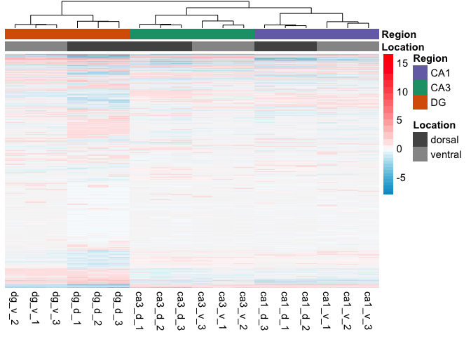

Cembrowski et all data reanalyzed
---------------------------------

This ([2016 Cembrowski
paper](https://elifesciences.org/content/5/e14997#fig1s30)) is very
similar to my experiment, so I want to compare the two. Like mine, they
compare hippocampal gene expression from dorsal CA1, CA3, and DG sub
regions. These cells were identifed through fac sorting to isolate
genetically labeled CA1 and CA3 pyramical neurons and DG granular cells.

Before beginning, I used the following UNIX commands to get their data.

This data was made available here [open source
data](https://www.janelia.org/lab/spruston-lab/resources/source-data-simulation-code-other-resources),
but I downloaded it from the GenBank archive using the following
commands:

    mkdir ../data/Cembrowski
    cd ../data/Cembrowski
    wget 'ftp://ftp.ncbi.nlm.nih.gov/geo/series/GSE74nnn/GSE74985/suppl/GSE74985_gene_exp.diff.gz'
    wget 'ftp://ftp.ncbi.nlm.nih.gov/geo/series/GSE74nnn/GSE74985/suppl/GSE74985_genes.fpkm_tracking.gz'
    wget 'ftp://ftp.ncbi.nlm.nih.gov/geo/series/GSE74nnn/GSE74985/suppl/GSE74985_genes.read_group_tracking.txt.gz'
    wget 'ftp://ftp.ncbi.nlm.nih.gov/geo/series/GSE74nnn/GSE74985/suppl/GSE74985_mergedCount.txt.gz'
    gunzip *.gz
    gzip GSE74985_genes.fpkm_tracking
    cd ../../bin

The GSE74985\_genes.fpkm\_tracking file is used to extract the gene
names with the corresponding ensembl gene id. The file must be unzipped
for use in R, but it must be zipped in order to store it on GitHub. The
4985\_mergedCount.txt file is used for gene expression analyis in R.

The first thing I notice is that they have waay more reads per sample
and thus gene counts per sample than I do. They have a mean gene counts
per sample around 400 million counts per gene. My data had 5 million
counts per gene.

This gene has the smalled pvalue of any in the DESeq model. It nicely
shows the dyanmic range of a gene's expression from roughly 1,000 to
20,000 counts.

    dds <- DESeqDataSetFromMatrix(countData = countData,
                                  colData = colData,
                                  design = ~ Region + Location + Region * Location )

    FALSE converting counts to integer mode

    dds <- dds[ rowSums(counts(dds)) > 2, ] ## filter genes with 0 counts
    dds <- DESeq(dds) # Differential expression analysis

    FALSE estimating size factors

    FALSE estimating dispersions

    FALSE gene-wise dispersion estimates

    FALSE mean-dispersion relationship

    FALSE final dispersion estimates

    FALSE fitting model and testing

    dds

    FALSE class: DESeqDataSet 
    FALSE dim: 23154 18 
    FALSE metadata(1): version
    FALSE assays(3): counts mu cooks
    FALSE rownames(23154): 0610005C13Rik 0610007C21Rik ... Zzef1 Zzz3
    FALSE rowData names(37): baseMean baseVar ... deviance maxCooks
    FALSE colnames(18): dg_d_1 dg_d_2 ... ca1_v_2 ca1_v_3
    FALSE colData names(4): RNAseqID Region Location sizeFactor

    ## for variance stablized gene expression and log transformed data
    rld <- rlog(dds, blind=FALSE)

This PCA shows fantastic separation of all 6 sample types included in
the anlaysis. DGs are separated from CAs by prcinciple compoent 1. CA1
and CA3 separate by princinple compent 2. Dorsal ventral groups are
separated more along the diagonals.

These are two heatmaps that I recreated with their data. Thousands of
genes are differntially expression at p &lt; 0.001 so I keep make the
threshold more and more stringent until I got these plots.

The top heatmap shows clean separation of each of the 6 groups. Dorsal
CA1 are most different from the rest. Ventral CA1 and CA3 are similar to
one another and to ventral CA3. DGs cluster well.

The bottom heat map is a much less stringent cutoff and this one cleanly
separates first by brain region and then by dorsal ventral location.

    FALSE Bootstrap (r = 0.5)... Done.
    FALSE Bootstrap (r = 0.6)... Done.
    FALSE Bootstrap (r = 0.7)... Done.
    FALSE Bootstrap (r = 0.8)... Done.
    FALSE Bootstrap (r = 0.9)... Done.
    FALSE Bootstrap (r = 1.0)... Done.
    FALSE Bootstrap (r = 1.1)... Done.
    FALSE Bootstrap (r = 1.2)... Done.
    FALSE Bootstrap (r = 1.3)... Done.
    FALSE Bootstrap (r = 1.4)... Done.

