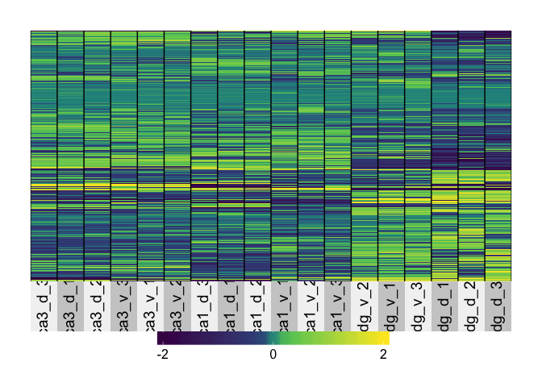
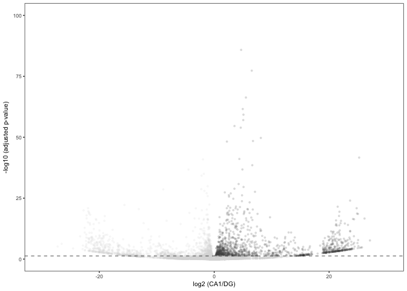

Cembrowski et all data reanalyzed
---------------------------------

This ([2016 Cembrowski
paper](https://elifesciences.org/content/5/e14997#fig1s30)) is very
similar to my experiment, so I want to compare the two. Like mine, they
compare hippocampal gene expression from dorsal CA1, CA3, and DG sub
regions. These cells were identifed through fac sorting to isolate
genetically labeled CA1 and CA3 pyramical neurons and DG granular cells.

Before beginning, I used the following UNIX commands to get their data.

This data was made available here [open source
data](https://www.janelia.org/lab/spruston-lab/resources/source-data-simulation-code-other-resources),
but I downloaded it from the GenBank archive using the following
commands:

    mkdir ../data/Cembrowski
    cd ../data/Cembrowski
    wget 'ftp://ftp.ncbi.nlm.nih.gov/geo/series/GSE74nnn/GSE74985/suppl/GSE74985_gene_exp.diff.gz'
    wget 'ftp://ftp.ncbi.nlm.nih.gov/geo/series/GSE74nnn/GSE74985/suppl/GSE74985_genes.fpkm_tracking.gz'
    wget 'ftp://ftp.ncbi.nlm.nih.gov/geo/series/GSE74nnn/GSE74985/suppl/GSE74985_genes.read_group_tracking.txt.gz'
    wget 'ftp://ftp.ncbi.nlm.nih.gov/geo/series/GSE74nnn/GSE74985/suppl/GSE74985_mergedCount.txt.gz'
    gunzip *.gz
    gzip GSE74985_genes.fpkm_tracking
    cd ../../bin

The GSE74985\_genes.fpkm\_tracking file is used to extract the gene
names with the corresponding ensembl gene id. The file must be unzipped
for use in R, but it must be zipped in order to store it on GitHub. The
4985\_mergedCount.txt file is used for gene expression analyis in R.

The first thing I notice is that they have waay more reads per sample
and thus gene counts per sample than I do. They have a mean gene counts
per sample around 400 million counts per gene. My data had 5 million
counts per gene.

This gene has the smalled pvalue of any in the DESeq model. It nicely
shows the dyanmic range of a gene's expression from roughly 1,000 to
20,000 counts.

    dds <- DESeqDataSetFromMatrix(countData = countData,
                                  colData = colData,
                                  design = ~ Region + Location + Region * Location )

    FALSE converting counts to integer mode

    dds <- dds[ rowSums(counts(dds)) > 2, ] ## filter genes with 0 counts
    dds <- DESeq(dds) # Differential expression analysis

    FALSE estimating size factors

    FALSE estimating dispersions

    FALSE gene-wise dispersion estimates

    FALSE mean-dispersion relationship

    FALSE final dispersion estimates

    FALSE fitting model and testing

    dds

    FALSE class: DESeqDataSet 
    FALSE dim: 23154 18 
    FALSE metadata(1): version
    FALSE assays(3): counts mu cooks
    FALSE rownames(23154): 0610005C13Rik 0610007C21Rik ... Zzef1 Zzz3
    FALSE rowData names(37): baseMean baseVar ... deviance maxCooks
    FALSE colnames(18): dg_d_1 dg_d_2 ... ca1_v_2 ca1_v_3
    FALSE colData names(4): RNAseqID Region Location sizeFactor

    ## for variance stablized gene expression and log transformed data
    rld <- rlog(dds, blind=FALSE)

This PCA shows fantastic separation of all 6 sample types included in
the anlaysis. DGs are separated from CAs by prcinciple compoent 1. CA1
and CA3 separate by princinple compent 2. Dorsal ventral groups are
separated more along the diagonals.

For number look here!!!
=======================

    ##    Location            Region         
    ##  Length:18          Length:18         
    ##  Class :character   Class :character  
    ##  Mode  :character   Mode  :character

    ## [1] 34262    18

    dim(rld)

    FALSE [1] 23154    18

    aov1 <- aov(PC1 ~ Region, data=pcadata)
    summary(aov1) 

    FALSE             Df Sum Sq Mean Sq F value   Pr(>F)    
    FALSE Region       2  24132   12066   112.9 9.11e-10 ***
    FALSE Residuals   15   1604     107                     
    FALSE ---
    FALSE Signif. codes:  0 '***' 0.001 '**' 0.01 '*' 0.05 '.' 0.1 ' ' 1

    TukeyHSD(aov1, which = "Region") 

    FALSE   Tukey multiple comparisons of means
    FALSE     95% family-wise confidence level
    FALSE 
    FALSE Fit: aov(formula = PC1 ~ Region, data = pcadata)
    FALSE 
    FALSE $Region
    FALSE               diff       lwr       upr     p adj
    FALSE CA3-CA1  -3.499322 -19.00559  12.00695 0.8294963
    FALSE DG-CA1  -79.362502 -94.86877 -63.85623 0.0000000
    FALSE DG-CA3  -75.863180 -91.36945 -60.35691 0.0000000

    aov2 <- aov(PC2 ~ Region, data=pcadata)
    summary(aov2) 

    FALSE             Df Sum Sq Mean Sq F value   Pr(>F)    
    FALSE Region       2   8977    4489   198.4 1.63e-11 ***
    FALSE Residuals   15    339      23                     
    FALSE ---
    FALSE Signif. codes:  0 '***' 0.001 '**' 0.01 '*' 0.05 '.' 0.1 ' ' 1

    TukeyHSD(aov2, which = "Region") 

    FALSE   Tukey multiple comparisons of means
    FALSE     95% family-wise confidence level
    FALSE 
    FALSE Fit: aov(formula = PC2 ~ Region, data = pcadata)
    FALSE 
    FALSE $Region
    FALSE              diff       lwr       upr p adj
    FALSE CA3-CA1 -54.68846 -61.82206 -47.55486 0e+00
    FALSE DG-CA1  -26.26829 -33.40189 -19.13468 3e-07
    FALSE DG-CA3   28.42017  21.28657  35.55378 1e-07

    aov3 <- aov(PC3 ~ Location, data=pcadata)
    summary(aov3) 

    FALSE             Df Sum Sq Mean Sq F value   Pr(>F)    
    FALSE Location     1   5807    5807   61.06 7.51e-07 ***
    FALSE Residuals   16   1522      95                     
    FALSE ---
    FALSE Signif. codes:  0 '***' 0.001 '**' 0.01 '*' 0.05 '.' 0.1 ' ' 1

    aov4 <- aov(PC4 ~ Location, data=pcadata)
    summary(aov4) 

    FALSE             Df Sum Sq Mean Sq F value Pr(>F)
    FALSE Location     1    375   374.7   1.319  0.268
    FALSE Residuals   16   4546   284.1

These are two heatmaps that I recreated with their data. Thousands of
genes are differntially expression at p &lt; 0.001 so I keep make the
threshold more and more stringent until I got these plots.

The top heatmap shows clean separation of each of the 6 groups. Dorsal
CA1 are most different from the rest. Ventral CA1 and CA3 are similar to
one another and to ventral CA3. DGs cluster well.

The bottom heat map is a much less stringent cutoff and this one cleanly
separates first by brain region and then by dorsal ventral location.

    # gene lists
    res <- results(dds, contrast =c("Region", "CA1", "DG"), independentFiltering = T, alpha = 0.05)
    summary(res)

    ## 
    ## out of 23154 with nonzero total read count
    ## adjusted p-value < 0.05
    ## LFC > 0 (up)     : 3702, 16% 
    ## LFC < 0 (down)   : 3018, 13% 
    ## outliers [1]     : 2872, 12% 
    ## low counts [2]   : 1262, 5.5% 
    ## (mean count < 4)
    ## [1] see 'cooksCutoff' argument of ?results
    ## [2] see 'independentFiltering' argument of ?results

    resOrdered <- res[order(res$padj),]
    head(resOrdered, 10)

    ## log2 fold change (MLE): Region CA1 vs DG 
    ## Wald test p-value: Region CA1 vs DG 
    ## DataFrame with 10 rows and 6 columns
    ##                baseMean log2FoldChange     lfcSE      stat        pvalue
    ##               <numeric>      <numeric> <numeric> <numeric>     <numeric>
    ## Sv2b          584755.27       7.970063 0.1548625  51.46542  0.000000e+00
    ## Lrrtm4         23232.31      -9.591277 0.3099813 -30.94147 3.309256e-210
    ## Runx1t1        43202.00       8.301786 0.2752856  30.15699 8.684870e-200
    ## Neurod6       152447.01      10.814101 0.3649548  29.63134 5.899724e-193
    ## Dkk3          232316.96       8.824865 0.3065822  28.78466 3.337644e-182
    ## Dlc1           24692.86       7.144761 0.2610041  27.37414 5.574018e-165
    ## Pde1a         327902.32       4.735296 0.1783788  26.54629 2.834344e-155
    ## 1810041L15Rik  39700.89      -7.409121 0.3062918 -24.18974 2.852625e-129
    ## St8sia5        12509.38       7.369934 0.3047098  24.18673 3.068703e-129
    ## Kctd4          49308.11      -7.160393 0.3027077 -23.65448 1.061366e-123
    ##                        padj
    ##                   <numeric>
    ## Sv2b           0.000000e+00
    ## Lrrtm4        3.147102e-206
    ## Runx1t1       5.506208e-196
    ## Neurod6       2.805319e-189
    ## Dkk3          1.269640e-178
    ## Dlc1          1.766964e-161
    ## Pde1a         7.701317e-152
    ## 1810041L15Rik 6.485192e-126
    ## St8sia5       6.485192e-126
    ## Kctd4         2.018718e-120

    data <- data.frame(gene = row.names(res), pvalue = -log10(res$padj), lfc = res$log2FoldChange)
    data <- na.omit(data)
    data <- data %>%
      mutate(color = ifelse(data$lfc > 0 & data$pvalue > 1.3, 
                            yes = "CA1", 
                            no = ifelse(data$lfc < 0 & data$pvalue > 1.3, 
                                        yes = "DG", 
                                        no = "none")))
    top_labelled <- top_n(data, n = 5, wt = pvalue)

    # Color corresponds to fold change directionality
    colored <- ggplot(data, aes(x = lfc, y = pvalue)) + 
      geom_point(aes(color = factor(color)), size = 1, alpha = 0.2, na.rm = T) + # add gene points
      theme_bw(base_size = 8) + # clean up theme
      theme(legend.position = "none") + # remove legend 
      scale_color_manual(values = c("CA1" = "#7570b3",
                                    "DG" = "#d95f02", 
                                    "none" = "#d9d9d9")) + theme(panel.grid.minor=element_blank(),
               panel.grid.major=element_blank()) + 
      scale_x_continuous(name="log2 (CA1/DG)",
                         limits=c(-30, 30)) +
      scale_y_continuous(name="-log10 (adjusted p-value)",
                        limits= c(0, 100)) +
      geom_hline(yintercept = 1.3,  size = 0.25, linetype = 2 )
    colored

    #cvd_grid(colored) # to view plot for color blind 
    pdf(file="../figures/04_Cembrowski/AllCA1DG.pdf", width=1.5, height=1.75)
    plot(colored)
    dev.off()

    ## quartz_off_screen 
    ##                 2
