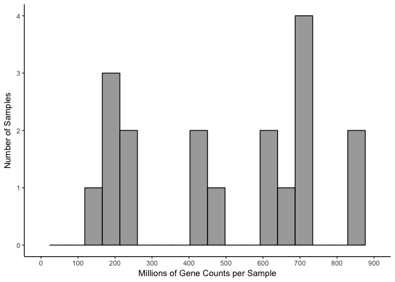
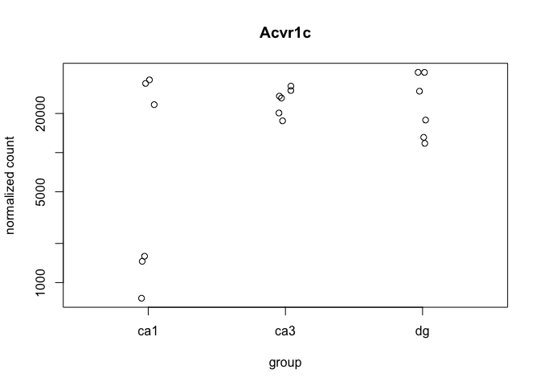
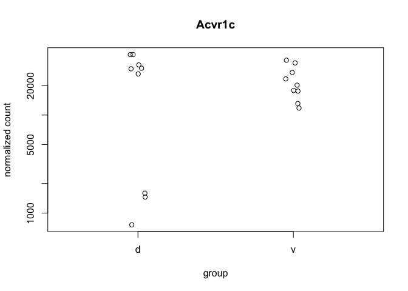
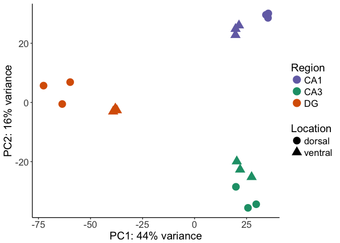
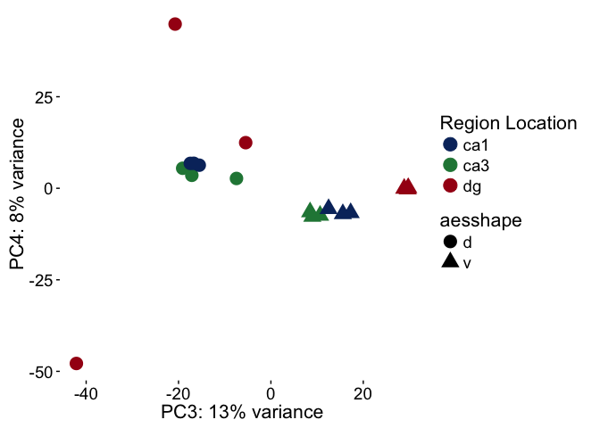
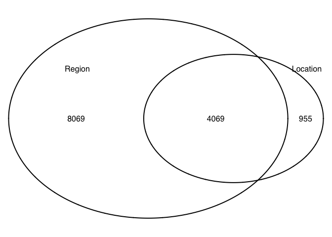

Methods for Dorsal Hippocampal Gene Expression Profiling
--------------------------------------------------------

#### Part 3: Examining fac-sorted pyramindal neurons from CA1 and CA3 as well as granular cells from DG from Cembrowski et al 2016.

This ([2016 Cembrowski
paper](https://elifesciences.org/content/5/e14997#fig1s30)) is very
similar to my experiment, so I want to compare the two. Like mine, they
compare hippocampal gene expression from dorsal CA1, CA3, and DG sub
regions. These cells were identifed through fac sorting to isolate
genetically labeled CA1 and CA3 pyramical neurons and DG granular cells.

Before beginning, I used the following UNIX commands to get their data.

This data was made available here [open source
data](https://www.janelia.org/lab/spruston-lab/resources/source-data-simulation-code-other-resources),
but I downloaded it from the GenBank archive using the following
commands: ~~ mkdir ../data/Cembrowski cd ../data/Cembrowski
wget
'<ftp://ftp.ncbi.nlm.nih.gov/geo/series/GSE74nnn/GSE74985/suppl/GSE74985_gene_exp.diff.gz>'
wget
'<ftp://ftp.ncbi.nlm.nih.gov/geo/series/GSE74nnn/GSE74985/suppl/GSE74985_genes.fpkm_tracking.gz>'
wget
'<ftp://ftp.ncbi.nlm.nih.gov/geo/series/GSE74nnn/GSE74985/suppl/GSE74985_genes.read_group_tracking.txt.gz>'
wget
'<ftp://ftp.ncbi.nlm.nih.gov/geo/series/GSE74nnn/GSE74985/suppl/GSE74985_mergedCount.txt.gz>'
gunzip \*.gz gzip GSE74985\_genes.fpkm\_tracking cd ../../bin
~~

The GSE74985\_genes.fpkm\_tracking file is used to extract the gene
names with the corresponding ensembl gene id. The file must be unzipped
for use in R, but it must be zipped in order to store it on GitHub. The
4985\_mergedCount.txt file is used for gene expression analyis in R.

The first thing I notice is that they have waay more reads per sample
and thus gene counts per sample than I do. They have a mean gene counts
per sample around 400 million counts per gene. My data had 5 million
counts per gene.

This gene has the smalled pvalue of any in the DESeq model. It nicely
shows the dyanmic range of a gene's expression from roughly 1,000 to
20,000 counts.

This PCA shows fantastic separation of all 6 sample types included in
the anlaysis. DGs are separated from CAs by prcinciple compoent 1. CA1
and CA3 separate by princinple compent 2. Dorsal ventral groups are
separated more along the diagonals.

These are two heatmaps that I recreated with their data. Thousands of
genes are differntially expression at p &lt; 0.001 so I keep make the
threshold more and more stringent until I got these plots.

The top heatmap shows clean separation of each of the 6 groups. Dorsal
CA1 are most different from the rest. Ventral CA1 and CA3 are similar to
one another and to ventral CA3. DGs cluster well.

The bottom heat map is a much less stringent cutoff and this one cleanly
separates first by brain region and then by dorsal ventral location.

\`\`\`{r Heatmap100DEgenes, echo=FALSE, message=FALSE, results='hide',comment=FALSE, warning=FALSE}
===================================================================================================

source("figureoptions.R") \#ann\_colors &lt;- ann\_colorscembrowksi
colorpalette &lt;- cembrowskicolors

nt &lt;- normTransform(dds) \# defaults to log2(x+1) df &lt;-
as.data.frame(colData(dds)\[,c("region", "location")\]) rm(ann\_colors)

DEGes &lt;- as.data.frame(rldpvals) \# convert matrix to dataframe
DEGes$rownames &lt;- rownames(DEGes) \# add the rownames to the dataframe DEGes$padjmin
&lt;- with(DEGes, pmin(pvallocationdv)) \# put the min pvalue in a new
column DEGes &lt;- DEGes %&gt;% filter(padjmin &lt; 0.00000000000000001)
rownames(DEGes) &lt;- DEGes$rownames drop.cols
&lt;-colnames(DEGes\[,grep("padj|pval|rownames", colnames(DEGes))\])
DEGes &lt;- DEGes %&gt;% select(-one\_of(drop.cols)) DEGes &lt;-
as.matrix(DEGes) DEGes &lt;- DEGes - rowMeans(DEGes)

pheatmap(DEGes, show\_colnames=F, show\_rownames = T,
annotation\_col=df, \#annotation\_colors = ann\_colors, fontsize = 12,
fontsize\_row = 7, \#cellwidth=10, cellheight=10, width = 10,
border\_color = "grey60" , color = colorpalette, main = "top DE genes p
&lt;&lt;&lt;&lt;&lt; 0.01" )

DEGes &lt;- as.data.frame(rldpvals) \# convert matrix to dataframe
DEGes$rownames &lt;- rownames(DEGes) \# add the rownames to the dataframe DEGes$padjmin
&lt;- with(DEGes, pmin(pvallocationdv)) \# put the min pvalue in a new
column DEGes &lt;- DEGes %&gt;% filter(padjmin &lt; 0.01)
rownames(DEGes) &lt;- DEGes$rownames drop.cols
&lt;-colnames(DEGes\[,grep("padj|pval|rownames", colnames(DEGes))\])
DEGes &lt;- DEGes %&gt;% select(-one\_of(drop.cols)) DEGes &lt;-
as.matrix(DEGes) DEGes &lt;- DEGes - rowMeans(DEGes)

pheatmap(DEGes, show\_colnames=F, show\_rownames = F,
annotation\_col=df, \#annotation\_colors = ann\_colors, fontsize = 12,
fontsize\_row = 7, \#cellwidth=10, cellheight=10, width = 10,
border\_color = "grey60" , color = colorpalette, main = "top DE genes p
&lt; 0.01" )

pheatmap(DEGes, show\_colnames=F, show\_rownames = F,
annotation\_col=df, \#annotation\_colors = ann\_colors, fontsize = 12,
fontsize\_row = 7, \#cellwidth=10, cellheight=10, width = 10,
border\_color = "grey60" , color = colorpalette, main = "top DE genes p
&lt; 0.01" )

\`\`\`
======
