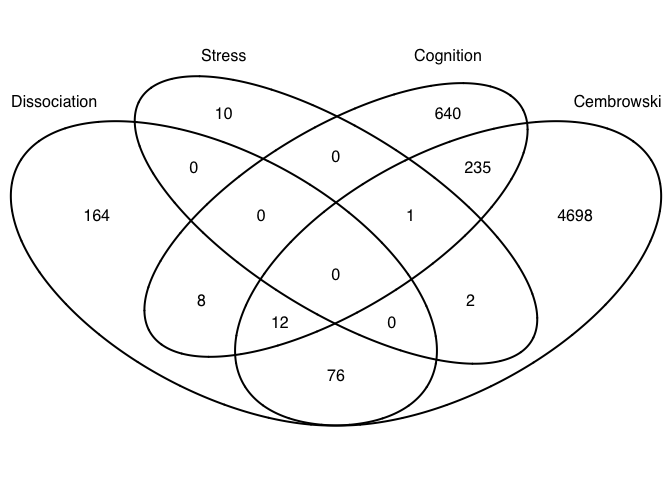
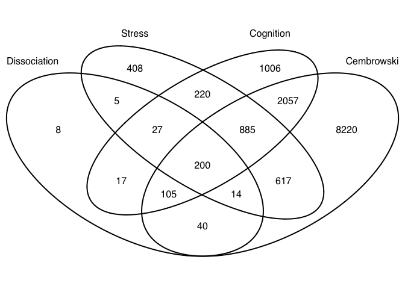

Comparing Rayna's data and the Cembrowski data
----------------------------------------------

    library(VennDiagram)

    ## Loading required package: grid

    ## Loading required package: futile.logger

    # set output file for figures 
    knitr::opts_chunk$set(fig.path = '../figures/05_metaanalyses/')

    dissociation_venn123 <- read.table("../results/01_dissociation_venn123.txt")
    dissociation_venn4 <- read.table("../results/01_dissociation_venn4.txt")
    dissociation_venn1 <- read.table("../results/01_dissociation_venn1.txt")

    stress_venn123 <- read.table("../results/02_stress_venn123.txt")
    #stress_venn4 <- read.table("../results/02_stress_venn4.txt")
    stress_venn1 <- read.table("../results/02_stress_venn1.txt")

    cognition_venn123 <- read.table("../results/03_cognition_venn123.txt")
    cognition_venn4 <- read.table("../results/03_cognition_venn4.txt")
    cognition_venn1 <- read.table("../results/03_cognition_venn1.txt")

    cembrowski_venn123 <- read.table("../results/04_cembrowski_venn123.txt")
    cembrowski_venn4 <- read.table("../results/04_cembrowski_venn4.txt")
    cembrowski_venn1 <- read.table("../results/04_cembrowski_venn1.txt")

    #flatten to lists not dfs
    dissociation_venn123 <- unlist(apply(dissociation_venn123, 1, list), recursive = FALSE)
    stress_venn123 <- unlist(apply(stress_venn123, 1, list), recursive = FALSE)
    cognition_venn123 <- unlist(apply(cognition_venn123, 1, list), recursive = FALSE)
    cembrowski_venn123 <- unlist(apply(cembrowski_venn123, 1, list), recursive = FALSE)

    dissociation_venn4 <- unlist(apply(dissociation_venn4, 1, list), recursive = FALSE)
    #stress_venn4 <- unlist(apply(stress_venn4, 1, list), recursive = FALSE)
    cognition_venn4 <- unlist(apply(cognition_venn4, 1, list), recursive = FALSE)
    cembrowski_venn4 <- unlist(apply(cembrowski_venn4, 1, list), recursive = FALSE)

    dissociation_venn1 <- unlist(apply(dissociation_venn1, 1, list), recursive = FALSE)
    stress_venn1 <- unlist(apply(stress_venn1, 1, list), recursive = FALSE)
    cognition_venn1 <- unlist(apply(cognition_venn1, 1, list), recursive = FALSE)
    cembrowski_venn1 <- unlist(apply(cembrowski_venn1, 1, list), recursive = FALSE)

    length(dissociation_venn123)

    ## [1] 331

    length(stress_venn123)

    ## [1] 1669

    length(cognition_venn123)  

    ## [1] 3485

    146/length(cembrowski_venn123)

    ## [1] 0.01358013

Figure 2A: Interesection of all genes differentially regulated by
treatment

Figure 5A: Interesection of all genes differentially regulated between
any of the three brain regions (CA1, CA3, DG)

    candidates <- list("Dissociation" = dissociation_venn123, "Cembrowski" = cembrowski_venn123, "Stress" = stress_venn123, "Cognition" = cognition_venn123)

    prettyvenn <- venn.diagram(
      scaled=T,
      x = candidates, filename=NULL, 
      fill = c( "white", "white", "white", "white"),
      alpha = 0.5,
      #cex = 1, 
      fontfamily = "sans", #fontface = "bold",
      cat.default.pos = "text",
      #cat.dist = c(0.1, 0.1, 0.1), cat.pos = 1,
      cat.cex = 1, cat.fontfamily = "sans",
      col = "black"
      )
    #dev.off()
    grid.draw(prettyvenn)

    146/length(dissociation_venn123) #44%

    ## [1] 0.4410876

    146/length(stress_venn123)       # 9%

    ## [1] 0.08747753

    146/length(cognition_venn123)    # 4%

    ## [1] 0.04189383

    146/length(cembrowski_venn123)   # 1%

    ## [1] 0.01358013

Save files with the gene names found in overlapping circle.
