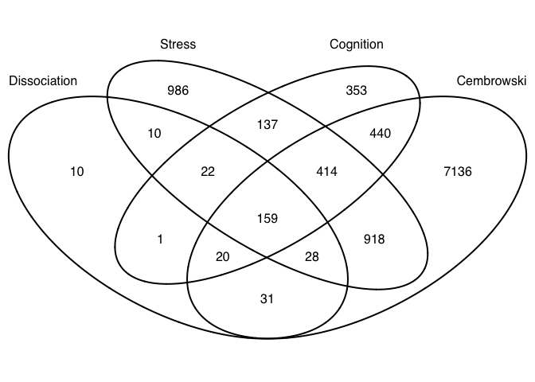
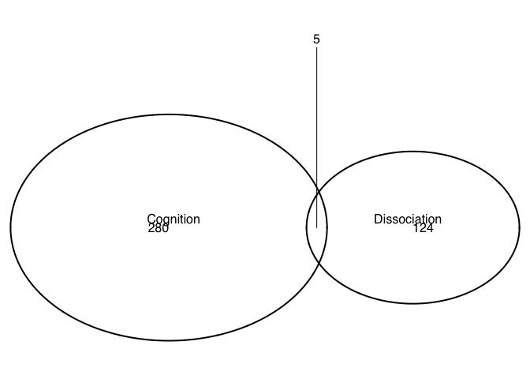
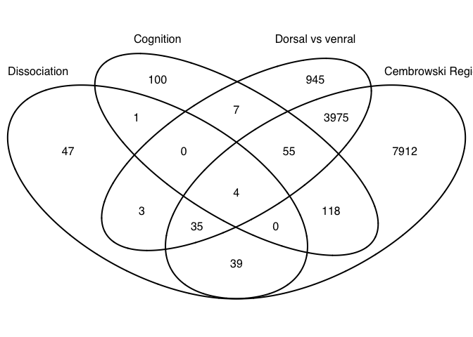
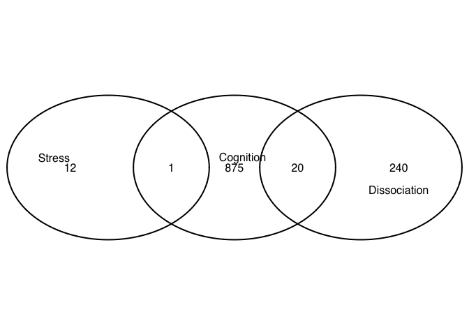
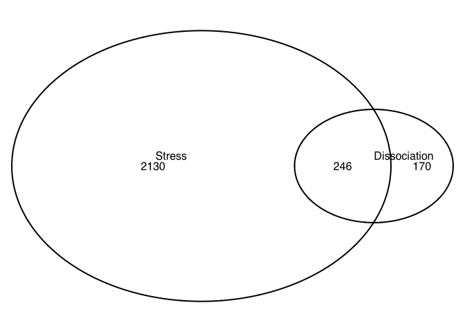

Comparing Rayna's data and the Cembrowski data
----------------------------------------------

Interesection of all genes differentially regulated between any of the
three brain regions (CA1, CA3, DG)

Interesection of all genes differentially regulated between CA1 and DG

Interesection of all genes differentially regulated by treatment

Genes differntially regulated by treatment only within the dissociation
and cognition groups

Overlap between Dissociation, Cognition, and any Cembrowski difference

Overlap in treatment DEGs, only looking at my three experiments

Overlap in DEG different between any brain region in the dissociation
and stress treatments

