GO\_MWU uses continuous measure of significance (such as fold-change or
-log(p-value) ) to identify GO categories that are significantly
enriches with either up- or down-regulated genes. The advantage - no
need to impose arbitrary significance cutoff.

If the measure is binary (0 or 1) the script will perform a typical "GO
enrichment" analysis based Fisher's exact test: it will show GO
categories over-represented among the genes that have 1 as their
measure.

On the plot, different fonts are used to indicate significance and color
indicates enrichment with either up (red) or down (blue) regulated
genes. No colors are shown for binary measure analysis.

The tree on the plot is hierarchical clustering of GO categories based
on shared genes. Categories with no branch length between them are
subsets of each other.

The fraction next to GO category name indicates the fracton of "good"
genes in it; "good" genes being the ones exceeding the arbitrary
absValue cutoff (option in gomwuPlot). For Fisher's based test, specify
absValue=0.5. This value does not affect statistics and is used for
plotting only.

Stretch the plot manually to match tree to text

Mikhail V. Matz, UT Austin, February 2015; <matz@utexas.edu>

################################################################ 

    # First, navigate to the directory containing scripts and input files. Then edit, mark and execute the following bits of code, one after another.
    library(ape)

    ## Warning: package 'ape' was built under R version 3.3.2

    source("gomwu.functions.R")

    # set output file for figures 
    knitr::opts_chunk$set(fig.path = '../../figures/06_GO_MMU/')

From Experitment 1: Dissociation Test Molecular Function (MF)
-------------------------------------------------------------

    # input files
    input="01_dissociation_GOpvals.csv" 
    goAnnotations="goAnnotations.tab" 
    goDatabase="go.obo" 
    goDivision="MF" # either MF, or BP, or CC

    # Calculating stats
    gomwuStats(input, goDatabase, goAnnotations, goDivision,
        perlPath="perl", 
        largest=0.1,  
        smallest=5,   
        clusterCutHeight=0.25  
    )

    ## Continuous measure of interest: will perform MWU test
    ## 126  GO terms at 10% FDR

    # Data viz
    gomwuPlot(input,goAnnotations,goDivision,
        absValue=-log(0.05,10),  
        level1=0.1, 
        level2=0.05, 
        level3=0.01, 
        txtsize=1.4,    
        treeHeight=0.5, 
      colors=c("dodgerblue2","firebrick1","skyblue","lightcoral") 
    )

    ## Warning in plot.formula(c(1:top) ~ c(1:top), type = "n", axes = F, xlab =
    ## "", : the formula 'c(1:top) ~ c(1:top)' is treated as 'c(1:top) ~ 1'

    ## Warning in plot.formula(c(1:top) ~ c(1:top), type = "n", axes = F, xlab =
    ## "", : the formula 'c(1:top) ~ c(1:top)' is treated as 'c(1:top) ~ 1'

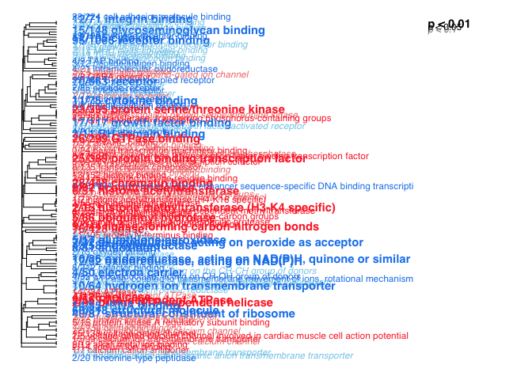

    ## GO terms dispayed:  126 
    ## "Good genes" accounted for:  468 out of 706 ( 66% )

    gomwuPlot(input,goAnnotations,goDivision,
        absValue=-log(0.05,10),  
        level1=0.01, 
        level2=0.005, 
        level3=0.001, 
        txtsize=1.4,    
        treeHeight=0.5, 
      colors=c("dodgerblue2","firebrick1","skyblue","lightcoral") 
    )

    ## Warning in plot.formula(c(1:top) ~ c(1:top), type = "n", axes = F, xlab =
    ## "", : the formula 'c(1:top) ~ c(1:top)' is treated as 'c(1:top) ~ 1'

    ## Warning in plot.formula(c(1:top) ~ c(1:top), type = "n", axes = F, xlab =
    ## "", : the formula 'c(1:top) ~ c(1:top)' is treated as 'c(1:top) ~ 1'

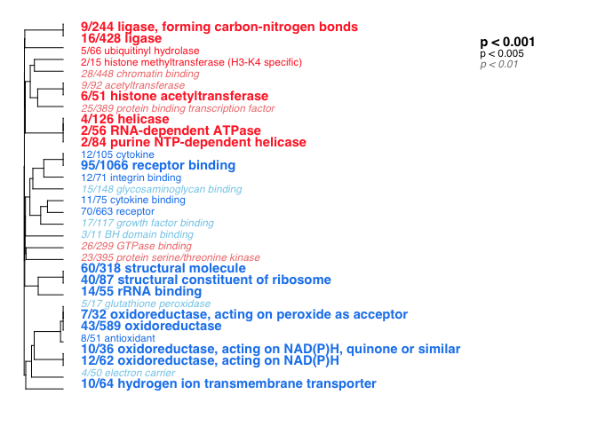

    ## GO terms dispayed:  32 
    ## "Good genes" accounted for:  364 out of 706 ( 52% )

From Experitment 1: Dissociation Test Cellular Component (CC)
-------------------------------------------------------------

    ## Continuous measure of interest: will perform MWU test
    ## 136  GO terms at 10% FDR

    ## Warning in plot.formula(c(1:top) ~ c(1:top), type = "n", axes = F, xlab =
    ## "", : the formula 'c(1:top) ~ c(1:top)' is treated as 'c(1:top) ~ 1'

    ## Warning in plot.formula(c(1:top) ~ c(1:top), type = "n", axes = F, xlab =
    ## "", : the formula 'c(1:top) ~ c(1:top)' is treated as 'c(1:top) ~ 1'

    ## GO terms dispayed:  136 
    ## "Good genes" accounted for:  650 out of 751 ( 87% )

    ## Warning in plot.formula(c(1:top) ~ c(1:top), type = "n", axes = F, xlab =
    ## "", : the formula 'c(1:top) ~ c(1:top)' is treated as 'c(1:top) ~ 1'

    ## Warning in plot.formula(c(1:top) ~ c(1:top), type = "n", axes = F, xlab =
    ## "", : the formula 'c(1:top) ~ c(1:top)' is treated as 'c(1:top) ~ 1'

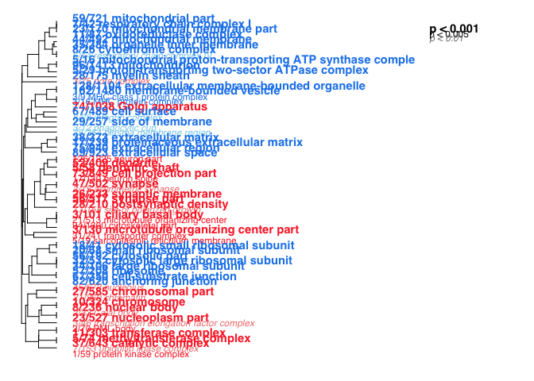

    ## GO terms dispayed:  66 
    ## "Good genes" accounted for:  611 out of 751 ( 81% )

    ## Warning in plot.formula(c(1:top) ~ c(1:top), type = "n", axes = F, xlab =
    ## "", : the formula 'c(1:top) ~ c(1:top)' is treated as 'c(1:top) ~ 1'

    ## Warning in plot.formula(c(1:top) ~ c(1:top), type = "n", axes = F, xlab =
    ## "", : the formula 'c(1:top) ~ c(1:top)' is treated as 'c(1:top) ~ 1'

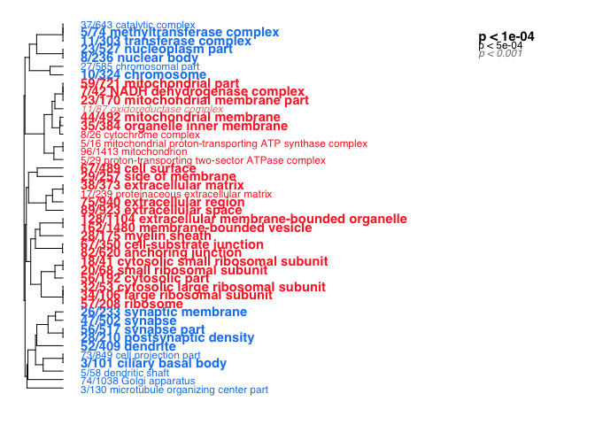

    ## GO terms dispayed:  44 
    ## "Good genes" accounted for:  551 out of 751 ( 73% )

From Experitment 2: Stress Molecular Function (MF)
--------------------------------------------------

    ## Continuous measure of interest: will perform MWU test
    ## 0  GO terms at 10% FDR

From Experitment 2: Stress Cellular Component (CC)
--------------------------------------------------

    ## Continuous measure of interest: will perform MWU test
    ## 0  GO terms at 10% FDR

From Experitment 3: Cognition Cellular Component (CC)
-----------------------------------------------------

    ## Continuous measure of interest: will perform MWU test
    ## 93  GO terms at 10% FDR

    ## Warning in plot.formula(c(1:top) ~ c(1:top), type = "n", axes = F, xlab =
    ## "", : the formula 'c(1:top) ~ c(1:top)' is treated as 'c(1:top) ~ 1'

    ## Warning in plot.formula(c(1:top) ~ c(1:top), type = "n", axes = F, xlab =
    ## "", : the formula 'c(1:top) ~ c(1:top)' is treated as 'c(1:top) ~ 1'

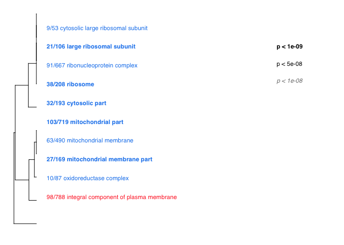

    ## GO terms dispayed:  93 
    ## "Good genes" accounted for:  961 out of 1298 ( 74% )

    ## Warning in plot.formula(c(1:top) ~ c(1:top), type = "n", axes = F, xlab =
    ## "", : the formula 'c(1:top) ~ c(1:top)' is treated as 'c(1:top) ~ 1'

    ## Warning in plot.formula(c(1:top) ~ c(1:top), type = "n", axes = F, xlab =
    ## "", : the formula 'c(1:top) ~ c(1:top)' is treated as 'c(1:top) ~ 1'

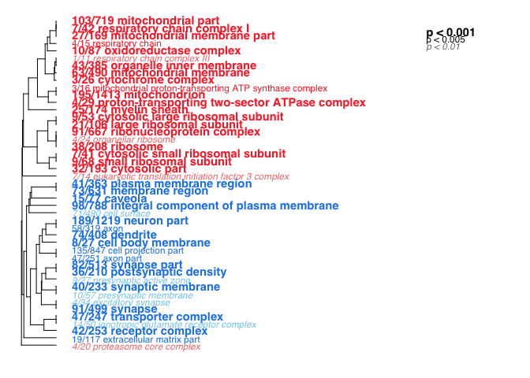

    ## GO terms dispayed:  45 
    ## "Good genes" accounted for:  669 out of 1298 ( 52% )

    ## Warning in plot.formula(c(1:top) ~ c(1:top), type = "n", axes = F, xlab =
    ## "", : the formula 'c(1:top) ~ c(1:top)' is treated as 'c(1:top) ~ 1'

    ## Warning in plot.formula(c(1:top) ~ c(1:top), type = "n", axes = F, xlab =
    ## "", : the formula 'c(1:top) ~ c(1:top)' is treated as 'c(1:top) ~ 1'

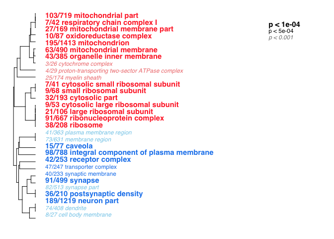

    ## GO terms dispayed:  30 
    ## "Good genes" accounted for:  602 out of 1298 ( 46% )

From Experitment 3: Cognition Molecular Function (MF)
-----------------------------------------------------

    ## Continuous measure of interest: will perform MWU test
    ## 64  GO terms at 10% FDR

    ## Warning in plot.formula(c(1:top) ~ c(1:top), type = "n", axes = F, xlab =
    ## "", : the formula 'c(1:top) ~ c(1:top)' is treated as 'c(1:top) ~ 1'

    ## Warning in plot.formula(c(1:top) ~ c(1:top), type = "n", axes = F, xlab =
    ## "", : the formula 'c(1:top) ~ c(1:top)' is treated as 'c(1:top) ~ 1'

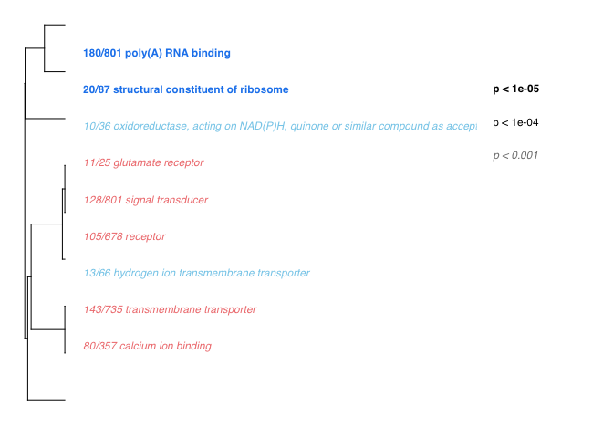

    ## GO terms dispayed:  64 
    ## "Good genes" accounted for:  691 out of 1236 ( 56% )

    ## Warning in plot.formula(c(1:top) ~ c(1:top), type = "n", axes = F, xlab =
    ## "", : the formula 'c(1:top) ~ c(1:top)' is treated as 'c(1:top) ~ 1'

    ## Warning in plot.formula(c(1:top) ~ c(1:top), type = "n", axes = F, xlab =
    ## "", : the formula 'c(1:top) ~ c(1:top)' is treated as 'c(1:top) ~ 1'

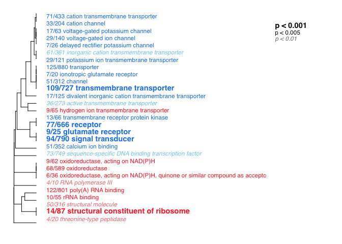

    ## GO terms dispayed:  29 
    ## "Good genes" accounted for:  541 out of 1236 ( 44% )

    ## Warning in plot.formula(c(1:top) ~ c(1:top), type = "n", axes = F, xlab =
    ## "", : the formula 'c(1:top) ~ c(1:top)' is treated as 'c(1:top) ~ 1'

    ## Warning in plot.formula(c(1:top) ~ c(1:top), type = "n", axes = F, xlab =
    ## "", : the formula 'c(1:top) ~ c(1:top)' is treated as 'c(1:top) ~ 1'

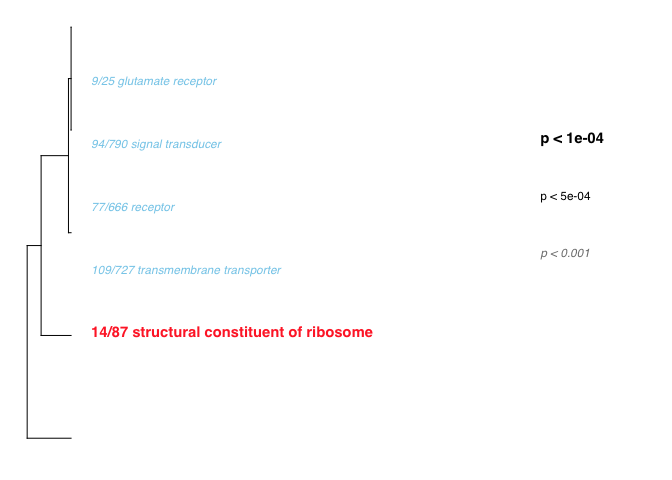

    ## GO terms dispayed:  5 
    ## "Good genes" accounted for:  214 out of 1236 ( 17% )

Now for Presence/Absence GO analysis
------------------------------------

-   First, I exported the list of overlapping genes from the previous
    05\_combo.Rmd file
-   Now, I'll use some joining majic to create a file with all the genes
    in the study and a 0 or 1 based on whether or not they were in the
    list of genes

<!-- -->

    library(dplyr)

    ## 
    ## Attaching package: 'dplyr'

    ## The following objects are masked from 'package:stats':
    ## 
    ##     filter, lag

    ## The following objects are masked from 'package:base':
    ## 
    ##     intersect, setdiff, setequal, union

    #list of all genes. I only care about column 1
    allgenes <- read.csv("01_dissociation_GOpvals.csv", header = T)
    allgenes <- select(allgenes, gene)

    # first, identify genes differentially expressed by region in all experiments
    intersection <- read.csv("05_combo_intersection.csv", header=T)
    intersection$logP <- 1
    intersection <- full_join(allgenes, intersection)

    ## Joining, by = "gene"

    ## Warning in full_join_impl(x, y, by$x, by$y, suffix$x, suffix$y): joining
    ## factors with different levels, coercing to character vector

    intersection <- intersection %>%
       mutate(logP = replace(logP,is.na(logP),0))

    write.csv(intersection, "./05_combo_intersection_allgenes.csv", row.names = F)

The intersection: genes diffferntially expressed by region in all four experiments
----------------------------------------------------------------------------------

    ## Binary classification detected; will perform Fisher's test
    ## 8  GO terms at 10% FDR

    ## Warning in plot.formula(c(1:top) ~ c(1:top), type = "n", axes = F, xlab =
    ## "", : the formula 'c(1:top) ~ c(1:top)' is treated as 'c(1:top) ~ 1'

    ## Warning in plot.formula(c(1:top) ~ c(1:top), type = "n", axes = F, xlab =
    ## "", : the formula 'c(1:top) ~ c(1:top)' is treated as 'c(1:top) ~ 1'

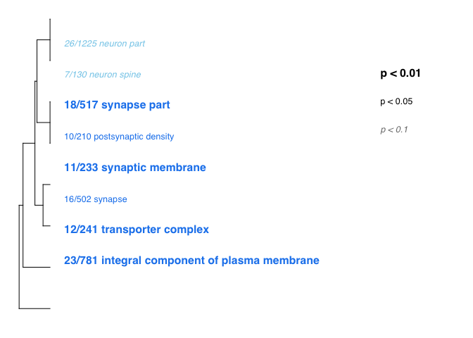

    ## GO terms dispayed:  8 
    ## "Good genes" accounted for:  51 out of 117 ( 44% )

    ## Binary classification detected; will perform Fisher's test
    ## 4  GO terms at 10% FDR

    ## Warning in plot.formula(c(1:top) ~ c(1:top), type = "n", axes = F, xlab =
    ## "", : the formula 'c(1:top) ~ c(1:top)' is treated as 'c(1:top) ~ 1'

    ## Warning in plot.formula(c(1:top) ~ c(1:top), type = "n", axes = F, xlab =
    ## "", : the formula 'c(1:top) ~ c(1:top)' is treated as 'c(1:top) ~ 1'

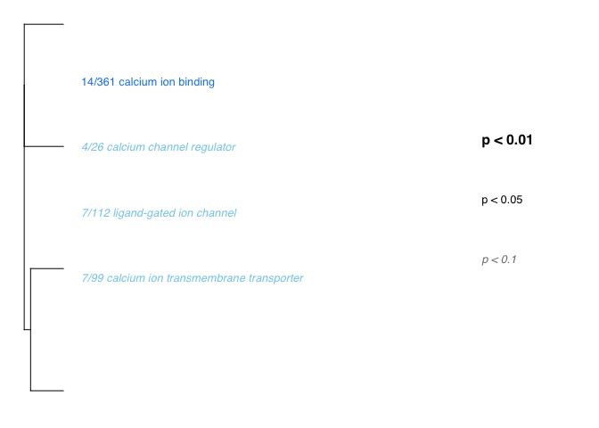

    ## GO terms dispayed:  4 
    ## "Good genes" accounted for:  24 out of 112 ( 21% )
