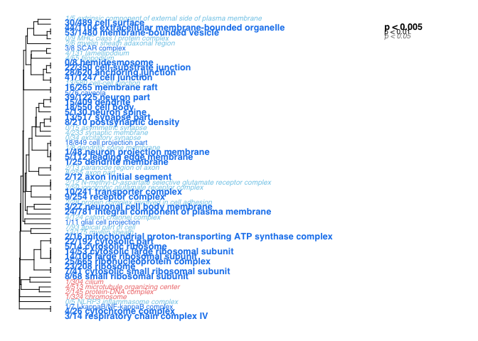
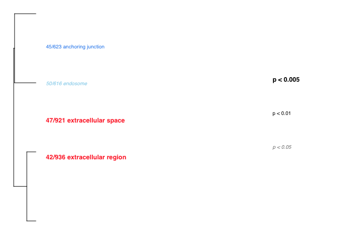
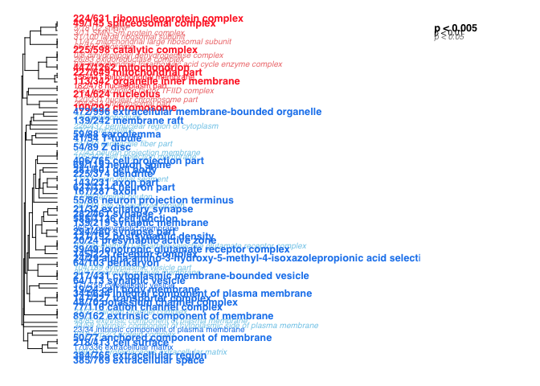

GO\_MWU uses continuous measure of significance (such as fold-change or
-log(p-value) ) to identify GO categories that are significantly
enriches with either up- or down-regulated genes. The advantage - no
need to impose arbitrary significance cutoff.

If the measure is binary (0 or 1) the script will perform a typical "GO
enrichment" analysis based Fisher's exact test: it will show GO
categories over-represented among the genes that have 1 as their
measure.

On the plot, different fonts are used to indicate significance and color
indicates enrichment with either up (red) or down (blue) regulated
genes. No colors are shown for binary measure analysis.

The tree on the plot is hierarchical clustering of GO categories based
on shared genes. Categories with no branch length between them are
subsets of each other.

The fraction next to GO category name indicates the fracton of "good"
genes in it; "good" genes being the ones exceeding the arbitrary
absValue cutoff (option in gomwuPlot). For Fisher's based test, specify
absValue=0.5. This value does not affect statistics and is used for
plotting only.

Stretch the plot manually to match tree to text

Mikhail V. Matz, UT Austin, February 2015; <matz@utexas.edu>

################################################################ 

    # First, navigate to the directory containing scripts and input files. Then edit, mark and execute the following bits of code, one after another.
    library(ape)

    ## Warning: package 'ape' was built under R version 3.3.2

    source("gomwu.functions.R")

    # set output file for figures 
    knitr::opts_chunk$set(fig.path = '../../figures/06_GO_MMU/')

    # input files
    input="01_dissociation_GOpvals.csv" 
    goAnnotations="goAnnotations.tab" 
    goDatabase="go.obo" 
    goDivision="CC" # either MF, or BP, or CC

    # Calculating stats
    gomwuStats(input, goDatabase, goAnnotations, goDivision,
        perlPath="perl", # replace with full path to perl executable if it is not in your system's PATH already
        largest=0.1,  # a GO category will not be considered if it contains more than this fraction of the total number of genes
        smallest=5,   # a GO category should contain at least this many genes to be considered
        clusterCutHeight=0.25 # threshold for merging similar (gene-sharing) terms. See README for details.
    #   Alternative="g" # by default the MWU test is two-tailed; specify "g" or "l" of you want to test for "greater" or "less" instead. 
    #   Module=TRUE,Alternative="g" # un-remark this if you are analyzing a SIGNED WGCNA module (values: 0 for not in module genes, kME for in-module genes). In the call to gomwuPlot below, specify absValue=0.001 (count number of "good genes" that fall into the module)
    #   Module=TRUE # un-remark this if you are analyzing an UNSIGNED WGCNA module 
    )

    ## Continuous measure of interest: will perform MWU test
    ## 77  GO terms at 10% FDR

    # do not continue if the printout shows that no GO terms pass 10% FDR.

    gomwuPlot(input,goAnnotations,goDivision,
        absValue=-log(0.05,10),  # genes with the measure value exceeding this will be counted as "good genes". Specify absValue=0.001 if you are doing Fisher's exact test for standard GO enrichment or analyzing a WGCNA module (all non-zero genes = "good genes").
        level1=0.05, # FDR threshold for plotting. Specify level1=1 to plot all GO categories containing genes exceeding the absValue.
        level2=0.01, # FDR cutoff to print in regular (not italic) font.
        level3=0.005, # FDR cutoff to print in large bold font.
        txtsize=1.2,    # decrease to fit more on one page, or increase (after rescaling the plot so the tree fits the text) for better "word cloud" effect
        treeHeight=0.5, # height of the hierarchical clustering tree
      colors=c("dodgerblue2","firebrick1","skyblue","lightcoral") # these are default colors, un-remar and change if needed
    )

    ## Warning in plot.formula(c(1:top) ~ c(1:top), type = "n", axes = F, xlab =
    ## "", : the formula 'c(1:top) ~ c(1:top)' is treated as 'c(1:top) ~ 1'

    ## Warning in plot.formula(c(1:top) ~ c(1:top), type = "n", axes = F, xlab =
    ## "", : the formula 'c(1:top) ~ c(1:top)' is treated as 'c(1:top) ~ 1'

    ## GO terms dispayed:  61 
    ## "Good genes" accounted for:  150 out of 216 ( 69% )

    # manually rescale the plot so the tree matches the text 
    # if there are too many categories displayed, try make it more stringent with, for instance, level1=0.05,level2=0.01,level3=0.001.  

    # input files
    input="03_behavior_GOpvals.csv" 
    goAnnotations="goAnnotations.tab" 
    goDatabase="go.obo" 
    goDivision="CC" # either MF, or BP, or CC

    # Calculating stats
    gomwuStats(input, goDatabase, goAnnotations, goDivision,
        perlPath="perl", 
        largest=0.1,  
        smallest=5,   
        clusterCutHeight=0.25 
    )

    ## Continuous measure of interest: will perform MWU test
    ## 8  GO terms at 10% FDR

    # do not continue if the printout shows that no GO terms pass 10% FDR.

    gomwuPlot(input,goAnnotations,goDivision,
        absValue=-log(0.05,10),  
        level1=0.05, 
        level2=0.01, 
        level3=0.005, 
        txtsize=1.2,    
        treeHeight=0.5, #
      colors=c("dodgerblue2","firebrick1","skyblue","lightcoral") 
    )

    ## Warning in plot.formula(c(1:top) ~ c(1:top), type = "n", axes = F, xlab =
    ## "", : the formula 'c(1:top) ~ c(1:top)' is treated as 'c(1:top) ~ 1'

    ## Warning in plot.formula(c(1:top) ~ c(1:top), type = "n", axes = F, xlab =
    ## "", : the formula 'c(1:top) ~ c(1:top)' is treated as 'c(1:top) ~ 1'

    ## GO terms dispayed:  4 
    ## "Good genes" accounted for:  148 out of 738 ( 20% )

    # input files
    input="04_cembrowski_GOpvals.csv" 
    goAnnotations="goAnnotations.tab" 
    goDatabase="go.obo" 
    goDivision="CC" # either MF, or BP, or CC

    # Calculating stats
    gomwuStats(input, goDatabase, goAnnotations, goDivision,
        perlPath="perl", 
        largest=0.1,  
        smallest=5,   
        clusterCutHeight=0.25 
    )

    ## Continuous measure of interest: will perform MWU test
    ## 107  GO terms at 10% FDR

    # do not continue if the printout shows that no GO terms pass 10% FDR.

    gomwuPlot(input,goAnnotations,goDivision,
        absValue=-log(0.05,10),  
        level1=0.05, 
        level2=0.01, 
        level3=0.005, 
        txtsize=1.2,    
        treeHeight=0.5, #
      colors=c("dodgerblue2","firebrick1","skyblue","lightcoral") 
    )

    ## Warning in plot.formula(c(1:top) ~ c(1:top), type = "n", axes = F, xlab =
    ## "", : the formula 'c(1:top) ~ c(1:top)' is treated as 'c(1:top) ~ 1'

    ## Warning in plot.formula(c(1:top) ~ c(1:top), type = "n", axes = F, xlab =
    ## "", : the formula 'c(1:top) ~ c(1:top)' is treated as 'c(1:top) ~ 1'

    ## GO terms dispayed:  78 
    ## "Good genes" accounted for:  3094 out of 4017 ( 77% )
