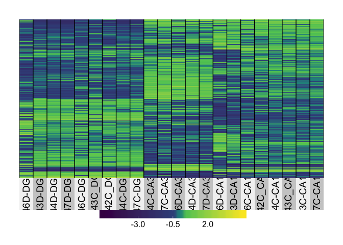

Cellular Stress
---------------

In this analysis, I examine the effect that cell dissasociation has on
CA1, CA3, and DG gene expression relative to control tissue samples.

Here is a brief overview of the samples being compared.

    ##        Treatment Region 
    ##  control    :7   CA1:6  
    ##  dissociated:7   CA3:4  
    ##                  DG :4

14 Samples, 22485 genes.

    ## [1] 22485    14

I used DESeq2 (Love et al., 2014) for gene expression normalization and
quantification using the following experimental design:
`Treatment + Region + Treatment * Region`. Genes with less than 2 counts
across all samples were filtered, leaving us with 16,709 genes for
analysis of differntial expression.

    dds <- DESeqDataSetFromMatrix(countData = countData,
                                  colData = colData,
                                  design = ~ Treatment + Region + Treatment * Region )
    dds <- dds[ rowSums(counts(dds)) > 2, ] ## filter genes 
    dds <- DESeq(dds) # Differential expression analysis

    ## estimating size factors

    ## estimating dispersions

    ## gene-wise dispersion estimates

    ## mean-dispersion relationship

    ## final dispersion estimates

    ## fitting model and testing

    rld <- rlog(dds, blind=FALSE) ## log transformed data
    dim(rld) #print total genes analyzed

    ## [1] 16709    14

This PCA gives an overview of the variability between samples using the
a large matrix of log transformed gene expression data. You can see that
the biggest difference is between DG punches and the CA1 and CA3
punches. CA1 and CA3 samples have similar transcriptomes. The control
CA1 samples have the most similar transcriptonal profiles as evidenced
by their tight clustering.

    source("DESeqPCAfunction.R")
    source("figureoptions.R")

    # create the dataframe using my function pcadataframe
    pcadata <- pcadataframe(rld, intgroup=c("Region", "Treatment"), returnData=TRUE)
    percentVar <- round(100 * attr(pcadata, "percentVar"))

    ## for markdown
    plotPC2PC1(aescolor = pcadata$Region, colorname = "Region", colorvalues = colorvalRegion, aesshape = pcadata$Treatment, shapename = "Treatment")

    # for adobe
    myplot <- plotPC2PC1(aescolor = pcadata$Region, colorname = "Region", aesshape = pcadata$Treatment, shapename = "Treatment", colorvalues = colorvalRegion)
    pdf(file="../figures/01_dissociationtest/PCA-1.pdf", width=4.5, height=3)
    plot(myplot)
    dev.off()

    ## quartz_off_screen 
    ##                 2

    ## statistics
    aov1 <- aov(PC1 ~ Region, data=pcadata)
    summary(aov1) 

    ##             Df Sum Sq Mean Sq F value   Pr(>F)    
    ## Region       2 2812.7  1406.4   17.69 0.000365 ***
    ## Residuals   11  874.3    79.5                     
    ## ---
    ## Signif. codes:  0 '***' 0.001 '**' 0.01 '*' 0.05 '.' 0.1 ' ' 1

    TukeyHSD(aov1, which = "Region") 

    ##   Tukey multiple comparisons of means
    ##     95% family-wise confidence level
    ## 
    ## Fit: aov(formula = PC1 ~ Region, data = pcadata)
    ## 
    ## $Region
    ##              diff       lwr      upr     p adj
    ## CA3-CA1  5.223942 -10.31899 20.76687 0.6467956
    ## DG-CA1  33.098083  17.55515 48.64101 0.0003454
    ## DG-CA3  27.874142  10.84772 44.90057 0.0027013

    aov2 <- aov(PC2 ~ Region, data=pcadata)
    summary(aov2) 

    ##             Df Sum Sq Mean Sq F value Pr(>F)
    ## Region       2  243.8   121.9   0.744  0.498
    ## Residuals   11 1801.4   163.8

    TukeyHSD(aov2, which = "Region") 

    ##   Tukey multiple comparisons of means
    ##     95% family-wise confidence level
    ## 
    ## Fit: aov(formula = PC2 ~ Region, data = pcadata)
    ## 
    ## $Region
    ##              diff       lwr      upr     p adj
    ## CA3-CA1 -8.297717 -30.60810 14.01267 0.5893113
    ## DG-CA1   1.924204 -20.38618 24.23459 0.9706097
    ## DG-CA3  10.221920 -14.21788 34.66172 0.5166917

    aov3 <- aov(PC1 ~ Treatment, data=pcadata)
    summary(aov3) 

    ##             Df Sum Sq Mean Sq F value Pr(>F)
    ## Treatment    1    335   335.2     1.2  0.295
    ## Residuals   12   3352   279.3

    TukeyHSD(aov3, which = "Treatment")

    ##   Tukey multiple comparisons of means
    ##     95% family-wise confidence level
    ## 
    ## Fit: aov(formula = PC1 ~ Treatment, data = pcadata)
    ## 
    ## $Treatment
    ##                         diff       lwr      upr     p adj
    ## dissociated-control 9.785654 -9.678654 29.24996 0.2948417

    aov4 <- aov(PC2 ~ Treatment, data=pcadata)
    summary(aov4) 

    ##             Df Sum Sq Mean Sq F value Pr(>F)  
    ## Treatment    1  691.1   691.1   6.125 0.0292 *
    ## Residuals   12 1354.1   112.8                 
    ## ---
    ## Signif. codes:  0 '***' 0.001 '**' 0.01 '*' 0.05 '.' 0.1 ' ' 1

    TukeyHSD(aov4, which = "Treatment") 

    ##   Tukey multiple comparisons of means
    ##     95% family-wise confidence level
    ## 
    ## Fit: aov(formula = PC2 ~ Treatment, data = pcadata)
    ## 
    ## $Treatment
    ##                          diff       lwr       upr     p adj
    ## dissociated-control -14.05242 -26.42372 -1.681116 0.0292306

Now, we can calulate the number of significant genes by contrast by
contrast. The first number displayed is not corrected for mutiple
hypothesis testing but the second one is.

    ## DEG by contrasts
    source("resvalsfunction.R")
    contrast1 <- resvals(contrastvector = c('Region', 'CA1', 'DG'), mypval = 0.05)

    ## [1] 322

    contrast2 <- resvals(contrastvector = c('Region', 'CA3', 'DG'), mypval = 0.05)

    ## [1] 63

    contrast3 <- resvals(contrastvector = c('Region', 'CA1', 'CA3'), mypval = 0.05)

    ## [1] 9

    contrast4 <- resvals(contrastvector = c('Treatment', 'dissociated', 'control'), mypval = 0.05)

    ## [1] 162

Now, we can view a histogram of the distribution

This Venn Diagram sthe overlap of differentailly expression genes by
Region and Treatment. This shows all genes with *adjusted* pvalue
&lt;0.05.

heatmaps
========

    ## Any padj <0.05
    DEGes <- assay(rld)
    DEGes <- cbind(DEGes, contrast1, contrast2, contrast3, contrast4)
    DEGes <- as.data.frame(DEGes) # convert matrix to dataframe
    DEGes$rownames <- rownames(DEGes)  # add the rownames to the dataframe

    DEGes$padjmin <- with(DEGes, pmin(padjTreatmentdissociatedcontrol, padjRegionCA1DG ,padjRegionCA3DG, padjRegionCA1CA3 )) # put the min pvalue in a new column
    DEGes <- DEGes %>% filter(padjmin < 0.05)

    rownames(DEGes) <- DEGes$rownames
    drop.cols <-colnames(DEGes[,grep("padj|pval|rownames", colnames(DEGes))])
    DEGes <- DEGes %>% select(-one_of(drop.cols))
    DEGes <- as.matrix(DEGes)
    DEGes <- DEGes - rowMeans(DEGes)

    # setting color options
    source("figureoptions.R")
    ann_colors <- ann_colorsdissociation
    colorpalette <- cembrowskicolors
    df <- as.data.frame(colData(dds)[,c("Treatment", "Region")])
    paletteLength <- 30
    myBreaks <- c(seq(min(DEGes), 0, length.out=ceiling(paletteLength/2) + 1), 
                  seq(max(DEGes)/paletteLength, max(DEGes), length.out=floor(paletteLength/2)))

    pheatmap(DEGes, show_colnames=T, show_rownames = F,
             annotation_col=df, annotation_colors = ann_colors,
             fontsize = 8, fontsize_row = 7, 
             cellwidth=20,
             border_color = "grey60" ,
             color = colorpalette,
             breaks=myBreaks,
             clustering_method="average",
             clustering_distance_cols="correlation"
             )

    # for adobe
    pheatmap(DEGes, show_colnames=F, show_rownames = F,
             annotation_col=df, annotation_colors = ann_colors,
             treeheight_row = 0, treeheight_col = 25,
             fontsize = 8, 
             width=4.5, height=3,
             border_color = "grey60" ,
             color = colorpalette,
             cellwidth = 8, 
             breaks=myBreaks,
             clustering_method="average",
             clustering_distance_cols="correlation" ,
             filename = "../figures/01_dissociationtest/HeatmapPadj-1.pdf"
             )

This is a supplementary data validation check plot. Here, I'm showing
how many millions of reads were present in each sample. On average, each
sample had 5 million reads, but the range was from 0.8 to 10 millino
reads.

Save files for GO analysis. A total of 200 DEGs with unadjusted p-value
&lt; 0.05 were input into the GO anlaysis.

    # from https://github.com/rachelwright8/Ahya-White-Syndromes/blob/master/deseq2_Ahya.R

    resCD=results(dds, contrast=c('Treatment', 'dissociated', 'control'), independentFiltering = F)
    table(resCD$padj<0.05)

    ## 
    ## FALSE  TRUE 
    ## 16529   162

    logs <- data.frame(cbind("gene"=row.names(resCD),"logP"=round(-log(resCD$pvalue+1e-10,10),1)))
    logs$logP=as.numeric(as.character(logs$logP))
    sign <- rep(1,nrow(logs))
    sign[resCD$log2FoldChange<0]=-1  ##change to correct model
    table(sign)

    ## sign
    ##   -1    1 
    ## 6989 9720

    logs$logP <- logs$logP*sign

    write.csv(logs, file = "./06_GO_MWU/01_dissociation_GOpvals.csv", row.names = F)
Behavioral Stress
-----------------

In this analysis, I examine the effect that behavioral stress has on
CA1, CA3, and DG gene expression relative to homogenized tissue samples.

    #source("http://www.bioconductor.org/biocLite.R")
    #biocLite("DESeq2")
    library(DESeq2)
    library(magrittr)
    library(tidyverse)
    library(reshape2)
    library(VennDiagram)
    library(genefilter)
    library(pheatmap)
    library(cowplot)
    library(RColorBrewer)
    library(ggcorrplot)
    library(dplyr)
    library(plyr)
    library(ggplot2)
    library(colorRamps)

    # set output file for figures 
    knitr::opts_chunk$set(fig.path = '../figures/02_stresstest/')

    colData <- read.csv('../data/DissociationColData.csv')
    rownames(colData) <- colData$RNAseqID
    countData <-  read.csv('../data/DissociationCountData.csv', check.names = F, row.names = 1)

Subset to just look homogenized and dissociated samples
-------------------------------------------------------

    colData <- colData %>%
      filter(Mouse != "15-100") %>% droplevels()
    savecols <- as.character(colData$RNAseqID) #selects all good samples
    savecols <- as.vector(savecols) # make it a vector
    countData <- countData %>% select(one_of(savecols)) # keep good samples

    ## rename and relevel things
    colData <- rename(colData, c("Group"="Treatment"))
    colData$Treatment <- plyr::revalue(colData$Treatment, c("control"="shocked"))
    colData$Treatment <- factor(colData$Treatment, levels = c("homecage", "shocked"))

Here is a brief overview of the samples being compared.

    ##     Treatment  Region 
    ##  homecage: 6   CA1:7  
    ##  shocked :12   CA3:5  
    ##                DG :6

18 Samples, 22485 genes.

    ## [1] 22485    18

    dds <- DESeqDataSetFromMatrix(countData = countData,
                                  colData = colData,
                                  design = ~ Treatment + Region + Treatment * Region )
    dds <- dds[ rowSums(counts(dds)) > 2, ] ## filter genes with 0 counts
    dds <- DESeq(dds) # Differential expression analysis
    rld <- rlog(dds, blind=FALSE) # log transformed
    dim(rld) #print total genes analyzed

    ## [1] 16229    18

This PCA gives an overview of the variability between samples using the
a large matrix of log transformed gene expression data. You can see that
the bigges difference is between DG punches and the CA1 and CA3 punches.
CA1 and CA3 samples have similar transcriptomes. The homogenized CA1
samples have the most similar transcriptonal profiles as evidenced by
their tight clustering.

    source("DESeqPCAfunction.R")
    source("figureoptions.R")

    # create the dataframe using my function pcadataframe
    pcadata <- pcadataframe(rld, intgroup=c("Treatment", "Region"), returnData=TRUE)
    percentVar <- round(100 * attr(pcadata, "percentVar"))

    pcadata$Treatment <- factor(pcadata$Treatment, levels = c("homecage", "shocked"))

    ## plot a bunch of pca plots using my ggplot functions DESeqPCAfunction.R, with the color defined infigureoptions.R
    plotPC2PC1(aescolor = pcadata$Region, colorname = "Region", aesshape = pcadata$Treatment, shapename = "Treatment", colorvalues = colorvalRegion)

    plotPC2PC3(aescolor = pcadata$Region, colorname = "Region", aesshape = pcadata$Treatment, shapename = "Treatment", colorvalues = colorvalRegion)

    # for adobe
    myplot <- plotPC2PC1(aescolor = pcadata$Region, colorname = "Region", aesshape = pcadata$Treatment, shapename = "Treatment", colorvalues = colorvalRegion)
    pdf(file="../figures/../figures/02_stresstest/PCA-1.pdf", width=4.5, height=3)
    plot(myplot)
    dev.off()

    ## quartz_off_screen 
    ##                 2

    ## statistics
    aov1 <- aov(PC1 ~ Region, data=pcadata)
    summary(aov1) 

    ##             Df Sum Sq Mean Sq F value   Pr(>F)    
    ## Region       2   7334    3667   42.89 6.24e-07 ***
    ## Residuals   15   1282      85                     
    ## ---
    ## Signif. codes:  0 '***' 0.001 '**' 0.01 '*' 0.05 '.' 0.1 ' ' 1

    TukeyHSD(aov1, which = "Region") 

    ##   Tukey multiple comparisons of means
    ##     95% family-wise confidence level
    ## 
    ## Fit: aov(formula = PC1 ~ Region, data = pcadata)
    ## 
    ## $Region
    ##              diff       lwr      upr     p adj
    ## CA3-CA1  3.127434 -10.93525 17.19012 0.8339245
    ## DG-CA1  44.037806  30.67620 57.39941 0.0000011
    ## DG-CA3  40.910372  26.36759 55.45315 0.0000073

    aov2 <- aov(PC2 ~ Region, data=pcadata)
    summary(aov2) 

    ##             Df Sum Sq Mean Sq F value   Pr(>F)    
    ## Region       2   2976  1487.9   11.41 0.000971 ***
    ## Residuals   15   1955   130.4                     
    ## ---
    ## Signif. codes:  0 '***' 0.001 '**' 0.01 '*' 0.05 '.' 0.1 ' ' 1

    TukeyHSD(aov2, which = "Region") 

    ##   Tukey multiple comparisons of means
    ##     95% family-wise confidence level
    ## 
    ## Fit: aov(formula = PC2 ~ Region, data = pcadata)
    ## 
    ## $Region
    ##              diff        lwr       upr     p adj
    ## CA3-CA1  31.34187  13.976505 48.707233 0.0008014
    ## DG-CA1   18.32018   1.820548 34.819817 0.0288392
    ## DG-CA3  -13.02169 -30.979895  4.936522 0.1776538

    aov5 <- aov(PC3 ~ Region, data=pcadata)
    summary(aov5) 

    ##             Df Sum Sq Mean Sq F value Pr(>F)  
    ## Region       2   1928   963.8   6.315 0.0102 *
    ## Residuals   15   2289   152.6                 
    ## ---
    ## Signif. codes:  0 '***' 0.001 '**' 0.01 '*' 0.05 '.' 0.1 ' ' 1

    TukeyHSD(aov5, which = "Region") 

    ##   Tukey multiple comparisons of means
    ##     95% family-wise confidence level
    ## 
    ## Fit: aov(formula = PC3 ~ Region, data = pcadata)
    ## 
    ## $Region
    ##               diff       lwr       upr     p adj
    ## CA3-CA1 -23.912642 -42.70222 -5.123068 0.0125516
    ## DG-CA1   -1.905862 -19.75870 15.946981 0.9586161
    ## DG-CA3   22.006780   2.57574 41.437821 0.0257680

    aov3 <- aov(PC1 ~ Treatment, data=pcadata)
    summary(aov3) 

    ##             Df Sum Sq Mean Sq F value Pr(>F)
    ## Treatment    1    142   142.1   0.268  0.612
    ## Residuals   16   8474   529.6

    aov4 <- aov(PC2 ~ Treatment, data=pcadata)
    summary(aov4) 

    ##             Df Sum Sq Mean Sq F value Pr(>F)
    ## Treatment    1     53   52.73   0.173  0.683
    ## Residuals   16   4879  304.91

    aov6 <- aov(PC3 ~ Treatment, data=pcadata)
    summary(aov6) 

    ##             Df Sum Sq Mean Sq F value Pr(>F)
    ## Treatment    1    339   339.4     1.4  0.254
    ## Residuals   16   3877   242.3

    aov7 <- aov(PC6 ~ Treatment, data=pcadata)
    summary(aov7) 

    ##             Df Sum Sq Mean Sq F value Pr(>F)  
    ## Treatment    1  319.1   319.1   4.774 0.0441 *
    ## Residuals   16 1069.5    66.8                 
    ## ---
    ## Signif. codes:  0 '***' 0.001 '**' 0.01 '*' 0.05 '.' 0.1 ' ' 1

    lm1 <- lm(PC1~Region*Treatment, data=pcadata)
    summary(lm1)

    ## 
    ## Call:
    ## lm(formula = PC1 ~ Region * Treatment, data = pcadata)
    ## 
    ## Residuals:
    ##      Min       1Q   Median       3Q      Max 
    ## -14.6047  -2.6399  -0.3964   3.2833  14.6047 
    ## 
    ## Coefficients:
    ##                            Estimate Std. Error t value Pr(>|t|)    
    ## (Intercept)                -15.1706     5.4511  -2.783   0.0166 *  
    ## RegionCA3                    0.2547     7.7090   0.033   0.9742    
    ## RegionDG                    57.1767     7.7090   7.417 8.09e-06 ***
    ## Treatmentshocked            -0.5283     6.4498  -0.082   0.9361    
    ## RegionCA3:Treatmentshocked   4.6873     9.5459   0.491   0.6323    
    ## RegionDG:Treatmentshocked  -19.7460     9.2829  -2.127   0.0548 .  
    ## ---
    ## Signif. codes:  0 '***' 0.001 '**' 0.01 '*' 0.05 '.' 0.1 ' ' 1
    ## 
    ## Residual standard error: 7.709 on 12 degrees of freedom
    ## Multiple R-squared:  0.9172, Adjusted R-squared:  0.8827 
    ## F-statistic:  26.6 on 5 and 12 DF,  p-value: 4.223e-06

    anova(lm1) 

    ## Analysis of Variance Table
    ## 
    ## Response: PC1
    ##                  Df Sum Sq Mean Sq F value    Pr(>F)    
    ## Region            2 7333.5  3666.8 61.7000 4.846e-07 ***
    ## Treatment         1  131.2   131.2  2.2072   0.16316    
    ## Region:Treatment  2  438.1   219.0  3.6855   0.05652 .  
    ## Residuals        12  713.1    59.4                      
    ## ---
    ## Signif. codes:  0 '***' 0.001 '**' 0.01 '*' 0.05 '.' 0.1 ' ' 1

    lm2 <- lm(PC2~Region*Treatment, data=pcadata)
    summary(lm2)

    ## 
    ## Call:
    ## lm(formula = PC2 ~ Region * Treatment, data = pcadata)
    ## 
    ## Residuals:
    ##      Min       1Q   Median       3Q      Max 
    ## -26.3267  -1.3168   0.2702   1.4777  26.3267 
    ## 
    ## Coefficients:
    ##                            Estimate Std. Error t value Pr(>|t|)   
    ## (Intercept)                 -16.942      8.011  -2.115  0.05606 . 
    ## RegionCA3                    34.630     11.330   3.057  0.00996 **
    ## RegionDG                      8.933     11.330   0.788  0.44573   
    ## Treatmentshocked              2.980      9.479   0.314  0.75860   
    ## RegionCA3:Treatmentshocked   -4.913     14.030  -0.350  0.73227   
    ## RegionDG:Treatmentshocked    14.293     13.643   1.048  0.31543   
    ## ---
    ## Signif. codes:  0 '***' 0.001 '**' 0.01 '*' 0.05 '.' 0.1 ' ' 1
    ## 
    ## Residual standard error: 11.33 on 12 degrees of freedom
    ## Multiple R-squared:  0.6876, Adjusted R-squared:  0.5575 
    ## F-statistic: 5.283 on 5 and 12 DF,  p-value: 0.008546

    anova(lm2)

    ## Analysis of Variance Table
    ## 
    ## Response: PC2
    ##                  Df  Sum Sq Mean Sq F value   Pr(>F)   
    ## Region            2 2975.79 1487.90 11.5909 0.001575 **
    ## Treatment         1  157.38  157.38  1.2260 0.289883   
    ## Region:Treatment  2  257.64  128.82  1.0035 0.395373   
    ## Residuals        12 1540.42  128.37                    
    ## ---
    ## Signif. codes:  0 '***' 0.001 '**' 0.01 '*' 0.05 '.' 0.1 ' ' 1

    ## DEG by contrasts
    source("resvalsfunction.R")
    contrast1 <- resvals(contrastvector = c('Region', 'CA1', 'DG'), mypval = 0.05)

    ## [1] 918

    contrast2 <- resvals(contrastvector = c('Region', 'CA3', 'DG'), mypval = 0.05)

    ## [1] 1024

    contrast3 <- resvals(contrastvector = c('Region', 'CA1', 'CA3'), mypval = 0.05)

    ## [1] 357

    contrast4 <- resvals(contrastvector = c('Treatment', 'shocked', 'homecage'), mypval = 0.05)

    ## [1] 0

Now, we can view a histogram of the distribution

    source("resvalsfunction.R")
    myhistogram(contrastvector = c('Region', 'CA1', 'DG'), mypval = 0.05)

    ## [1] 1

    myhistogram(contrastvector = c('Region', 'CA3', 'DG'), mypval = 0.05)

    ## [1] 1

    myhistogram(contrastvector = c('Region', 'CA1', 'CA3'), mypval = 0.05)

    ## [1] 1

    myhistogram(contrastvector = c('Treatment', 'shocked', 'homecage'), mypval = 0.05)

    ## [1] 1

This Venn Diagram sthe overlap of differentailly expression genes by
Region and method. This shows all genes with *adjusted* pvalue &lt;0.05.

    #create a new DF with the gene counts
    rldpvals <- assay(rld)
    rldpvals <- cbind(rldpvals, contrast1, contrast2, contrast3, contrast4)
    rldpvals <- as.data.frame(rldpvals)
    rldpvals <- rldpvals[ , grepl( "padj|pval" , names( rldpvals ) ) ]

    # venn with padj values
    venn1 <- row.names(rldpvals[rldpvals[2] <0.05 & !is.na(rldpvals[2]),])
    venn2 <- row.names(rldpvals[rldpvals[4] <0.05 & !is.na(rldpvals[4]),])
    venn3 <- row.names(rldpvals[rldpvals[6] <0.05 & !is.na(rldpvals[6]),])
    venn4 <- row.names(rldpvals[rldpvals[8] <0.05 & !is.na(rldpvals[8]),])
    venn12 <- union(venn1,venn2)
    venn123 <- union(venn12,venn3)

    # save files for big venn diagram
    write(venn123, "../results/02_stress_venn123.txt")
    write(venn4, "../results/02_stress_venn4.txt")

    ## check order for correctness
    candidates <- list("Region" = venn123, "Method" = venn4)

    prettyvenn <- venn.diagram(
      scaled=T,
      x = candidates, filename=NULL, 
      col = "black",
      fill = c( "white", "white"),
      alpha = 0.5,
      cex = 1, fontfamily = "sans", #fontface = "bold",
      cat.default.pos = "text",
      cat.dist = c(0.07, 0.07), cat.pos = 1,
      cat.cex = 1, cat.fontfamily = "sans")
    #dev.off()
    grid.draw(prettyvenn)

    ## Any padj <0.05
    DEGes <- assay(rld)
    DEGes <- cbind(DEGes, contrast1, contrast2, contrast3, contrast4)
    DEGes <- as.data.frame(DEGes) # convert matrix to dataframe
    DEGes$rownames <- rownames(DEGes)  # add the rownames to the dataframe

    DEGes$padjmin <- with(DEGes, pmin(padjTreatmentshockedhomecage, padjRegionCA1DG ,padjRegionCA3DG, padjRegionCA1CA3 )) # put the min pvalue in a new column
    DEGes <- DEGes %>% filter(padjmin < 0.05)

    rownames(DEGes) <- DEGes$rownames
    drop.cols <-colnames(DEGes[,grep("padj|pval|rownames", colnames(DEGes))])
    DEGes <- DEGes %>% select(-one_of(drop.cols))
    DEGes <- as.matrix(DEGes)
    DEGes <- DEGes - rowMeans(DEGes)

    # setting color options
    source("figureoptions.R")
    ann_colors <- ann_colorsstress
    colorpalette <- cembrowskicolors
    df <- as.data.frame(colData(dds)[,c("Treatment", "Region")])
    df$Treatment <- factor(df$Treatment, levels = c("homecage", "shocked"))

    paletteLength <- 30
    myBreaks <- c(seq(min(DEGes), 0, length.out=ceiling(paletteLength/2) + 1), 
                  seq(max(DEGes)/paletteLength, max(DEGes), length.out=floor(paletteLength/2)))

    pheatmap(DEGes, show_colnames=T, show_rownames = F,
             annotation_col=df, annotation_colors = ann_colors,
             treeheight_row = 0, treeheight_col = 25,
             fontsize = 8, 
             #width=4.5, height=3,
             border_color = "grey60" ,
             color = colorpalette,
             #cellwidth = 12, 
             #main = "Any Padj < 0.05",
             clustering_method="average",
             breaks=myBreaks,
             clustering_distance_cols="correlation" 
             )

    # for adobe
    pheatmap(DEGes, show_colnames=F, show_rownames = F,
             annotation_col=df, annotation_colors = ann_colors,
             treeheight_row = 0, treeheight_col = 25,
             fontsize = 8, 
             width=4.5, height=3,
             border_color = "grey60" ,
             color = colorpalette,
             cellwidth = 7, 
             filename = "../figures/02_stresstest/HeatmapPadj-1.pdf",
             clustering_method="average",
             breaks=myBreaks,
             clustering_distance_cols="correlation" 
             )

    # from https://github.com/rachelwright8/Ahya-White-Syndromes/blob/master/deseq2_Ahya.R

    res <- results(dds, contrast=c('Treatment', 'shocked', 'homecage'), independentFiltering = F)
    table(res$padj<0.05)

    ## 
    ## FALSE 
    ## 16220

    logs <- data.frame(cbind("gene"=row.names(res),"logP"=round(-log(res$pvalue+1e-10,10),1)))
    logs$logP <- as.numeric(as.character(logs$logP))
    sign <- rep(1,nrow(logs))
    sign[res$log2FoldChange<0]=-1  ##change to correct model
    table(sign)

    ## sign
    ##   -1    1 
    ## 7045 9184

    logs$logP <- logs$logP*sign

    write.csv(logs, file = "./06_GO_MWU/02_stress_GOpvals.csv", row.names = F)

res &lt;- results(dds, contrast=c('Treatment', 'shocked', 'homecage'),
independentFiltering = F) table(res$padj&lt;0.05)
Examining of cognitive training on hippocampal
----------------------------------------------

The goals of the subsequent analysis are 1) to determine the effects of
cognitiving training on hippocampal gene expression and 2) related any
detectable changes to variation cause by other technical and biological
treatements.

### Experimental Design

We use 3-4–month-old male C57BL/6J mice fro the Jackson Laboratory and
housed at the Marine Biological Laboratory. Mice (N=4) trained in the
active place avoidance task are conditioned to avoid mild shocks that
can be localized by visual cues in the enviornment. Yoked control mice
(N=4) are delivered sequence of unavoidable shock that mimickes the time
series of shocks received by the trained mice. While the trained and
yoked animals received the same number of shocks, only the trained
animals exhibitied an avoidance response. (Supplementary figures showing
the number of shocks and the avoidance behaviors can be viewed by using
'include=TRUE' in the corresponding Rmd file).

Thirty minutes after the last cognitive training session, mice were
killed and transverse brain slices were prepared. The DG, CA3, CA1
subregions were microdissected using a 0.25 mm punch (Electron
Microscopy Systems) and a dissecting scope (Zeiss). RNA was isolated
using the Maxwell 16 LEV RNA Isolation Kit (Promega). RNA libraries were
prepared by the Genomic Sequencing and Analysis Facility at the
University of Texas at Austin using the Illumina HiSeq platform.

The orginal design was 4 animals per treament and 3 hippocampal sub
regions per animals, which would give 24 samples. After excluding
compromized samples, the final sample sizes are:

    ##    Treatment  Region 
    ##  yoked  : 9   CA1:8  
    ##  trained:13   CA3:5  
    ##               DG :9

### Differential gene expresssion analysis

Raw reads were downloaded from the Amazon cloud server to the Stampede
Cluster at the Texas Advanced Computing Facility for processing and
analysis. RNA quality was checked using the bioinformatic program FASTQC
(citation). Low quality reads and adapter sequences were removed using
the program Cutadapt (Martin, 2011). Kallisto was use for fast read
mapping and counting (Bray et al., 2016). Transcript from a single gene
were combined into a count total for each gene. In the end, we meausred
the expression of 22,485 genes in 22 samples.

    ## [1] 22485    22

We used DESeq2 (Love et al., 2014) for gene expression normalization and
quantification using the following experimental design:
`Treatment + Region + Treatment * Region`. Genes with less than 2 counts
across all samples were filtered, leaving us with 17,320 genes for
analysis of differntial expression.

    dim(rld)

    FALSE [1] 17320    22

We see a large effect of brain region on gene expression, with 20% of
detectable genes begin differentially expressed between one or more
brain-region comparisons (3485 differentially expressed genes /17320
measured genes). This is an order of magnitude greater than the 2% of
the transcriptome that changed in response to learning (423 DEGs /17320
genes measured).

Then, we visuazlied the data as a heatmap showing the relative log fold
change of gene expression across samples. Genes were filtered for a
minimimum adjust p value &lt; 0.05 in any two-way contrast. The row mean
for each gene was subtracted for the raw value to allow for analysis of
fold change rather than raw magnitudes. The samples cluster primarily by
brain region with some small treatment-driven.

### Analysis of variance

A principal component analysis of all gene expression data revealed that
PC1 explains 50% of the variance in gene expression and distinguishes
between the DG and CA regions. PC2 accounts for 18% of the variance and
distinguishes the three subfields.

To confirm statistical significance of this visual pattern, we conducted
a two-way ANOVA for PC1 ~ Region: F2,19= 199.3; p = 1.78e-13).

    aov1 <- aov(PC1 ~ Region, data=pcadata)
    summary(aov1) 

    FALSE             Df Sum Sq Mean Sq F value   Pr(>F)    
    FALSE Region       2  12615    6307   226.1 5.65e-14 ***
    FALSE Residuals   19    530      28                     
    FALSE ---
    FALSE Signif. codes:  0 '***' 0.001 '**' 0.01 '*' 0.05 '.' 0.1 ' ' 1

A post hoc Tukey test showed PC1 does not distinguish CA1 and CA3
samples. However PC does distingish DG from non-DG samples (CA1-DG, p =
1.0e-07; CA3-DG, p = 1.0e-07; CA1-CA3, p = 0.7002).

    TukeyHSD(aov1, which = "Region")

    FALSE   Tukey multiple comparisons of means
    FALSE     95% family-wise confidence level
    FALSE 
    FALSE Fit: aov(formula = PC1 ~ Region, data = pcadata)
    FALSE 
    FALSE $Region
    FALSE              diff       lwr      upr    p adj
    FALSE CA3-CA1  5.100214 -2.548692 12.74912 0.233216
    FALSE DG-CA1  50.510511 43.990986 57.03003 0.000000
    FALSE DG-CA3  45.410296 37.926612 52.89398 0.000000

The strongest contributor to PC2 is brain regions (PC2 ~ Region ANOVA:
F2,19= 220.4; p = 7.15e-14), but it is also influenced by treatment (PC2
~ Treatment ANOVA: F1,20=3.389; p = 0.0805).

    aov2 <- aov(PC2 ~ Region, data=pcadata)
    summary(aov2) 

    FALSE             Df Sum Sq Mean Sq F value   Pr(>F)    
    FALSE Region       2   4255  2127.4   255.3 1.86e-14 ***
    FALSE Residuals   19    158     8.3                     
    FALSE ---
    FALSE Signif. codes:  0 '***' 0.001 '**' 0.01 '*' 0.05 '.' 0.1 ' ' 1

PC2 is an excellent variable for summarizing brain region differences
because all three are signficantly different from one another (Tukey
test, p&lt;&lt;&lt;0.001 for all three comparisons). Thus, we can use
PC2 on the X axis to aid vizualization of the influence of treatment on
PC3 and PC4.

    TukeyHSD(aov2, which = "Region") 

    FALSE   Tukey multiple comparisons of means
    FALSE     95% family-wise confidence level
    FALSE 
    FALSE Fit: aov(formula = PC2 ~ Region, data = pcadata)
    FALSE 
    FALSE $Region
    FALSE              diff        lwr       upr p adj
    FALSE CA3-CA1  37.09928  32.918856  41.27970 0e+00
    FALSE DG-CA1   12.33263   8.769462  15.89581 1e-07
    FALSE DG-CA3  -24.76665 -28.856769 -20.67652 0e+00

PC3 account for 7% of the variation in gene expression and is
signficantly influenced by treatment (PC3 ~ Treatment ANOVA:
F1,18=5.622, p = 0.0291)

    aov3 <- aov(PC3 ~ Treatment, data=pcadata)
    summary(aov3) 

    FALSE             Df Sum Sq Mean Sq F value Pr(>F)  
    FALSE Treatment    1  404.2   404.2   7.451 0.0129 *
    FALSE Residuals   20 1085.0    54.2                 
    FALSE ---
    FALSE Signif. codes:  0 '***' 0.001 '**' 0.01 '*' 0.05 '.' 0.1 ' ' 1

PC3 accounts for 4.5 of of the variation in gene expression and is also
signficantly influenced by treatment (PC4 ~ Treatment ANOVA:
F1,18=12.01. p = 0.00276).

    aov4 <- aov(PC4 ~ Treatment, data=pcadata)
    summary(aov4) 

    FALSE             Df Sum Sq Mean Sq F value  Pr(>F)   
    FALSE Treatment    1  324.1   324.1   10.11 0.00472 **
    FALSE Residuals   20  641.5    32.1                   
    FALSE ---
    FALSE Signif. codes:  0 '***' 0.001 '**' 0.01 '*' 0.05 '.' 0.1 ' ' 1

The gene expression data were exported to csv files for importing into
the GOMMU analysis package for subsequent analysis.

### Supplementary Files

A supplementary figure was creating using pvclust to obtain bootstrap
values for the heatmap sample dendrogram. To reproduce this analysis,
add the following code to a R block.

    library(pvclust)
    result <- pvclust(DEGes, method.dist="cor", method.hclust="average", nboot=1000)

    ## Bootstrap (r = 0.5)... Done.
    ## Bootstrap (r = 0.6)... Done.
    ## Bootstrap (r = 0.7)... Done.
    ## Bootstrap (r = 0.8)... Done.
    ## Bootstrap (r = 0.9)... Done.
    ## Bootstrap (r = 1.0)... Done.
    ## Bootstrap (r = 1.1)... Done.
    ## Bootstrap (r = 1.2)... Done.
    ## Bootstrap (r = 1.3)... Done.
    ## Bootstrap (r = 1.4)... Done.

    plot(result)

Supplementary figures showing the distibution of pvalues can be viewed
by using 'include=TRUE' in the corresponding Rmd file.

Supplementary figures of showing PC3 and PC4 contrasted against PC2 can
be view by changing `include = TRUE`)
Comparing Rayna's data and the Cembrowski data
----------------------------------------------

    library(VennDiagram)

    ## Loading required package: grid

    ## Loading required package: futile.logger

    # set output file for figures 
    knitr::opts_chunk$set(fig.path = '../figures/05_metaanalyses/')

    dissociation_venn123 <- read.table("../results/01_dissociation_venn123.txt")
    dissociation_venn4 <- read.table("../results/01_dissociation_venn4.txt")
    dissociation_venn1 <- read.table("../results/01_dissociation_venn1.txt")

    stress_venn123 <- read.table("../results/02_stress_venn123.txt")
    #stress_venn4 <- read.table("../results/02_stress_venn4.txt")
    stress_venn1 <- read.table("../results/02_stress_venn1.txt")

    cognition_venn123 <- read.table("../results/03_cognition_venn123.txt")
    cognition_venn4 <- read.table("../results/03_cognition_venn4.txt")
    cognition_venn1 <- read.table("../results/03_cognition_venn1.txt")

    cembrowski_venn123 <- read.table("../results/04_cembrowski_venn123.txt")
    cembrowski_venn4 <- read.table("../results/04_cembrowski_venn4.txt")
    cembrowski_venn1 <- read.table("../results/04_cembrowski_venn1.txt")

    #flatten to lists not dfs
    dissociation_venn123 <- unlist(apply(dissociation_venn123, 1, list), recursive = FALSE)
    stress_venn123 <- unlist(apply(stress_venn123, 1, list), recursive = FALSE)
    cognition_venn123 <- unlist(apply(cognition_venn123, 1, list), recursive = FALSE)
    cembrowski_venn123 <- unlist(apply(cembrowski_venn123, 1, list), recursive = FALSE)

    dissociation_venn4 <- unlist(apply(dissociation_venn4, 1, list), recursive = FALSE)
    #stress_venn4 <- unlist(apply(stress_venn4, 1, list), recursive = FALSE)
    cognition_venn4 <- unlist(apply(cognition_venn4, 1, list), recursive = FALSE)
    cembrowski_venn4 <- unlist(apply(cembrowski_venn4, 1, list), recursive = FALSE)

    dissociation_venn1 <- unlist(apply(dissociation_venn1, 1, list), recursive = FALSE)
    stress_venn1 <- unlist(apply(stress_venn1, 1, list), recursive = FALSE)
    cognition_venn1 <- unlist(apply(cognition_venn1, 1, list), recursive = FALSE)
    cembrowski_venn1 <- unlist(apply(cembrowski_venn1, 1, list), recursive = FALSE)

Figure 2A: Interesection of all genes differentially regulated by
treatment

Figure 5A: Interesection of all genes differentially regulated between
any of the three brain regions (CA1, CA3, DG)

    candidates <- list("Dissociation" = dissociation_venn123, "Cembrowski" = cembrowski_venn123, "Stress" = stress_venn123, "Cognition" = cognition_venn123)

    prettyvenn <- venn.diagram(
      scaled=T,
      x = candidates, filename=NULL, 
      fill = c( "white", "white", "white", "white"),
      alpha = 0.5,
      #cex = 1, 
      fontfamily = "sans", #fontface = "bold",
      cat.default.pos = "text",
      #cat.dist = c(0.1, 0.1, 0.1), cat.pos = 1,
      cat.cex = 1, cat.fontfamily = "sans",
      col = "black"
      )
    #dev.off()
    grid.draw(prettyvenn)

Save files with the gene names found in overlapping circle.

    length(dissociation_venn123)

    ## [1] 331

    length(stress_venn123)

    ## [1] 1669

    length(cognition_venn123)  

    ## [1] 3485

    length(cembrowski_venn123)

    ## [1] 10751

    length(intersection)

    ## [1] 146

    length(cognitiondissociation)

    ## [1] 3

    length(intersection)/length(dissociation_venn123) #44%

    ## [1] 0.4410876

    length(intersection)/length(stress_venn123)       # 9%

    ## [1] 0.08747753

    length(intersection)/length(cognition_venn123)    # 4%

    ## [1] 0.04189383

    length(intersection)/length(cembrowski_venn123)   # 1%

    ## [1] 0.01358013

    length(dissociation_venn123)/length(cembrowski_venn123) #30%

    ## [1] 0.03078783

    length(stress_venn123)/length(cembrowski_venn123)       #16%

    ## [1] 0.1552414

    length(cognition_venn123)/length(cembrowski_venn123)    #32%

    ## [1] 0.3241559
