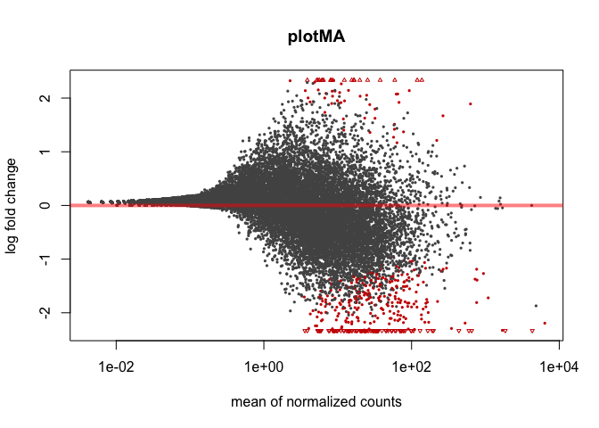
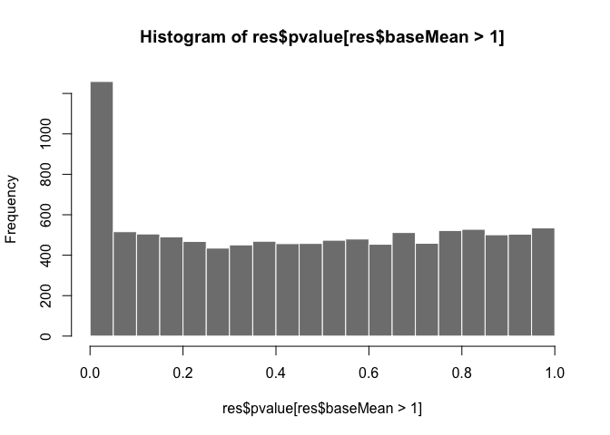
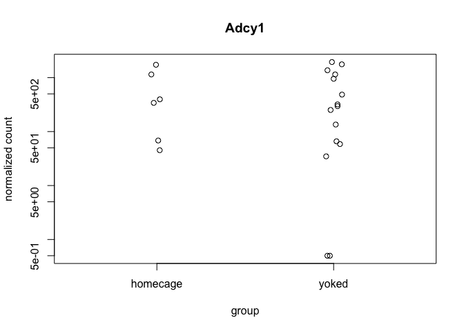
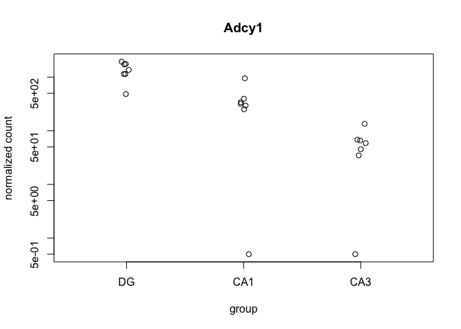
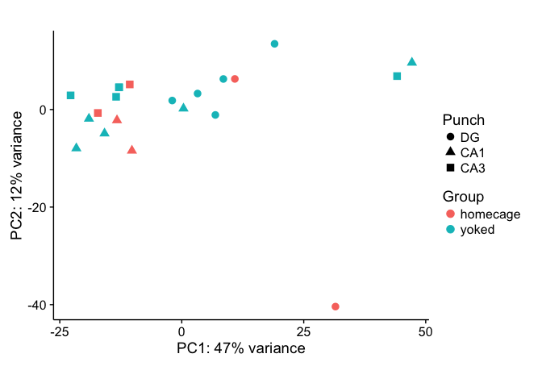
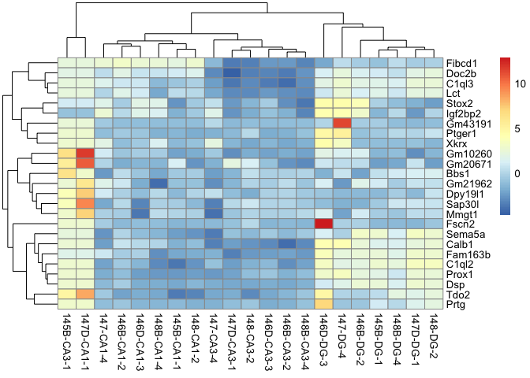
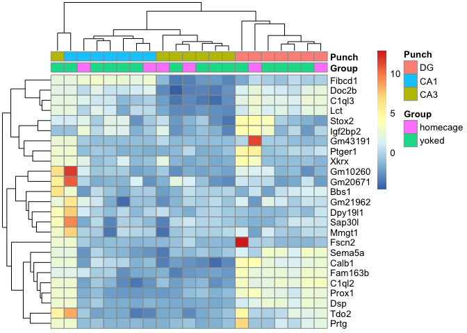

Loading the data
----------------

In the summer of 2016, I processed a bunch of hippocampal tissue samples
from WT and FMR1-KO mice that were trained in an active place avoidance
task.

This data was added the the epically large sample collection database
contained in the two files "animals.csv" and "punches.csv" which
provided a detailed account of all animals processed and all tissue
samples collected. Then, I tidy the dataframe a little bit to get it
prepared for RNAseq sample submision.

    #install.packages("tidyr", dependencies=TRUE)
    library("tidyr") 
    library("dplyr") ## for filtering and selecting rows
    library("plyr")  ## for renmaing factors
    library("reshape2") ##  for melting dataframe
    library("ggplot2") ## for awesome plots!
    library("magrittr") ## to use the weird pipe
    library("gplots") ##for making awesome plots
    library("cowplot") ## for some easy to use themes
    library("DESeq2") ## for differnetial gene expression profiling
    # set output file for figures 
    knitr::opts_chunk$set(fig.path = '../figures/homecage/')

Subsetting the data
-------------------

This analysis will focus only on the anaimals process in 2016. I
collected many, many samples, but I only processed a subset. I conducted
a photo anlaysis first to decide which samples came from a very specific
location in the hippocampus.

Data Cleaning
-------------

Well, the words I used when collecting might not be exactly what I want
plotted on figures and such, so I need to do a little data cleaning. I
also need to get the data in order so that row names are informative and
contain information

    ## start after 02c_tpmbygene
    Traits <- read.csv("../data/homecage.csv", header=TRUE)
    rownames(Traits) <- Traits$RNAseqID    # set $genoAPAsessionInd as
    str(Traits)

    ## 'data.frame':    21 obs. of  5 variables:
    ##  $ Mouse   : Factor w/ 7 levels "15-145B","15-146B",..: 1 1 1 2 2 2 3 3 3 4 ...
    ##  $ Year    : Factor w/ 1 level "Summer2015": 1 1 1 1 1 1 1 1 1 1 ...
    ##  $ Group   : Factor w/ 2 levels "homecage","yoked": 2 2 2 2 2 2 2 2 2 1 ...
    ##  $ Punch   : Factor w/ 3 levels "CA1","CA3","DG": 1 2 3 2 1 3 2 1 3 1 ...
    ##  $ RNAseqID: Factor w/ 21 levels "145B-CA1-1","145B-CA3-1",..: 1 2 3 5 4 6 8 7 9 10 ...

Kallisto Gather
---------------

The kallisto output gives you read counts for sample in an abundance
file for every single sample. This portion of the code goes through and
finds each samples' abundance.tsv file, extracts the data, and combines
it all into a dataframe. The "counts" file is unnormalized, but the
"tpm" is the data after being normalized by transcripts per million. I
also use some string splitting to take the very long transcript
identifying and create a "geneids" file that has all the database
identifiers for each transcript.

(P.S. Unfortunately, I have no idea how to do this next part without
changing directories.)

    setwd("../data/JA16444/")
    ## this will create lists of all the samples
    kallistoDirs = dir(".")
    kallistoDirs = kallistoDirs[!grepl("\\.(R|py|pl|sh|xlsx?|txt|tsv|csv|org|md|obo|png|jpg|pdf)$",
            kallistoDirs, ignore.case=TRUE)]

    kallistoFiles = paste0(kallistoDirs, "/abundance.tsv")
    names(kallistoFiles) = kallistoDirs
    if(file.exists(kallistoFiles))
      kallistoData = lapply(
        kallistoFiles,
        read.table,
        sep = "\t",
        row.names = 1,
        header = TRUE
    )

    ## Warning in if (file.exists(kallistoFiles)) kallistoData =
    ## lapply(kallistoFiles, : the condition has length > 1 and only the first
    ## element will be used

    ## this for loop uses the reduce function to make two data frame with counts or tpm from all the samples
    ids = Reduce(f=union, x=lapply(kallistoData, rownames))
    if (all(sapply(kallistoData, function(x) {all(rownames(x)==ids)}))) {
        count = data.frame(
            id = ids,
            sapply(kallistoData, function(x) {x$est_counts}),
            check.names = FALSE,
            stringsAsFactors = FALSE
        )
        tpm = data.frame(
            id = ids,
            sapply(kallistoData, function(x) {x$tpm}),
            check.names = FALSE,
            stringsAsFactors = FALSE
        )
    }

    ## make a dataframe with the parts of the gene id as columns
    geneids <- count[c(1)] 
    geneids$ENSMUST <- sapply(strsplit(as.character(geneids$id),'\\|'), "[", 1)
    geneids$ENSMUSG <- sapply(strsplit(as.character(geneids$id),'\\|'), "[", 2)
    geneids$OTTMUSG <- sapply(strsplit(as.character(geneids$id),'\\|'), "[", 3)
    geneids$OTTMUST <- sapply(strsplit(as.character(geneids$id),'\\|'), "[", 4)
    geneids$transcript <- sapply(strsplit(as.character(geneids$id),'\\|'), "[", 5)
    geneids$gene <- sapply(strsplit(as.character(geneids$id),'\\|'), "[", 6)
    geneids$length <- sapply(strsplit(as.character(geneids$id),'\\|'), "[", 7)
    geneids$structure1 <- sapply(strsplit(as.character(geneids$id),'\\|'), "[", 8)
    geneids$structure2 <- sapply(strsplit(as.character(geneids$id),'\\|'), "[", 9)
    geneids$structure3 <- sapply(strsplit(as.character(geneids$id),'\\|'), "[", 10)
    geneids$transcript_lenght <- as.factor(paste(geneids$transcript, geneids$length, sep="_"))

    ## prep data for wgcna
    countswgcna <- count
    row.names(countswgcna) <- geneids$transcript_lenght
    countswgcna[1] <- NULL
    countswgcna <- round(countswgcna)
    summary(countswgcna)

    ##    100-CA1-1          100-CA1-2         100-CA1-3       
    ##  Min.   :    0.00   Min.   :    0.0   Min.   :    0.00  
    ##  1st Qu.:    0.00   1st Qu.:    0.0   1st Qu.:    0.00  
    ##  Median :    0.00   Median :    1.0   Median :    0.00  
    ##  Mean   :   39.36   Mean   :  113.2   Mean   :   38.79  
    ##  3rd Qu.:   13.00   3rd Qu.:   41.0   3rd Qu.:   14.00  
    ##  Max.   :31720.00   Max.   :95996.0   Max.   :24445.00  
    ##    100-CA3-1          100-CA3-4           100-DG-2      
    ##  Min.   :    0.00   Min.   :    0.00   Min.   :    0.0  
    ##  1st Qu.:    0.00   1st Qu.:    0.00   1st Qu.:    0.0  
    ##  Median :    0.00   Median :    0.00   Median :    0.0  
    ##  Mean   :   33.63   Mean   :   40.06   Mean   :   21.9  
    ##  3rd Qu.:   14.00   3rd Qu.:   15.00   3rd Qu.:    9.0  
    ##  Max.   :24878.00   Max.   :42838.00   Max.   :22711.0  
    ##     100-DG-3          101-CA1-1           101-CA1-2     
    ##  Min.   :     0.0   Min.   :     0.00   Min.   :   0.0  
    ##  1st Qu.:     0.0   1st Qu.:     0.00   1st Qu.:   0.0  
    ##  Median :     0.0   Median :     0.00   Median :   0.0  
    ##  Mean   :   103.7   Mean   :    81.46   Mean   :   2.3  
    ##  3rd Qu.:    44.0   3rd Qu.:    27.00   3rd Qu.:   0.0  
    ##  Max.   :100671.0   Max.   :183815.00   Max.   :3478.0  
    ##    101-CA1-3          101-CA3-1          101-CA3-4       
    ##  Min.   :   0.000   Min.   :    0.00   Min.   :    0.00  
    ##  1st Qu.:   0.000   1st Qu.:    0.00   1st Qu.:    0.00  
    ##  Median :   0.000   Median :    0.00   Median :    0.00  
    ##  Mean   :   5.123   Mean   :   42.56   Mean   :   20.32  
    ##  3rd Qu.:   0.000   3rd Qu.:   14.00   3rd Qu.:    6.00  
    ##  Max.   :6174.000   Max.   :86004.00   Max.   :37665.00  
    ##     101-DG-3           101-DG-4        145A-CA1-2      
    ##  Min.   :   0.000   Min.   :   0.0   Min.   :    0.00  
    ##  1st Qu.:   0.000   1st Qu.:   0.0   1st Qu.:    0.00  
    ##  Median :   0.000   Median :   0.0   Median :    0.00  
    ##  Mean   :   1.122   Mean   :  10.2   Mean   :   79.72  
    ##  3rd Qu.:   0.000   3rd Qu.:   1.0   3rd Qu.:   27.00  
    ##  Max.   :4563.000   Max.   :9988.0   Max.   :73533.00  
    ##    145A-CA3-2          145A-DG-2          145B-CA1-1     
    ##  Min.   :    0.000   Min.   :    0.00   Min.   :    0.0  
    ##  1st Qu.:    0.000   1st Qu.:    0.00   1st Qu.:    0.0  
    ##  Median :    0.000   Median :    0.00   Median :    0.0  
    ##  Mean   :    5.886   Mean   :   24.45   Mean   :   34.4  
    ##  3rd Qu.:    1.000   3rd Qu.:    9.00   3rd Qu.:   10.0  
    ##  Max.   :15478.000   Max.   :11567.00   Max.   :39155.0  
    ##    145B-CA3-1          145B-DG-1         146A-CA1-2      
    ##  Min.   : 0.000000   Min.   :    0.0   Min.   :    0.00  
    ##  1st Qu.: 0.000000   1st Qu.:    0.0   1st Qu.:    0.00  
    ##  Median : 0.000000   Median :    0.0   Median :    0.00  
    ##  Mean   : 0.004667   Mean   :   25.7   Mean   :   29.21  
    ##  3rd Qu.: 0.000000   3rd Qu.:   10.0   3rd Qu.:   10.00  
    ##  Max.   :16.000000   Max.   :15903.0   Max.   :28994.00  
    ##    146A-DG-2          146B-CA1-2         146B-CA3-2      
    ##  Min.   :    0.00   Min.   :    0.00   Min.   :    0.00  
    ##  1st Qu.:    0.00   1st Qu.:    0.00   1st Qu.:    0.00  
    ##  Median :    0.00   Median :    0.00   Median :    0.00  
    ##  Mean   :   20.46   Mean   :   18.11   Mean   :   36.53  
    ##  3rd Qu.:    8.00   3rd Qu.:    6.00   3rd Qu.:   11.00  
    ##  Max.   :13368.00   Max.   :10320.00   Max.   :23297.00  
    ##    146B-DG-2          146C-CA1-4         146C-CA3-4      
    ##  Min.   :   0.000   Min.   :    0.00   Min.   :   0.000  
    ##  1st Qu.:   0.000   1st Qu.:    0.00   1st Qu.:   0.000  
    ##  Median :   0.000   Median :    0.00   Median :   0.000  
    ##  Mean   :   1.977   Mean   :   23.16   Mean   :   4.391  
    ##  3rd Qu.:   0.000   3rd Qu.:    8.00   3rd Qu.:   0.000  
    ##  Max.   :7802.000   Max.   :15918.00   Max.   :6848.000  
    ##    146C-DG-4          146D-CA1-3          146D-CA3-3      146D-DG-3      
    ##  Min.   :   0.000   Min.   :    0.000   Min.   :    0   Min.   :   0.00  
    ##  1st Qu.:   0.000   1st Qu.:    0.000   1st Qu.:    0   1st Qu.:   0.00  
    ##  Median :   0.000   Median :    0.000   Median :    0   Median :   0.00  
    ##  Mean   :   8.382   Mean   :    6.666   Mean   :   51   Mean   :   1.54  
    ##  3rd Qu.:   3.000   3rd Qu.:    0.000   3rd Qu.:   16   3rd Qu.:   0.00  
    ##  Max.   :2795.000   Max.   :19366.000   Max.   :38276   Max.   :6004.00  
    ##    147-CA1-4          147-CA3-4           147-DG-4       
    ##  Min.   :   0.000   Min.   :    0.00   Min.   :   0.000  
    ##  1st Qu.:   0.000   1st Qu.:    0.00   1st Qu.:   0.000  
    ##  Median :   0.000   Median :    0.00   Median :   0.000  
    ##  Mean   :   2.709   Mean   :   11.74   Mean   :   2.372  
    ##  3rd Qu.:   0.000   3rd Qu.:    0.00   3rd Qu.:   0.000  
    ##  Max.   :8956.000   Max.   :28974.00   Max.   :7543.000  
    ##    147C-CA1-3         147C-CA3-3          147C-DG-3      
    ##  Min.   :    0.00   Min.   :     0.00   Min.   :    0.0  
    ##  1st Qu.:    0.00   1st Qu.:     0.00   1st Qu.:    0.0  
    ##  Median :    0.00   Median :     0.00   Median :    1.0  
    ##  Mean   :   52.32   Mean   :    98.01   Mean   :   74.1  
    ##  3rd Qu.:   20.00   3rd Qu.:    37.00   3rd Qu.:   34.0  
    ##  Max.   :37687.00   Max.   :150301.00   Max.   :46988.0  
    ##    147D-CA1-1         147D-CA3-1         147D-DG-1      
    ##  Min.   :0.000000   Min.   :    0.00   Min.   :    0.0  
    ##  1st Qu.:0.000000   1st Qu.:    0.00   1st Qu.:    0.0  
    ##  Median :0.000000   Median :    0.00   Median :    0.0  
    ##  Mean   :0.003628   Mean   :   78.77   Mean   :  199.3  
    ##  3rd Qu.:0.000000   3rd Qu.:   27.00   3rd Qu.:   82.0  
    ##  Max.   :6.000000   Max.   :95754.00   Max.   :91299.0  
    ##    148-CA1-2          148-CA3-2           148-DG-2       
    ##  Min.   :    0.00   Min.   :    0.00   Min.   :    0.00  
    ##  1st Qu.:    0.00   1st Qu.:    0.00   1st Qu.:    0.00  
    ##  Median :    0.00   Median :    0.00   Median :    0.00  
    ##  Mean   :   32.38   Mean   :   39.91   Mean   :   38.01  
    ##  3rd Qu.:    8.00   3rd Qu.:   13.00   3rd Qu.:   12.00  
    ##  Max.   :24841.00   Max.   :23437.00   Max.   :23190.00  
    ##    148A-CA1-3        148A-CA3-3         148A-DG-3       
    ##  Min.   :    0.0   Min.   :    0.00   Min.   :    0.00  
    ##  1st Qu.:    0.0   1st Qu.:    0.00   1st Qu.:    0.00  
    ##  Median :    0.0   Median :    0.00   Median :    0.00  
    ##  Mean   :   89.6   Mean   :   45.58   Mean   :   68.45  
    ##  3rd Qu.:   31.0   3rd Qu.:   13.00   3rd Qu.:   29.00  
    ##  Max.   :52783.0   Max.   :32891.00   Max.   :31971.00  
    ##    148B-CA1-4         148B-CA3-4         148B-DG-4      
    ##  Min.   :    0.00   Min.   :    0.00   Min.   :    0.0  
    ##  1st Qu.:    0.00   1st Qu.:    0.00   1st Qu.:    0.0  
    ##  Median :    0.00   Median :    0.00   Median :    0.0  
    ##  Mean   :    5.74   Mean   :   59.38   Mean   :   13.6  
    ##  3rd Qu.:    0.00   3rd Qu.:   19.00   3rd Qu.:    5.0  
    ##  Max.   :33665.00   Max.   :37680.00   Max.   :10089.0

    ## prep data for wgcna
    tpmswgcna <- tpm
    row.names(tpmswgcna) <- geneids$transcript_lenght
    tpmswgcna[1] <- NULL
    tpmswgcna <- round(tpmswgcna)
    summary(tpmswgcna)

    ##    100-CA1-1          100-CA1-2          100-CA1-3       
    ##  Min.   :    0.00   Min.   :    0.00   Min.   :    0.00  
    ##  1st Qu.:    0.00   1st Qu.:    0.00   1st Qu.:    0.00  
    ##  Median :    0.00   Median :    0.00   Median :    0.00  
    ##  Mean   :   17.03   Mean   :   17.03   Mean   :   17.03  
    ##  3rd Qu.:    7.00   3rd Qu.:    7.00   3rd Qu.:    8.00  
    ##  Max.   :24369.00   Max.   :24132.00   Max.   :19819.00  
    ##    100-CA3-1          100-CA3-4           100-DG-2       
    ##  Min.   :    0.00   Min.   :    0.00   Min.   :    0.00  
    ##  1st Qu.:    0.00   1st Qu.:    0.00   1st Qu.:    0.00  
    ##  Median :    0.00   Median :    0.00   Median :    0.00  
    ##  Mean   :   17.03   Mean   :   17.03   Mean   :   17.03  
    ##  3rd Qu.:    9.00   3rd Qu.:    6.00   3rd Qu.:    7.00  
    ##  Max.   :21555.00   Max.   :28390.00   Max.   :29202.00  
    ##     100-DG-3          101-CA1-1          101-CA1-2       
    ##  Min.   :    0.00   Min.   :    0.00   Min.   :    0.00  
    ##  1st Qu.:    0.00   1st Qu.:    0.00   1st Qu.:    0.00  
    ##  Median :    0.00   Median :    0.00   Median :    0.00  
    ##  Mean   :   17.03   Mean   :   17.03   Mean   :   17.03  
    ##  3rd Qu.:    8.00   3rd Qu.:    5.00   3rd Qu.:    0.00  
    ##  Max.   :28519.00   Max.   :51265.00   Max.   :33859.00  
    ##    101-CA1-3          101-CA3-1          101-CA3-4       
    ##  Min.   :    0.00   Min.   :    0.00   Min.   :    0.00  
    ##  1st Qu.:    0.00   1st Qu.:    0.00   1st Qu.:    0.00  
    ##  Median :    0.00   Median :    0.00   Median :    0.00  
    ##  Mean   :   17.03   Mean   :   17.03   Mean   :   17.03  
    ##  3rd Qu.:    0.00   3rd Qu.:    5.00   3rd Qu.:    5.00  
    ##  Max.   :27533.00   Max.   :47831.00   Max.   :40527.00  
    ##     101-DG-3           101-DG-4          145A-CA1-2      
    ##  Min.   :    0.00   Min.   :    0.00   Min.   :    0.00  
    ##  1st Qu.:    0.00   1st Qu.:    0.00   1st Qu.:    0.00  
    ##  Median :    0.00   Median :    0.00   Median :    0.00  
    ##  Mean   :   17.03   Mean   :   17.03   Mean   :   17.03  
    ##  3rd Qu.:    0.00   3rd Qu.:    2.00   3rd Qu.:    6.00  
    ##  Max.   :49143.00   Max.   :25508.00   Max.   :27499.00  
    ##    145A-CA3-2         145A-DG-2          145B-CA1-1      
    ##  Min.   :    0.00   Min.   :    0.00   Min.   :    0.00  
    ##  1st Qu.:    0.00   1st Qu.:    0.00   1st Qu.:    0.00  
    ##  Median :    0.00   Median :    0.00   Median :    0.00  
    ##  Mean   :   17.03   Mean   :   17.03   Mean   :   17.03  
    ##  3rd Qu.:    1.00   3rd Qu.:    9.00   3rd Qu.:    6.00  
    ##  Max.   :38595.00   Max.   :14783.00   Max.   :31778.00  
    ##    145B-CA3-1         145B-DG-1          146A-CA1-2      
    ##  Min.   :    0.00   Min.   :    0.00   Min.   :    0.00  
    ##  1st Qu.:    0.00   1st Qu.:    0.00   1st Qu.:    0.00  
    ##  Median :    0.00   Median :    0.00   Median :    0.00  
    ##  Mean   :   17.03   Mean   :   17.03   Mean   :   17.03  
    ##  3rd Qu.:    0.00   3rd Qu.:    9.00   3rd Qu.:    6.00  
    ##  Max.   :35254.00   Max.   :18049.00   Max.   :25334.00  
    ##    146A-DG-2          146B-CA1-2         146B-CA3-2      
    ##  Min.   :    0.00   Min.   :    0.00   Min.   :    0.00  
    ##  1st Qu.:    0.00   1st Qu.:    0.00   1st Qu.:    0.00  
    ##  Median :    0.00   Median :    0.00   Median :    0.00  
    ##  Mean   :   17.03   Mean   :   17.03   Mean   :   17.03  
    ##  3rd Qu.:    9.00   3rd Qu.:    8.00   3rd Qu.:    6.00  
    ##  Max.   :19323.00   Max.   :12770.00   Max.   :17434.00  
    ##    146B-DG-2           146C-CA1-4         146C-CA3-4      
    ##  Min.   :     0.00   Min.   :    0.00   Min.   :    0.00  
    ##  1st Qu.:     0.00   1st Qu.:    0.00   1st Qu.:    0.00  
    ##  Median :     0.00   Median :    0.00   Median :    0.00  
    ##  Mean   :    17.03   Mean   :   17.03   Mean   :   17.03  
    ##  3rd Qu.:     0.00   3rd Qu.:    8.00   3rd Qu.:    0.00  
    ##  Max.   :118921.00   Max.   :20521.00   Max.   :26486.00  
    ##    146C-DG-4          146D-CA1-3         146D-CA3-3      
    ##  Min.   :    0.00   Min.   :    0.00   Min.   :    0.00  
    ##  1st Qu.:    0.00   1st Qu.:    0.00   1st Qu.:    0.00  
    ##  Median :    0.00   Median :    0.00   Median :    0.00  
    ##  Mean   :   17.03   Mean   :   17.03   Mean   :   17.03  
    ##  3rd Qu.:    6.00   3rd Qu.:    0.00   3rd Qu.:    7.00  
    ##  Max.   :10508.00   Max.   :48182.00   Max.   :21103.00  
    ##    146D-DG-3           147-CA1-4          147-CA3-4       
    ##  Min.   :     0.00   Min.   :    0.00   Min.   :    0.00  
    ##  1st Qu.:     0.00   1st Qu.:    0.00   1st Qu.:    0.00  
    ##  Median :     0.00   Median :    0.00   Median :    0.00  
    ##  Mean   :    17.03   Mean   :   17.03   Mean   :   17.03  
    ##  3rd Qu.:     0.00   3rd Qu.:    0.00   3rd Qu.:    0.00  
    ##  Max.   :110585.00   Max.   :51833.00   Max.   :36128.00  
    ##     147-DG-4           147C-CA1-3         147C-CA3-3      
    ##  Min.   :     0.00   Min.   :    0.00   Min.   :    0.00  
    ##  1st Qu.:     0.00   1st Qu.:    0.00   1st Qu.:    0.00  
    ##  Median :     0.00   Median :    0.00   Median :    0.00  
    ##  Mean   :    17.03   Mean   :   17.03   Mean   :   17.03  
    ##  3rd Qu.:     0.00   3rd Qu.:    8.00   3rd Qu.:    7.00  
    ##  Max.   :129255.00   Max.   :21638.00   Max.   :38426.00  
    ##    147C-DG-3          147D-CA1-1         147D-CA3-1      
    ##  Min.   :    0.00   Min.   :    0.00   Min.   :    0.00  
    ##  1st Qu.:    0.00   1st Qu.:    0.00   1st Qu.:    0.00  
    ##  Median :    0.00   Median :    0.00   Median :    0.00  
    ##  Mean   :   17.03   Mean   :   17.03   Mean   :   17.03  
    ##  3rd Qu.:   10.00   3rd Qu.:    0.00   3rd Qu.:    6.00  
    ##  Max.   :18962.00   Max.   :79385.00   Max.   :30897.00  
    ##    147D-DG-1          148-CA1-2          148-CA3-2       
    ##  Min.   :    0.00   Min.   :    0.00   Min.   :    0.00  
    ##  1st Qu.:    0.00   1st Qu.:    0.00   1st Qu.:    0.00  
    ##  Median :    0.00   Median :    0.00   Median :    0.00  
    ##  Mean   :   17.03   Mean   :   17.03   Mean   :   17.03  
    ##  3rd Qu.:    9.00   3rd Qu.:    5.00   3rd Qu.:    6.00  
    ##  Max.   :15216.00   Max.   :22177.00   Max.   :16496.00  
    ##     148-DG-2          148A-CA1-3         148A-CA3-3      
    ##  Min.   :    0.00   Min.   :    0.00   Min.   :    0.00  
    ##  1st Qu.:    0.00   1st Qu.:    0.00   1st Qu.:    0.00  
    ##  Median :    0.00   Median :    0.00   Median :    0.00  
    ##  Mean   :   17.03   Mean   :   17.03   Mean   :   17.03  
    ##  3rd Qu.:    7.00   3rd Qu.:    7.00   3rd Qu.:    5.00  
    ##  Max.   :12329.00   Max.   :18801.00   Max.   :19835.00  
    ##    148A-DG-3          148B-CA1-4         148B-CA3-4      
    ##  Min.   :    0.00   Min.   :    0.00   Min.   :    0.00  
    ##  1st Qu.:    0.00   1st Qu.:    0.00   1st Qu.:    0.00  
    ##  Median :    0.00   Median :    0.00   Median :    0.00  
    ##  Mean   :   17.03   Mean   :   17.03   Mean   :   17.03  
    ##  3rd Qu.:   10.00   3rd Qu.:    0.00   3rd Qu.:    6.00  
    ##  Max.   :15700.00   Max.   :56713.00   Max.   :19770.00  
    ##    148B-DG-4       
    ##  Min.   :    0.00  
    ##  1st Qu.:    0.00  
    ##  Median :    0.00  
    ##  Mean   :   17.03  
    ##  3rd Qu.:    7.00  
    ##  Max.   :21584.00

Merge transcipts counts to gene counts
--------------------------------------

Kallisto is cool because it does give you transcript level stuff, but
right now I think I have more power if I just look at gene level stuff.
I'll go back and look at transcripts if I want to.

    # merge tpm and gene id dataframe
    tpmbygene <-  full_join(geneids, tpm)

    ## Joining, by = "id"

    str(tpmbygene)

    ## 'data.frame':    58716 obs. of  61 variables:
    ##  $ id               : chr  "ENSMUST00000070533.4|ENSMUSG00000051951.5|OTTMUSG00000026353.2|OTTMUST00000065166.1|Xkr4-001|Xkr4|3634|UTR5:1-150|CDS:151-2094|"| __truncated__ "ENSMUST00000208660.1|ENSMUSG00000025900.11|OTTMUSG00000049985.3|OTTMUST00000145515.1|Rp1-003|Rp1|4170|UTR5:1-54|CDS:55-4170|" "ENSMUST00000027032.5|ENSMUSG00000025900.11|OTTMUSG00000049985.3|OTTMUST00000127195.2|Rp1-001|Rp1|6869|UTR5:1-127|CDS:128-6415|U"| __truncated__ "ENSMUST00000194992.6|ENSMUSG00000109048.1|-|-|Rp1-201|Rp1|858|CDS:1-858|" ...
    ##  $ ENSMUST          : chr  "ENSMUST00000070533.4" "ENSMUST00000208660.1" "ENSMUST00000027032.5" "ENSMUST00000194992.6" ...
    ##  $ ENSMUSG          : chr  "ENSMUSG00000051951.5" "ENSMUSG00000025900.11" "ENSMUSG00000025900.11" "ENSMUSG00000109048.1" ...
    ##  $ OTTMUSG          : chr  "OTTMUSG00000026353.2" "OTTMUSG00000049985.3" "OTTMUSG00000049985.3" "-" ...
    ##  $ OTTMUST          : chr  "OTTMUST00000065166.1" "OTTMUST00000145515.1" "OTTMUST00000127195.2" "-" ...
    ##  $ transcript       : chr  "Xkr4-001" "Rp1-003" "Rp1-001" "Rp1-201" ...
    ##  $ gene             : chr  "Xkr4" "Rp1" "Rp1" "Rp1" ...
    ##  $ length           : chr  "3634" "4170" "6869" "858" ...
    ##  $ structure1       : chr  "UTR5:1-150" "UTR5:1-54" "UTR5:1-127" "CDS:1-858" ...
    ##  $ structure2       : chr  "CDS:151-2094" "CDS:55-4170" "CDS:128-6415" NA ...
    ##  $ structure3       : chr  "UTR3:2095-3634" NA "UTR3:6416-6869" NA ...
    ##  $ transcript_lenght: Factor w/ 58716 levels "0610007P14Rik-001_1169",..: 56602 43155 43154 43156 47712 47716 47715 47713 47718 47717 ...
    ##  $ 100-CA1-1        : num  22.2 0 0 0 0 ...
    ##  $ 100-CA1-2        : num  24.5 0 0 0 0 ...
    ##  $ 100-CA1-3        : num  25.3 0 0 0 0 ...
    ##  $ 100-CA3-1        : num  27.7 0 0 0 0 ...
    ##  $ 100-CA3-4        : num  7.95 0 0 0 0 ...
    ##  $ 100-DG-2         : num  18.5 0 0 0 0 ...
    ##  $ 100-DG-3         : num  6.38 0 0 0 0 ...
    ##  $ 101-CA1-1        : num  4.04 0 0 0 3.95 ...
    ##  $ 101-CA1-2        : num  3.48 0 0 0 0 ...
    ##  $ 101-CA1-3        : num  3.5 0 0 0 0 ...
    ##  $ 101-CA3-1        : num  11.8 0 0 0 0 ...
    ##  $ 101-CA3-4        : num  12.63 0 0 0 2.47 ...
    ##  $ 101-DG-3         : num  12.5 0 0 0 0 ...
    ##  $ 101-DG-4         : num  2.93 0 0 0 0 ...
    ##  $ 145A-CA1-2       : num  16.34 0 0 0 6.34 ...
    ##  $ 145A-CA3-2       : num  4.49 0 0 0 0 ...
    ##  $ 145A-DG-2        : num  21.6 0 0 0 0 ...
    ##  $ 145B-CA1-1       : num  16.8 0 0 0 0 ...
    ##  $ 145B-CA3-1       : num  0 0 0 0 0 0 0 0 0 0 ...
    ##  $ 145B-DG-1        : num  12 0 0 0 0 ...
    ##  $ 146A-CA1-2       : num  6.22 0 0 0 0 ...
    ##  $ 146A-DG-2        : num  5.11 0 0 0 0 ...
    ##  $ 146B-CA1-2       : num  32.4 0 0 0 0 ...
    ##  $ 146B-CA3-2       : num  13.7 0 0 0 0 ...
    ##  $ 146B-DG-2        : num  4.75 0 0 0 0 ...
    ##  $ 146C-CA1-4       : num  45.7 0 0 0 0 ...
    ##  $ 146C-CA3-4       : num  1.81 0 0 0 0 ...
    ##  $ 146C-DG-4        : num  2.58 2.23 0 0 0 ...
    ##  $ 146D-CA1-3       : num  20.8 0 0 0 0 ...
    ##  $ 146D-CA3-3       : num  11.5 0 0 0 0 ...
    ##  $ 146D-DG-3        : num  0 0 0 0 0 0 0 0 0 0 ...
    ##  $ 147-CA1-4        : num  3.48 0 0 0 0 ...
    ##  $ 147-CA3-4        : num  8.25 0 0 0 0 ...
    ##  $ 147-DG-4         : num  0 0 0 0 0 0 0 0 0 0 ...
    ##  $ 147C-CA1-3       : num  22.23 0 0 0 1.25 ...
    ##  $ 147C-CA3-3       : num  22.3 0 0 0 1.2 ...
    ##  $ 147C-DG-3        : num  15.8 0 0 0 0 ...
    ##  $ 147D-CA1-1       : num  0 0 0 0 0 0 0 0 0 0 ...
    ##  $ 147D-CA3-1       : num  18.7 0 0 0 0 ...
    ##  $ 147D-DG-1        : num  12.737 0 0 0 0.119 ...
    ##  $ 148-CA1-2        : num  17.9 0 0 0 0 ...
    ##  $ 148-CA3-2        : num  12.7 0 0 0 0 ...
    ##  $ 148-DG-2         : num  9.57 0 0 0 0 ...
    ##  $ 148A-CA1-3       : num  30 0 0 0 0 ...
    ##  $ 148A-CA3-3       : num  7.76 1.21 0 0 0 ...
    ##  $ 148A-DG-3        : num  18.6 0 0 0 0 ...
    ##  $ 148B-CA1-4       : num  8.65 0 0 0 6.07 ...
    ##  $ 148B-CA3-4       : num  12.721 0 0 0 0.204 ...
    ##  $ 148B-DG-4        : num  12.139 0 0 0 0.838 ...

    head(tpmbygene)

    ##                                                                                                                                                    id
    ## 1      ENSMUST00000070533.4|ENSMUSG00000051951.5|OTTMUSG00000026353.2|OTTMUST00000065166.1|Xkr4-001|Xkr4|3634|UTR5:1-150|CDS:151-2094|UTR3:2095-3634|
    ## 2                        ENSMUST00000208660.1|ENSMUSG00000025900.11|OTTMUSG00000049985.3|OTTMUST00000145515.1|Rp1-003|Rp1|4170|UTR5:1-54|CDS:55-4170|
    ## 3       ENSMUST00000027032.5|ENSMUSG00000025900.11|OTTMUSG00000049985.3|OTTMUST00000127195.2|Rp1-001|Rp1|6869|UTR5:1-127|CDS:128-6415|UTR3:6416-6869|
    ## 4                                                                            ENSMUST00000194992.6|ENSMUSG00000109048.1|-|-|Rp1-201|Rp1|858|CDS:1-858|
    ## 5 ENSMUST00000027035.9|ENSMUSG00000025902.13|OTTMUSG00000050014.7|OTTMUST00000127245.2|Sox17-001|Sox17|3127|UTR5:1-1082|CDS:1083-2342|UTR3:2343-3127|
    ## 6   ENSMUST00000195555.1|ENSMUSG00000025902.13|OTTMUSG00000050014.7|OTTMUST00000127249.1|Sox17-005|Sox17|1977|UTR5:1-635|CDS:636-1511|UTR3:1512-1977|
    ##                ENSMUST               ENSMUSG              OTTMUSG
    ## 1 ENSMUST00000070533.4  ENSMUSG00000051951.5 OTTMUSG00000026353.2
    ## 2 ENSMUST00000208660.1 ENSMUSG00000025900.11 OTTMUSG00000049985.3
    ## 3 ENSMUST00000027032.5 ENSMUSG00000025900.11 OTTMUSG00000049985.3
    ## 4 ENSMUST00000194992.6  ENSMUSG00000109048.1                    -
    ## 5 ENSMUST00000027035.9 ENSMUSG00000025902.13 OTTMUSG00000050014.7
    ## 6 ENSMUST00000195555.1 ENSMUSG00000025902.13 OTTMUSG00000050014.7
    ##                OTTMUST transcript  gene length  structure1    structure2
    ## 1 OTTMUST00000065166.1   Xkr4-001  Xkr4   3634  UTR5:1-150  CDS:151-2094
    ## 2 OTTMUST00000145515.1    Rp1-003   Rp1   4170   UTR5:1-54   CDS:55-4170
    ## 3 OTTMUST00000127195.2    Rp1-001   Rp1   6869  UTR5:1-127  CDS:128-6415
    ## 4                    -    Rp1-201   Rp1    858   CDS:1-858          <NA>
    ## 5 OTTMUST00000127245.2  Sox17-001 Sox17   3127 UTR5:1-1082 CDS:1083-2342
    ## 6 OTTMUST00000127249.1  Sox17-005 Sox17   1977  UTR5:1-635  CDS:636-1511
    ##       structure3 transcript_lenght 100-CA1-1 100-CA1-2 100-CA1-3 100-CA3-1
    ## 1 UTR3:2095-3634     Xkr4-001_3634   22.2451   24.4511   25.3313   27.7121
    ## 2           <NA>      Rp1-003_4170    0.0000    0.0000    0.0000    0.0000
    ## 3 UTR3:6416-6869      Rp1-001_6869    0.0000    0.0000    0.0000    0.0000
    ## 4           <NA>       Rp1-201_858    0.0000    0.0000    0.0000    0.0000
    ## 5 UTR3:2343-3127    Sox17-001_3127    0.0000    0.0000    0.0000    0.0000
    ## 6 UTR3:1512-1977    Sox17-005_1977    0.0000    0.0000    0.0000    0.0000
    ##   100-CA3-4 100-DG-2 100-DG-3   101-CA1-1 101-CA1-2 101-CA1-3 101-CA3-1
    ## 1   7.95194  18.5292 6.376050 4.03856e+00   3.48254   3.50001  11.79530
    ## 2   0.00000   0.0000 0.000000 0.00000e+00   0.00000   0.00000   0.00000
    ## 3   0.00000   0.0000 0.000000 0.00000e+00   0.00000   0.00000   0.00000
    ## 4   0.00000   0.0000 0.000000 0.00000e+00   0.00000   0.00000   0.00000
    ## 5   0.00000   0.0000 0.000000 3.94761e+00   0.00000   0.00000   0.00000
    ## 6   1.74827   0.0000 0.542839 1.38649e-07   0.00000   0.00000   1.10103
    ##     101-CA3-4 101-DG-3 101-DG-4 145A-CA1-2 145A-CA3-2 145A-DG-2 145B-CA1-1
    ## 1 1.26264e+01  12.5498  2.92937   16.34040    4.48897   21.5896     16.838
    ## 2 0.00000e+00   0.0000  0.00000    0.00000    0.00000    0.0000      0.000
    ## 3 0.00000e+00   0.0000  0.00000    0.00000    0.00000    0.0000      0.000
    ## 4 0.00000e+00   0.0000  0.00000    0.00000    0.00000    0.0000      0.000
    ## 5 2.46799e+00   0.0000  0.00000    6.34082    0.00000    0.0000      0.000
    ## 6 3.90322e-08   0.0000  0.00000    0.00000    0.00000    0.0000      0.000
    ##   145B-CA3-1 145B-DG-1 146A-CA1-2 146A-DG-2 146B-CA1-2 146B-CA3-2
    ## 1          0   11.9887     6.2172   5.11426    32.3786     13.737
    ## 2          0    0.0000     0.0000   0.00000     0.0000      0.000
    ## 3          0    0.0000     0.0000   0.00000     0.0000      0.000
    ## 4          0    0.0000     0.0000   0.00000     0.0000      0.000
    ## 5          0    0.0000     0.0000   0.00000     0.0000      0.000
    ## 6          0    0.0000     0.0000   0.00000    11.7267      0.000
    ##   146B-DG-2 146C-CA1-4 146C-CA3-4 146C-DG-4 146D-CA1-3 146D-CA3-3
    ## 1   4.74991   45.71020    1.80851   2.58208    20.7804  11.463800
    ## 2   0.00000    0.00000    0.00000   2.23359     0.0000   0.000000
    ## 3   0.00000    0.00000    0.00000   0.00000     0.0000   0.000000
    ## 4   0.00000    0.00000    0.00000   0.00000     0.0000   0.000000
    ## 5   0.00000    0.00000    0.00000   0.00000     0.0000   0.000000
    ## 6   0.00000    4.15792    0.00000   0.00000     0.0000   0.417577
    ##   146D-DG-3 147-CA1-4 147-CA3-4 147-DG-4 147C-CA1-3 147C-CA3-3 147C-DG-3
    ## 1         0   3.48055   8.24899        0  22.229100   22.27690  15.77190
    ## 2         0   0.00000   0.00000        0   0.000000    0.00000   0.00000
    ## 3         0   0.00000   0.00000        0   0.000000    0.00000   0.00000
    ## 4         0   0.00000   0.00000        0   0.000000    0.00000   0.00000
    ## 5         0   0.00000   0.00000        0   1.252800    1.19818   0.00000
    ## 6         0   0.00000   0.00000        0   0.772894    0.00000   2.08254
    ##   147D-CA1-1 147D-CA3-1 147D-DG-1 148-CA1-2 148-CA3-2 148-DG-2 148A-CA1-3
    ## 1          0    18.6807 12.736700   17.9422   12.6904  9.56909    30.0286
    ## 2          0     0.0000  0.000000    0.0000    0.0000  0.00000     0.0000
    ## 3          0     0.0000  0.000000    0.0000    0.0000  0.00000     0.0000
    ## 4          0     0.0000  0.000000    0.0000    0.0000  0.00000     0.0000
    ## 5          0     0.0000  0.118783    0.0000    0.0000  0.00000     0.0000
    ## 6          0     0.0000  0.000000    0.0000    0.0000  0.00000     0.0000
    ##   148A-CA3-3 148A-DG-3 148B-CA1-4 148B-CA3-4 148B-DG-4
    ## 1   7.762330   18.5563    8.64615  12.721300 12.139300
    ## 2   1.205320    0.0000    0.00000   0.000000  0.000000
    ## 3   0.000000    0.0000    0.00000   0.000000  0.000000
    ## 4   0.000000    0.0000    0.00000   0.000000  0.000000
    ## 5   0.000000    0.0000    6.07479   0.204457  0.837751
    ## 6   0.384225    0.0000    0.00000   0.000000  0.000000

    countbygene <- full_join(geneids, count)

    ## Joining, by = "id"

    str(countbygene)

    ## 'data.frame':    58716 obs. of  61 variables:
    ##  $ id               : chr  "ENSMUST00000070533.4|ENSMUSG00000051951.5|OTTMUSG00000026353.2|OTTMUST00000065166.1|Xkr4-001|Xkr4|3634|UTR5:1-150|CDS:151-2094|"| __truncated__ "ENSMUST00000208660.1|ENSMUSG00000025900.11|OTTMUSG00000049985.3|OTTMUST00000145515.1|Rp1-003|Rp1|4170|UTR5:1-54|CDS:55-4170|" "ENSMUST00000027032.5|ENSMUSG00000025900.11|OTTMUSG00000049985.3|OTTMUST00000127195.2|Rp1-001|Rp1|6869|UTR5:1-127|CDS:128-6415|U"| __truncated__ "ENSMUST00000194992.6|ENSMUSG00000109048.1|-|-|Rp1-201|Rp1|858|CDS:1-858|" ...
    ##  $ ENSMUST          : chr  "ENSMUST00000070533.4" "ENSMUST00000208660.1" "ENSMUST00000027032.5" "ENSMUST00000194992.6" ...
    ##  $ ENSMUSG          : chr  "ENSMUSG00000051951.5" "ENSMUSG00000025900.11" "ENSMUSG00000025900.11" "ENSMUSG00000109048.1" ...
    ##  $ OTTMUSG          : chr  "OTTMUSG00000026353.2" "OTTMUSG00000049985.3" "OTTMUSG00000049985.3" "-" ...
    ##  $ OTTMUST          : chr  "OTTMUST00000065166.1" "OTTMUST00000145515.1" "OTTMUST00000127195.2" "-" ...
    ##  $ transcript       : chr  "Xkr4-001" "Rp1-003" "Rp1-001" "Rp1-201" ...
    ##  $ gene             : chr  "Xkr4" "Rp1" "Rp1" "Rp1" ...
    ##  $ length           : chr  "3634" "4170" "6869" "858" ...
    ##  $ structure1       : chr  "UTR5:1-150" "UTR5:1-54" "UTR5:1-127" "CDS:1-858" ...
    ##  $ structure2       : chr  "CDS:151-2094" "CDS:55-4170" "CDS:128-6415" NA ...
    ##  $ structure3       : chr  "UTR3:2095-3634" NA "UTR3:6416-6869" NA ...
    ##  $ transcript_lenght: Factor w/ 58716 levels "0610007P14Rik-001_1169",..: 56602 43155 43154 43156 47712 47716 47715 47713 47718 47717 ...
    ##  $ 100-CA1-1        : num  80 0 0 0 0 0 0 0 0 1 ...
    ##  $ 100-CA1-2        : num  266 0 0 0 0 0 0 13 0 0 ...
    ##  $ 100-CA1-3        : num  87 0 0 0 0 0 0 0 0 0 ...
    ##  $ 100-CA3-1        : num  86 0 0 0 0 0 0 5 0 0 ...
    ##  $ 100-CA3-4        : num  35 0 0 0 0 ...
    ##  $ 100-DG-2         : num  45 0 0 0 0 0 0 2 0 1 ...
    ##  $ 100-DG-3         : num  68 0 0 0 0 3 0 0 0 0 ...
    ##  $ 101-CA1-1        : num  42 0 0 0 35 ...
    ##  $ 101-CA1-2        : num  1 0 0 0 0 0 0 1 0 0 ...
    ##  $ 101-CA1-3        : num  2 0 0 0 0 0 0 0 0 0 ...
    ##  $ 101-CA3-1        : num  62 0 0 0 0 3 0 0 0 0 ...
    ##  $ 101-CA3-4        : num  30 0 0 0 5 ...
    ##  $ 101-DG-3         : num  2 0 0 0 0 0 0 0 0 0 ...
    ##  $ 101-DG-4         : num  3 0 0 0 0 0 0 0 0 0 ...
    ##  $ 145A-CA1-2       : num  133 0 0 0 44 0 0 0 0 0 ...
    ##  $ 145A-CA3-2       : num  3 0 0 0 0 0 0 2 0 0 ...
    ##  $ 145A-DG-2        : num  46 0 0 0 0 0 0 0 0 0 ...
    ##  $ 145B-CA1-1       : num  60 0 0 0 0 0 0 0 0 0 ...
    ##  $ 145B-CA3-1       : num  0 0 0 0 0 0 0 0 0 0 ...
    ##  $ 145B-DG-1        : num  27 0 0 0 0 0 0 0 0 2 ...
    ##  $ 146A-CA1-2       : num  20 0 0 0 0 0 0 6 0 2 ...
    ##  $ 146A-DG-2        : num  10 0 0 0 0 0 0 0 0 1 ...
    ##  $ 146B-CA1-2       : num  48 0 0 0 0 9 0 0 0 0 ...
    ##  $ 146B-CA3-2       : num  48 0 0 0 0 0 0 0 0 8 ...
    ##  $ 146B-DG-2        : num  1 0 0 0 0 0 0 0 0 0 ...
    ##  $ 146C-CA1-4       : num  93 0 0 0 0 ...
    ##  $ 146C-CA3-4       : num  1 0 0 0 0 0 0 3 0 0 ...
    ##  $ 146C-DG-4        : num  2 2 0 0 0 0 0 0 0 0 ...
    ##  $ 146D-CA1-3       : num  15 0 0 0 0 0 0 0 0 0 ...
    ##  $ 146D-CA3-3       : num  53 0 0 0 0 1 0 0 0 9 ...
    ##  $ 146D-DG-3        : num  0 0 0 0 0 0 0 0 0 0 ...
    ##  $ 147-CA1-4        : num  1 0 0 0 0 0 0 0 0 0 ...
    ##  $ 147-CA3-4        : num  11 0 0 0 0 0 0 0 0 0 ...
    ##  $ 147-DG-4         : num  0 0 0 0 0 0 0 0 0 0 ...
    ##  $ 147C-CA1-3       : num  106 0 0 0 5.09 ...
    ##  $ 147C-CA3-3       : num  237 0 0 0 10.9 ...
    ##  $ 147C-DG-3        : num  104 0 0 0 0 ...
    ##  $ 147D-CA1-1       : num  0 0 0 0 0 0 0 0 0 0 ...
    ##  $ 147D-CA3-1       : num  160 0 0 0 0 0 0 0 0 0 ...
    ##  $ 147D-DG-1        : num  227 0 0 0 1.8 ...
    ##  $ 148-CA1-2        : num  54 0 0 0 0 0 0 0 0 0 ...
    ##  $ 148-CA3-2        : num  49 0 0 0 0 ...
    ##  $ 148-DG-2         : num  34 0 0 0 0 0 0 0 0 0 ...
    ##  $ 148A-CA1-3       : num  253 0 0 0 0 0 0 0 0 4 ...
    ##  $ 148A-CA3-3       : num  39 7 0 0 0 1 0 0 0 0 ...
    ##  $ 148A-DG-3        : num  108 0 0 0 0 0 0 9 0 0 ...
    ##  $ 148B-CA1-4       : num  5 0 0 0 3 0 0 0 0 0 ...
    ##  $ 148B-CA3-4       : num  73 0 0 0 1 0 0 0 0 0 ...
    ##  $ 148B-DG-4        : num  17 0 0 0 1 0 0 0 0 0 ...

    ## remove unnecesary columns (aka, keep gene name and counts for samples)
    tpmbygene <- tpmbygene[-c(1:6,8:12)]  
    countbygene <- countbygene[-c(1:6,8:12)]  

    ## lenghten 
    tpmbygene <- melt(tpmbygene, id=c("gene"))
    head(tpmbygene)

    ##    gene  variable   value
    ## 1  Xkr4 100-CA1-1 22.2451
    ## 2   Rp1 100-CA1-1  0.0000
    ## 3   Rp1 100-CA1-1  0.0000
    ## 4   Rp1 100-CA1-1  0.0000
    ## 5 Sox17 100-CA1-1  0.0000
    ## 6 Sox17 100-CA1-1  0.0000

    countbygene <- melt(countbygene, id=c("gene"))
    head(countbygene)

    ##    gene  variable value
    ## 1  Xkr4 100-CA1-1    80
    ## 2   Rp1 100-CA1-1     0
    ## 3   Rp1 100-CA1-1     0
    ## 4   Rp1 100-CA1-1     0
    ## 5 Sox17 100-CA1-1     0
    ## 6 Sox17 100-CA1-1     0

    #then widen by sum
    tpmbygene <- dcast(tpmbygene, gene ~ variable, value.var= "value", fun.aggregate=mean)
    countbygene  <- dcast(countbygene, gene ~ variable, value.var= "value", fun.aggregate=mean)

    ## make gene the row name then round all value to nearest 1s place
    row.names(tpmbygene) <- tpmbygene$gene
    tpmbygene[1] <- NULL
    tpmbygene <- round(tpmbygene)
    summary(tpmbygene)

    ##    100-CA1-1          100-CA1-2          100-CA1-3       
    ##  Min.   :    0.00   Min.   :    0.00   Min.   :    0.00  
    ##  1st Qu.:    0.00   1st Qu.:    0.00   1st Qu.:    0.00  
    ##  Median :    2.00   Median :    2.00   Median :    2.00  
    ##  Mean   :   25.16   Mean   :   25.92   Mean   :   24.93  
    ##  3rd Qu.:   12.00   3rd Qu.:   12.00   3rd Qu.:   12.00  
    ##  Max.   :24369.00   Max.   :24132.00   Max.   :19819.00  
    ##    100-CA3-1          100-CA3-4           100-DG-2       
    ##  Min.   :    0.00   Min.   :    0.00   Min.   :    0.00  
    ##  1st Qu.:    0.00   1st Qu.:    0.00   1st Qu.:    0.00  
    ##  Median :    2.00   Median :    2.00   Median :    2.00  
    ##  Mean   :   25.05   Mean   :   26.74   Mean   :   26.62  
    ##  3rd Qu.:   13.00   3rd Qu.:   10.00   3rd Qu.:   11.00  
    ##  Max.   :21555.00   Max.   :28390.00   Max.   :29202.00  
    ##     100-DG-3          101-CA1-1          101-CA1-2       
    ##  Min.   :    0.00   Min.   :    0.00   Min.   :    0.00  
    ##  1st Qu.:    0.00   1st Qu.:    0.00   1st Qu.:    0.00  
    ##  Median :    2.00   Median :    1.00   Median :    0.00  
    ##  Mean   :   26.13   Mean   :   30.66   Mean   :   27.14  
    ##  3rd Qu.:   12.00   3rd Qu.:    8.00   3rd Qu.:    9.00  
    ##  Max.   :28519.00   Max.   :51265.00   Max.   :33859.00  
    ##    101-CA1-3         101-CA3-1          101-CA3-4       
    ##  Min.   :    0.0   Min.   :    0.00   Min.   :    0.00  
    ##  1st Qu.:    0.0   1st Qu.:    0.00   1st Qu.:    0.00  
    ##  Median :    0.0   Median :    1.00   Median :    1.00  
    ##  Mean   :   25.8   Mean   :   29.69   Mean   :   28.97  
    ##  3rd Qu.:   10.0   3rd Qu.:    9.00   3rd Qu.:    9.00  
    ##  Max.   :27533.0   Max.   :47831.00   Max.   :40527.00  
    ##     101-DG-3           101-DG-4         145A-CA1-2         145A-CA3-2     
    ##  Min.   :    0.00   Min.   :    0.0   Min.   :    0.00   Min.   :    0.0  
    ##  1st Qu.:    0.00   1st Qu.:    0.0   1st Qu.:    0.00   1st Qu.:    0.0  
    ##  Median :    0.00   Median :    0.0   Median :    2.00   Median :    0.0  
    ##  Mean   :   28.64   Mean   :   25.3   Mean   :   26.57   Mean   :   26.3  
    ##  3rd Qu.:    6.00   3rd Qu.:   12.0   3rd Qu.:   11.00   3rd Qu.:    9.0  
    ##  Max.   :49143.00   Max.   :25508.0   Max.   :27499.00   Max.   :27390.0  
    ##    145A-DG-2          145B-CA1-1         145B-CA3-1      
    ##  Min.   :    0.00   Min.   :    0.00   Min.   :    0.00  
    ##  1st Qu.:    0.00   1st Qu.:    0.00   1st Qu.:    0.00  
    ##  Median :    2.00   Median :    1.00   Median :    0.00  
    ##  Mean   :   23.62   Mean   :   26.78   Mean   :   22.74  
    ##  3rd Qu.:   14.00   3rd Qu.:   11.00   3rd Qu.:    0.00  
    ##  Max.   :14783.00   Max.   :31778.00   Max.   :27960.00  
    ##    145B-DG-1          146A-CA1-2         146A-DG-2       
    ##  Min.   :    0.00   Min.   :    0.00   Min.   :    0.00  
    ##  1st Qu.:    0.00   1st Qu.:    0.00   1st Qu.:    0.00  
    ##  Median :    2.00   Median :    1.00   Median :    2.00  
    ##  Mean   :   23.51   Mean   :   26.42   Mean   :   24.69  
    ##  3rd Qu.:   14.00   3rd Qu.:   10.00   3rd Qu.:   13.00  
    ##  Max.   :18049.00   Max.   :25334.00   Max.   :19323.00  
    ##    146B-CA1-2         146B-CA3-2         146B-DG-2       
    ##  Min.   :    0.00   Min.   :    0.00   Min.   :    0.00  
    ##  1st Qu.:    0.00   1st Qu.:    0.00   1st Qu.:    0.00  
    ##  Median :    2.00   Median :    2.00   Median :    0.00  
    ##  Mean   :   23.34   Mean   :   24.81   Mean   :   20.54  
    ##  3rd Qu.:   14.00   3rd Qu.:   11.00   3rd Qu.:    8.00  
    ##  Max.   :12770.00   Max.   :17434.00   Max.   :30815.00  
    ##    146C-CA1-4         146C-CA3-4         146C-DG-4       
    ##  Min.   :    0.00   Min.   :    0.00   Min.   :    0.00  
    ##  1st Qu.:    0.00   1st Qu.:    0.00   1st Qu.:    0.00  
    ##  Median :    2.00   Median :    0.00   Median :    1.00  
    ##  Mean   :   24.66   Mean   :   27.42   Mean   :   22.69  
    ##  3rd Qu.:   13.00   3rd Qu.:    9.00   3rd Qu.:   14.00  
    ##  Max.   :20521.00   Max.   :26486.00   Max.   :10508.00  
    ##    146D-CA1-3         146D-CA3-3         146D-DG-3      
    ##  Min.   :    0.00   Min.   :    0.00   Min.   :    0.0  
    ##  1st Qu.:    0.00   1st Qu.:    0.00   1st Qu.:    0.0  
    ##  Median :    0.00   Median :    2.00   Median :    0.0  
    ##  Mean   :   23.19   Mean   :   24.67   Mean   :   20.1  
    ##  3rd Qu.:    8.00   3rd Qu.:   12.00   3rd Qu.:    4.0  
    ##  Max.   :22343.00   Max.   :21103.00   Max.   :29508.0  
    ##    147-CA1-4          147-CA3-4           147-DG-4       
    ##  Min.   :    0.00   Min.   :    0.00   Min.   :    0.00  
    ##  1st Qu.:    0.00   1st Qu.:    0.00   1st Qu.:    0.00  
    ##  Median :    0.00   Median :    0.00   Median :    0.00  
    ##  Mean   :   22.36   Mean   :   23.63   Mean   :   20.58  
    ##  3rd Qu.:    4.00   3rd Qu.:    8.00   3rd Qu.:    2.00  
    ##  Max.   :25916.00   Max.   :18064.00   Max.   :21507.00  
    ##    147C-CA1-3         147C-CA3-3         147C-DG-3       
    ##  Min.   :    0.00   Min.   :    0.00   Min.   :    0.00  
    ##  1st Qu.:    0.00   1st Qu.:    0.00   1st Qu.:    0.00  
    ##  Median :    2.00   Median :    2.00   Median :    3.00  
    ##  Mean   :   25.15   Mean   :   28.39   Mean   :   24.47  
    ##  3rd Qu.:   13.00   3rd Qu.:   10.00   3rd Qu.:   14.00  
    ##  Max.   :21638.00   Max.   :38426.00   Max.   :18962.00  
    ##    147D-CA1-1         147D-CA3-1         147D-DG-1       
    ##  Min.   :    0.00   Min.   :    0.00   Min.   :    0.00  
    ##  1st Qu.:    0.00   1st Qu.:    0.00   1st Qu.:    0.00  
    ##  Median :    0.00   Median :    2.00   Median :    2.00  
    ##  Mean   :   23.13   Mean   :   27.19   Mean   :   23.61  
    ##  3rd Qu.:    0.00   3rd Qu.:   10.00   3rd Qu.:   14.00  
    ##  Max.   :79385.00   Max.   :30897.00   Max.   :15216.00  
    ##    148-CA1-2          148-CA3-2          148-DG-2       
    ##  Min.   :    0.00   Min.   :    0.0   Min.   :    0.00  
    ##  1st Qu.:    0.00   1st Qu.:    0.0   1st Qu.:    0.00  
    ##  Median :    1.00   Median :    1.0   Median :    1.00  
    ##  Mean   :   24.83   Mean   :   24.3   Mean   :   23.05  
    ##  3rd Qu.:   12.00   3rd Qu.:   11.0   3rd Qu.:   14.00  
    ##  Max.   :22177.00   Max.   :16496.0   Max.   :12329.00  
    ##    148A-CA1-3         148A-CA3-3         148A-DG-3       
    ##  Min.   :    0.00   Min.   :    0.00   Min.   :    0.00  
    ##  1st Qu.:    0.00   1st Qu.:    0.00   1st Qu.:    0.00  
    ##  Median :    2.00   Median :    1.00   Median :    3.00  
    ##  Mean   :   24.93   Mean   :   25.43   Mean   :   23.54  
    ##  3rd Qu.:   12.00   3rd Qu.:   10.00   3rd Qu.:   15.00  
    ##  Max.   :18801.00   Max.   :19835.00   Max.   :15700.00  
    ##    148B-CA1-4         148B-CA3-4         148B-DG-4       
    ##  Min.   :    0.00   Min.   :    0.00   Min.   :    0.00  
    ##  1st Qu.:    0.00   1st Qu.:    0.00   1st Qu.:    0.00  
    ##  Median :    0.00   Median :    2.00   Median :    2.00  
    ##  Mean   :   25.25   Mean   :   25.15   Mean   :   25.11  
    ##  3rd Qu.:    8.00   3rd Qu.:   11.00   3rd Qu.:   12.00  
    ##  Max.   :54348.00   Max.   :19770.00   Max.   :21584.00

    head(tpmbygene)

    ##               100-CA1-1 100-CA1-2 100-CA1-3 100-CA3-1 100-CA3-4 100-DG-2
    ## 0610007P14Rik        24        28        29        48        34       47
    ## 0610009B22Rik        11        22        11        21         8       18
    ## 0610009L18Rik         7        26         5        29        15        7
    ## 0610009O20Rik        19        32        30        44        31       37
    ## 0610010F05Rik         3         4         4         4         2        3
    ## 0610010K14Rik         4         4         4         4         5        4
    ##               100-DG-3 101-CA1-1 101-CA1-2 101-CA1-3 101-CA3-1 101-CA3-4
    ## 0610007P14Rik       36        20         6         0        26        33
    ## 0610009B22Rik       16         9        39         0        18        12
    ## 0610009L18Rik       30         9         0         0        15         7
    ## 0610009O20Rik       29        25        16        22        30        22
    ## 0610010F05Rik        3         1         3         3         1         2
    ## 0610010K14Rik        6         5         6         0         0         1
    ##               101-DG-3 101-DG-4 145A-CA1-2 145A-CA3-2 145A-DG-2 145B-CA1-1
    ## 0610007P14Rik       33       10         29         13        34         43
    ## 0610009B22Rik       35        3         12         25        19         12
    ## 0610009L18Rik      102       64         21          0         4          7
    ## 0610009O20Rik       39       20         18         28        38         54
    ## 0610010F05Rik        2        3          3          1         5          1
    ## 0610010K14Rik        6       14          3          1         7          4
    ##               145B-CA3-1 145B-DG-1 146A-CA1-2 146A-DG-2 146B-CA1-2
    ## 0610007P14Rik          0        22         16        21         16
    ## 0610009B22Rik          0        12         13         9         11
    ## 0610009L18Rik          0         0         20        25          0
    ## 0610009O20Rik          0        32         33        35         17
    ## 0610010F05Rik          0         3          3         6          6
    ## 0610010K14Rik          0         6          6         8          5
    ##               146B-CA3-2 146B-DG-2 146C-CA1-4 146C-CA3-4 146C-DG-4
    ## 0610007P14Rik         26         8         40         13        91
    ## 0610009B22Rik         34        13         10         35        22
    ## 0610009L18Rik          5         0         36          0         0
    ## 0610009O20Rik         21        15         24          8        20
    ## 0610010F05Rik          4         4          5          3        18
    ## 0610010K14Rik          3        25          3          0         6
    ##               146D-CA1-3 146D-CA3-3 146D-DG-3 147-CA1-4 147-CA3-4 147-DG-4
    ## 0610007P14Rik         27         36       287        12       122        0
    ## 0610009B22Rik         12         14         0        19        44       97
    ## 0610009L18Rik          0         12         0         0         0        0
    ## 0610009O20Rik          2         28        28         0        34        0
    ## 0610010F05Rik          4          5         1        17         0        9
    ## 0610010K14Rik          8          1         0         0         5        0
    ##               147C-CA1-3 147C-CA3-3 147C-DG-3 147D-CA1-1 147D-CA3-1
    ## 0610007P14Rik         30         27        34          0         16
    ## 0610009B22Rik         10          8        17          0         13
    ## 0610009L18Rik          3          9         4          0          9
    ## 0610009O20Rik         19         28        34          0         16
    ## 0610010F05Rik          7          3         4          0          3
    ## 0610010K14Rik          7          3         2          0          0
    ##               147D-DG-1 148-CA1-2 148-CA3-2 148-DG-2 148A-CA1-3 148A-CA3-3
    ## 0610007P14Rik        31        33        27       33         28         19
    ## 0610009B22Rik        17         6        34       12         20         13
    ## 0610009L18Rik        32        36         0        0         15         11
    ## 0610009O20Rik        33        14        37       72         30         20
    ## 0610010F05Rik         3         6        11        2          3          5
    ## 0610010K14Rik         6         0         3        3          4          6
    ##               148A-DG-3 148B-CA1-4 148B-CA3-4 148B-DG-4
    ## 0610007P14Rik        40         15         39        20
    ## 0610009B22Rik         7          0         22         4
    ## 0610009L18Rik        15          0         16         6
    ## 0610009O20Rik        60          0         19        20
    ## 0610010F05Rik         7          1          3         2
    ## 0610010K14Rik         2          0          4         5

    row.names(countbygene) <- countbygene$gene
    countbygene[1] <- NULL
    countbygene <- round(countbygene)
    summary(countbygene)

    ##    100-CA1-1          100-CA1-2         100-CA1-3       
    ##  Min.   :    0.00   Min.   :    0.0   Min.   :    0.00  
    ##  1st Qu.:    0.00   1st Qu.:    0.0   1st Qu.:    0.00  
    ##  Median :    4.00   Median :   12.0   Median :    4.00  
    ##  Mean   :   50.55   Mean   :  147.3   Mean   :   49.58  
    ##  3rd Qu.:   29.00   3rd Qu.:   91.0   3rd Qu.:   30.00  
    ##  Max.   :31720.00   Max.   :95996.0   Max.   :24445.00  
    ##    100-CA3-1          100-CA3-4           100-DG-2       
    ##  Min.   :    0.00   Min.   :    0.00   Min.   :    0.00  
    ##  1st Qu.:    0.00   1st Qu.:    0.00   1st Qu.:    0.00  
    ##  Median :    4.00   Median :    5.00   Median :    3.00  
    ##  Mean   :   42.98   Mean   :   53.61   Mean   :   29.28  
    ##  3rd Qu.:   29.00   3rd Qu.:   33.00   3rd Qu.:   19.00  
    ##  Max.   :24878.00   Max.   :42838.00   Max.   :22711.00  
    ##     100-DG-3          101-CA1-1          101-CA1-2       
    ##  Min.   :     0.0   Min.   :     0.0   Min.   :   0.000  
    ##  1st Qu.:     0.0   1st Qu.:     0.0   1st Qu.:   0.000  
    ##  Median :    14.0   Median :     9.0   Median :   0.000  
    ##  Mean   :   135.9   Mean   :   118.7   Mean   :   3.204  
    ##  3rd Qu.:    92.0   3rd Qu.:    58.0   3rd Qu.:   2.000  
    ##  Max.   :100671.0   Max.   :183815.0   Max.   :3478.000  
    ##    101-CA1-3          101-CA3-1          101-CA3-4       
    ##  Min.   :   0.000   Min.   :    0.00   Min.   :    0.00  
    ##  1st Qu.:   0.000   1st Qu.:    0.00   1st Qu.:    0.00  
    ##  Median :   0.000   Median :    5.00   Median :    2.00  
    ##  Mean   :   6.868   Mean   :   60.53   Mean   :   28.46  
    ##  3rd Qu.:   4.000   3rd Qu.:   34.00   3rd Qu.:   15.00  
    ##  Max.   :6174.000   Max.   :86004.00   Max.   :37665.00  
    ##     101-DG-3           101-DG-4         145A-CA1-2        145A-CA3-2      
    ##  Min.   :   0.000   Min.   :   0.00   Min.   :    0.0   Min.   :   0.000  
    ##  1st Qu.:   0.000   1st Qu.:   0.00   1st Qu.:    0.0   1st Qu.:   0.000  
    ##  Median :   0.000   Median :   0.00   Median :    8.0   Median :   0.000  
    ##  Mean   :   1.623   Mean   :  13.37   Mean   :  105.6   Mean   :   8.004  
    ##  3rd Qu.:   1.000   3rd Qu.:   8.00   3rd Qu.:   62.0   3rd Qu.:   4.000  
    ##  Max.   :2351.000   Max.   :9988.00   Max.   :73533.0   Max.   :7739.000  
    ##    145A-DG-2          145B-CA1-1         145B-CA3-1      
    ##  Min.   :    0.00   Min.   :    0.00   Min.   :0.000000  
    ##  1st Qu.:    0.00   1st Qu.:    0.00   1st Qu.:0.000000  
    ##  Median :    2.00   Median :    3.00   Median :0.000000  
    ##  Mean   :   30.73   Mean   :   45.99   Mean   :0.003514  
    ##  3rd Qu.:   21.00   3rd Qu.:   26.00   3rd Qu.:0.000000  
    ##  Max.   :11567.00   Max.   :39155.00   Max.   :3.000000  
    ##    145B-DG-1          146A-CA1-2         146A-DG-2          146B-CA1-2    
    ##  Min.   :    0.00   Min.   :    0.00   Min.   :    0.00   Min.   :   0.0  
    ##  1st Qu.:    0.00   1st Qu.:    0.00   1st Qu.:    0.00   1st Qu.:   0.0  
    ##  Median :    3.00   Median :    3.00   Median :    2.00   Median :   2.0  
    ##  Mean   :   32.06   Mean   :   39.06   Mean   :   26.33   Mean   :  22.5  
    ##  3rd Qu.:   22.00   3rd Qu.:   24.00   3rd Qu.:   18.00   3rd Qu.:  14.0  
    ##  Max.   :15903.00   Max.   :28994.00   Max.   :13368.00   Max.   :7314.0  
    ##    146B-CA3-2         146B-DG-2         146C-CA1-4      
    ##  Min.   :    0.00   Min.   :   0.00   Min.   :    0.00  
    ##  1st Qu.:    0.00   1st Qu.:   0.00   1st Qu.:    0.00  
    ##  Median :    4.00   Median :   0.00   Median :    2.00  
    ##  Mean   :   46.97   Mean   :   2.47   Mean   :   29.48  
    ##  3rd Qu.:   29.00   3rd Qu.:   1.00   3rd Qu.:   18.00  
    ##  Max.   :23297.00   Max.   :3901.00   Max.   :15918.00  
    ##    146C-CA3-4         146C-DG-4         146D-CA1-3      
    ##  Min.   :   0.000   Min.   :   0.00   Min.   :   0.000  
    ##  1st Qu.:   0.000   1st Qu.:   0.00   1st Qu.:   0.000  
    ##  Median :   0.000   Median :   0.00   Median :   0.000  
    ##  Mean   :   5.964   Mean   :  10.56   Mean   :   8.644  
    ##  3rd Qu.:   3.000   3rd Qu.:   7.00   3rd Qu.:   4.000  
    ##  Max.   :5751.000   Max.   :2745.00   Max.   :9683.000  
    ##    146D-CA3-3         146D-DG-3          147-CA1-4      
    ##  Min.   :    0.00   Min.   :   0.000   Min.   :   0.00  
    ##  1st Qu.:    0.00   1st Qu.:   0.000   1st Qu.:   0.00  
    ##  Median :    5.00   Median :   0.000   Median :   0.00  
    ##  Mean   :   65.28   Mean   :   1.934   Mean   :   3.59  
    ##  3rd Qu.:   40.00   3rd Qu.:   0.000   3rd Qu.:   1.00  
    ##  Max.   :38276.00   Max.   :3002.000   Max.   :5374.00  
    ##    147-CA3-4           147-DG-4          147C-CA1-3      147C-CA3-3      
    ##  Min.   :    0.00   Min.   :   0.000   Min.   :    0   Min.   :     0.0  
    ##  1st Qu.:    0.00   1st Qu.:   0.000   1st Qu.:    0   1st Qu.:     0.0  
    ##  Median :    0.00   Median :   0.000   Median :    6   Median :    13.0  
    ##  Mean   :   15.32   Mean   :   3.098   Mean   :   67   Mean   :   134.3  
    ##  3rd Qu.:    7.00   3rd Qu.:   0.000   3rd Qu.:   43   3rd Qu.:    79.0  
    ##  Max.   :14487.00   Max.   :3772.000   Max.   :37687   Max.   :150301.0  
    ##    147C-DG-3          147D-CA1-1        147D-CA3-1        147D-DG-1      
    ##  Min.   :    0.00   Min.   :0.00000   Min.   :    0.0   Min.   :    0.0  
    ##  1st Qu.:    0.00   1st Qu.:0.00000   1st Qu.:    0.0   1st Qu.:    0.0  
    ##  Median :   10.00   Median :0.00000   Median :    8.0   Median :   24.0  
    ##  Mean   :   94.22   Mean   :0.00378   Mean   :  105.7   Mean   :  249.9  
    ##  3rd Qu.:   66.00   3rd Qu.:0.00000   3rd Qu.:   59.0   3rd Qu.:  176.0  
    ##  Max.   :46988.00   Max.   :6.00000   Max.   :95754.0   Max.   :91299.0  
    ##    148-CA1-2          148-CA3-2           148-DG-2       
    ##  Min.   :    0.00   Min.   :    0.00   Min.   :    0.00  
    ##  1st Qu.:    0.00   1st Qu.:    0.00   1st Qu.:    0.00  
    ##  Median :    2.00   Median :    4.00   Median :    3.00  
    ##  Mean   :   41.76   Mean   :   51.06   Mean   :   47.46  
    ##  3rd Qu.:   24.00   3rd Qu.:   31.00   3rd Qu.:   33.00  
    ##  Max.   :24841.00   Max.   :23437.00   Max.   :15414.00  
    ##    148A-CA1-3        148A-CA3-3         148A-DG-3       
    ##  Min.   :    0.0   Min.   :    0.00   Min.   :    0.00  
    ##  1st Qu.:    0.0   1st Qu.:    0.00   1st Qu.:    0.00  
    ##  Median :    9.0   Median :    4.00   Median :    9.00  
    ##  Mean   :  115.2   Mean   :   60.18   Mean   :   85.29  
    ##  3rd Qu.:   72.0   3rd Qu.:   34.00   3rd Qu.:   60.00  
    ##  Max.   :52783.0   Max.   :32891.00   Max.   :31971.00  
    ##    148B-CA1-4         148B-CA3-4         148B-DG-4       
    ##  Min.   :    0.00   Min.   :    0.00   Min.   :    0.00  
    ##  1st Qu.:    0.00   1st Qu.:    0.00   1st Qu.:    0.00  
    ##  Median :    0.00   Median :    6.00   Median :    2.00  
    ##  Mean   :    8.26   Mean   :   76.68   Mean   :   17.71  
    ##  3rd Qu.:    3.00   3rd Qu.:   45.00   3rd Qu.:   12.00  
    ##  Max.   :33665.00   Max.   :37680.00   Max.   :10089.00

DESeq Analysis
--------------

Now, I'll look for differential gene expression between the FMR1-KO and
WT mice. This analysis was developed by reading the DESEq manual. In
many place, I try to provide the chapter where these steps are described
in more details.

    # 1.3.3 Count matrix input ----
    countData <- countbygene 
    colData <- Traits %>%
      arrange(RNAseqID) # needs to be in same order a countData
    head(countData)

    ##               100-CA1-1 100-CA1-2 100-CA1-3 100-CA3-1 100-CA3-4 100-DG-2
    ## 0610007P14Rik        21        78        28        32        40       24
    ## 0610009B22Rik         7        43         6        12         6        8
    ## 0610009L18Rik         3        35         2        11         8        2
    ## 0610009O20Rik        44       225        66        87        88       58
    ## 0610010F05Rik        10        35        11         8        12        7
    ## 0610010K14Rik         2         7         2         1         3        1
    ##               100-DG-3 101-CA1-1 101-CA1-2 101-CA1-3 101-CA3-1 101-CA3-4
    ## 0610007P14Rik       95        58         0         0        38        16
    ## 0610009B22Rik       30        16         2         0        18         5
    ## 0610009L18Rik       40        12         0         0        10         2
    ## 0610009O20Rik      200       165         3         8       100        34
    ## 0610010F05Rik       28        13         1         1         6         6
    ## 0610010K14Rik        9         7         0         0         0         0
    ##               101-DG-3 101-DG-4 145A-CA1-2 145A-CA3-2 145A-DG-2 145B-CA1-1
    ## 0610007P14Rik        2        3         66          2        20         26
    ## 0610009B22Rik        1        0         18          3         7          8
    ## 0610009L18Rik        2        8         21          0         1          3
    ## 0610009O20Rik        4       13         96         12        52        124
    ## 0610010F05Rik        0        1         22          1         6          4
    ## 0610010K14Rik        0        2          3          0         2          2
    ##               145B-CA3-1 145B-DG-1 146A-CA1-2 146A-DG-2 146B-CA1-2
    ## 0610007P14Rik          0        10         14        12          6
    ## 0610009B22Rik          0         5          8         3          3
    ## 0610009L18Rik          0         0          8         6          0
    ## 0610009O20Rik          0        46         68        44         16
    ## 0610010F05Rik          0         5          9         6          7
    ## 0610010K14Rik          0         2          3         2          1
    ##               146B-CA3-2 146B-DG-2 146C-CA1-4 146C-CA3-4 146C-DG-4
    ## 0610007P14Rik         16         0         19          2        11
    ## 0610009B22Rik         22         0          4          4         3
    ## 0610009L18Rik          2         0          9          0         0
    ## 0610009O20Rik         46         2         31          3        10
    ## 0610010F05Rik         14         1          5          1         4
    ## 0610010K14Rik          1         1          1          0         0
    ##               146D-CA1-3 146D-CA3-3 146D-DG-3 147-CA1-4 147-CA3-4 147-DG-4
    ## 0610007P14Rik          6         44         3         1        46        0
    ## 0610009B22Rik          2         12         0         1        10        4
    ## 0610009L18Rik          0          7         0         0         0        0
    ## 0610009O20Rik          1         83         3         0        29        0
    ## 0610010F05Rik          1         18         0         2         0        2
    ## 0610010K14Rik          1          1         0         0         1        0
    ##               147C-CA1-3 147C-CA3-3 147C-DG-3 147D-CA1-1 147D-CA3-1
    ## 0610007P14Rik         34         82        41          0         40
    ## 0610009B22Rik          8         15        20          0         20
    ## 0610009L18Rik          2         11         3          0          9
    ## 0610009O20Rik         58        191       145          0         88
    ## 0610010F05Rik         19         41        23          0         28
    ## 0610010K14Rik          4          3         2          0          0
    ##               147D-DG-1 148-CA1-2 148-CA3-2 148-DG-2 148A-CA1-3 148A-CA3-3
    ## 0610007P14Rik       152        24        29       21         68         28
    ## 0610009B22Rik        52         3        23        8         30         12
    ## 0610009L18Rik        67        13         0        0         16          7
    ## 0610009O20Rik       377        27        91      164        162         65
    ## 0610010F05Rik        56         9        19        7         25         19
    ## 0610010K14Rik        16         0         2        1          5          4
    ##               148A-DG-3 148B-CA1-4 148B-CA3-4 148B-DG-4
    ## 0610007P14Rik        52          2         61         8
    ## 0610009B22Rik         8          0         22         1
    ## 0610009L18Rik        11          0         11         1
    ## 0610009O20Rik       226          0         70        18
    ## 0610010F05Rik        22          0         22         3
    ## 0610010K14Rik         2          0          4         1

    head(colData)

    ##     Mouse       Year Group Punch   RNAseqID
    ## 1 15-145B Summer2015 yoked   CA1 145B-CA1-1
    ## 2 15-145B Summer2015 yoked   CA3 145B-CA3-1
    ## 3 15-145B Summer2015 yoked    DG  145B-DG-1
    ## 4 15-146B Summer2015 yoked   CA1 146B-CA1-2
    ## 5 15-146B Summer2015 yoked   CA3 146B-CA3-2
    ## 6 15-146B Summer2015 yoked    DG  146B-DG-2

    ## making sure colData and countData have the same number of rows
    savecols <- as.character(colData$RNAseqID) #select the sample name column that corresponds to row names
    savecols <- as.vector(savecols) # make it a vector
    countData <- countData %>% select(one_of(savecols)) # select just the columns that match the samples in colData

    ## remove genes with total counts across all samples < 2
    countData[countData < 2] <- 0

    ## differential gene expression
    dds <- DESeqDataSetFromMatrix(countData = countData,
                                  colData = colData,
                                  design = ~ Group + Punch)

    ## converting counts to integer mode

    dds

    ## class: DESeqDataSet 
    ## dim: 22485 21 
    ## metadata(1): version
    ## assays(1): counts
    ## rownames(22485): 0610007P14Rik 0610009B22Rik ... Zzef1 Zzz3
    ## rowData names(0):
    ## colnames(21): 145B-CA1-1 145B-CA3-1 ... 148B-CA3-4 148B-DG-4
    ## colData names(5): Mouse Year Group Punch RNAseqID

    ## 1.3.6 Pre-filtering
    dds <- dds[ rowSums(counts(dds)) > 1, ]

    ## 1.3.7 Note on factor levels
    dds$Group <- factor(dds$Group, levels=c("homecage","yoked"))
    dds$Punch <- factor(dds$Punch, levels=c("DG","CA1", "CA3"))

    ## 1.4  Differential expression analysi
    dds <- DESeq(dds)

    ## estimating size factors

    ## estimating dispersions

    ## gene-wise dispersion estimates

    ## mean-dispersion relationship

    ## final dispersion estimates

    ## fitting model and testing

    # general deseq
    res <- results(dds, independentFiltering = F)
    resOrdered <- res[order(res$padj),]
    summary(res)

    ## 
    ## out of 16289 with nonzero total read count
    ## adjusted p-value < 0.1
    ## LFC > 0 (up)     : 63, 0.39% 
    ## LFC < 0 (down)   : 343, 2.1% 
    ## outliers [1]     : 25, 0.15% 
    ## low counts [2]   : 0, 0% 
    ## (mean count < 0)
    ## [1] see 'cooksCutoff' argument of ?results
    ## [2] see 'independentFiltering' argument of ?results

    head(resOrdered,10)

    ## log2 fold change (MAP): Punch CA3 vs DG 
    ## Wald test p-value: Punch CA3 vs DG 
    ## DataFrame with 10 rows and 6 columns
    ##          baseMean log2FoldChange     lfcSE       stat       pvalue
    ##         <numeric>      <numeric> <numeric>  <numeric>    <numeric>
    ## Adcy1   597.63906      -4.010449 0.3815878 -10.509898 7.777765e-26
    ## C1ql3    70.02369      -5.578422 0.5713696  -9.763246 1.618897e-22
    ## Doc2b    78.71870      -5.225043 0.5431348  -9.620158 6.573014e-22
    ## Fam163b 191.08967      -5.015710 0.5262979  -9.530174 1.570200e-21
    ## Lct      53.61275      -5.077398 0.5447780  -9.320122 1.162065e-20
    ## Stxbp6   21.23819      -4.315759 0.4763881  -9.059333 1.312502e-19
    ## Calb1    72.21269      -5.479162 0.6243660  -8.775562 1.700531e-18
    ## Pitpnm2  39.70220      -3.348475 0.4187665  -7.996042 1.284826e-15
    ## Plekha2  13.18417      -3.899394 0.5210157  -7.484216 7.197554e-14
    ## Gng7     14.23496      -3.166469 0.4286755  -7.386634 1.505926e-13
    ##                 padj
    ##            <numeric>
    ## Adcy1   1.264976e-21
    ## C1ql3   1.316487e-18
    ## Doc2b   3.563450e-18
    ## Fam163b 6.384432e-18
    ## Lct     3.779964e-17
    ## Stxbp6  3.557756e-16
    ## Calb1   3.951063e-15
    ## Pitpnm2 2.612051e-12
    ## Plekha2 1.300678e-10
    ## Gng7    2.449237e-10

    sum(res$padj < 0.1, na.rm = TRUE) 

    ## [1] 406

    res05 <- results(dds, alpha=0.05)
    summary(res05) 

    ## 
    ## out of 16289 with nonzero total read count
    ## adjusted p-value < 0.05
    ## LFC > 0 (up)     : 66, 0.41% 
    ## LFC < 0 (down)   : 362, 2.2% 
    ## outliers [1]     : 25, 0.15% 
    ## low counts [2]   : 8840, 54% 
    ## (mean count < 3)
    ## [1] see 'cooksCutoff' argument of ?results
    ## [2] see 'independentFiltering' argument of ?results

    table(res05$padj < .05)

    ## 
    ## FALSE  TRUE 
    ##  6996   428

    sum(res05$padj < 0.05, na.rm=TRUE)

    ## [1] 428

    ## 1.5 exploring and reporting results

    plotMA(res, main="plotMA")

    resMLE <- results(dds)
    head(resMLE, 4)

    ## log2 fold change (MAP): Punch CA3 vs DG 
    ## Wald test p-value: Punch CA3 vs DG 
    ## DataFrame with 4 rows and 6 columns
    ##                 baseMean log2FoldChange     lfcSE       stat    pvalue
    ##                <numeric>      <numeric> <numeric>  <numeric> <numeric>
    ## 0610007P14Rik  5.9275591      0.6838276 0.6545436  1.0447396 0.2961433
    ## 0610009B22Rik  2.7195360      0.3405613 0.7148040  0.4764401 0.6337609
    ## 0610009L18Rik  0.4005762      0.1367083 0.6290015  0.2173417 0.8279420
    ## 0610009O20Rik 10.5377994     -0.2871048 0.6836621 -0.4199514 0.6745210
    ##                    padj
    ##               <numeric>
    ## 0610007P14Rik 0.6829502
    ## 0610009B22Rik        NA
    ## 0610009L18Rik        NA
    ## 0610009O20Rik 0.9060353

    hist(res$pvalue[res$baseMean > 1], breaks=0:20/20, col="grey50", border="white")

    plotCounts(dds, gene=which.min(res$padj), intgroup="Group")

    plotCounts(dds, gene=which.min(res$padj), intgroup="Punch")

    respadj <- as.data.frame(res$padj)
    head(respadj)

    ##   res$padj
    ## 1        1
    ## 2        1
    ## 3        1
    ## 4        1
    ## 5        1
    ## 6        1

    ## 1.5 more info
    mcols(res)$description

    ## [1] "mean of normalized counts for all samples"
    ## [2] "log2 fold change (MAP): Punch CA3 vs DG"  
    ## [3] "standard error: Punch CA3 vs DG"          
    ## [4] "Wald statistic: Punch CA3 vs DG"          
    ## [5] "Wald test p-value: Punch CA3 vs DG"       
    ## [6] "BH adjusted p-values"

    ## for variance stablized gene expression and log transformed data
    rld <- rlog(dds, blind=FALSE)
    vsd <- varianceStabilizingTransformation(dds, blind=FALSE)
    vsd.fast <- vst(dds, blind=FALSE)
    head(assay(rld), 3)

    ##               145B-CA1-1 145B-CA3-1 145B-DG-1 146B-CA1-2 146B-CA3-2
    ## 0610007P14Rik  2.5127579  4.4268553 2.4994939  2.5742915  2.5220905
    ## 0610009B22Rik  1.7825725  3.1060116 1.8220653  1.8550323  2.0133059
    ## 0610009L18Rik  0.5042221  0.7968301 0.4926707  0.4927617  0.5056195
    ##               146B-DG-2 146D-CA1-3 146D-CA3-3 146D-DG-3 147-CA1-4
    ## 0610007P14Rik 2.2637720  2.7177039   2.685635 3.7321604 2.2414314
    ## 0610009B22Rik 1.7289150  1.8575036   1.821361 1.8521858 1.7208624
    ## 0610009L18Rik 0.5293184  0.4928532   0.519949 0.5581745 0.5105077
    ##               147-CA3-4  147-DG-4 147D-CA1-1 147D-CA3-1 147D-DG-1
    ## 0610007P14Rik 3.7741956 2.2710091  4.4268553  2.4080088 2.8366112
    ## 0610009B22Rik 2.2004249 2.8055754  3.1060116  1.7840264 1.9050533
    ## 0610009L18Rik 0.4928064 0.5343624  0.7968301  0.5068076 0.5963342
    ##               148-CA1-2 148-CA3-2  148-DG-2 148B-CA1-4 148B-CA3-4
    ## 0610007P14Rik 2.6247254 2.7134691 2.7514871  2.3918852   2.824194
    ## 0610009B22Rik 1.7517000 2.0232146 1.8895631  1.7072094   1.909559
    ## 0610009L18Rik 0.5679938 0.4926458 0.4926732  0.4928209   0.535698
    ##               148B-DG-4
    ## 0610007P14Rik 2.5635921
    ## 0610009B22Rik 1.7055008
    ## 0610009L18Rik 0.4927154

pca plot
--------

    pcaData <- plotPCA(rld, intgroup = c( "Group", "Punch"), returnData=TRUE)
    pcaData

    ##                    PC1         PC2          group    Group Punch
    ## 145B-CA1-1 -19.0252569  -1.8804969    yoked : CA1    yoked   CA1
    ## 145B-CA3-1  44.1330606   6.8557276    yoked : CA3    yoked   CA3
    ## 145B-DG-1    3.2428410   3.2797058     yoked : DG    yoked    DG
    ## 146B-CA1-2   0.3521636   0.2067821    yoked : CA1    yoked   CA1
    ## 146B-CA3-2 -12.8910153   4.5480868    yoked : CA3    yoked   CA3
    ## 146B-DG-2    6.8839038  -1.1093724     yoked : DG    yoked    DG
    ## 146D-CA1-3 -15.8317852  -4.9031007    yoked : CA1    yoked   CA1
    ## 146D-CA3-3 -13.4524633   2.6128314    yoked : CA3    yoked   CA3
    ## 146D-DG-3   19.0224587  13.4755819     yoked : DG    yoked    DG
    ## 147-CA1-4  -10.2144225  -8.4315692 homecage : CA1 homecage   CA1
    ## 147-CA3-4  -17.1988031  -0.7050867 homecage : CA3 homecage   CA3
    ## 147-DG-4    31.5012301 -40.4039859  homecage : DG homecage    DG
    ## 147D-CA1-1  47.1754949   9.6074597    yoked : CA1    yoked   CA1
    ## 147D-CA3-1 -22.7844405   2.9015727    yoked : CA3    yoked   CA3
    ## 147D-DG-1    8.5273720   6.2657285     yoked : DG    yoked    DG
    ## 148-CA1-2  -13.2773811  -2.1989208 homecage : CA1 homecage   CA1
    ## 148-CA3-2  -10.6607803   5.1494930 homecage : CA3 homecage   CA3
    ## 148-DG-2    10.8817989   6.2765161  homecage : DG homecage    DG
    ## 148B-CA1-4 -21.6084155  -7.9521989    yoked : CA1    yoked   CA1
    ## 148B-CA3-4 -12.8211378   4.5591431    yoked : CA3    yoked   CA3
    ## 148B-DG-4   -1.9544223   1.8461029     yoked : DG    yoked    DG
    ##                  name
    ## 145B-CA1-1 145B-CA1-1
    ## 145B-CA3-1 145B-CA3-1
    ## 145B-DG-1   145B-DG-1
    ## 146B-CA1-2 146B-CA1-2
    ## 146B-CA3-2 146B-CA3-2
    ## 146B-DG-2   146B-DG-2
    ## 146D-CA1-3 146D-CA1-3
    ## 146D-CA3-3 146D-CA3-3
    ## 146D-DG-3   146D-DG-3
    ## 147-CA1-4   147-CA1-4
    ## 147-CA3-4   147-CA3-4
    ## 147-DG-4     147-DG-4
    ## 147D-CA1-1 147D-CA1-1
    ## 147D-CA3-1 147D-CA3-1
    ## 147D-DG-1   147D-DG-1
    ## 148-CA1-2   148-CA1-2
    ## 148-CA3-2   148-CA3-2
    ## 148-DG-2     148-DG-2
    ## 148B-CA1-4 148B-CA1-4
    ## 148B-CA3-4 148B-CA3-4
    ## 148B-DG-4   148B-DG-4

    percentVar <- round(100 * attr(pcaData, "percentVar"))

    ggplot(pcaData, aes(PC1, PC2, color=Group, shape = Punch)) + geom_point(size=3) +
      xlab(paste0("PC1: ",percentVar[1],"% variance")) +
      ylab(paste0("PC2: ",percentVar[2],"% variance")) +
      coord_fixed()

    library("genefilter")
    library("pheatmap")
    topVarGenes <- head(order(rowVars(assay(rld)),decreasing=TRUE),25)
    mat <- assay(rld)[ topVarGenes, ]
    mat <- mat - rowMeans(mat)
    df <- as.data.frame(colData(rld)[,c("Group", "Punch")])
    pheatmap(mat)

    pheatmap(mat, show_colnames=F, show_rownames = T,
             annotation_col=df)

Session Info
------------

    sessionInfo()

    ## R version 3.3.1 (2016-06-21)
    ## Platform: x86_64-apple-darwin13.4.0 (64-bit)
    ## Running under: OS X 10.10.5 (Yosemite)
    ## 
    ## locale:
    ## [1] en_US.UTF-8/en_US.UTF-8/en_US.UTF-8/C/en_US.UTF-8/en_US.UTF-8
    ## 
    ## attached base packages:
    ## [1] parallel  stats4    stats     graphics  grDevices utils     datasets 
    ## [8] methods   base     
    ## 
    ## other attached packages:
    ##  [1] pheatmap_1.0.8             genefilter_1.56.0         
    ##  [3] DESeq2_1.14.0              SummarizedExperiment_1.4.0
    ##  [5] Biobase_2.34.0             GenomicRanges_1.26.1      
    ##  [7] GenomeInfoDb_1.10.1        IRanges_2.8.0             
    ##  [9] S4Vectors_0.12.0           BiocGenerics_0.20.0       
    ## [11] cowplot_0.7.0              gplots_3.0.1              
    ## [13] magrittr_1.5               ggplot2_2.1.0             
    ## [15] reshape2_1.4.2             plyr_1.8.4                
    ## [17] dplyr_0.5.0                tidyr_0.6.0               
    ## 
    ## loaded via a namespace (and not attached):
    ##  [1] locfit_1.5-9.1       Rcpp_0.12.7          lattice_0.20-34     
    ##  [4] gtools_3.5.0         assertthat_0.1       rprojroot_1.2       
    ##  [7] digest_0.6.11        R6_2.2.0             chron_2.3-47        
    ## [10] backports_1.0.5      acepack_1.4.1        RSQLite_1.0.0       
    ## [13] evaluate_0.10        zlibbioc_1.20.0      lazyeval_0.2.0      
    ## [16] data.table_1.9.6     annotate_1.52.0      gdata_2.17.0        
    ## [19] rpart_4.1-10         Matrix_1.2-7.1       rmarkdown_1.3       
    ## [22] labeling_0.3         splines_3.3.1        BiocParallel_1.8.1  
    ## [25] geneplotter_1.52.0   stringr_1.1.0        foreign_0.8-67      
    ## [28] RCurl_1.95-4.8       munsell_0.4.3        htmltools_0.3.5     
    ## [31] nnet_7.3-12          tibble_1.2           gridExtra_2.2.1     
    ## [34] htmlTable_1.7        Hmisc_4.0-0          XML_3.98-1.4        
    ## [37] bitops_1.0-6         grid_3.3.1           xtable_1.8-2        
    ## [40] gtable_0.2.0         DBI_0.5-1            scales_0.4.0        
    ## [43] KernSmooth_2.23-15   stringi_1.1.2        XVector_0.14.0      
    ## [46] latticeExtra_0.6-28  Formula_1.2-1        RColorBrewer_1.1-2  
    ## [49] tools_3.3.1          survival_2.40-1      yaml_2.1.14         
    ## [52] AnnotationDbi_1.36.0 colorspace_1.2-7     cluster_2.0.5       
    ## [55] caTools_1.17.1       knitr_1.15.1
