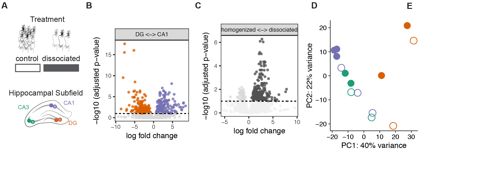

### Identifying the effects of cellular dissociation on hippocampal transcriptomes

```{r setup, echo=FALSE, message=FALSE, results='hide',comment=FALSE, warning=FALSE}
#source("http://www.bioconductor.org/biocLite.R")
#biocLite("DESeq2")
library(DESeq2)
library(magrittr)
library(tidyverse)
library(reshape2)
library(VennDiagram)
library(genefilter)
library(pheatmap)
library(cowplot)
library(RColorBrewer)
library(dplyr)
library(plyr)
library(ggplot2)
library(colorRamps)
library(car)
library(edgeR)
library(viridis) 

# user defined funcitons and options
source("resvalsfunction.R") 
source("DESeqPCAfunction.R")

# set output file for figures 
knitr::opts_chunk$set(fig.path = '../figures/01_dissociationtest/')
```

The sample and count information for this part is found in `../data/GSE99765_DissociationColData.csv` and `../data/GSE99765_DissociationCountData.csv`. You can also download these two files (with a different name but same content) from [GEO GSE99765 ](https://www.ncbi.nlm.nih.gov/geo/query/acc.cgi?acc=GSE99765). 

```{r ImportData, message=FALSE, warning=FALSE}
colData <- read.csv('../data/GSE99765_DissociationColData.csv')
rownames(colData) <- colData$RNAseqID
countData <-  read.csv('../data/GSE99765_DissociationCountData.csv', check.names = F, row.names = 1)
```

Sample sizes

```{r viewcoldata}
colData <- rename(colData, c("Region"="Subfield"))
table(colData$Treatment,colData$Subfield) 
dim(countData)

write.csv(colData, "../results/01_dissociation_colData.csv", row.names = F)
write.csv(countData, "../results/01_dissociation_countData.csv", row.names = T)
```

I used DESeq2 (Love et al., 2014) for gene expression normalization and quantification using the following experimental design: `Treatment + Subfield + Treatment * Subfield`. Genes with less than 2 counts across all samples were filtered, leaving us with `dim(rld)` number of genes for analysis of differntial expression.

```{r DEG}
dds <- DESeqDataSetFromMatrix(countData = countData,
                              colData = colData,
                              design = ~ Treatment + Subfield + Treatment * Subfield )
dds <- dds[ rowSums(counts(dds)) > 2, ] ## filter genes 
dds <- DESeq(dds) # Differential expression analysis
rld <- rlog(dds, blind=FALSE) ## log transformed data
dim(rld) #print total genes analyzed
vsd <- vst(dds, blind=FALSE) # variance stabilized
head(assay(rld), 3)
head(assay(vsd), 3)

write.csv(assay(vsd), "../results/01_dissociation_vsd.csv")
write.csv(assay(rld), "../results/01_dissociation_rld.csv")
```

We identified 162 genes that were differentially expressed between the control and dissociated samples, 331 genes that were differentially expressed genes (DEGs) between any of the three hippocampus subfields, and 30 genes were shared between both sets of differentially expressed genes at FDR p-value < 0.05 (Fig 1B). 


```{r signficiantgenes}
## DEG by contrasts
source("resvalsfunction.R")
contrast1 <- resvals(contrastvector = c('Subfield', 'CA1', 'DG'), mypval = 0.1)
contrast2 <- resvals(contrastvector = c('Subfield', 'CA3', 'DG'), mypval = 0.1)
contrast3 <- resvals(contrastvector = c('Subfield', 'CA1', 'CA3'), mypval = 0.1)
contrast4 <- resvals(contrastvector = c('Treatment', 'dissociated', 'control'), mypval = 0.1)
```


```{r VennDiagramPadj}
#create a new DF with the gene counts
rldpvals <- assay(rld)
rldpvals <- cbind(rldpvals, contrast1, contrast2, contrast3, contrast4)
rldpvals <- as.data.frame(rldpvals)
rldpvals <- rldpvals[ , grepl( "padj|pval" , names( rldpvals ) ) ]


# venn with padj values
venn1 <- row.names(rldpvals[rldpvals[2] <0.1 & !is.na(rldpvals[2]),])
venn2 <- row.names(rldpvals[rldpvals[4] <0.1 & !is.na(rldpvals[4]),])
venn3 <- row.names(rldpvals[rldpvals[6] <0.1 & !is.na(rldpvals[6]),])
venn4 <- row.names(rldpvals[rldpvals[8] <0.1 & !is.na(rldpvals[8]),])
venn12 <- union(venn1,venn2)
venn123 <- union(venn12,venn3)

## check order for correctness
candidates <- list("Subfield" = venn123, "Treatment" = venn4)

prettyvenn <- venn.diagram(
  scaled=T,
  x = candidates, filename=NULL, 
  col = "black",
  fill = c( "white", "white"),
  alpha = 0.5,
  cex = 1, fontfamily = "sans", #fontface = "bold",
  cat.default.pos = "text",
  cat.dist = c(0.08, 0.08), cat.pos = 1,
  cat.cex = 1, cat.fontfamily = "sans")
#dev.off()
grid.draw(prettyvenn)

# save files for metanalysis
write(venn123, "../results/01_dissociation_venn123.txt")
write(venn4, "../results/01_dissociation_venn4.txt")
write(venn1, "../results/01_dissociation_venn1.txt")

```


A hierarchical clustering analysis of all differentially expressed genes does not give rise to distinct clusters that are separated by subfield or method; however, when examining the control, homogenized samples alone (identified with light grey boxes), the three subfields form distinct clusters, while the dissociated samples do not cluster by subfield (Fig. 1C). 


```{r HeatmapPadj}
contrast4 <- resvals(contrastvector = c('Treatment', 'dissociated', 'control'), mypval = 0.001)

DEGes <- assay(rld)
DEGes <- cbind(DEGes, contrast4)
DEGes <- as.data.frame(DEGes) # convert matrix to dataframe
DEGes$rownames <- rownames(DEGes)  # add the rownames to the dataframe

DEGes$padjmin <- with(DEGes, pmin(padjTreatmentdissociatedcontrol)) # put the min pvalue in a new column

write.csv(as.data.frame(DEGes), "../results/01_dissociation_DEGes.csv", row.names = F)

```

# volcano plots yea!

```{r volcano}
res <- results(dds, contrast =c('Treatment', 'dissociated', 'control'), independentFiltering = T, alpha = 0.1)
summary(res)
resOrdered <- res[order(res$padj),]
head(resOrdered, 3)

data <- data.frame(gene = row.names(res),
                   pvalue = -log10(res$padj), 
                   lfc = res$log2FoldChange)
data <- na.omit(data)
data <- data %>%
  mutate(color = ifelse(data$lfc > 0 & data$pvalue > 1, 
                        yes = "dissociated", 
                        no = ifelse(data$lfc < 0 & data$pvalue > 1, 
                                    yes = "control", 
                                    no = "none")))
data$color <- as.factor(data$color)
summary(data)
write.csv(data, "../results/01_dissociation_volcanoTreatment.csv")

res <- results(dds, contrast =c("Subfield", "CA1", "DG"), independentFiltering = T, alpha = 0.05)
summary(res)
resOrdered <- res[order(res$padj),]
head(resOrdered, 3)

data <- data.frame(gene = row.names(res), pvalue = -log10(res$padj), lfc = res$log2FoldChange)
data <- na.omit(data)
data <- data %>%
  mutate(color = ifelse(data$lfc > 0 & data$pvalue > 1, 
                        yes = "CA1", 
                        no = ifelse(data$lfc < 0 & data$pvalue > 1, 
                                    yes = "DG", 
                                    no = "none")))

data$color <- as.factor(data$color)
summary(data)
write.csv(data, "../results/01_dissociation_volcanoCA1DG.csv")
```

This PCA gives an overview of the variability between samples using the a large matrix of log transformed gene expression data. You can see that the biggest difference is between DG punches and the CA1 and CA3 punches. CA1 and CA3 samples have similar transcriptomes. The control CA1 samples have the most similar transcriptonal profiles as evidenced by their tight clustering. 

```{r PCA, message=FALSE, warning=FALSE}
colorvalSubfield <- c("#7570b3", "#1b9e77", "#d95f02")
colorvalTreatment <- c("#ffffff", "#525252")


# create the dataframe using my function pcadataframe
pcadata <- pcadataframe(rld, intgroup=c("Subfield", "Treatment"), returnData=TRUE)
percentVar <- round(100 * attr(pcadata, "percentVar"))

PCA12 <- ggplot(pcadata, aes(PC1, PC2, shape = Treatment, color = Subfield)) + 
  geom_point(size = 3, alpha = 1) +
    xlab(paste0("PC1: ", percentVar[1],"% variance")) +
    ylab(paste0("PC2: ", percentVar[2],"% variance")) +
    scale_color_manual(values = colorvalSubfield) +
    theme_cowplot(font_size = 8, line_size = 0.25)  +
    theme(legend.position="none") +
    scale_shape_manual(values=c(16, 1)) 
PCA12

pdf(file="../figures/01_dissociationtest/PCA-1.pdf", width=1.75, height=2)
plot(PCA12)
dev.off()

## statistics
aov1 <- aov(PC1 ~ Subfield, data=pcadata)
summary(aov1) 
TukeyHSD(aov1, which = "Subfield") 

aov2 <- aov(PC2 ~ Subfield, data=pcadata)
summary(aov2) 
TukeyHSD(aov2, which = "Subfield") 

aov3 <- aov(PC1 ~ Treatment, data=pcadata)
summary(aov3) 
TukeyHSD(aov3, which = "Treatment")

aov4 <- aov(PC2 ~ Treatment, data=pcadata)
summary(aov4) 
TukeyHSD(aov4, which = "Treatment") 

```


Next, save files for dowstream GO analysis.

```{r GOsetup}
# from https://github.com/rachelwright8/Ahya-White-Syndromes/blob/master/deseq2_Ahya.R

resCD=results(dds, contrast=c('Treatment', 'dissociated', 'control'), independentFiltering = F)
table(resCD$padj<0.05)

logs <- data.frame(cbind("gene"=row.names(resCD),"logP"=round(-log(resCD$pvalue+1e-10,10),1)))
logs$logP=as.numeric(as.character(logs$logP))
sign <- rep(1,nrow(logs))
sign[resCD$log2FoldChange<0]=-1  ##change to correct model
table(sign)
logs$logP <- logs$logP*sign

write.csv(logs, file = "./06_GO_MWU/01_dissociation_GOpvals.csv", row.names = F)
```


To view a histogram of the p-value distibution for each constrast, change the Rmd file to `include=TRUE` for this chunck.   
```{r histogram, include=FALSE}
source("resvalsfunction.R")
myhistogram(contrastvector = c('Subfield', 'CA1', 'DG'), mypval = 0.05)
myhistogram(contrastvector = c('Subfield', 'CA3', 'DG'), mypval = 0.05)
myhistogram(contrastvector = c('Subfield', 'CA1', 'CA3'), mypval = 0.05)
myhistogram(contrastvector = c('Treatment', 'dissociated', 'control'), mypval = 0.05)
```

Here is the corresponding Adobe Illustrator file that combines many of the above plots. 

