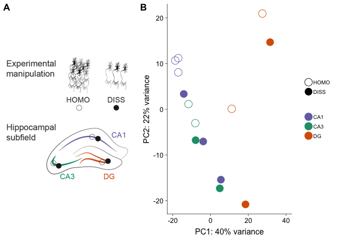

### Identifying the effects of cellular dissociation on hippocampal transcriptomes

The sample and count information for this part is found in
`../data/GSE99765_DissociationColData.csv` and
`../data/GSE99765_DissociationCountData.csv`. You can also download
these two files (with a different name but same content) from [GEO
GSE99765](https://www.ncbi.nlm.nih.gov/geo/query/acc.cgi?acc=GSE99765).

    colData <- read.csv('../data/GSE99765_DissociationColData.csv')
    rownames(colData) <- colData$RNAseqID
    countData <-  read.csv('../data/GSE99765_DissociationCountData.csv', check.names = F, row.names = 1)

Sample sizes

    colData <- rename(colData, c("Region"="Subfield"))
    colData$Treatment <- revalue(colData$Treatment, c("control"="HOMO", "dissociated"="DISS"))
    table(colData$Treatment,colData$Subfield) 

    ##       
    ##        CA1 CA3 DG
    ##   HOMO   3   2  2
    ##   DISS   3   2  2

    dim(countData)

    ## [1] 22485    14

    write.csv(colData, "../results/01_dissociation_colData.csv", row.names = F)
    write.csv(countData, "../results/01_dissociation_countData.csv", row.names = T)

I used DESeq2 (Love et al., 2014) for gene expression normalization and
quantification using the following experimental design:
`Treatment + Subfield + Treatment * Subfield`. Genes with less than 2
counts across all samples were filtered, leaving us with `dim(rld)`
number of genes for analysis of differntial expression.

    dds <- DESeqDataSetFromMatrix(countData = countData,
                                  colData = colData,
                                  design = ~ Treatment + Subfield + Treatment * Subfield )
    dds <- dds[ rowSums(counts(dds)) > 2, ] ## filter genes 
    dds <- DESeq(dds) # Differential expression analysis

    ## estimating size factors

    ## estimating dispersions

    ## gene-wise dispersion estimates

    ## mean-dispersion relationship

    ## final dispersion estimates

    ## fitting model and testing

    rld <- rlog(dds, blind=FALSE) ## log transformed data
    dim(rld) #print total genes analyzed

    ## [1] 16709    14

    vsd <- vst(dds, blind=FALSE) # variance stabilized
    head(assay(rld), 3)

    ##               100-CA1-1 100-CA1-2 100-CA1-3 100-CA3-1 100-CA3-4 100-DG-2
    ## 0610007P14Rik  4.588504  4.776456  4.853058  5.079031  5.171332 5.186176
    ## 0610009B22Rik  3.186433  3.699918  3.130234  3.603000  3.097205 3.642543
    ## 0610009L18Rik  1.776915  2.360122  1.673934  2.380225  2.128375 1.829245
    ##               100-DG-3 101-CA1-1 101-CA1-2 101-CA1-3 101-CA3-1 101-CA3-4
    ## 0610007P14Rik 5.030620  4.955177  4.217255  3.466887  5.086616  5.019215
    ## 0610009B22Rik 3.482690  3.304830  4.260588  2.711418  3.820074  3.477413
    ## 0610009L18Rik 2.487691  2.038995  1.952132  1.795738  2.240395  1.916895
    ##               101-DG-3 101-DG-4
    ## 0610007P14Rik 5.439697 4.155559
    ## 0610009B22Rik 4.200700 2.744482
    ## 0610009L18Rik 3.161307 3.000024

    head(assay(vsd), 3)

    ##               100-CA1-1 100-CA1-2 100-CA1-3 100-CA3-1 100-CA3-4 100-DG-2
    ## 0610007P14Rik  6.024282  6.147172  6.198913  6.358510  6.425746 6.439969
    ## 0610009B22Rik  5.500732  5.801174  5.469570  5.744608  5.451894 5.771328
    ## 0610009L18Rik  5.099770  5.428706  5.033775  5.444353  5.302348 5.116703
    ##               100-DG-3 101-CA1-1 101-CA1-2 101-CA1-3 101-CA3-1 101-CA3-4
    ## 0610007P14Rik 6.321325  6.268696  5.582529  4.748434  6.363481  6.318356
    ## 0610009B22Rik 5.671124  5.569662  6.355559  4.748434  5.880938  5.669040
    ## 0610009L18Rik 5.499883  5.255534  4.748434  4.748434  5.364748  5.165706
    ##               101-DG-3 101-DG-4
    ## 0610007P14Rik 6.872924 5.722956
    ## 0610009B22Rik 6.528940 5.152565
    ## 0610009L18Rik 6.528940 5.867002

    write.csv(assay(vsd), "../results/01_dissociation_vsd.csv")
    write.csv(assay(rld), "../results/01_dissociation_rld.csv")

We identified 162 genes that were differentially expressed between the
control and dissociated samples, 331 genes that were differentially
expressed genes (DEGs) between any of the three hippocampus subfields,
and 30 genes were shared between both sets of differentially expressed
genes at FDR p-value &lt; 0.05 (Fig 1B).

    ## DEG by contrasts
    source("resvalsfunction.R")
    contrast1 <- resvals(contrastvector = c('Subfield', 'CA1', 'DG'), mypval = 0.1) #484

    ## [1] 484

    contrast2 <- resvals(contrastvector = c('Subfield', 'CA3', 'DG'), mypval = 0.1) #98

    ## [1] 98

    contrast3 <- resvals(contrastvector = c('Subfield', 'CA1', 'CA3'), mypval = 0.1) #18

    ## [1] 18

    contrast4 <- resvals(contrastvector = c('Treatment', 'DISS', 'HOMO'), mypval = 0.1) #344

    ## [1] 344

A hierarchical clustering analysis of all differentially expressed genes
does not give rise to distinct clusters that are separated by subfield
or method; however, when examining the control, homogenized samples
alone (identified with light grey boxes), the three subfields form
distinct clusters, while the dissociated samples do not cluster by
subfield (Fig. 1C).

    contrast4 <- resvals(contrastvector = c('Treatment', 'DISS', 'HOMO'), mypval = 0.01)

    ## [1] 67

    DEGes <- assay(rld)
    DEGes <- cbind(DEGes, contrast4)
    DEGes <- as.data.frame(DEGes) # convert matrix to dataframe
    DEGes$rownames <- rownames(DEGes)  # add the rownames to the dataframe

    DEGes$padjmin <- with(DEGes, pmin(padjTreatmentDISSHOMO)) # put the min pvalue in a new column

    write.csv(as.data.frame(DEGes), "../results/01_dissociation_DEGes.csv", row.names = F)

Volcano Plots: Figure 1 C
-------------------------

    res <- results(dds, contrast =c('Treatment', 'DISS', 'HOMO'), independentFiltering = T, alpha = 0.1)
    summary(res)

    ## 
    ## out of 16709 with nonzero total read count
    ## adjusted p-value < 0.1
    ## LFC > 0 (up)       : 288, 1.7%
    ## LFC < 0 (down)     : 56, 0.34%
    ## outliers [1]       : 18, 0.11%
    ## low counts [2]     : 4534, 27%
    ## (mean count < 4)
    ## [1] see 'cooksCutoff' argument of ?results
    ## [2] see 'independentFiltering' argument of ?results

    288+56 # tolal number of DEGs = 344

    ## [1] 344

    (344/16709)*100 # percent of DEGs out of total measured

    ## [1] 2.058771

    resOrdered <- res[order(res$padj),]
    head(resOrdered, 3)

    ## log2 fold change (MLE): Treatment DISS vs HOMO 
    ## Wald test p-value: Treatment DISS vs HOMO 
    ## DataFrame with 3 rows and 6 columns
    ##                baseMean   log2FoldChange             lfcSE
    ##               <numeric>        <numeric>         <numeric>
    ## Trf      434.2199764615 2.72476331388246 0.413412216638661
    ## Hexb   218.643899347355 2.34823092106826 0.365572531130074
    ## Selplg 69.2575786624309 2.96944199007498 0.468249851856762
    ##                    stat               pvalue                 padj
    ##               <numeric>            <numeric>            <numeric>
    ## Trf    6.59091145403671 4.37134551387366e-11 5.31424474121621e-07
    ## Hexb   6.42343371316578 1.33234177125507e-10 8.09863945657394e-07
    ## Selplg 6.34157593067072 2.27426618272289e-10 9.21608466112071e-07

    data <- data.frame(gene = row.names(res),
                       pvalue = -log10(res$padj), 
                       lfc = res$log2FoldChange,
                       padj = res$padj)
    data <- na.omit(data)
    data <- data %>%
      mutate(color = ifelse(data$lfc > 0 & data$pvalue > 1, 
                            yes = "DISS", 
                            no = ifelse(data$lfc < 0 & data$pvalue > 1, 
                                        yes = "HOMO", 
                                        no = "none")))
    data$color <- as.factor(data$color)
    summary(data)

    ##             gene           pvalue              lfc          
    ##  0610007P14Rik:    1   Min.   :0.000003   Min.   :-5.06587  
    ##  0610009B22Rik:    1   1st Qu.:0.026323   1st Qu.:-0.40829  
    ##  0610009L18Rik:    1   Median :0.073080   Median : 0.04498  
    ##  0610009O20Rik:    1   Mean   :0.185088   Mean   : 0.15206  
    ##  0610010F05Rik:    1   3rd Qu.:0.204839   3rd Qu.: 0.56869  
    ##  0610010K14Rik:    1   Max.   :6.274558   Max.   : 9.47422  
    ##  (Other)      :12151                                        
    ##       padj            color      
    ##  Min.   :0.0000005   DISS:  288  
    ##  1st Qu.:0.6239665   HOMO:   56  
    ##  Median :0.8451229   none:11813  
    ##  Mean   :0.7499809               
    ##  3rd Qu.:0.9411891               
    ##  Max.   :0.9999928               
    ## 

    write.csv(data, "../results/01_dissociation_volcanoTreatment.csv")

    dissocDEGs <- data %>%
      filter(color != "none")
    dissocDEGs <- dissocDEGs[order(dissocDEGs$pvalue),]
    head(dissocDEGs)

    ##        gene   pvalue        lfc       padj color
    ## 123   Gria2 1.001435 -0.8428466 0.09967002  HOMO
    ## 21     Atrx 1.003647 -1.0589990 0.09916376  HOMO
    ## 148   Itpr3 1.003647  3.1187332 0.09916376  DISS
    ## 107 Gadd45b 1.007298  1.4857539 0.09833361  DISS
    ## 126   Gsk3b 1.007298 -0.9041536 0.09833361  HOMO
    ## 334  Ubqln1 1.011430 -1.0570724 0.09740253  HOMO

    res <- results(dds, contrast =c("Subfield", "CA1", "DG"), independentFiltering = T, alpha = 0.1)
    summary(res)

    ## 
    ## out of 16709 with nonzero total read count
    ## adjusted p-value < 0.1
    ## LFC > 0 (up)       : 262, 1.6%
    ## LFC < 0 (down)     : 222, 1.3%
    ## outliers [1]       : 18, 0.11%
    ## low counts [2]     : 4210, 25%
    ## (mean count < 4)
    ## [1] see 'cooksCutoff' argument of ?results
    ## [2] see 'independentFiltering' argument of ?results

    resOrdered <- res[order(res$padj),]
    head(resOrdered, 3)

    ## log2 fold change (MLE): Subfield CA1 vs DG 
    ## Wald test p-value: Subfield CA1 vs DG 
    ## DataFrame with 3 rows and 6 columns
    ##                baseMean    log2FoldChange             lfcSE
    ##               <numeric>         <numeric>         <numeric>
    ## C1ql2  130.705376021756 -7.65382313740708 0.786125207627745
    ## Stxbp6 143.438808384453 -5.19396604691866 0.558924222312385
    ## Crlf1  40.1931561676361 -7.69969383758498 0.843507316553684
    ##                     stat               pvalue                 padj
    ##                <numeric>            <numeric>            <numeric>
    ## C1ql2  -9.73613753018261 2.11438624194895e-22 2.63896546857649e-18
    ## Stxbp6 -9.29279111474208 1.50294385386716e-20 9.37912112005798e-17
    ## Crlf1  -9.12818856040704 6.96549786332862e-20 2.89787929440682e-16

    data <- data.frame(gene = row.names(res), 
                       pvalue = -log10(res$padj), 
                       lfc = res$log2FoldChange, 
                       padj = res$padj )
    data <- na.omit(data)
    data <- data %>%
      mutate(color = ifelse(data$lfc > 0 & data$pvalue > 1, 
                            yes = "CA1", 
                            no = ifelse(data$lfc < 0 & data$pvalue > 1, 
                                        yes = "DG", 
                                        no = "none")))

    data$color <- as.factor(data$color)
    summary(data)

    ##             gene           pvalue               lfc         
    ##  0610007P14Rik:    1   Min.   : 0.000003   Min.   :-9.3376  
    ##  0610009B22Rik:    1   1st Qu.: 0.003253   1st Qu.:-0.5547  
    ##  0610009L18Rik:    1   Median : 0.007490   Median :-0.1297  
    ##  0610009O20Rik:    1   Mean   : 0.155269   Mean   :-0.1413  
    ##  0610010F05Rik:    1   3rd Qu.: 0.052268   3rd Qu.: 0.2950  
    ##  0610010K14Rik:    1   Max.   :17.578566   Max.   : 8.4434  
    ##  (Other)      :12475                                        
    ##       padj         color      
    ##  Min.   :0.0000   CA1 :  262  
    ##  1st Qu.:0.8866   DG  :  222  
    ##  Median :0.9829   none:11997  
    ##  Mean   :0.8577               
    ##  3rd Qu.:0.9925               
    ##  Max.   :1.0000               
    ## 

    write.csv(data, "../results/01_dissociation_volcanoCA1DG.csv")

    res <- results(dds, contrast =c("Subfield", "CA3", "DG"), independentFiltering = T, alpha = 0.1)
    summary(res)

    ## 
    ## out of 16709 with nonzero total read count
    ## adjusted p-value < 0.1
    ## LFC > 0 (up)       : 53, 0.32%
    ## LFC < 0 (down)     : 45, 0.27%
    ## outliers [1]       : 18, 0.11%
    ## low counts [2]     : 5178, 31%
    ## (mean count < 6)
    ## [1] see 'cooksCutoff' argument of ?results
    ## [2] see 'independentFiltering' argument of ?results

    res <- results(dds, contrast =c("Subfield", "CA1", "CA3"), independentFiltering = T, alpha = 0.1)
    summary(res)

    ## 
    ## out of 16709 with nonzero total read count
    ## adjusted p-value < 0.1
    ## LFC > 0 (up)       : 1, 0.006%
    ## LFC < 0 (down)     : 17, 0.1%
    ## outliers [1]       : 18, 0.11%
    ## low counts [2]     : 8415, 50%
    ## (mean count < 21)
    ## [1] see 'cooksCutoff' argument of ?results
    ## [2] see 'independentFiltering' argument of ?results

Table 1: % of DEGs
------------------

    (222+262)/16709*100

    ## [1] 2.896643

    (45+53)/16709*100

    ## [1] 0.5865103

    (17+1)/16709*100

    ## [1] 0.1077264

    (56+288)/16709*100

    ## [1] 2.058771

PCA
---

This PCA gives an overview of the variability between samples using the
a large matrix of log transformed gene expression data. You can see that
the biggest difference is between DG punches and the CA1 and CA3
punches. CA1 and CA3 samples have similar transcriptomes. The control
CA1 samples have the most similar transcriptonal profiles as evidenced
by their tight clustering.

    colorvalSubfield <- c("#7570b3", "#1b9e77", "#d95f02")
    colorvalTreatment <- c("#ffffff", "#525252")

    # create the dataframe using my function pcadataframe
    pcadata <- pcadataframe(rld, intgroup=c("Subfield", "Treatment"), returnData=TRUE)
    percentVar <- round(100 * attr(pcadata, "percentVar"))

    PCA12 <- ggplot(pcadata, aes(PC1, PC2, color = Subfield, shape = Treatment)) + 
      geom_point(size = 5, alpha = 1) +
        xlab(paste0("PC1: ", percentVar[1],"% variance")) +
        ylab(paste0("PC2: ", percentVar[2],"% variance")) +
        scale_color_manual(values = colorvalSubfield) +
       theme_cowplot(font_size = 12, line_size = 0.25)  +
      xlim(-20,40) +
        scale_shape_manual(values=c(1, 16))  +
        theme(legend.position=c(0.75, 0.35),
              #legend.key.size = unit(1, "mm"),
              #legend.key = element_rect(size = 1),
              legend.key.width=unit(0.1,"mm"),
              legend.key.height=unit(0.1,"cm"),
              legend.title=element_blank(),
              legend.text = element_text(size = 8),
              panel.grid.minor=element_blank(),
             panel.grid.major=element_blank())  

    PCA12

figure panels
-------------

    a <- ggdraw() + draw_image("../figures/expdesign.png", scale = 1)

    figure1 <- plot_grid(a, PCA12,  
                         nrow = 1, labels = c('A', 'B'), 
                         #align = 'h',
                         rel_widths = c(1.7,2.5))

    figure1

    pdf("../figures/figure1.pdf", width=5.5, height=3)
    print(figure1)
    dev.off()

    ## quartz_off_screen 
    ##                 2

    png("../figures/figure1.png")
    plot(figure1)
    dev.off()

    ## quartz_off_screen 
    ##                 2

    tiff("../figures/figure1.tiff")
    plot(figure1)
    dev.off()

    ## quartz_off_screen 
    ##                 2

statistics
----------

    aov1 <- aov(PC1 ~ Subfield, data=pcadata)
    summary(aov1) 

    ##             Df Sum Sq Mean Sq F value   Pr(>F)    
    ## Subfield     2 2812.7  1406.4   17.69 0.000365 ***
    ## Residuals   11  874.3    79.5                     
    ## ---
    ## Signif. codes:  0 '***' 0.001 '**' 0.01 '*' 0.05 '.' 0.1 ' ' 1

    TukeyHSD(aov1, which = "Subfield") 

    ##   Tukey multiple comparisons of means
    ##     95% family-wise confidence level
    ## 
    ## Fit: aov(formula = PC1 ~ Subfield, data = pcadata)
    ## 
    ## $Subfield
    ##              diff       lwr      upr     p adj
    ## CA3-CA1  5.223963 -10.31904 20.76696 0.6467960
    ## DG-CA1  33.098277  17.55528 48.64128 0.0003454
    ## DG-CA3  27.874315  10.84781 44.90082 0.0027012

    aov2 <- aov(PC2 ~ Subfield, data=pcadata)
    summary(aov2) 

    ##             Df Sum Sq Mean Sq F value Pr(>F)
    ## Subfield     2  243.8   121.9   0.744  0.498
    ## Residuals   11 1801.4   163.8

    TukeyHSD(aov2, which = "Subfield") 

    ##   Tukey multiple comparisons of means
    ##     95% family-wise confidence level
    ## 
    ## Fit: aov(formula = PC2 ~ Subfield, data = pcadata)
    ## 
    ## $Subfield
    ##              diff       lwr      upr     p adj
    ## CA3-CA1 -8.297758 -30.60826 14.01275 0.5893115
    ## DG-CA1   1.924170 -20.38633 24.23468 0.9706111
    ## DG-CA3  10.221928 -14.21801 34.66186 0.5166947

    aov3 <- aov(PC1 ~ Treatment, data=pcadata)
    summary(aov3) 

    ##             Df Sum Sq Mean Sq F value Pr(>F)
    ## Treatment    1    335   335.2     1.2  0.295
    ## Residuals   12   3352   279.3

    TukeyHSD(aov3, which = "Treatment")

    ##   Tukey multiple comparisons of means
    ##     95% family-wise confidence level
    ## 
    ## Fit: aov(formula = PC1 ~ Treatment, data = pcadata)
    ## 
    ## $Treatment
    ##              diff       lwr     upr     p adj
    ## DISS-HOMO 9.78567 -9.678756 29.2501 0.2948438

    aov4 <- aov(PC2 ~ Treatment, data=pcadata)
    summary(aov4) 

    ##             Df Sum Sq Mean Sq F value Pr(>F)  
    ## Treatment    1  691.2   691.2   6.125 0.0292 *
    ## Residuals   12 1354.1   112.8                 
    ## ---
    ## Signif. codes:  0 '***' 0.001 '**' 0.01 '*' 0.05 '.' 0.1 ' ' 1

    TukeyHSD(aov4, which = "Treatment") 

    ##   Tukey multiple comparisons of means
    ##     95% family-wise confidence level
    ## 
    ## Fit: aov(formula = PC2 ~ Treatment, data = pcadata)
    ## 
    ## $Treatment
    ##                diff       lwr       upr     p adj
    ## DISS-HOMO -14.05249 -26.42385 -1.681127 0.0292306

Next, save files for dowstream GO analysis.

    # from https://github.com/rachelwright8/Ahya-White-Syndromes/blob/master/deseq2_Ahya.R

    resCD=results(dds, contrast=c('Treatment', 'DISS', 'HOMO'), independentFiltering = T)
    table(resCD$padj<0.1)

    ## 
    ## FALSE  TRUE 
    ## 11813   344

    logs <- data.frame(cbind("gene"=row.names(resCD),"logP"=round(-log(resCD$pvalue+1e-10,10),1)))
    logs$logP=as.numeric(as.character(logs$logP))
    sign <- rep(1,nrow(logs))
    sign[resCD$log2FoldChange<0]=-1  ##change to correct model
    table(sign)

    ## sign
    ##   -1    1 
    ## 6989 9720

    logs$logP <- logs$logP*sign

    write.csv(logs, file = "./05_GO_MWU/01_dissociation_GOpvals.csv", row.names = F)

To view a histogram of the p-value distibution for each constrast,
change the Rmd file to `include=TRUE` for this chunck.

Here is the corresponding Adobe Illustrator file that combines many of
the above plots.

