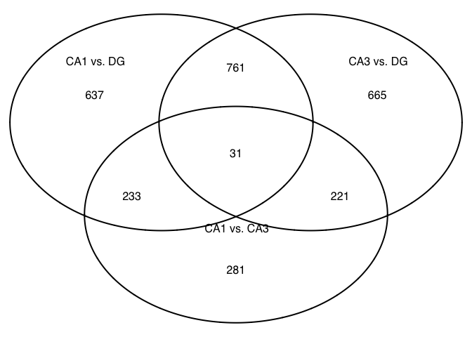
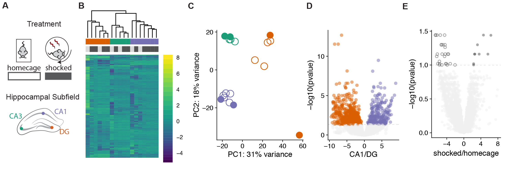

Identifying the effects of habituation to a stressor on hippocampal transcriptomes
----------------------------------------------------------------------------------

We examined the expression patterns of 16,229 genes. We identified 0
genes that were significantly expressed between homecage and shocked
samples; 1669 genes that were were differentially expressed between any
of the three brain regions at PDF p-value &lt; 0.05 (Fig. 3B).

    #source("http://www.bioconductor.org/biocLite.R")
    library(DESeq2)
    library(VennDiagram)
    library(genefilter)
    library(pheatmap)
    library(cowplot)
    library(RColorBrewer)
    library(dplyr)
    library(plyr)
    library(ggplot2)
    library(edgeR)
    library(pvclust)
    library(knitr) 
    library(viridis)

    # set output file for figures 
    knitr::opts_chunk$set(fig.path = '../figures/02_stresstest/')

    # user defined funcitons and options
    source("resvalsfunction.R") 
    source("DESeqPCAfunction.R")

The sample and count information for this part is found in
`../data/GSE100225_IntegrativeWT2015ColData.csv` and
`../data/GSE100225_IntegrativeWT2015CountData.csv`. You can also
download these two files (with a different name but same content) from
[GEO
GSE100225](https://www.ncbi.nlm.nih.gov/geo/query/acc.cgi?acc=GSE100225).

### Import and Subset Data

    colData <- read.csv('../data/GSE100225_IntegrativeWT2015ColData.csv')
    rownames(colData) <- colData$RNAseqID
    countData <-  read.csv('../data/GSE100225_IntegrativeWT2015CountData.csv', check.names = F, row.names = 1)

    colData <- colData %>%
      filter(Treatment %in% c("homecage", "shocked")) %>% droplevels()

    savecols <- as.character(colData$RNAseqID) #selects all good samples
    savecols <- as.vector(savecols) # make it a vector
    countData <- countData %>% select(one_of(savecols)) # keep good samples

    ## rename and relevel things
    colData$Treatment <- factor(colData$Treatment, levels = c("homecage", "shocked"))
    colData <- rename(colData, c("Region"="Subfield"))

### Here is a brief overview of the samples being compared and the number of genes measures

    ##     Treatment  Subfield
    ##  homecage: 6   CA1:7   
    ##  shocked :12   CA3:5   
    ##                DG :6

    ##           
    ##            CA1 CA3 DG
    ##   homecage   2   2  2
    ##   shocked    5   3  4

    ## [1] 22485    18

    dds <- DESeqDataSetFromMatrix(countData = countData,
                                  colData = colData,
                                  design = ~ Treatment + Subfield + Treatment * Subfield )

    dds <- dds[ rowSums(counts(dds)) > 2, ] ## filter genes with 0 counts
    dds <- DESeq(dds) # Differential expression analysis

    ## estimating size factors

    ## estimating dispersions

    ## gene-wise dispersion estimates

    ## mean-dispersion relationship

    ## final dispersion estimates

    ## fitting model and testing

    rld <- rlog(dds, blind=FALSE) # log transformed
    dim(rld) #print total genes analyzed

    ## [1] 16229    18

    vsd <- vst(dds, blind=FALSE) # variance stabilized
    dim(rld)

    ## [1] 16229    18

    head(assay(rld), 3)

    ##               143B-CA1-1 143B-DG-1 144B-CA1-1 144B-CA3-1 145B-CA1-1
    ## 0610007P14Rik   4.847503 4.3044638   4.577293  4.7992635  4.5275117
    ## 0610009B22Rik   3.363518 2.3855580   2.538916  3.0373491  2.9043781
    ## 0610009L18Rik   1.051505 0.7985879   0.173570  0.8293791  0.4559893
    ##                145B-DG-1 146B-CA1-2 146B-CA3-2 146B-DG-2 147-CA1-4
    ## 0610007P14Rik 3.77973629 3.66161264  3.9163684 3.7384167 3.8791687
    ## 0610009B22Rik 2.73028692 2.60166666  3.9045867 3.2063463 3.4366296
    ## 0610009L18Rik 0.06733365 0.08021559  0.3203815 0.5176911 0.4026617
    ##               147-CA3-4  147-DG-4 148-CA1-2  148-CA3-2   148-DG-2
    ## 0610007P14Rik 6.6139233 3.0007703  4.512105 4.45023048 4.09188652
    ## 0610009B22Rik 4.4925735 5.8021520  2.082513 3.87539379 2.71938684
    ## 0610009L18Rik 0.1084584 0.5704028  1.160589 0.05647915 0.05668814
    ##               148B-CA1-4 148B-CA3-4 148B-DG-4
    ## 0610007P14Rik  4.1422798  4.9014613 4.2087134
    ## 0610009B22Rik  1.6478618  3.4682931 1.9783315
    ## 0610009L18Rik  0.2436951  0.7520996 0.3951121

    head(assay(vsd), 3)

    ##               143B-CA1-1 143B-DG-1 144B-CA1-1 144B-CA3-1 145B-CA1-1
    ## 0610007P14Rik   6.155156  5.847963   5.995663   6.127394   5.968041
    ## 0610009B22Rik   5.541506  5.174102   5.224984   5.404242   5.353472
    ## 0610009L18Rik   5.250241  5.112270   4.754772   5.134060   4.929999
    ##               145B-DG-1 146B-CA1-2 146B-CA3-2 146B-DG-2 147-CA1-4
    ## 0610007P14Rik  5.595219   5.540948   5.658079  5.487632  5.602063
    ## 0610009B22Rik  5.288407   5.239659   5.802380  5.487632  5.602063
    ## 0610009L18Rik  4.581457   4.581457   4.852298  4.581457  4.581457
    ##               147-CA3-4 147-DG-4 148-CA1-2 148-CA3-2 148-DG-2 148B-CA1-4
    ## 0610007P14Rik  7.511475 4.581457  5.959506  5.925396 5.741184   5.758685
    ## 0610009B22Rik  6.155394 7.246965  5.079736  5.786711 5.286307   4.581457
    ## 0610009L18Rik  4.581457 4.581457  5.310764  4.581457 4.581457   4.581457
    ##               148B-CA3-4 148B-DG-4
    ## 0610007P14Rik   6.187172  5.797874
    ## 0610009B22Rik   5.587285  5.022657
    ## 0610009L18Rik   5.086305  4.894038

    write.csv(assay(vsd), "../results/02_stress_vsd.csv")
    write.csv(assay(rld), "../results/02_stress_rld.csv")

this is for treatment
---------------------

    res <- results(dds, contrast =c('Treatment', 'shocked', 'homecage'), independentFiltering = T)
    summary(res)

    ## 
    ## out of 16229 with nonzero total read count
    ## adjusted p-value < 0.1
    ## LFC > 0 (up)     : 27, 0.17% 
    ## LFC < 0 (down)   : 9, 0.055% 
    ## outliers [1]     : 9, 0.055% 
    ## low counts [2]   : 5348, 33% 
    ## (mean count < 5)
    ## [1] see 'cooksCutoff' argument of ?results
    ## [2] see 'independentFiltering' argument of ?results

    table(res$padj<0.1)

    ## 
    ## FALSE  TRUE 
    ## 10836    36

    head((res[order(res$padj),]), 10)

    ## log2 fold change (MLE): Treatment shocked vs homecage 
    ## Wald test p-value: Treatment shocked vs homecage 
    ## DataFrame with 10 rows and 6 columns
    ##          baseMean log2FoldChange     lfcSE      stat       pvalue
    ##         <numeric>      <numeric> <numeric> <numeric>    <numeric>
    ## Bysl    34.661903       5.507929  1.269888  4.337335 1.442207e-05
    ## Dbndd1  13.720190      -4.615858  1.082123 -4.265558 1.994034e-05
    ## Flad1   25.439577       6.278326  1.469999  4.270974 1.946211e-05
    ## Gm15446 20.063087       6.646051  1.550346  4.286819 1.812500e-05
    ## Wdr90   42.768536       6.609079  1.508510  4.381198 1.180288e-05
    ## Wee1    20.350498       4.500890  1.050454  4.284711 1.829767e-05
    ## Mroh2a   7.827091      -6.356716  1.502940 -4.229522 2.341884e-05
    ## Fam98a  23.765696       4.411256  1.094214  4.031437 5.543697e-05
    ## Jmjd8   48.552064       5.266356  1.296183  4.062973 4.845169e-05
    ## Notch2  20.235554       4.902930  1.216074  4.031768 5.535888e-05
    ##               padj
    ##          <numeric>
    ## Bysl    0.03613189
    ## Dbndd1  0.03613189
    ## Flad1   0.03613189
    ## Gm15446 0.03613189
    ## Wdr90   0.03613189
    ## Wee1    0.03613189
    ## Mroh2a  0.03637281
    ## Fam98a  0.05022590
    ## Jmjd8   0.05022590
    ## Notch2  0.05022590

    results <- data.frame(cbind("gene"=row.names(res), 
                             "baseMean" = res$baseMean,
                             "log2FoldChange" = res$log2FoldChange,
                             "lfcSE" = res$lfcSE,
                             "pvalue" = res$pvalue, "padj" = res$padj,
                             "logP"=round(-log(res$pvalue+1e-10,10),1)))
    write.csv(results, file = "../results/02_stress_results.csv", row.names = F)

this is for CA1 DG
------------------

    res <- results(dds, contrast =c("Subfield", "CA1", "DG"), independentFiltering = T, alpha = 0.1)
    summary(res)

    ## 
    ## out of 16229 with nonzero total read count
    ## adjusted p-value < 0.1
    ## LFC > 0 (up)     : 548, 3.4% 
    ## LFC < 0 (down)   : 1114, 6.9% 
    ## outliers [1]     : 9, 0.055% 
    ## low counts [2]   : 5033, 31% 
    ## (mean count < 5)
    ## [1] see 'cooksCutoff' argument of ?results
    ## [2] see 'independentFiltering' argument of ?results

    head((res[order(res$padj),]), 10)

    ## log2 fold change (MLE): Subfield CA1 vs DG 
    ## Wald test p-value: Subfield CA1 vs DG 
    ## DataFrame with 10 rows and 6 columns
    ##           baseMean log2FoldChange     lfcSE      stat       pvalue
    ##          <numeric>      <numeric> <numeric> <numeric>    <numeric>
    ## Stxbp6   141.61628      -6.538098 0.7697274 -8.494043 1.995697e-17
    ## Plekha2   90.63330      -7.495781 0.9310257 -8.051100 8.205333e-16
    ## Prox1    167.38162      -8.525340 1.0548308 -8.082187 6.361567e-16
    ## Pex5l    250.32402       4.003798 0.5402715  7.410715 1.256202e-13
    ## Tiam1    173.31078      -4.954172 0.7122820 -6.955353 3.516811e-12
    ## Atp2b1  1354.94337       2.372869 0.3428119  6.921781 4.459990e-12
    ## Btbd3    265.72997      -3.569765 0.5552035 -6.429651 1.278974e-10
    ## Ablim1    88.50809      -5.223695 0.8297457 -6.295538 3.063361e-10
    ## Alkbh1    53.64058      -7.150523 1.1326779 -6.312936 2.737916e-10
    ## Gnal      96.25346      -4.750832 0.7541277 -6.299772 2.980839e-10
    ##                 padj
    ##            <numeric>
    ## Stxbp6  2.232586e-13
    ## Plekha2 3.059769e-12
    ## Prox1   3.059769e-12
    ## Pex5l   3.513282e-10
    ## Tiam1   7.868514e-09
    ## Atp2b1  8.315652e-09
    ## Btbd3   2.043982e-07
    ## Ablim1  2.855818e-07
    ## Alkbh1  2.855818e-07
    ## Gnal    2.855818e-07

this is for CA1 CA3
-------------------

    res <- results(dds, contrast =c("Subfield", "CA1", "CA3"), independentFiltering = T, alpha = 0.1)
    summary(res)

    ## 
    ## out of 16229 with nonzero total read count
    ## adjusted p-value < 0.1
    ## LFC > 0 (up)     : 351, 2.2% 
    ## LFC < 0 (down)   : 415, 2.6% 
    ## outliers [1]     : 9, 0.055% 
    ## low counts [2]   : 4404, 27% 
    ## (mean count < 3)
    ## [1] see 'cooksCutoff' argument of ?results
    ## [2] see 'independentFiltering' argument of ?results

    head((res[order(res$padj),]), 10)

    ## log2 fold change (MLE): Subfield CA1 vs CA3 
    ## Wald test p-value: Subfield CA1 vs CA3 
    ## DataFrame with 10 rows and 6 columns
    ##         baseMean log2FoldChange     lfcSE      stat       pvalue
    ##        <numeric>      <numeric> <numeric> <numeric>    <numeric>
    ## Doc2b  206.97935       6.587233 0.7867321  8.372905 5.621516e-17
    ## Fibcd1 242.97941       6.494948 0.8130089  7.988779 1.362821e-15
    ## Wfs1   358.06939       5.775651 0.8071007  7.156047 8.303657e-13
    ## Ptn    114.76758       4.589751 0.6518493  7.041123 1.906963e-12
    ## C1ql3  129.23845       5.391192 0.7893295  6.830091 8.486083e-12
    ## Pex5l  250.32402       3.272133 0.4781331  6.843562 7.724761e-12
    ## Scn3b  398.11813       2.358710 0.3596638  6.558097 5.449888e-11
    ## Mal2   181.51393       2.747973 0.4218199  6.514565 7.290062e-11
    ## Mapk4   67.90997       4.441492 0.6833432  6.499651 8.050661e-11
    ## Kcnb1  222.40612       3.581708 0.5760716  6.217471 5.052326e-10
    ##                padj
    ##           <numeric>
    ## Doc2b  6.642383e-13
    ## Fibcd1 8.051545e-12
    ## Wfs1   3.270534e-09
    ## Ptn    5.633169e-09
    ## C1ql3  1.671193e-08
    ## Pex5l  1.671193e-08
    ## Scn3b  9.199411e-08
    ## Mal2   1.056962e-07
    ## Mapk4  1.056962e-07
    ## Kcnb1  5.969829e-07

this is for CA3 DG
------------------

    res <- results(dds, contrast =c("Subfield", "CA3", "DG"), independentFiltering = T, alpha = 0.1)
    summary(res)

    ## 
    ## out of 16229 with nonzero total read count
    ## adjusted p-value < 0.1
    ## LFC > 0 (up)     : 575, 3.5% 
    ## LFC < 0 (down)   : 1103, 6.8% 
    ## outliers [1]     : 9, 0.055% 
    ## low counts [2]   : 4719, 29% 
    ## (mean count < 4)
    ## [1] see 'cooksCutoff' argument of ?results
    ## [2] see 'independentFiltering' argument of ?results

    head((res[order(res$padj),]), 10)

    ## log2 fold change (MLE): Subfield CA3 vs DG 
    ## Wald test p-value: Subfield CA3 vs DG 
    ## DataFrame with 10 rows and 6 columns
    ##          baseMean log2FoldChange     lfcSE      stat       pvalue
    ##         <numeric>      <numeric> <numeric> <numeric>    <numeric>
    ## C1ql3    129.2385      -7.217055 0.7813386 -9.236783 2.540188e-20
    ## Doc2b    206.9794      -7.312875 0.7874961 -9.286237 1.598402e-20
    ## Adcy1   1206.5519      -4.322265 0.4935627 -8.757276 2.000251e-18
    ## Fam163b  280.0048      -5.131904 0.5896724 -8.702975 3.232961e-18
    ## Stxbp6   141.6163      -5.130609 0.6324327 -8.112498 4.958975e-16
    ## Calb1    111.7841      -8.001007 1.0013420 -7.990284 1.346279e-15
    ## Plekha2   90.6333      -5.175571 0.6595081 -7.847624 4.239944e-15
    ## Prox1    167.3816      -6.154067 0.7945948 -7.744912 9.564840e-15
    ## Tiam1    173.3108      -5.057554 0.6628162 -7.630403 2.340218e-14
    ## Hlf      135.1660      -4.501181 0.6036402 -7.456729 8.869659e-14
    ##                 padj
    ##            <numeric>
    ## C1ql3   1.460735e-16
    ## Doc2b   1.460735e-16
    ## Adcy1   7.668294e-15
    ## Fam163b 9.295571e-15
    ## Stxbp6  1.140663e-12
    ## Calb1   2.580593e-12
    ## Plekha2 6.966229e-12
    ## Prox1   1.375065e-11
    ## Tiam1   2.990539e-11
    ## Hlf     1.020100e-10

Next, save files for dowstream GO analysis.

    # from https://github.com/rachelwright8/Ahya-White-Syndromes/blob/master/deseq2_Ahya.R

    res <- results(dds, contrast=c('Treatment', 'shocked', 'homecage'), independentFiltering = T)
    table(res$padj<0.1)

    ## 
    ## FALSE  TRUE 
    ## 10836    36

    logs <- data.frame(cbind("gene"=row.names(res),"logP"=round(-log(res$pvalue+1e-10,10),1)))
    logs$logP <- as.numeric(as.character(logs$logP))
    sign <- rep(1,nrow(logs))
    sign[res$log2FoldChange<0]=-1  ##change to correct model
    table(sign)

    ## sign
    ##   -1    1 
    ## 7045 9184

    logs$logP <- logs$logP*sign

    write.csv(logs, file = "./06_GO_MWU/02_stress_GOpvals.csv", row.names = F)

I examined the expression patterns of 16,229 genes. I identified this
number of differentially expressed genes at an adjusted p-value &lt;
0.1.

<table>
<thead>
<tr class="header">
<th>Contrast</th>
<th>Number of DEGs</th>
</tr>
</thead>
<tbody>
<tr class="odd">
<td>CA1 vs. DG</td>
<td>1662</td>
</tr>
<tr class="even">
<td>CA3 vs. DG</td>
<td>1678</td>
</tr>
<tr class="odd">
<td>CA1 vs. CA3</td>
<td>766</td>
</tr>
<tr class="even">
<td>CA1 vs. DG</td>
<td>36</td>
</tr>
</tbody>
</table>

    contrast1 <- resvals(contrastvector = c('Subfield', 'CA1', 'DG'), mypval = 0.1)  

    ## [1] 1662

    contrast2 <- resvals(contrastvector = c('Subfield', 'CA3', 'DG'), mypval = 0.1) 

    ## [1] 1678

    contrast3 <- resvals(contrastvector = c('Subfield', 'CA1', 'CA3'), mypval = 0.1)

    ## [1] 766

    contrast4 <- resvals(contrastvector = c('Treatment', 'shocked', 'homecage'), mypval = 0.1)

    ## [1] 36

    #create a new DF with the gene counts
    rldpvals <- assay(rld)
    rldpvals <- cbind(rldpvals, contrast1, contrast2, contrast3, contrast4)
    rldpvals <- as.data.frame(rldpvals)
    rldpvals <- rldpvals[ , grepl( "padj|pval" , names( rldpvals ) ) ]

    # venn with padj values
    venn1 <- row.names(rldpvals[rldpvals[2] <0.1 & !is.na(rldpvals[2]),])
    venn2 <- row.names(rldpvals[rldpvals[4] <0.1 & !is.na(rldpvals[4]),])
    venn3 <- row.names(rldpvals[rldpvals[6] <0.1 & !is.na(rldpvals[6]),])
    venn4 <- row.names(rldpvals[rldpvals[8] <0.1 & !is.na(rldpvals[8]),])
    venn12 <- union(venn1,venn2)
    venn123 <- union(venn12,venn3)

    # save files for big venn diagram
    write(venn123, "../results/02_stress_venn123.txt")
    write(venn4, "../results/02_stress_venn4.txt")

    ## check order for correctness
    candidates <- list("Subfield" = venn123, "Method" = venn4)

    prettyvenn <- venn.diagram(
      scaled=T,
      x = candidates, filename=NULL, 
      col = "black",
      fill = c( "white", "white"),
      alpha = 0.5,
      cex = 1, fontfamily = "sans", #fontface = "bold",
      cat.default.pos = "text",
      cat.dist = c(0.07, 0.07), cat.pos = 1,
      cat.cex = 1, cat.fontfamily = "sans")
    #dev.off()
    grid.draw(prettyvenn)

    candidates <- list("CA1 vs. DG" = venn1, "CA3 vs. DG" = venn2, "CA1 vs. CA3" = venn3)

    prettyvenn <- venn.diagram(
      scaled=T,
      x = candidates, filename=NULL, 
      col = "black",
      fill = c( "white", "white", "white"),
      alpha = 0.5,
      cex = 1, fontfamily = "sans", #fontface = "bold",
      cat.default.pos = "text",
      cat.dist = c(0.07, 0.07, 0.07), cat.pos = 1,
      cat.cex = 1, cat.fontfamily = "sans")
    #dev.off()
    grid.draw(prettyvenn)

Supplementary histogram of p-value distributions

    myhistogram(contrastvector = c('Subfield', 'CA1', 'DG'), mypval = 0.1)

    ## [1] 1

    myhistogram(contrastvector = c('Subfield', 'CA3', 'DG'), mypval = 0.1)

    ## [1] 1

    myhistogram(contrastvector = c('Subfield', 'CA1', 'CA3'), mypval = 0.1)

    ## [1] 1

    myhistogram(contrastvector = c('Treatment', 'shocked', 'homecage'), mypval = 0.1)

    ## [1] 1

Hierarchical clustering of the differentially expressed genes gives rise
to three distinct clusters corresponding to the three subfields, with
CA1 (purple) and CA3 (green) being more similar to one another than to
DG (orange) (Fig. 3C).

    contrast1 <- resvals(contrastvector = c('Subfield', 'CA1', 'DG'), mypval = 0.1)

    ## [1] 1662

    contrast2 <- resvals(contrastvector = c('Subfield', 'CA3', 'DG'), mypval = 0.1)

    ## [1] 1678

    contrast3 <- resvals(contrastvector = c('Subfield', 'CA1', 'CA3'), mypval = 0.1)

    ## [1] 766

    contrast4 <- resvals(contrastvector = c('Treatment', 'shocked', 'homecage'), mypval = 0.1)

    ## [1] 36

    DEGes <- assay(rld)
    DEGes <- cbind(DEGes, contrast1, contrast2, contrast3, contrast4)
    DEGes <- as.data.frame(DEGes) # convert matrix to dataframe
    DEGes$rownames <- rownames(DEGes)  # add the rownames to the dataframe

    DEGes$padjmin <- with(DEGes, pmin(padjTreatmentshockedhomecage, padjSubfieldCA1DG ,padjSubfieldCA3DG, padjSubfieldCA1CA3 )) # put the min pvalue in a new column
    DEGes <- DEGes %>% filter(padjmin < 0.1)

    rownames(DEGes) <- DEGes$rownames
    drop.cols <-colnames(DEGes[,grep("padj|pval|rownames", colnames(DEGes))])
    DEGes <- DEGes %>% select(-one_of(drop.cols))
    DEGes <- as.matrix(DEGes)
    DEGes <- DEGes - rowMeans(DEGes)

    # setting color options
    ann_colors <-  list(Treatment = c(homecage = (values=c("#d9d9d9")),
                                      shocked = (values=c("#525252"))),
                      Subfield = c(CA1 = (values=c("#7570b3")),
                                CA3 = (values=c("#1b9e77")), 
                                DG = (values=c("#d95f02"))))

    df <- as.data.frame(colData(dds)[,c("Treatment", "Subfield")])
    df$Treatment <- factor(df$Treatment, levels = c("homecage", "shocked"))

    paletteLength <- 30
    myBreaks <- c(seq(min(DEGes), 0, length.out=ceiling(paletteLength/2) + 1), 
                  seq(max(DEGes)/paletteLength, max(DEGes), length.out=floor(paletteLength/2)))

    pheatmap(DEGes, show_colnames=T, show_rownames = F,
             annotation_col=df, annotation_colors = ann_colors,
             treeheight_row = 0, treeheight_col = 25,
             fontsize = 8, 
             border_color = "grey60" ,
             color = viridis(30),
             clustering_method="average",
             breaks=myBreaks,
             clustering_distance_cols="correlation" 
             )

    # for adobe
    pheatmap(DEGes, show_colnames=F, show_rownames = F,
             annotation_col=df, annotation_colors = ann_colors,
             treeheight_row = 0, treeheight_col = 25,
             annotation_legend = FALSE,
             annotation_names_row = FALSE, annotation_names_col = FALSE,
             fontsize = 6, 
             width=1.5, height=2.25,
             border_color = "grey60",
             color = viridis(30),
             clustering_method="average",
             breaks=myBreaks,
             clustering_distance_cols="correlation" ,
             filename = "../figures/02_stresstest/HeatmapPadj-1.pdf"
             )

volcano plots yea!
==================

    res <- results(dds, contrast =c('Treatment', 'homecage', 'shocked'), independentFiltering = T, alpha = 0.1)
    summary(res)

    ## 
    ## out of 16229 with nonzero total read count
    ## adjusted p-value < 0.1
    ## LFC > 0 (up)     : 9, 0.055% 
    ## LFC < 0 (down)   : 27, 0.17% 
    ## outliers [1]     : 9, 0.055% 
    ## low counts [2]   : 5348, 33% 
    ## (mean count < 5)
    ## [1] see 'cooksCutoff' argument of ?results
    ## [2] see 'independentFiltering' argument of ?results

    resOrdered <- res[order(res$padj),]
    head(resOrdered, 3)

    ## log2 fold change (MLE): Treatment homecage vs shocked 
    ## Wald test p-value: Treatment homecage vs shocked 
    ## DataFrame with 3 rows and 6 columns
    ##         baseMean log2FoldChange     lfcSE      stat       pvalue
    ##        <numeric>      <numeric> <numeric> <numeric>    <numeric>
    ## Bysl    34.66190      -5.507929  1.269888 -4.337335 1.442207e-05
    ## Dbndd1  13.72019       4.615858  1.082123  4.265558 1.994034e-05
    ## Flad1   25.43958      -6.278326  1.469999 -4.270974 1.946211e-05
    ##              padj
    ##         <numeric>
    ## Bysl   0.03613189
    ## Dbndd1 0.03613189
    ## Flad1  0.03613189

    data <- data.frame(gene = row.names(res),
                       pvalue = -log10(res$padj), 
                       lfc = res$log2FoldChange)
    data <- na.omit(data)

    data <- data %>%
      mutate(color = ifelse(data$lfc > 0 & data$pvalue > 1, 
                            yes = "shocked", 
                            no = ifelse(data$lfc < 0 & data$pvalue > 1, 
                                        yes = "homecage", 
                                        no = "none")))
    data$color <- as.factor(data$color)
    summary(data)

    ##             gene           pvalue               lfc         
    ##  0610007P14Rik:    1   Min.   :0.0000126   Min.   :-6.8142  
    ##  0610009B22Rik:    1   1st Qu.:0.0279982   1st Qu.:-0.8083  
    ##  0610009O20Rik:    1   Median :0.0768484   Median :-0.1870  
    ##  0610010F05Rik:    1   Mean   :0.1426022   Mean   :-0.3009  
    ##  0610010K14Rik:    1   3rd Qu.:0.1858096   3rd Qu.: 0.3809  
    ##  0610012G03Rik:    1   Max.   :1.4421093   Max.   : 7.9333  
    ##  (Other)      :10866                                        
    ##       color      
    ##  homecage:   27  
    ##  none    :10836  
    ##  shocked :    9  
    ##                  
    ##                  
    ##                  
    ## 

    write.csv(data, "../results/02_stress_volcanoTreatment.csv")

    res <- results(dds, contrast =c("Subfield", "CA1", "DG"), independentFiltering = T, alpha = 0.05)
    resOrdered <- res[order(res$padj),]
    head(resOrdered, 10)

    ## log2 fold change (MLE): Subfield CA1 vs DG 
    ## Wald test p-value: Subfield CA1 vs DG 
    ## DataFrame with 10 rows and 6 columns
    ##           baseMean log2FoldChange     lfcSE      stat       pvalue
    ##          <numeric>      <numeric> <numeric> <numeric>    <numeric>
    ## Stxbp6   141.61628      -6.538098 0.7697274 -8.494043 1.995697e-17
    ## Plekha2   90.63330      -7.495781 0.9310257 -8.051100 8.205333e-16
    ## Prox1    167.38162      -8.525340 1.0548308 -8.082187 6.361567e-16
    ## Pex5l    250.32402       4.003798 0.5402715  7.410715 1.256202e-13
    ## Tiam1    173.31078      -4.954172 0.7122820 -6.955353 3.516811e-12
    ## Atp2b1  1354.94337       2.372869 0.3428119  6.921781 4.459990e-12
    ## Btbd3    265.72997      -3.569765 0.5552035 -6.429651 1.278974e-10
    ## Ablim1    88.50809      -5.223695 0.8297457 -6.295538 3.063361e-10
    ## Alkbh1    53.64058      -7.150523 1.1326779 -6.312936 2.737916e-10
    ## Gnal      96.25346      -4.750832 0.7541277 -6.299772 2.980839e-10
    ##                 padj
    ##            <numeric>
    ## Stxbp6  2.106857e-13
    ## Plekha2 2.887457e-12
    ## Prox1   2.887457e-12
    ## Pex5l   3.315431e-10
    ## Tiam1   7.425395e-09
    ## Atp2b1  7.847353e-09
    ## Btbd3   1.928875e-07
    ## Ablim1  2.694992e-07
    ## Alkbh1  2.694992e-07
    ## Gnal    2.694992e-07

    data <- data.frame(gene = row.names(res), pvalue = -log10(res$padj), lfc = res$log2FoldChange)
    data <- na.omit(data)
    data <- data %>%
      mutate(color = ifelse(data$lfc > 0 & data$pvalue > 1, 
                            yes = "CA1", 
                            no = ifelse(data$lfc < 0 & data$pvalue > 1, 
                                        yes = "DG", 
                                        no = "none")))
    data$color <- as.factor(data$color)
    summary(data)

    ##             gene           pvalue               lfc           color     
    ##  0610007P14Rik:    1   Min.   : 0.000023   Min.   :-9.4954   CA1 : 553  
    ##  0610009B22Rik:    1   1st Qu.: 0.084865   1st Qu.:-1.2109   DG  :1123  
    ##  0610009O20Rik:    1   Median : 0.244235   Median :-0.1936   none:8881  
    ##  0610010F05Rik:    1   Mean   : 0.530560   Mean   :-0.3134              
    ##  0610010K14Rik:    1   3rd Qu.: 0.669793   3rd Qu.: 0.7587              
    ##  0610012G03Rik:    1   Max.   :12.676365   Max.   : 8.9658              
    ##  (Other)      :10551

    write.csv(data, "../results/02_stress_volcanoCA1DG.csv")

Next, I conducted a principal component analysis of all genes measured.
PC1 accounts for 31% of the variation and visually separates the DG
samples from the CA1 and CA3 samples ANOVA (PC1 ~ Subfield, F2,15=
42.89; p &lt; 0.001) (Fig. 3D). A post hoc Tukey test showed that DG
samples are significantly different from both CA1 and CA3 samples
(CA1-DG, p &lt; 0.001; CA3-DG, p &lt; 0.001; CA1-CA3, p = 0.83). PC2
accounts for 18% of the variation and varies significantly between CA1
and CA3 and CA1 and DG (PC2 ~ Subfield, ANOVA, F2, 15= 11.41; p &lt;
0.001; Tukey test, CA1-DG, p = 0.03; CA3-DG, p = 0.18; CA1-CA3, p &lt;
0.001). PC2 accounts for 15% of the variation and also explains some
brain Subfield specific differences (PC3 ~ Subfield, ANOVA, F2, 15=
6.315; p &lt; 0.01; Tukey test, CA1-DG, p = 0.95; CA3-DG, p = 0.03;
CA1-CA3, p = 0.01). PC7 is the lowest PC to explain any variance
associated with treatment (PC6 ~ Subfield, ANOVA, F1, 16= 4.774; p =
0.04

    colorvalSubfield <- c("#7570b3", "#1b9e77", "#d95f02")
    colorvalTreatment <- c("#ffffff", "#525252")

    # create the dataframe using my function pcadataframe
    pcadata <- pcadataframe(rld, intgroup=c("Treatment", "Subfield"), returnData=TRUE)
    percentVar <- round(100 * attr(pcadata, "percentVar"))

    pcadata$Treatment <- factor(pcadata$Treatment, levels = c("homecage", "shocked"))

    PCA12 <- ggplot(pcadata, aes(PC1, PC2, shape = Treatment, color = Subfield)) + 
      geom_point(size = 3, alpha = 1) +
        xlab(paste0("PC1: ", percentVar[1],"% variance")) +
        ylab(paste0("PC2: ", percentVar[2],"% variance")) +
        scale_color_manual(values = colorvalSubfield) +
        theme_cowplot(font_size = 8, line_size = 0.25)  +
        theme(legend.position="none") +
        scale_shape_manual(values=c(16, 1)) 
    PCA12

    pdf(file="../figures/02_stresstest/PCA-1.pdf", width=1.75, height=2)
    plot(PCA12)
    dev.off()

    ## quartz_off_screen 
    ##                 2

    ## statistics
    aov1R <- aov(PC1 ~ Subfield, data=pcadata)
    summary(aov1R) 

    ##             Df Sum Sq Mean Sq F value   Pr(>F)    
    ## Subfield     2   7334    3667   42.89 6.24e-07 ***
    ## Residuals   15   1282      85                     
    ## ---
    ## Signif. codes:  0 '***' 0.001 '**' 0.01 '*' 0.05 '.' 0.1 ' ' 1

    TukeyHSD(aov1R, which = "Subfield") 

    ##   Tukey multiple comparisons of means
    ##     95% family-wise confidence level
    ## 
    ## Fit: aov(formula = PC1 ~ Subfield, data = pcadata)
    ## 
    ## $Subfield
    ##              diff       lwr      upr     p adj
    ## CA3-CA1  3.127434 -10.93525 17.19012 0.8339245
    ## DG-CA1  44.037806  30.67620 57.39941 0.0000011
    ## DG-CA3  40.910372  26.36759 55.45315 0.0000073

    aov2R <- aov(PC2 ~ Subfield, data=pcadata)
    summary(aov2R) 

    ##             Df Sum Sq Mean Sq F value   Pr(>F)    
    ## Subfield     2   2976  1487.9   11.41 0.000971 ***
    ## Residuals   15   1955   130.4                     
    ## ---
    ## Signif. codes:  0 '***' 0.001 '**' 0.01 '*' 0.05 '.' 0.1 ' ' 1

    TukeyHSD(aov2R, which = "Subfield") 

    ##   Tukey multiple comparisons of means
    ##     95% family-wise confidence level
    ## 
    ## Fit: aov(formula = PC2 ~ Subfield, data = pcadata)
    ## 
    ## $Subfield
    ##              diff        lwr       upr     p adj
    ## CA3-CA1  31.34187  13.976505 48.707233 0.0008014
    ## DG-CA1   18.32018   1.820548 34.819817 0.0288392
    ## DG-CA3  -13.02169 -30.979895  4.936522 0.1776538

    aov3R <- aov(PC3 ~ Subfield, data=pcadata)
    summary(aov3R) 

    ##             Df Sum Sq Mean Sq F value Pr(>F)  
    ## Subfield     2   1928   963.8   6.315 0.0102 *
    ## Residuals   15   2289   152.6                 
    ## ---
    ## Signif. codes:  0 '***' 0.001 '**' 0.01 '*' 0.05 '.' 0.1 ' ' 1

    TukeyHSD(aov3R, which = "Subfield") 

    ##   Tukey multiple comparisons of means
    ##     95% family-wise confidence level
    ## 
    ## Fit: aov(formula = PC3 ~ Subfield, data = pcadata)
    ## 
    ## $Subfield
    ##               diff       lwr       upr     p adj
    ## CA3-CA1 -23.912642 -42.70222 -5.123068 0.0125516
    ## DG-CA1   -1.905862 -19.75870 15.946981 0.9586161
    ## DG-CA3   22.006780   2.57574 41.437821 0.0257680

    aov4R <- aov(PC3 ~ Subfield, data=pcadata)
    summary(aov4R) 

    ##             Df Sum Sq Mean Sq F value Pr(>F)  
    ## Subfield     2   1928   963.8   6.315 0.0102 *
    ## Residuals   15   2289   152.6                 
    ## ---
    ## Signif. codes:  0 '***' 0.001 '**' 0.01 '*' 0.05 '.' 0.1 ' ' 1

    TukeyHSD(aov4R, which = "Subfield") 

    ##   Tukey multiple comparisons of means
    ##     95% family-wise confidence level
    ## 
    ## Fit: aov(formula = PC3 ~ Subfield, data = pcadata)
    ## 
    ## $Subfield
    ##               diff       lwr       upr     p adj
    ## CA3-CA1 -23.912642 -42.70222 -5.123068 0.0125516
    ## DG-CA1   -1.905862 -19.75870 15.946981 0.9586161
    ## DG-CA3   22.006780   2.57574 41.437821 0.0257680

    aov5R <- aov(PC5 ~ Subfield, data=pcadata)
    summary(aov5R) 

    ##             Df Sum Sq Mean Sq F value Pr(>F)
    ## Subfield     2   17.7    8.86   0.092  0.912
    ## Residuals   15 1439.5   95.97

    TukeyHSD(aov5R, which = "Subfield") 

    ##   Tukey multiple comparisons of means
    ##     95% family-wise confidence level
    ## 
    ## Fit: aov(formula = PC5 ~ Subfield, data = pcadata)
    ## 
    ## $Subfield
    ##               diff       lwr      upr     p adj
    ## CA3-CA1 -0.2227589 -15.12229 14.67677 0.9991689
    ## DG-CA1  -2.1893719 -16.34610 11.96736 0.9153862
    ## DG-CA3  -1.9666130 -17.37480 13.44158 0.9414470

    aov6R <- aov(PC6 ~ Subfield, data=pcadata)
    summary(aov6R) 

    ##             Df Sum Sq Mean Sq F value Pr(>F)
    ## Subfield     2    1.3    0.66   0.007  0.993
    ## Residuals   15 1387.3   92.49

    TukeyHSD(aov6R, which = "Subfield") 

    ##   Tukey multiple comparisons of means
    ##     95% family-wise confidence level
    ## 
    ## Fit: aov(formula = PC6 ~ Subfield, data = pcadata)
    ## 
    ## $Subfield
    ##              diff       lwr      upr     p adj
    ## CA3-CA1 0.4724674 -14.15423 15.09916 0.9961274
    ## DG-CA1  0.6061285 -13.29137 14.50363 0.9929528
    ## DG-CA3  0.1336611 -14.99238 15.25970 0.9997096

    aov1T <- aov(PC1 ~ Treatment, data=pcadata)
    summary(aov1T) 

    ##             Df Sum Sq Mean Sq F value Pr(>F)
    ## Treatment    1    142   142.1   0.268  0.612
    ## Residuals   16   8474   529.6

    aov2T <- aov(PC2 ~ Treatment, data=pcadata)
    summary(aov2T) 

    ##             Df Sum Sq Mean Sq F value Pr(>F)
    ## Treatment    1     53   52.73   0.173  0.683
    ## Residuals   16   4879  304.91

    aov3T <- aov(PC3 ~ Treatment, data=pcadata)
    summary(aov3T) 

    ##             Df Sum Sq Mean Sq F value Pr(>F)
    ## Treatment    1    339   339.4     1.4  0.254
    ## Residuals   16   3877   242.3

    aov4T <- aov(PC4 ~ Treatment, data=pcadata)
    summary(aov4T) 

    ##             Df Sum Sq Mean Sq F value Pr(>F)
    ## Treatment    1  172.9   172.9   1.435  0.248
    ## Residuals   16 1927.7   120.5

    aov5T <- aov(PC5 ~ Treatment, data=pcadata)
    summary(aov5T) 

    ##             Df Sum Sq Mean Sq F value Pr(>F)
    ## Treatment    1  122.8  122.75   1.472  0.243
    ## Residuals   16 1334.5   83.41

    aov6T <- aov(PC6 ~ Treatment, data=pcadata)
    summary(aov6T) 

    ##             Df Sum Sq Mean Sq F value Pr(>F)  
    ## Treatment    1  319.1   319.1   4.774 0.0441 *
    ## Residuals   16 1069.5    66.8                 
    ## ---
    ## Signif. codes:  0 '***' 0.001 '**' 0.01 '*' 0.05 '.' 0.1 ' ' 1

    lm1 <- lm(PC1~Subfield*Treatment, data=pcadata)
    summary(lm1)

    ## 
    ## Call:
    ## lm(formula = PC1 ~ Subfield * Treatment, data = pcadata)
    ## 
    ## Residuals:
    ##      Min       1Q   Median       3Q      Max 
    ## -14.6047  -2.6399  -0.3964   3.2833  14.6047 
    ## 
    ## Coefficients:
    ##                              Estimate Std. Error t value Pr(>|t|)    
    ## (Intercept)                  -15.1706     5.4511  -2.783   0.0166 *  
    ## SubfieldCA3                    0.2547     7.7090   0.033   0.9742    
    ## SubfieldDG                    57.1767     7.7090   7.417 8.09e-06 ***
    ## Treatmentshocked              -0.5283     6.4498  -0.082   0.9361    
    ## SubfieldCA3:Treatmentshocked   4.6873     9.5459   0.491   0.6323    
    ## SubfieldDG:Treatmentshocked  -19.7460     9.2829  -2.127   0.0548 .  
    ## ---
    ## Signif. codes:  0 '***' 0.001 '**' 0.01 '*' 0.05 '.' 0.1 ' ' 1
    ## 
    ## Residual standard error: 7.709 on 12 degrees of freedom
    ## Multiple R-squared:  0.9172, Adjusted R-squared:  0.8827 
    ## F-statistic:  26.6 on 5 and 12 DF,  p-value: 4.223e-06

    anova(lm1) 

    ## Analysis of Variance Table
    ## 
    ## Response: PC1
    ##                    Df Sum Sq Mean Sq F value    Pr(>F)    
    ## Subfield            2 7333.5  3666.8 61.7000 4.846e-07 ***
    ## Treatment           1  131.2   131.2  2.2072   0.16316    
    ## Subfield:Treatment  2  438.1   219.0  3.6855   0.05652 .  
    ## Residuals          12  713.1    59.4                      
    ## ---
    ## Signif. codes:  0 '***' 0.001 '**' 0.01 '*' 0.05 '.' 0.1 ' ' 1

    lm2 <- lm(PC2~Subfield*Treatment, data=pcadata)
    summary(lm2)

    ## 
    ## Call:
    ## lm(formula = PC2 ~ Subfield * Treatment, data = pcadata)
    ## 
    ## Residuals:
    ##      Min       1Q   Median       3Q      Max 
    ## -26.3267  -1.3168   0.2702   1.4777  26.3267 
    ## 
    ## Coefficients:
    ##                              Estimate Std. Error t value Pr(>|t|)   
    ## (Intercept)                   -16.942      8.011  -2.115  0.05606 . 
    ## SubfieldCA3                    34.630     11.330   3.057  0.00996 **
    ## SubfieldDG                      8.933     11.330   0.788  0.44573   
    ## Treatmentshocked                2.980      9.479   0.314  0.75860   
    ## SubfieldCA3:Treatmentshocked   -4.913     14.030  -0.350  0.73227   
    ## SubfieldDG:Treatmentshocked    14.293     13.643   1.048  0.31543   
    ## ---
    ## Signif. codes:  0 '***' 0.001 '**' 0.01 '*' 0.05 '.' 0.1 ' ' 1
    ## 
    ## Residual standard error: 11.33 on 12 degrees of freedom
    ## Multiple R-squared:  0.6876, Adjusted R-squared:  0.5575 
    ## F-statistic: 5.283 on 5 and 12 DF,  p-value: 0.008546

    anova(lm2)

    ## Analysis of Variance Table
    ## 
    ## Response: PC2
    ##                    Df  Sum Sq Mean Sq F value   Pr(>F)   
    ## Subfield            2 2975.79 1487.90 11.5909 0.001575 **
    ## Treatment           1  157.38  157.38  1.2260 0.289883   
    ## Subfield:Treatment  2  257.64  128.82  1.0035 0.395373   
    ## Residuals          12 1540.42  128.37                    
    ## ---
    ## Signif. codes:  0 '***' 0.001 '**' 0.01 '*' 0.05 '.' 0.1 ' ' 1

Supplementary behavior file about timesheries of shocks.

Here is the corresponding Adobe Illustrator file that combines many of
the above plots.

