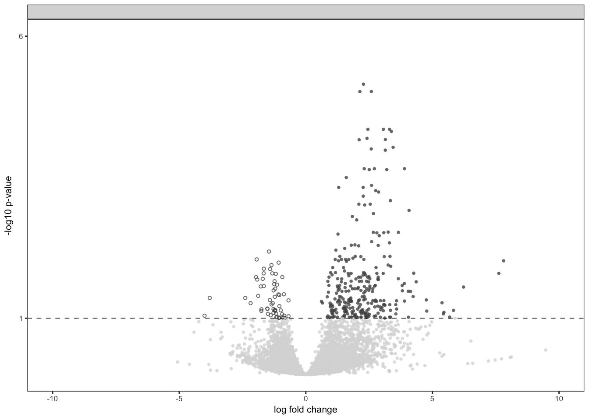
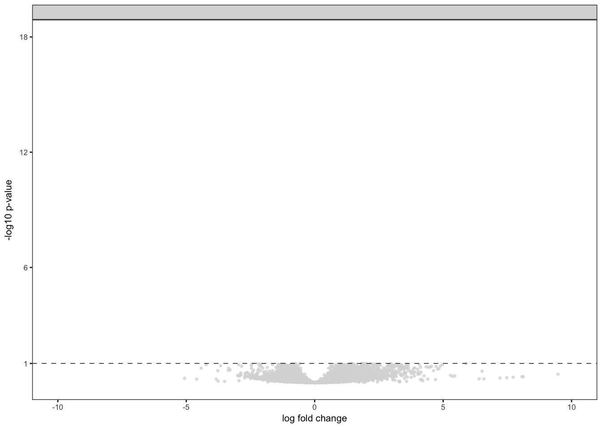
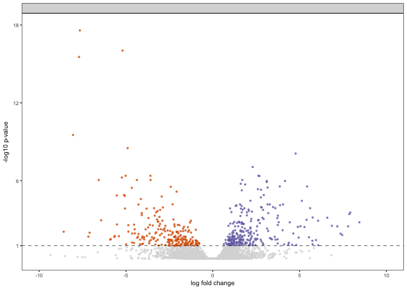

These are the packages I need for my volcano plots.

Here I load the relevant dataframes and set the color palette.

    dissociation <- read.csv("../results/01_dissociation_volcanoTreatment.csv", header = T, row.names = 1)
    levels(dissociation$color) <- c("HOMO", "DISS", "none")
    dissociation$wrap <- "HOMO <-> DISS"
    dissociationcolor <-  c("HOMO" = "#525252", "DISS" = "#525252", "none" = "#d9d9d9")

Here's my function for plotting the effect of treatment. Since each
treatment has different levels, I set the color code outside the
function.

    VolcanoTreatment <- function(filename, colorval){
      data <- filename
      volcanoplot <- ggplot(data, aes(x = lfc, y = pvalue)) + 
      geom_point(aes(color = factor(color), shape = factor(color)), 
                 size = 1, alpha = 0.8, na.rm = T) +
      theme_bw(base_size = 8) + # clean up theme
      theme(legend.position = "none",
            panel.grid.minor=element_blank(),
            panel.grid.major=element_blank())+
      scale_color_manual(values = colorval) +
      scale_x_continuous(name="log fold change",
                          limits = c(-10, 10)) +
      scale_y_continuous(name="-log10 p-value",
                         limits = c(0, 6),
                         breaks = c(1,6)) +
      geom_hline(yintercept = 1,  size = 0.25, linetype = 2 ) + 
      scale_shape_manual(values = c(16,1,16)) +
        facet_wrap(~wrap)
      plot(volcanoplot)
      myfile = paste("../figures/02_volcanoplots/Treatment_", substitute(filename), ".pdf", sep="")
      pdf(file = myfile, width=1.75, height=2)
      plot(volcanoplot)
      dev.off()
    }

Now, let's run the function on the four files.

    VolcanoTreatment(dissociation, dissociationcolor)

    ## quartz_off_screen 
    ##                 2

Now this is the fucntion for plotting CA1 vs. DG volcano plots. The
color here is set inside.

    VolcanoCA1DG <- function(filename){
      data <- filename
      volcanoplot <- ggplot(data, aes(x = lfc, y = pvalue)) + 
      geom_point(aes(color = factor(color), shape = factor(color)), 
                 size = 1, alpha = 0.8, na.rm = T) + # add gene points
      theme_bw(base_size = 8) + # clean up theme
      theme(legend.position = "none", # remove legend 
            panel.grid.minor=element_blank(),
            panel.grid.major=element_blank()) + 
      scale_color_manual(values = c("CA1" = "#7570b3",
                                    "DG" = "#d95f02", 
                                    "none" = "#d9d9d9")) +   
      scale_x_continuous(name="log fold change",
                         limits = c(-10, 10)) +
      scale_y_continuous(name="-log10 p-value",
                         limits = c(0, 18),
                         breaks = c(1,6,12,18)) +
      geom_hline(yintercept = 1,  size = 0.25, linetype = 2 ) + 
      scale_shape_manual(values = c(16,16,16)) +
        facet_wrap(~wrap)
      plot(volcanoplot)
      myfile = paste("../figures/02_volcanoplots/CA1DG_", substitute(filename), ".pdf", sep="")
      pdf(file = myfile, width=1.75, height=2)
      plot(volcanoplot)
      dev.off()
    }
    VolcanoCA1DG(dissociation)

    ## quartz_off_screen 
    ##                 2

The files

    dissociation <- read.csv("../results/01_dissociation_volcanoCA1DG.csv", header = T, row.names = 1)
    dissociation$wrap <- "DG <-> CA1"

    VolcanoCA1DG(dissociation)

    ## quartz_off_screen 
    ##                 2

Useful R tutorials
------------------

-   <http://ggplot2.tidyverse.org/reference/scale_continuous.html> for
    adjusting ggplot axis
